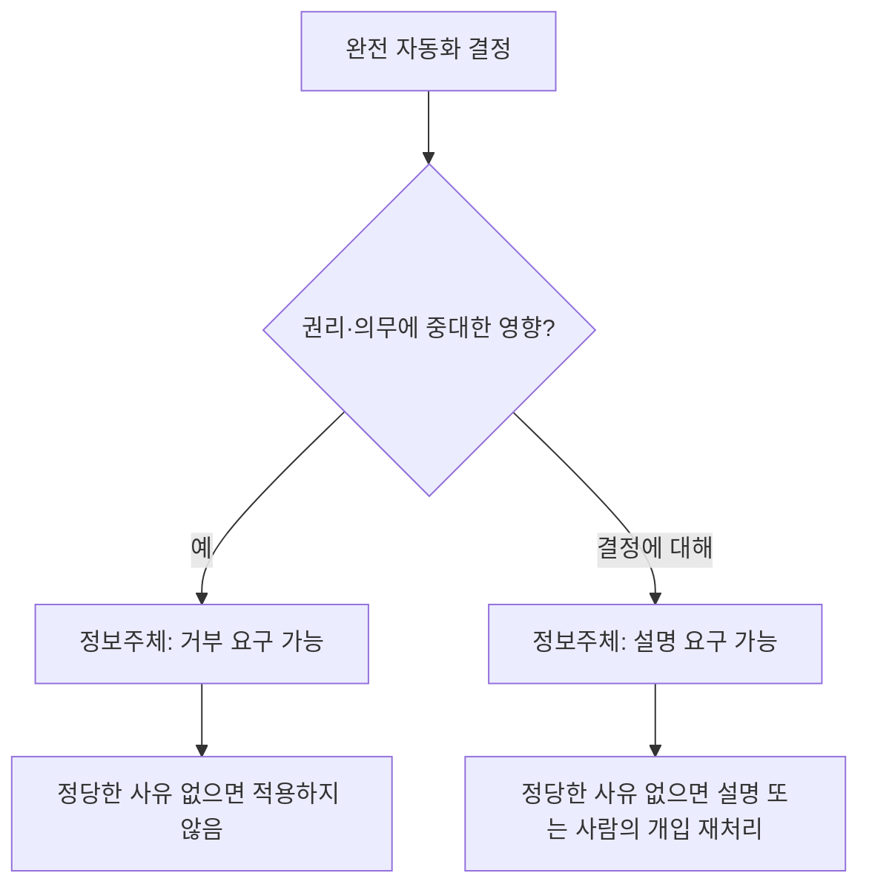
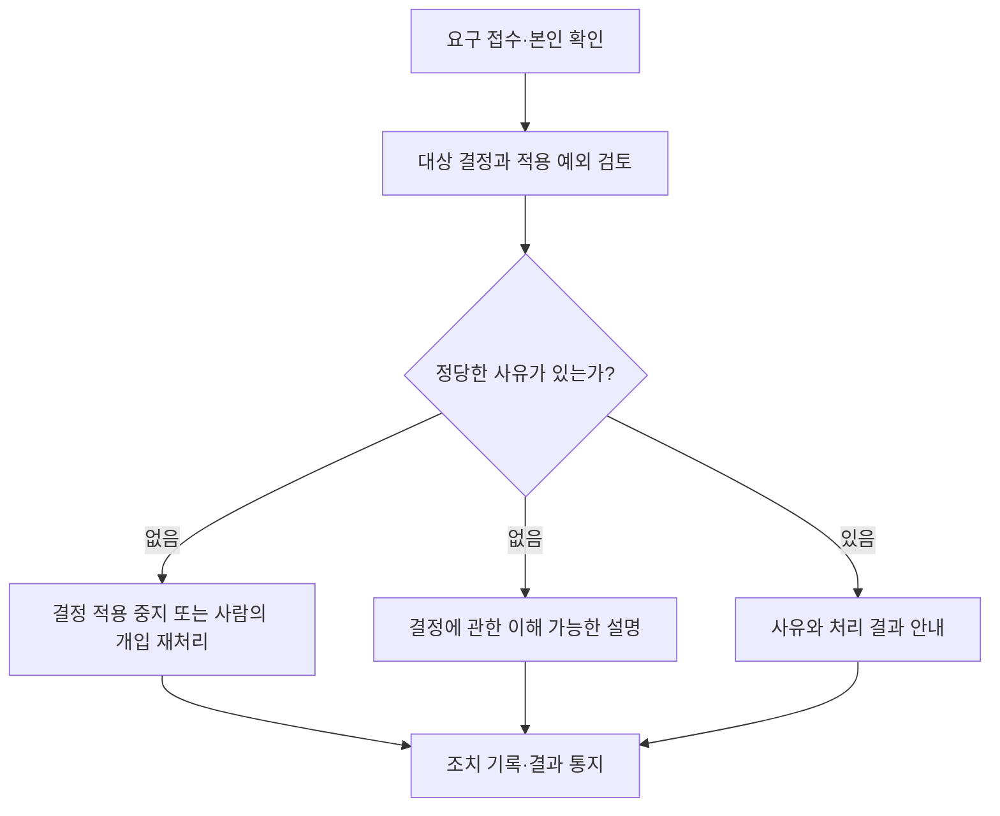

## 지식 로드맵 내 현재 위치

개인정보 보호 → 정보주체 권리 → 자동화된 결정에 대한 권리

## 30초 인출

- 본질: 자동화된 결정 권리는 완전히 자동화된 결정이 개인의 권리·의무에 중대한 영향을 줄 때 거부하거나 설명을 요구할 수 있는 정보주체 권리다.
- 메커니즘: 처리자는 정당한 사유가 없는 한 결정을 적용하지 않거나 사람의 개입으로 재처리·설명하고, 판단 기준·절차와 개인정보 처리 방식을 공개한다.

핵심 용어

- **자동화된 결정**: 완전히 자동화된 시스템으로 개인정보를 처리해 내린 결정. 행정기본법상 행정청의 자동적 처분은 개인정보 보호법 제37조의2의 정의에서 제외된다.
- **거부권**: 완전히 자동화된 결정이 권리·의무에 중대한 영향을 주는 경우 그 결정의 거부를 요구하는 권리. 법률상 예외가 있다.
- **설명 요구**: 자동화된 결정에 대해 결정 내용과 관련한 설명 등을 개인정보처리자에게 요구하는 권리.
- **인적 개입 재처리**: 담당자가 개입해 자동화된 결정을 다시 처리하는 조치.

---

## 1교시 예상문제 (10점)

> 개인정보 보호법상 자동화된 결정에 대한 정보주체의 거부·설명 요구 권리와 개인정보처리자의 조치를 설명하시오. (예상)

---

## 1교시 10점 답안

### 1. 정의·목적

- 정의: 자동화된 결정 권리는 완전히 자동화된 결정이 개인의 권리·의무에 중대한 영향을 줄 때 적용되는 정보주체의 권리다.
- 목적: 자동화된 결정의 영향에 대응하고 결정에 대한 설명과 사람의 개입을 보장한다.

### 2. 권리와 처리자 조치

제언: 결정 기준·절차와 권리 행사 방법을 이해하기 쉽게 공개하고 담당자 처리 절차를 마련한다.

---

## 2~4교시 예상문제 (25점)

> 개인정보 보호법 제37조의2의 적용 범위와 정보주체 권리를 구분하고, 개인정보처리자의 설명·재처리 절차와 기술적 지원 방안을 제시하시오. (예상)

---

## 2~4교시 25점 답안

## Ⅰ. 개요와 적용 범위

개인정보 보호법 제37조의2는 완전히 자동화된 시스템이 개인정보를 처리해 내린 결정에 대한 정보주체의 권리와 개인정보처리자의 조치를 정한다. 권리·의무에 중대한 영향을 주는 자동화된 결정에는 거부권이 적용되며, 행정기본법상 행정청의 자동적 처분은 이 조의 정의에서 제외된다.

| 판단 항목 | 확인 내용 |
|---|---|
| 자동화 정도 | 사람의 실질적 판단 없이 완전히 자동화된 결정인지 |
| 처리 대상 | 개인정보 처리에 따른 결정인지 |
| 영향 | 거부권은 권리·의무에 중대한 영향을 미치는지 |
| 예외 | 법에서 정한 거부권 예외 또는 별도 법률 적용 여부 |

## Ⅱ. 권리 유형과 예외

| 권리 | 적용 내용 |
|---|---|
| 거부권 | 중대한 영향을 미치는 완전 자동화 결정의 거부를 요구. 법 제15조제1항제1호·제2호·제4호에 따라 이루어진 결정은 법정 예외 |
| 설명 요구권 | 개인정보처리자가 자동화된 결정을 한 경우 그 결정에 대한 설명 등을 요구 |
| 자동적 처분 | 행정기본법 제20조에 따른 행정청의 자동적 처분은 이 조의 자동화된 결정에서 제외 |

## Ⅲ. 개인정보처리자의 대응

처리자는 결정의 기준·절차와 개인정보 처리 방식을 정보주체가 쉽게 확인할 수 있도록 공개해야 한다. 구체적인 거부·설명 요구 절차와 필요 조치는 법과 시행령에 따른다.

## Ⅳ. 설명·재처리 지원 설계

| 기능 | 운영 내용 |
|---|---|
| 결정 이력 | 입력 정보, 모델·규칙 버전, 결정 시각을 추적 가능하게 관리 |
| 설명 생성 | 해당 결정에 실제 사용된 주요 기준을 이용자가 이해할 수 있게 안내 |
| 사람의 재처리 | 담당자에게 필요한 기록과 근거를 제공하고 재검토 권한·기한을 정함 |
| 공개·권리 절차 | 결정 기준·절차, 요구 채널, 처리 결과 통지 방법을 쉽게 찾도록 안내 |

설명가능한 인공지능 기법은 설명을 돕는 기술 수단이다. 특정 기법의 사용 자체가 법에서 정한 의무는 아니다.

## Ⅴ. 보안·운영 통제

| 통제 | 목적 |
|---|---|
| 접근권한 분리 | 재심사 담당자가 필요한 개인정보와 결정 자료만 열람 |
| 처리 이력 기록 | 요구 접수부터 설명·재처리·통지까지 추적 |
| 기한·미처리 알림 | 권리 요구가 누락되지 않도록 담당자에게 배정·통지 |
| 변경 관리 | 모델·기준 변경에 따라 공개 설명과 운영 절차를 갱신 |

## Ⅵ. 문제와 대응

| 문제 | 대응 |
|---|---|
| 점수만 제공해 결정 이유를 이해하기 어려움 | 사용된 주요 기준과 정보의 의미를 맥락에 맞게 설명 |
| 자동화와 사람 판단이 혼재해 적용 여부가 불명확 | 의사결정 흐름과 사람의 실질적 역할을 문서화해 사례별 판정 |
| 설명·재검토 요청의 처리 이력이 끊김 | 접수번호로 담당자·기한·결과를 연결하는 사건관리 절차 운영 |

## Ⅶ. 기술사적 제언

| 문제 | 해결 방안 |
|---|---|
| 결정 근거와 권리 요구 이력이 시스템별로 흩어져 설명·재처리가 늦어질 수 있음 | 결정 당시 입력·모델 버전·적용 기준을 기록하고 이를 권리요구 사건관리와 연결해 담당자가 근거를 확인한 뒤 재처리·설명 결과를 통지하도록 한다. |

## 출제 이력과 검증 출처

- 기존 노트에 확인된 기출 문항이 없어 예상문제로 작성함.
- [국가법령정보센터, 개인정보 보호법 제37조의2(2026-09-11 시행)](https://law.go.kr/LSW/lsLinkCommonInfo.do?chrClsCd=010202&lsJoLnkSeq=1029334889)
- [국가법령정보센터, 개인정보 보호법 시행령 제44조의2(요구 방법·절차)](https://www.law.go.kr/LSW/lsLinkCommonInfo.do?lsJoLnkSeq=1027192967)
