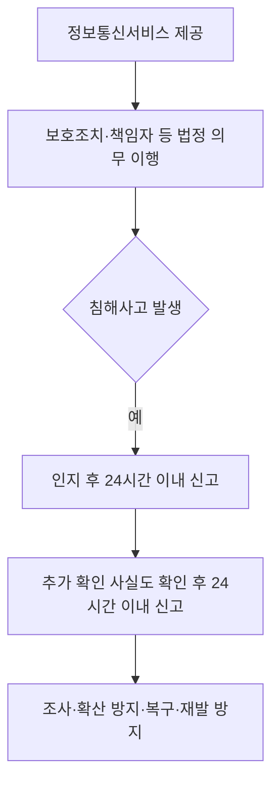
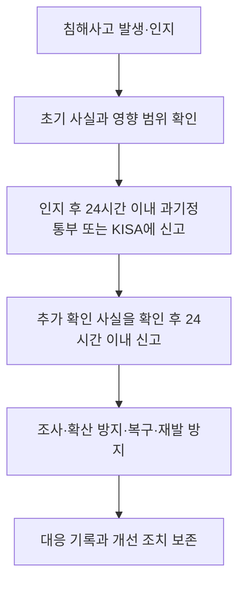

## 지식 로드맵 내 현재 위치

정보보호 법제 → 민간 정보통신망·서비스 보호 → 정보통신망법

## 30초 인출

- 본질: 정보통신망법은 정보통신망의 이용 촉진과 정보통신서비스의 안전한 제공을 위한 보호 의무를 정한다.
- 메커니즘: 사업자는 정보보호 체계와 책임자를 갖추고, 침해사고가 발생하면 신고·조사·피해 확산 방지 절차를 수행한다.

핵심 용어

- **정보통신서비스 제공자**: 정보통신망법상 정보통신서비스를 제공하는 자.
- **정보보호 최고책임자(CISO)**: 정보통신시스템과 정보의 안전한 관리를 총괄하도록 법령 기준에 따라 지정·신고하는 책임자.
- **침해사고**: 정보통신망 또는 정보시스템의 침해로 서비스·정보의 안전성이나 정상 운영에 영향을 주는 사고.
- **ISMS**: 정보보호 관리체계의 수립·운영이 인증 기준에 맞는지 심사하는 제도.

---

## 1교시 예상문제 (10점)

> 정보통신망법상 정보통신서비스 제공자의 정보보호 책임과 침해사고 신고 의무를 설명하시오. (예상)

---

## 1교시 10점 답안

### 1. 정의·목적

- 정의: 정보통신망법은 정보통신망 이용 촉진과 정보통신서비스의 안전한 제공을 규율하는 법률이다.
- 목적: 침해사고를 예방·대응하고 정보통신망과 서비스의 안정성을 높인다.

### 2. 보호 책임과 신고

제언: 사고대응 연락망과 신고에 필요한 최소 정보를 미리 정리해 초기 신고가 지연되지 않게 한다.

---

## 2~4교시 예상문제 (25점)

> 정보통신망법상 정보보호 관리와 침해사고 신고·대응체계를 설명하고, 정보통신서비스 제공자의 실행 방안을 제시하시오. (예상)

---

## 2~4교시 25점 답안

## Ⅰ. 개요

정보통신망법은 정보통신망·서비스의 보호, 정보보호 책임과 침해사고 대응 등을 규정한다. 개인정보 보호 법제가 개인정보 보호법으로 정비된 뒤에도 이 법에는 정보보호·서비스 안정과 이용자 보호 관련 의무가 남아 있다.

| 보호 목표 | 법·제도상 수단 |
|---|---|
| 정보통신망과 서비스의 안전성 | 보호조치, 책임자, 인증·점검, 침해사고 대응 |

## Ⅱ. 정보보호 책임체계

| 제도 | 핵심 |
|---|---|
| 정보보호 최고책임자 | 법과 시행령의 적용 대상 기준에 따라 지정·신고하고 정보보호 업무를 총괄 |
| 정보보호 관리체계 인증 | 법정 인증 대상은 정보보호 관리체계 수립·운영의 적합성을 심사받음 |
| 보호조치 | 서비스·자산·위험에 맞는 기술적·관리적 보호대책을 수립·운영 |

CISO 지정·신고 및 ISMS 인증 대상은 모든 기업에 일률적으로 적용되지 않으며 법률·시행령상 기준에 따라 확인한다. 겸직 제한도 적용 대상과 법정 조건을 확인해야 한다.

## Ⅲ. 침해사고 신고와 대응 흐름

법률은 침해사고 발생 시 신고하도록 하고, 시행령은 인지 후 24시간 이내의 신고 시기와 신고 항목·방법을 정한다. 신고 후 새로 확인된 사실도 확인한 때부터 24시간 이내에 추가 신고해야 한다. 다른 법률에 따른 통지·신고를 이미 한 경우에는 법에서 정한 범위에서 신고한 것으로 본다.

## Ⅳ. 신고 정보와 기록

| 신고·기록 항목 | 내용 |
|---|---|
| 사고 개요 | 발생 일시, 원인 및 피해 내용 |
| 대응 현황 | 사고 대응 조치와 현재 상태 |
| 연락 체계 | 대응 부서와 연락처 |
| 후속 정보 | 추가로 확인된 사실과 확인 시각, 보완 신고 내역 |

## Ⅴ. 침해사고 처리와 관계기관 역할

| 주체 | 주요 역할 |
|---|---|
| 정보통신서비스 제공자 | 사고 신고, 내부 대응, 자료 보존, 복구·재발 방지 |
| 과학기술정보통신부·한국인터넷진흥원 | 신고 접수, 필요한 지원·조사 및 법정 대응 |
| 개인정보보호위원회 등 관계기관 | 개인정보 침해가 함께 발생한 경우 소관 법률에 따른 신고·통지와 조사 |

## Ⅵ. 운영상 취약점과 대응

| 문제 | 대응 |
|---|---|
| 사고 인지와 신고 판단이 늦음 | 역할·연락망·신고 판단 기준을 사전 정의하고 당직 체계와 연결 |
| 초기 피해 범위를 확정하지 못해 신고가 지연 | 확인된 사실로 1차 신고하고 추가 사실은 법정 기한 내 보완 |
| 사고 대응 중 증거가 훼손 | 로그·시스템 이미지·타임라인을 보존하고 접근을 통제 |
| 신고·통지 의무가 중복되거나 누락 | 사고 유형별 적용 법령과 관할 기관을 정리하고 단일 사건대장으로 추적 |

## Ⅶ. 기술사적 제언

| 문제 | 해결 방안 |
|---|---|
| 기술 대응, 법정 신고, 고객·관계기관 통지가 별도 절차로 운영되어 기한과 사고 정보가 엇갈릴 수 있음 | 사고대응 플레이북에 탐지 시각, 법령별 신고 대상·기한, 승인 책임자와 추가 신고 항목을 연결하고 모의훈련으로 초기 보고 절차를 검증한다. |

## 출제 이력과 검증 출처

- 기존 노트에 확인된 기출 문항이 없어 예상문제로 작성함.
- [국가법령정보센터, 정보통신망법 제48조의3 침해사고 신고](https://www.law.go.kr/lsLinkCommonInfo.do?chrClsCd=010202&lsJoLnkSeq=1032645223)
- [국가법령정보센터, 정보통신망법 시행령 제58조의2 신고 시기·방법·절차](https://www.law.go.kr/LSW/lsSideInfoP.do?docCls=jo&joBrNo=02&joNo=0058&lsiSeq=288033&urlMode=lsScJoRltInfoR)
- [국가법령정보센터, 정보통신망법 제45조의3 정보보호 최고책임자](https://www.law.go.kr/LSW/lsLawLinkInfo.do?chrClsCd=010202&lsJoLnkSeq=900629793)
