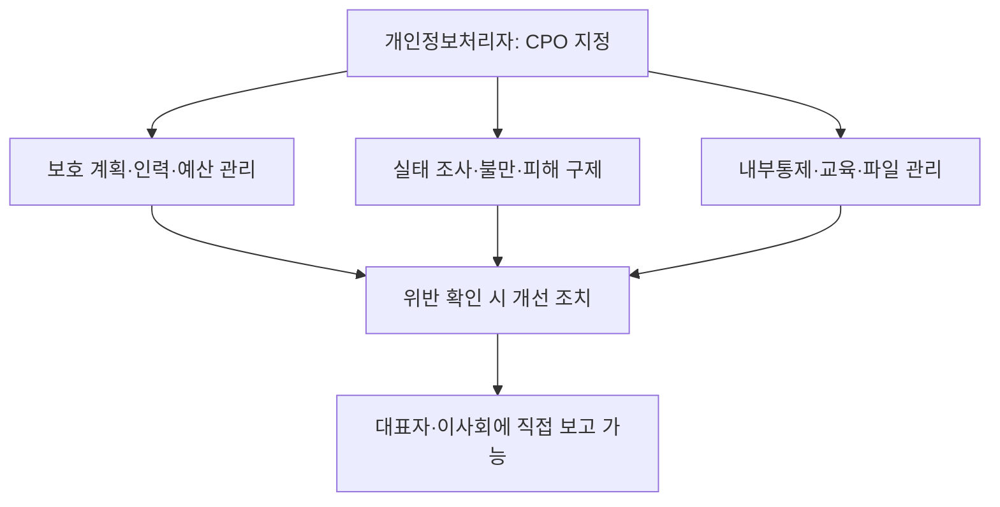
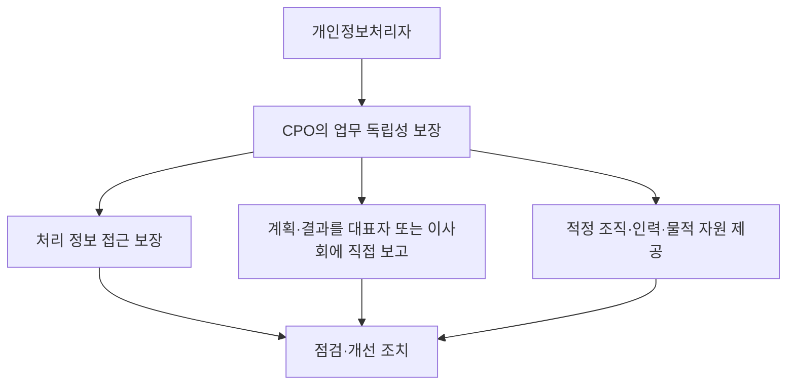

## 지식 로드맵 내 현재 위치

개인정보 보호 → 내부 거버넌스 → 개인정보 보호책임자

## 30초 인출

- 본질: 개인정보 보호책임자는 개인정보 처리·보호 업무를 총괄하는 법정 책임자다.
- 메커니즘: 보호 계획·예산·인력·내부통제·권리구제를 관리하고, 위반 사실을 알면 개선하며 필요한 사항을 대표자·이사회에 보고한다.

핵심 용어

- **개인정보 보호책임자(CPO)**: 개인정보 처리와 보호 업무를 총괄하도록 개인정보처리자가 지정하는 법정 책임자.
- **독립성 보장**: 정당한 이유 없는 불이익을 금지하고 CPO가 업무를 독립적으로 수행하도록 보장하는 의무.
- **전문 지정 대상**: 법률·시행령의 규모 기준에 해당해 이사회 의결 및 보호위원회 신고 의무가 추가 적용되는 개인정보처리자.
- **CISO**: 정보통신망법상 정보통신시스템과 정보의 안전한 관리를 총괄하는 정보보호 최고책임자. CPO와 역할이 일부 연계될 수 있으나 법적 직무는 구분된다.

---

## 1교시 예상문제 (10점)

> 개인정보 보호법상 개인정보 보호책임자의 지정·업무·독립성 보장 사항을 설명하시오. (예상)

---

## 1교시 10점 답안

### 1. 정의·목적

- 정의: 개인정보 보호책임자는 개인정보 처리와 보호 업무를 총괄하는 법정 책임자다.
- 목적: 조직의 개인정보 처리 과정에서 법 준수와 정보주체 권리 보호를 지속적으로 관리한다.

### 2. 지정과 주요 업무

제언: 개인정보 보호책임자에게 필요한 접근권한·인력·예산과 정기 보고 경로를 보장한다.

---

## 2~4교시 예상문제 (25점)

> 개인정보 보호법 제31조상 개인정보 보호책임자의 지정 기준과 주요 업무, 독립성 보장 및 최근 제도 변경을 설명하고 조직의 이행 방안을 제시하시오. (예상)

---

## 2~4교시 25점 답안

## Ⅰ. 개요

개인정보 보호책임자는 개인정보 처리·보호 업무를 총괄하고 위반을 개선하는 조직 내부의 책임자다. 2026년 개정법은 일정 규모 이상의 처리자에게 CPO 지정·변경·해제 시 이사회 의결과 보호위원회 신고를 추가로 요구한다.

| 공통 의무 | 규모 기준 해당 처리자 추가 의무 |
|---|---|
| CPO 지정과 법정 업무 수행 | 이사회 의결, 보호위원회 신고 |

## Ⅱ. 지정과 대상 기준

모든 개인정보처리자는 원칙적으로 CPO를 지정한다. 소상공인은 법정 예외에 따라 별도 지정하지 않을 수 있으며, 이 경우 사업주 또는 대표자가 CPO가 된다. 별도로 법 제31조제3항·시행령 제32조제3항의 규모 기준에 해당하면 지정·변경·해제 때 이사회 의결과 보호위원회 신고가 추가된다.

| 시행령상 지정·신고 추가 대상의 주요 기준 | 조건 |
|---|---|
| 매출 및 민감정보 등 | 연간 매출액 등이 1,800억 원 초과이면서 민감정보·고유식별정보 5만 명 이상 처리 또는 개인정보 100만 명 이상 처리 |
| 고등교육기관 | 재학생 2만 명 이상인 학교 |
| 의료기관 | 상급종합병원 |
| 공공부문 | 공공시스템운영기관 등 시행령이 정한 기관 |

## Ⅲ. CPO의 법정 업무

| 업무 영역 | 법정 업무 예 |
|---|---|
| 계획·자원 | 보호 계획 수립·시행, 전문 인력 관리와 예산 확보 |
| 보고·점검 | 대표자·이사회 보고, 처리 실태·관행 정기 조사와 개선 |
| 권리·사고 | 불만 처리·피해 구제, 유출·오용 방지 내부통제 구축 |
| 교육·관리 | 보호 교육, 개인정보파일 보호·관리·감독, 처리방침 관리와 파기 등 |

## Ⅳ. 독립성과 보고 체계

독립성은 명목상 직책만 부여하는 것으로 충족되지 않는다. 법과 시행령에 따라 처리정보 접근, 직접 보고체계와 업무 수행에 적합한 자원을 보장해야 한다. 정당한 이유 없는 불이익도 금지된다.

## Ⅴ. CPO와 CISO 역할 연계

| 구분 | 개인정보 보호책임자(CPO) | 정보보호 최고책임자(CISO) |
|---|---|---|
| 주된 책임 | 개인정보 처리의 적법성·정보주체 권리·보호 거버넌스 | 정보통신시스템·정보의 안전 관리 |
| 업무 예 | 처리방침, 권리·불만, 처리 실태와 내부통제 | 정보보호 체계, 기술적 보안, 침해사고 대응 |
| 협업 지점 | 개인정보 침해 영향과 법정 조치 | 시스템 원인 분석·차단·복구 |

## Ⅵ. 실무 이행 과제

| 문제 | 대응 |
|---|---|
| 책임자의 권한이 직책에 머무름 | 예산·접근권한·정기 보고 주기를 정하고 이사회 확인 |
| 개발·사업 조직과 보호 검토가 분리 | 설계·변경 단계에서 CPO 검토 절차와 위험 승인 기록 운영 |
| 사고 때 CPO·CISO 보고가 분산 | 개인정보 영향·시스템 대응을 하나의 사고 지휘체계에서 조정 |
| 전문 지정 대상 변경을 놓침 | 매출·정보주체 수·기관 유형 등 대상 기준을 정기 점검 |

## Ⅶ. 기술사적 제언

| 문제 | 해결 방안 |
|---|---|
| 개인정보 통제와 시스템 보안이 별도 관리돼 보호 조치의 책임·증적이 이어지지 않을 수 있음 | 개인정보 처리흐름·시스템 자산·통제 담당자를 연결한 책임 매트릭스를 운영하고, CPO·CISO가 공통 사고훈련과 개선 추적을 수행한다. |

## 출제 이력과 검증 출처

- 기존 노트에 확인된 기출 문항이 없어 예상문제로 작성함.
- [국가법령정보센터, 개인정보 보호법 제31조(2026-09-11 시행)](https://law.go.kr/lsLinkCommonInfo.do?chrClsCd=010202&lsJoLnkSeq=1020398749)
- [국가법령정보센터, 개인정보 보호법 시행령 제32조(2026-09-11 시행)](https://law.go.kr/lsLinkCommonInfo.do?lsJoLnkSeq=1029332801)
