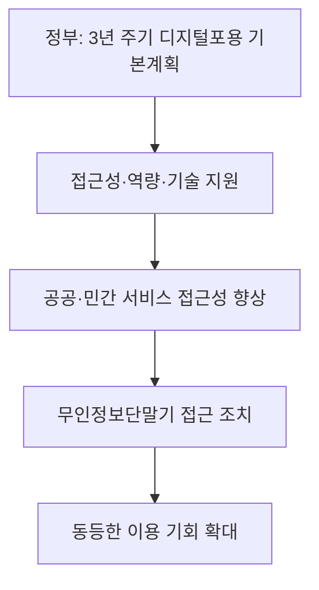
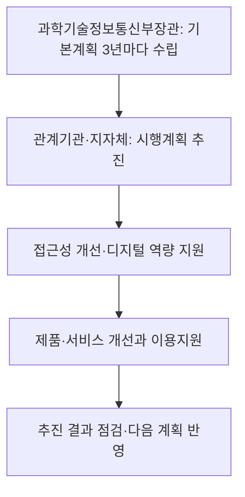
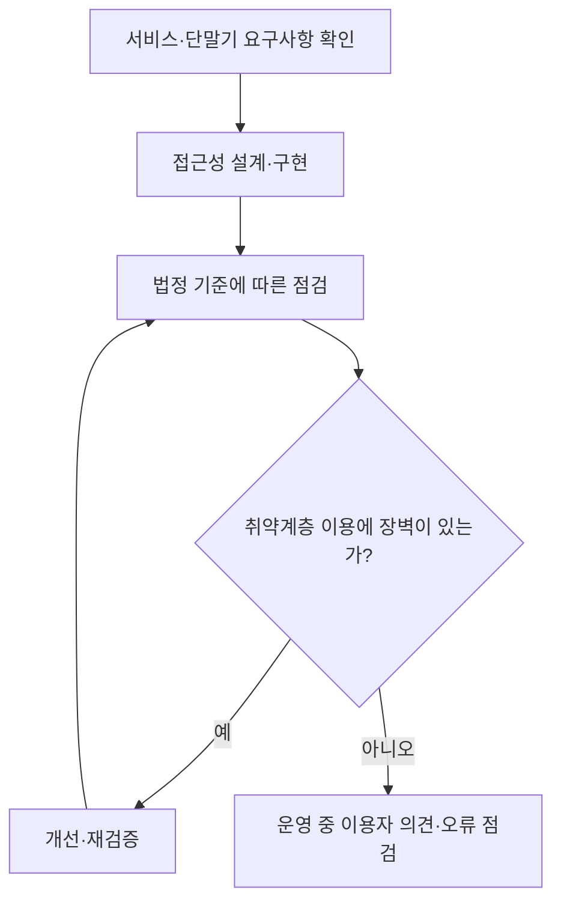

## 지식 로드맵 내 현재 위치

디지털 정책·법제 → 접근성·역량·참여 → 디지털포용법

## 30초 인출

- 본질: 디지털포용법은 디지털 취약계층을 포함한 국민이 디지털 기술과 서비스를 이용하고 사회에 참여할 수 있도록 국가 정책과 접근성 의무를 정한다.
- 메커니즘: 정부는 기본계획·역량 지원·접근성 정책을 추진하고, 법 적용 대상 서비스와 무인정보단말기 제공자는 접근성과 이용 편의를 보장한다.

핵심 용어

- **디지털포용**: 디지털 기술·서비스에 대한 접근과 이용 역량을 높여 사회 참여에서 배제되지 않도록 하는 정책 방향.
- **디지털취약계층**: 연령·장애·경제·지역 등 여건으로 디지털 기술·서비스 이용에 어려움을 겪는 사람.
- **무인정보단말기**: 서류 발급, 정보 제공, 상품 주문·결제 등을 이용자 조작으로 처리하는 단말기.
- **접근성 품질인증**: 지능정보제품·서비스 등이 법령상 접근성 기준에 부합하는지를 인증하는 제도.

---

## 1교시 예상문제 (10점)

> 디지털포용법의 목적과 주요 정책 수단, 무인정보단말기 접근성 의무를 설명하시오. (예상)

---

## 1교시 10점 답안

### 1. 정의·목적

- 정의: 디지털포용법은 디지털 기술·서비스의 접근과 이용을 지원하고 디지털 사회 참여를 보장하기 위한 법률이다.
- 목적: 디지털 환경에서 이용 격차와 배제를 줄이고 국민의 참여를 넓힌다.

### 2. 정책과 단말기 의무

무인정보단말기 설치·운영자는 보조 인력 배치나 실시간 음성 안내 등 이용 편의 조치를 해야 하며, 제조·임대자는 취약계층이 다른 사람과 동등하게 접근·이용하도록 법령상 정당한 조치를 해야 한다.

제언: 단말기 도입 때 실제 이용자 시험을 포함해 접근성과 보조 절차를 확인한다.

---

## 2~4교시 예상문제 (25점)

> 디지털포용법의 정책 추진체계와 접근성 보장 수단을 설명하고, 공공서비스와 무인정보단말기의 이용 장벽을 줄이는 방안을 제시하시오. (예상)

---

## 2~4교시 25점 답안

## Ⅰ. 개요

디지털포용법은 접근성, 이용 역량과 사회 참여를 정책으로 다루고 디지털 취약계층이 지능정보서비스와 제품을 이용할 수 있도록 제도적 기반을 둔다. 법률 제20672호는 2026년 1월 22일 시행되었다.

| 목표 | 수단 |
|---|---|
| 디지털 접근·이용과 참여 지원 | 기본계획, 교육·지원, 접근성 보장, 연구개발과 협력 |

## Ⅱ. 정책 추진체계

## Ⅲ. 접근성 보장 대상과 책임

| 대상·주체 | 법정 방향 |
|---|---|
| 국가기관 등 | 제공하는 법정 지능정보서비스·제품을 디지털 취약계층이 어려움 없이 이용하도록 접근성 보장 |
| 무인정보단말기 설치·운영자 | 보조 인력 또는 실시간 음성 안내 등 접근·이용 편의를 높이는 조치 |
| 무인정보단말기 제조·임대자 | 취약계층과 다른 이용자가 동등하게 접근·이용하도록 대통령령상 정당한 조치 |
| 과학기술정보통신부장관 | 법정 의무 미이행 시 시정명령 등 감독 수행 |

## Ⅳ. 무인정보단말기 이용 편의

| 이용 장벽 | 대응 예 |
|---|---|
| 화면을 보기 어려움 | 음성 안내·이어폰 사용 지원, 충분한 글자 크기·대비 |
| 터치·도달이 어려움 | 접근 가능한 조작 위치와 대체 입력 방안 |
| 화면 흐름을 이해하기 어려움 | 명확한 단계 표시, 일관된 용어, 오류 복구·취소 경로 |
| 기기 조작에 도움이 필요 | 현장 보조 인력 또는 법령상 인정되는 보조 수단 제공 |

구체적 설계·검증 기준은 시행령과 관련 기준에 따라 적용한다. 기능 하나를 넣는 것만으로 접근성 의무를 모두 충족한다고 단정하지 않는다.

## Ⅴ. 접근성 검증·인증

접근성 품질인증은 법률상 제도이며, 모든 제품에 인증표시가 일률적으로 의무인 것으로 표현하지 않는다. 적용 대상과 인증·구매 관련 의무는 해당 조항을 구분해 확인한다.

## Ⅵ. 현장 적용 과제

| 문제 | 대응 |
|---|---|
| 납품 전 형식 시험만 하고 실제 사용 장벽을 놓침 | 장애·연령이 다양한 이용자 시험과 현장 관찰을 수행 |
| 음성 안내 등 보조 기능이 고장나거나 이용하기 어려움 | 정기 점검, 장애 신고, 대체 주문·지원 경로 운영 |
| 제품 구매 후 접근성 개선 비용이 커짐 | 조달·요구사항 단계부터 접근성 기준과 검수 항목 반영 |
| 앱·단말기·직원 지원이 분리되어 사용 경험이 끊김 | 온라인·현장 채널의 안내와 오류 복구 절차를 일관되게 설계 |

## Ⅶ. 기술사적 제언

| 문제 | 해결 방안 |
|---|---|
| 접근성 점검이 체크리스트 통과에 그쳐 실제 서비스 이용 실패를 발견하지 못할 수 있음 | 설계 검증에 실제 이용자 과업 시험을 포함하고, 실패 사례와 개선 결과를 조달 검수·운영 품질지표에 연결한다. |

## 출제 이력과 검증 출처

- 기존 노트에 확인된 기출 문항이 없어 예상문제로 작성함.
- [국가법령정보센터, 디지털포용법(2026-01-22 시행)](https://www.law.go.kr/LSW/lsInfoP.do?lsiSeq=268533)
- [국가법령정보센터, 디지털포용법 제20조 무인정보단말기 이용 편의](https://www.law.go.kr/lsLinkCommonInfo.do?chrClsCd=010202&lsJoLnkSeq=1031809823)
- [국가법령정보센터, 디지털포용법 제19조 접근성 보장](https://www.law.go.kr/lsLinkCommonInfo.do?chrClsCd=010202&lsJoLnkSeq=1031811027)
- [국가법령정보센터, 시행령의 무인정보단말기 접근성 조치](https://www.law.go.kr/LSW/lsLinkCommonInfo.do?chrClsCd=010202&lspttninfSeq=197967)
