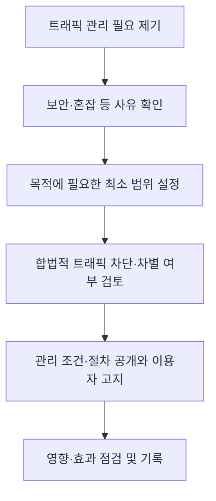

## 지식 로드맵 내 현재 위치

통신 정책·법제 → 인터넷 개방성·트래픽 관리 → 망 중립성

## 30초 인출

- 본질: 망 중립성은 인터넷접속서비스 제공자가 합법적 콘텐츠·서비스와 이용자 기기를 불합리하게 차단하거나 차별하지 말아야 한다는 원칙이다.
- 메커니즘: 이용자 권리와 트래픽 관리 투명성을 보장하고, 합리적 트래픽 관리는 공개된 기준과 절차에 따라 제한적으로 수행한다.

핵심 용어

- **망 중립성**: 인터넷접속서비스 제공자가 합법적 트래픽을 불합리하게 차단·차별하지 않는다는 개방성 원칙.
- **합리적 트래픽 관리**: 망의 보안·혼잡 등 정당한 사유에 대응해 필요한 범위에서 수행하는 트래픽 관리.
- **특수서비스**: 보편적 인터넷 종단 연결이 아니고, 특정 용도에 한정되며, 별도 자원·기술로 전송 품질을 보장하는 서비스.
- **망 이용 대가**: 사업자 간 접속·전송·망 이용에 관한 계약과 비용 분담 논의. 망 중립성 원칙과는 관련되지만 동일한 쟁점은 아니다.

---

## 1교시 예상문제 (10점)

> 망 중립성의 기본원칙과 합리적 트래픽 관리의 의미를 설명하시오. (예상)

---

## 1교시 10점 답안

### 1. 정의·목적

- 정의: 망 중립성은 인터넷접속서비스 제공자가 합법적 트래픽을 불합리하게 차단·차별하지 않는다는 원칙이다.
- 목적: 이용자의 인터넷 접근권과 개방적·공정한 인터넷 환경을 보장한다.

### 2. 기본원칙

| 원칙 | 내용 |
|---|---|
| 이용자 권리 | 합법적인 콘텐츠·애플리케이션·서비스와 위해가 없는 기기를 자유롭게 이용하고 트래픽 관리 정보를 받을 권리 |
| 투명성 | 사업자는 트래픽 관리 목적·범위·조건·절차·방법 등을 공개하고 이용자에게 필요한 사실을 알림 |
| 차단 금지 | 합법적 콘텐츠·서비스·기기를 불합리하게 차단하지 않음 |
| 불합리한 차별 금지 | 합법적 트래픽을 불합리하게 차별하지 않음 |
| 합리적 관리 허용 | 정당한 사유와 기준에 따라 필요한 트래픽 관리를 수행할 수 있음 |

제언: 트래픽 관리 목적·영향과 이용자 고지 내역을 기록해 필요성과 비례성을 검증한다.

---

## 2~4교시 예상문제 (25점)

> 망 중립성의 기본원칙과 합리적 트래픽 관리·특수서비스의 관계를 설명하고, ISP와 콘텐츠 제공자 간 트래픽 증가 및 망 비용 분담 갈등의 대응 방안을 제시하시오. (예상)

---

## 2~4교시 25점 답안

## Ⅰ. 개요

망 중립성은 인터넷접속서비스 제공자가 합법적 트래픽을 부당하게 차단·차별하지 않도록 하는 정책 원칙이다. 국내 「망 중립성 및 인터넷 트래픽 관리에 관한 가이드라인」은 이용자 권리, 투명성, 차단 금지, 불합리한 차별 금지와 합리적 트래픽 관리의 기본원칙을 둔다.

| 핵심 균형 | 검토 요소 |
|---|---|
| 개방적 이용과 망의 안정적 운영 | 합법적 트래픽의 자유, 혼잡·보안 관리의 필요성과 비례성 |

## Ⅱ. 기본원칙과 적용

| 원칙 | 사업자 실천 |
|---|---|
| 이용자 권리 | 합법적 서비스·기기 이용과 관리 정보 제공 보장 |
| 투명성 | 관리 목적·범위·조건·절차·방법 공개, 필요 시 이용자 고지 |
| 차단 금지 | 합법적 트래픽·서비스를 불합리하게 차단하지 않음 |
| 불합리한 차별 금지 | 출처·목적·서비스에 따른 부당한 차별을 하지 않음 |
| 합리적 트래픽 관리 | 보안·망 혼잡 등 필요에 비례하는 사유·방법·절차로 관리 |

## Ⅲ. 트래픽 관리 판단

세부적인 합리성 판단 기준과 절차는 관련 트래픽 관리 기준을 함께 확인한다. 특정 사업자나 콘텐츠를 우대하는 조치를 단순히 혼잡관리라고 부르더라도 합리성이 자동 인정되는 것은 아니다.

## Ⅳ. 특수서비스

| 구분 | 특징 | 주의점 |
|---|---|---|
| 최선형 인터넷 | 일반적인 인터넷 접속서비스 방식으로 트래픽을 전달 | 합법적 트래픽에 대한 차단·불합리한 차별 금지 원칙 적용 |
| 특수서비스 | 보편적 인터넷 종단 연결이 아니고 특정 용도에 한정되며, 구분된 망 자원·기술로 전송 품질을 보장 | 일반 인터넷 품질을 적정 수준으로 유지하고, 망 중립성 원칙 회피 목적으로 이용하지 않음 |

특수서비스는 망 중립성 원칙의 포괄적 예외가 아니다. 가이드라인상 세 가지 요건을 모두 갖춰야 하며, 일반 인터넷 품질을 적정 수준으로 유지하고 망 중립성 원칙 회피 목적으로 제공해서는 안 된다. 네트워크 슬라이싱도 특수서비스 정의와 요건을 충족하는지 별도로 판단한다.

## Ⅴ. ISP·콘텐츠 제공자 간 쟁점

| 관점 | 주요 관심 |
|---|---|
| 인터넷접속서비스 제공자(ISP) | 망 증설 비용, 혼잡 관리, 안정적 서비스 제공과 투자 회수 |
| 콘텐츠 제공자(CP) | 콘텐츠의 비차별적 전달, 이용자 접속 품질, 중복 비용 우려 |
| 이용자 | 개방적 선택, 합리적 품질·가격, 관리 방식의 투명성 |

망 이용 대가와 상호접속 비용은 계약·시장구조·관련 법령에 걸친 별도 논점이다. 이를 망 중립성 위반 여부와 동일시하지 말고 개별 사안의 차단·차별, 투명성, 경쟁 영향을 구분해 판단한다.

## Ⅵ. 쟁점 대응

| 문제 | 대응 |
|---|---|
| 혼잡 해소 명목으로 특정 서비스 트래픽만 제한 | 관리 필요 사유·영향·대상 기준을 검증하고 비차별적 대안을 우선 검토 |
| 관리 정책을 이용자가 알기 어려움 | 공개 문서와 이용자 고지를 명확히 하고 변경 이력을 관리 |
| CP·ISP 간 비용 분담 갈등이 서비스 품질 저하로 전이 | 망 용량·트래픽·상호접속 조건을 근거로 협의하고 이용자 영향과 경쟁 영향을 함께 평가 |
| 관리형 서비스가 일반 인터넷 품질을 저하시킴 | 자원 배분과 품질 영향을 측정하고 조건을 조정하거나 제공 범위를 재검토 |

## Ⅶ. 기술사적 제언

| 문제 | 해결 방안 |
|---|---|
| 트래픽 관리 정책이 기술적 조치로만 기록되어 이용자 영향과 정책 목적을 함께 검증하기 어려움 | 관리 사유·대상·기간·품질 영향·고지 내역을 통합 기록하고, 정기 검토에서 비차별성·필요성·비례성을 확인한다. |

## 출제 이력과 검증 출처

- 기존 노트는 제123회 4교시 1번을 CP의 망 관리 비용 요구와 망 중립성 쟁점으로 기록했으나 공식 원문은 별도 대조하지 못함.
- [국가법령정보센터, 망 중립성 및 인터넷 트래픽 관리에 관한 가이드라인(2021-01-11 시행)](https://www.law.go.kr/LSW/admRulInfoP.do?admRulSeq=2100000197003&chrClsCd=010201)
- [국가법령정보센터, 통신망의 합리적 관리·이용과 트래픽 관리의 투명성에 관한 기준](https://www.law.go.kr/LSW/admRulInfoP.do?admRulSeq=2100000197004&chrClsCd=010201)
