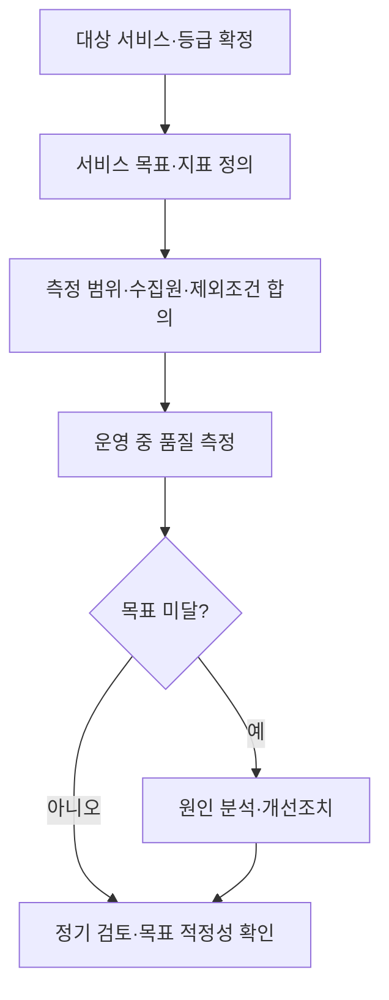
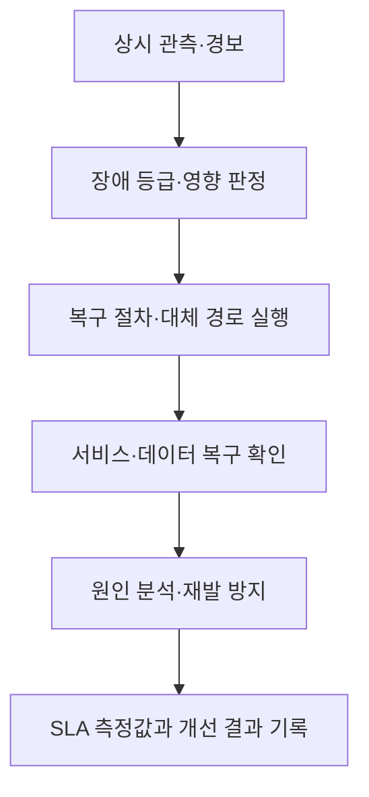

## 지식 로드맵 내 현재 위치

공공 정보화·운영 → 정보시스템 안정성·서비스 품질 → 공공 SLA

## 30초 인출

- 본질: 공공 서비스수준협약(SLA)은 정보시스템이 제공해야 할 서비스 품질과 장애 대응 수준을 측정 가능한 기준으로 정하는 약정이다.
- 메커니즘: 시스템 중요도에 맞춰 목표 수준·장애 예방·복구·재발 방지·유지보수 방안을 정하고, 실제 측정 결과로 이행을 관리한다.

핵심 용어

- **서비스수준협약(SLA)**: 서비스 제공 수준, 측정 방법, 책임과 개선 절차를 합의해 관리하는 약정.
- **서비스 수준 목표**: 가용성·복구 등 제공자가 달성하도록 정한 측정 가능한 목표.
- **RTO**: 장애 후 서비스를 복구하기까지 허용하는 목표 시간.
- **RPO**: 장애 시 허용 가능한 데이터 복구 시점 간격.

---

## 1교시 예상문제 (10점)

> 공공 정보시스템 서비스수준협약(SLA)의 개념과 등급 연계, 핵심 운영요소를 설명하시오. (예상)

---

## 1교시 10점 답안

### 1. 정의·목적

- 정의: 공공 SLA는 공공 정보시스템의 서비스 품질 목표와 측정·개선 방법을 정하는 약정이다.
- 목적: 국민에게 필요한 전자정부서비스의 안정성과 장애 대응을 체계적으로 관리한다.

### 2. 등급과 운영요소

| 관리 축 | 내용 |
|---|---|
| 중요도 | 서비스 특성·중요도, 이용자 수, 장애 시 다른 시스템에 미치는 영향 등을 고려해 등급 분류 |
| 목표 수준 | 등급별 전자정부서비스 목표와 안정적 운영 기준 설정 |
| 장애 대응 | 예방·점검, 복구, 원인 조사, 재발 방지, 노후 장비 교체·재해복구 방안 |
| 측정·개선 | 서비스 수준을 확인하고 미달 원인을 개선 조치로 연결 |

제언: 서비스 목표는 수치와 측정 경계·제외 조건을 함께 정의해 객관적으로 검증한다.

---

## 2~4교시 예상문제 (25점)

> 전자정부법상 공공 정보시스템 등급 관리와 서비스수준협약(SLA)의 목적·주요 관리항목을 설명하고, 안정적인 서비스 운영을 위한 이행 방안을 제시하시오. (예상)

---

## 2~4교시 25점 답안

## Ⅰ. 개요

전자정부법 제56조의3과 시행령 제70조의3은 정보시스템 등급 분류와 등급별 관리 방안을 규정한다. 행정안전부는 2025년 발표에서 당시 1·2등급 정보시스템의 SLA 표준안을 2026년 시범 적용한 뒤 2027년부터 의무화할 계획이라고 밝혔다. 2026년에는 등급 체계가 A1~A4로 재분류되었으므로, 기존 1·2등급과 새 등급 간의 대응 및 최종 적용 범위는 확정된 SLA 기준에서 확인해야 한다. 발표된 계획과 법령상 확정 의무를 구분한다.

| 목적 | 관리 방향 |
|---|---|
| 국민 영향이 큰 공공서비스의 안정성 | 중요도 등급에 맞춘 서비스 목표·예방·복구·유지관리 |

## Ⅱ. 시스템 등급과 관리 기준

정보시스템 등급은 서비스 특성·중요도, 이용자 수, 장애 시 영향을 받는 다른 시스템 수 등을 고려해 분류한다. 2026년 행정안전부는 국민 관점의 중요도를 중심으로 A1~A4 체계로 전 공공 정보시스템을 재분류했다. 기존 등급 구분을 새 체계에 임의로 대응시키지 않는다.

| 등급 관리 시 고려 | 등급별 관리 방안에 포함되는 사항 |
|---|---|
| 서비스 특성과 중요도 | 전자정부서비스 목표 수준 |
| 이용자 수 | 장애 예방·점검과 안정적 운영·관리 |
| 장애 시 연계 시스템 영향 | 복구·원인 조사·재발 방지 |
| 등급 산정에 필요한 기타 사항 | 노후 장비 교체·재해복구 등 유지·보수 |

## Ⅲ. SLA의 핵심 구성

## Ⅳ. 지표와 측정 설계

| 지표 유형 | 정의 시 필요한 사항 |
|---|---|
| 가용성 | 분모·분자, 측정 구간, 계획 정비와 외부 장애 처리 |
| 성능 | 사용자 관점 응답시간, 표본·부하 조건, 측정 위치 |
| 복구 | 장애 선언 조건, RTO·RPO 목표, 복구 검증 방법 |
| 지원·처리 | 장애 등급, 접수·대응 시간, 책임 주체와 보고 기준 |

## Ⅴ. 운영·장애 대응

## Ⅵ. 계약·운영 정착 과제

| 문제 | 대응 |
|---|---|
| 목표는 높지만 예산·구조가 뒷받침되지 않음 | 등급·업무 영향과 비용을 검토해 목표·이중화·복구 투자를 함께 설계 |
| 장애 책임의 측정 경계가 불명확 | 기관·운영자·공통 인프라의 책임 경계와 데이터 출처를 SLA에 명시 |
| 측정값을 수기로 집계해 이견 발생 | 관측 지점·로그·집계 방법을 합의하고 자동 측정 결과를 보존 |
| 평가가 감액·벌점에 치우쳐 은폐 유인 증가 | 원인 공개와 개선을 포함한 평가 절차를 두고 계약상 조치와 법적 의무를 구분 |

## Ⅶ. 기술사적 제언

| 문제 | 해결 방안 |
|---|---|
| SLA가 계약 지표만 나열하고 국민이 겪는 서비스 영향과 장애 후 개선을 반영하지 못할 수 있음 | 국민 관점의 서비스 여정을 측정 경계에 포함하고, 장애·복구·재발 방지 데이터를 등급별 목표와 연결해 정기적으로 개선한다. |

## 출제 이력과 검증 출처

- 기존 노트는 제139회 2교시 5번을 정보시스템 등급제와 공공 SLA 표준 의무화 문항으로 기록했으나 공식 문제 원문은 별도 대조하지 못함.
- [국가법령정보센터, 전자정부법 시행령 제70조의3(2026-08-28 시행)](https://law.go.kr/lsLinkCommonInfo.do?chrClsCd=010202&lspttninfSeq=195595)
- [행정안전부, 1·2등급 정보시스템 SLA 표준안 및 2027년 의무화 계획(2025-08-28)](https://www.mois.go.kr/frt/bbs/type010/commonSelectBoardArticle.do?bbsId=BBSMSTR_000000000008&nttId=120101)
- [행정안전부, 공공 정보시스템 A1~A4 등급 재분류 결과(2026-08-27)](https://www.mois.go.kr/frt/bbs/type010/commonSelectBoardArticle.do?bbsId=BBSMSTR_000000000008&nttId=129047)
