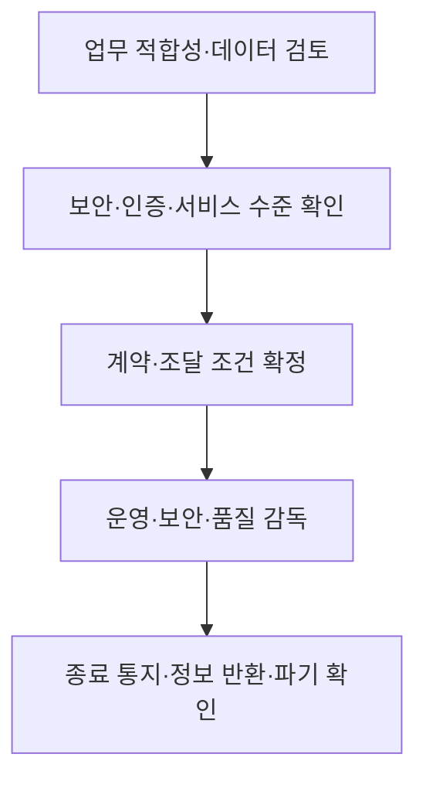
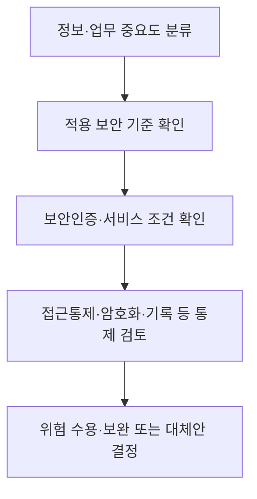
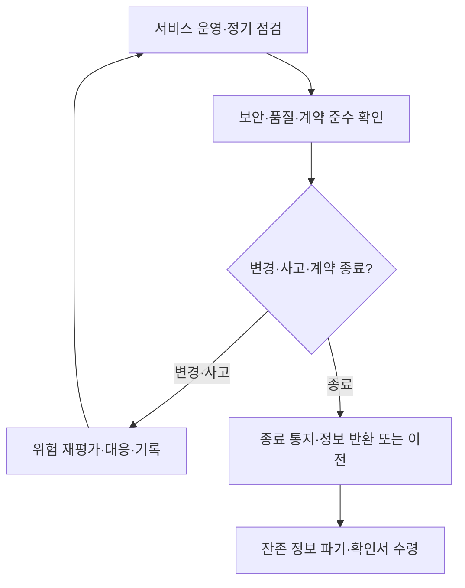

## 지식 로드맵 내 현재 위치

공공 정보화·조달 → 클라우드서비스 도입·관리 → 공공부문 SaaS 이용

## 30초 인출

- 본질: 공공부문 SaaS 이용은 기관이 자체 구축 대신 클라우드 기반 소프트웨어를 계약해 쓰는 방식이다.
- 메커니즘: 업무 적합성·보안·서비스 수준을 검토하고, 계약 중 운영을 감독하며, 종료 시 통지·정보 반환·파기를 관리한다.

핵심 용어

- **SaaS**: 인터넷 등 네트워크를 통해 제공되는 소프트웨어를 이용자가 서비스 형태로 사용하는 클라우드 모델.
- **클라우드 보안인증(CSAP)**: 클라우드서비스가 법정 보안인증 기준을 충족하는지 심사하는 제도.
- **서비스 수준**: 가용성·성능·지원 등 계약한 클라우드서비스 품질 기준.
- **출구 계획**: 계약 종료 때 이용정보를 반환·이전하고 안전하게 파기하도록 정한 절차.

---

## 1교시 예상문제 (10점)

> 공공부문에서 SaaS를 도입할 때 검토할 업무·보안·계약·종료 요건을 설명하시오. (예상)

---

## 1교시 10점 답안

### 1. 정의·목적

- 정의: SaaS는 클라우드사업자가 제공하는 소프트웨어를 서비스로 이용하는 방식이다.
- 목적: 공공기관의 업무 요구를 충족하면서 서비스와 정보자원을 효율적으로 이용한다.

### 2. 도입 생명주기

공공기관은 보안인증 서비스를 우선 고려하고 국가 클라우드 보안 기준 등 적용되는 보안 요구를 확인한다. 종료 시 정보 반환과 파기 절차를 계약 및 이용 기준에 반영한다.

제언: 도입 승인 전에 정보의 민감도와 계약 종료 후 이전 가능성을 함께 확인한다.

---

## 2~4교시 예상문제 (25점)

> 행정기관·공공기관의 클라우드 기반 SaaS 도입·운영·종료 절차와 보안·서비스 품질 확보 방안을 설명하시오. (예상)

---

## 2~4교시 25점 답안

## Ⅰ. 개요

공공부문 SaaS는 기관이 소프트웨어를 직접 개발·운영하는 대신 클라우드서비스를 계약해 이용하는 방식이다. 도입 여부는 업무 적합성, 정보의 중요도, 보안 기준, 서비스 수준과 운영·종료 조건을 함께 검토해 결정한다.

| 도입 이점 | 관리할 위험 |
|---|---|
| 신속한 기능 이용·운영부담 조정 가능 | 정보보호, 사업자 의존, 서비스 장애, 계약 종료 시 정보 이동 |

## Ⅱ. 도입 전 검토

| 검토 항목 | 질문 |
|---|---|
| 업무 적합성 | 표준 SaaS 기능으로 업무를 수행할 수 있는가? 맞춤 개발·연계 요구는 무엇인가? |
| 정보 분류 | 처리 정보의 중요도·개인정보 포함 여부와 허용 환경은 무엇인가? |
| 보안·인증 | 적용 법령·국가 보안 기준에 맞는 서비스·등급인가? 인증 요건은 충족되는가? |
| 서비스 수준 | 가용성·성능·지원·장애 통지와 측정 조건이 적절한가? |
| 종료 가능성 | 정보 반환 형식·시기·비용, 이전 지원과 파기 증명이 정해졌는가? |

## Ⅲ. 보안·위험 검토

현행 고시는 보안인증된 클라우드서비스를 우선 고려하도록 하며, 국가 정보보안 기본지침과 국가 클라우드컴퓨팅 보안 가이드라인 등 적용 기준을 준수하도록 정한다. 따라서 모든 공공 SaaS에 동일 인증등급이 무조건 필요한 것으로 단정하지 말고, 서비스·정보·기관에 적용되는 요건을 확인한다.

## Ⅳ. 계약·조달

| 계약 항목 | 포함할 내용 |
|---|---|
| 이용 범위 | 서비스 기능·이용자·정보처리 위치와 연계 범위 |
| 보안 책임 | 계정·권한, 로그, 취약점·사고 통지와 공동 대응 |
| 서비스 수준 | 품질 지표, 측정 방법, 장애 대응, 지원 시간 |
| 변경·하도급 | 서비스 변경·하위 처리자·재위탁 통지 및 승인 조건 |
| 종료 지원 | 정보 반환·이전, 계약 종료 통지, 삭제와 파기 확인 |

조달·계약 방식은 디지털서비스 전문계약 등 해당 절차의 자격과 법정 요건을 검토한다. SaaS라는 이유만으로 수의계약이 자동 허용되는 것은 아니다.

## Ⅴ. 운영·종료 관리

## Ⅵ. 실무 과제와 대응

| 문제 | 대응 |
|---|---|
| 조직별 맞춤 요구가 누적되어 SaaS 표준 업데이트가 어려움 | 필수 업무·법정 요구와 선호 기능을 구분하고 표준 기능 적용을 우선 검토 |
| 인증 보유만 확인하고 실제 계약 설정을 점검하지 않음 | 계약한 서비스·등급·데이터 흐름과 실제 설정이 일치하는지 정기 확인 |
| 기관 망·인증과 외부 SaaS 연계가 막힘 | 허용된 보안 기준에 맞는 접속·연계 방식을 보안 담당자와 설계 |
| 종료 때 정보 이관이 지연되거나 추가 비용 발생 | 이전 형식·기한·지원 비용·삭제 증명을 계약 전 합의 |

## Ⅶ. 기술사적 제언

| 문제 | 해결 방안 |
|---|---|
| SaaS 계약이 도입 단계에 집중되고 변경·종료 시 정보보호와 서비스 연속성이 약해질 수 있음 | 업무·정보 분류에서 계약·운영·종료까지 통제 항목을 연결한 서비스 생명주기 대장을 두고 정기적으로 사업자와 이행 증적을 확인한다. |

## 출제 이력과 검증 출처

- 기존 노트에는 제128회 2교시 공공부문 클라우드 활용 문항과 제134회 2교시 1번 SaaS 이용 가이드라인 문항이 기록되어 있으나 공식 문항 원문은 별도 대조하지 못함.
- [국가법령정보센터, 행정기관 및 공공기관의 클라우드컴퓨팅서비스 이용 기준 및 안전성 확보 등에 관한 고시(2025-12-29 시행)](https://www.law.go.kr/LSW/admRulInfoP.do?admRulSeq=2100000270616&chrClsCd=010201)
- [국가법령정보센터, 공공 클라우드 이용 고시 제11조(보안성 기준)](https://www.law.go.kr/LSW/admRulInfoP.do?admRulSeq=2100000270616&chrClsCd=010202&lsId=81348)
- [국가법령정보센터, 클라우드서비스 이용정보·인증등급 기록](https://www.law.go.kr/LSW/flDownload.do?bylClsCd=200201&flNm=%5B%EB%B3%84%ED%91%9C+1%5D+%ED%81%B4%EB%9D%BC%EC%9A%B0%EB%93%9C%EC%BB%B4%ED%93%A8%ED%8C%85%EC%84%9C%EB%B9%84%EC%8A%A4+%EC%9D%B4%EC%9A%A9%EC%A0%95%EB%B3%B4%28%EC%A0%9C9%EC%A1%B0+%EA%B4%80%EB%A0%A8%29&flSeq=160669565)
