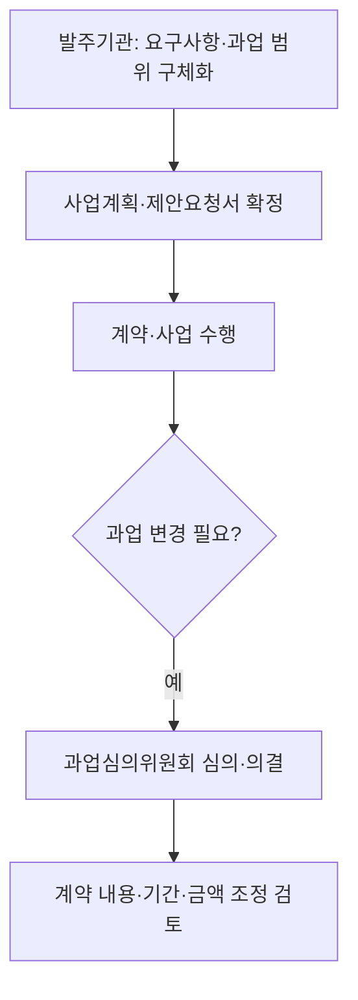
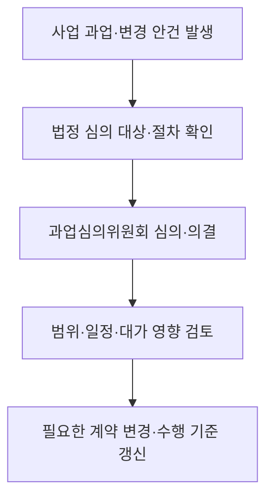

## 지식 로드맵 내 현재 위치

소프트웨어 정책·법제 → 공공 SW 사업 발주·수행 → 소프트웨어 진흥법

## 30초 인출

- 본질: 소프트웨어 진흥법은 소프트웨어산업의 진흥 기반과 공공 소프트웨어사업의 발주·수행 절차를 정한 법이다.
- 메커니즘: 발주자는 과업 범위·요구사항을 구체화하고, 과업심의위원회 절차로 범위와 변경을 다루며 계약·기간·대가를 조정한다.

핵심 용어

- **요구사항 상세화**: 국가기관 등이 공공 SW 사업의 목적과 범위에 맞게 요구사항을 구체적으로 작성하는 절차.
- **과업심의위원회**: 공공 SW 사업의 과업 확정·변경 등 법정 사항을 심의하는 위원회.
- **과업 변경**: 확정된 SW 사업 범위나 내용을 바꾸는 것. 법정 심의 및 계약 변경 절차에 따른다.
- **대기업 참여 제한**: 공공 SW 사업에서 법령상 대상 대기업의 참여를 제한하는 제도. 예외·사업 기준은 법과 고시를 확인한다.

---

## 1교시 예상문제 (10점)

> 소프트웨어 진흥법상 공공 SW 사업의 요구사항 상세화와 과업 변경 심의의 목적 및 절차를 설명하시오. (예상)

---

## 1교시 10점 답안

### 1. 정의·목적

- 정의: 소프트웨어 진흥법은 소프트웨어산업의 진흥과 공공 SW 사업의 합리적 추진 절차를 정한 법률이다.
- 목적: 사업 범위·책임을 명확히 하고 과업 변경을 적정한 심의·계약 절차로 관리한다.

### 2. 발주·변경 절차

제언: 발주 전 요구사항의 검증 가능성과 변경 시 심의·계약 절차를 함께 설계한다.

---

## 2~4교시 예상문제 (25점)

> 소프트웨어 진흥법상 공공 SW 사업의 주요 발주·수행 제도와 과업심의위원회의 역할을 설명하고, 요구사항 변경에 따른 공정한 사업관리를 위한 개선 방안을 제시하시오. (예상)

---

## 2~4교시 25점 답안

## Ⅰ. 개요

소프트웨어 진흥법은 산업 기반을 조성하고 공공 SW 사업의 발주·계약·수행 과정에서 합리적인 절차를 마련한다. 핵심은 사전 과업 범위의 구체화와 변경 발생 시 공식 심의 및 계약 조정이다.

| 사업 위험 | 제도적 대응 |
|---|---|
| 모호한 과업·무상 추가 요구 | 요구사항 상세화, 과업심의와 계약 변경 절차 |

## Ⅱ. 발주 단계와 요구사항

| 발주 단계 | 관리 내용 |
|---|---|
| 사업 기획 | 목적·대상·예산·일정·연계와 제약조건 정의 |
| 요구사항 분석 | 기능·품질·보안·검수 기준을 구체화하고 검증 가능하게 작성 |
| 입찰·계약 | 과업 범위와 변경 요청·심의·계약 조정 절차를 문서화 |
| 수행·검수 | 기준선 대비 변경을 추적하고 결과를 합의된 기준으로 확인 |

## Ⅲ. 과업심의위원회

국가기관 등의 장은 위원회를 두고 법정 심의사항을 다뤄야 한다. 계약한 사업자는 과업 변경으로 계약 변경이 필요한 경우 위원회 개최를 요청할 수 있다. 과업심의 결과는 계약 내용·기간·금액 조정 절차와 연결해 처리한다.

## Ⅳ. 변경·대가 관리

| 단계 | 통제 |
|---|---|
| 변경 요청 | 원인·요구자·범위·필요성 기록 |
| 영향 분석 | 기능·보안·품질·일정·비용 영향 평가 |
| 심의·계약 변경 | 법정 심의 및 국가·지방 계약 규정에 따른 변경 절차 준수 |
| 기준선 갱신 | 승인된 범위·일정·검수 기준을 사업 계획과 이력에 반영 |

과업이 늘었다고 대가가 자동 산정되거나 언제나 기능점수 방식만 적용되는 것은 아니다. 심의와 계약 조정은 적용되는 법령·계약조건 및 예산 절차에 따라야 한다.

## Ⅴ. 수행환경과 참여 제도

| 제도 | 실무상 확인 |
|---|---|
| 원격지 개발 | 사업 특성·보안 요구·발주 조건과 현행 지침을 함께 검토해 개발환경을 정함 |
| 대기업 참여 제한 | 사업 규모·유형, 기업 구분, 예외와 과학기술정보통신부 고시 기준을 확인 |
| 발주·사업관리 | 관련 고시·지침과 계약조건을 발주·수행 단계에 반영 |

## Ⅵ. 사업관리 문제와 대응

| 문제 | 대응 |
|---|---|
| 모호한 요구사항으로 검수·변경 분쟁 | 요구사항마다 산출물·수용 기준·검증 방법을 명시 |
| 구두로 과업이 늘고 변경 이력이 누락 | 변경 요청·영향 분석·승인·계약 반영을 단일대장으로 추적 |
| 심의 후에도 실제 계약·계획에 미반영 | 위원회 의결과 계약 변경·일정·예산 문서를 연결해 확인 |
| 보안 사유만으로 개발 장소를 일률 제한 | 데이터·접속·인력 위험에 맞춘 통제와 원격 개발 가능성을 함께 평가 |

## Ⅶ. 기술사적 제언

| 문제 | 해결 방안 |
|---|---|
| 과업심의가 변경 발생 후 형식 절차가 되어 비용·일정 영향이 누적될 수 있음 | 요구사항 추적표와 계약 변경 기록을 연계하고, 변경률·미결 심의·비용 영향을 정기적으로 발주기관 책임자가 검토하게 한다. |

## 시행 예정 개정 확인

법률 제21865호(2026-08-11 공포)는 2027년 2월 12일 시행 예정이다. 특정 변경 가능성이 높은 계약은 일정 시점에 과업심의위원회를 의무적으로 개최하는 등 제50조를 개정하며, 적용례는 시행 이후 체결하는 계약부터다. 시행 전에는 개정 조문과 현행 조문을 구분한다.

## 출제 이력과 검증 출처

- 기존 노트에는 제121회 4교시 RFP 요구사항 상세화, 제132회 4교시 4번 소프트웨어 진흥법상 공공 SW 제도가 기록되어 있으나 공식 기출 원문은 별도 대조하지 못함.
- [국가법령정보센터, 소프트웨어 진흥법 제44조(요구사항 상세화)](https://law.go.kr/LSW/lsLinkCommonInfo.do?chrClsCd=010202&lsJoLnkSeq=1027884493)
- [국가법령정보센터, 소프트웨어 진흥법 제50조(과업심의위원회)](https://law.go.kr/lsLinkCommonInfo.do?chrClsCd=010202&lsJoLnkSeq=1031614467)
- [국가법령정보센터, 법률 제21865호 및 시행일·적용례](https://law.go.kr/LSW/lsRvsDocListP.do?chrClsCd=010202&lsId=000751&lsRvsGubun=all)
- [국가법령정보센터, 소프트웨어사업 계약·관리감독 지침(과업변경 대가 조정)](https://www.law.go.kr/LSW/admRulLsInfoP.do?admRulId=33489&efYd=0)
