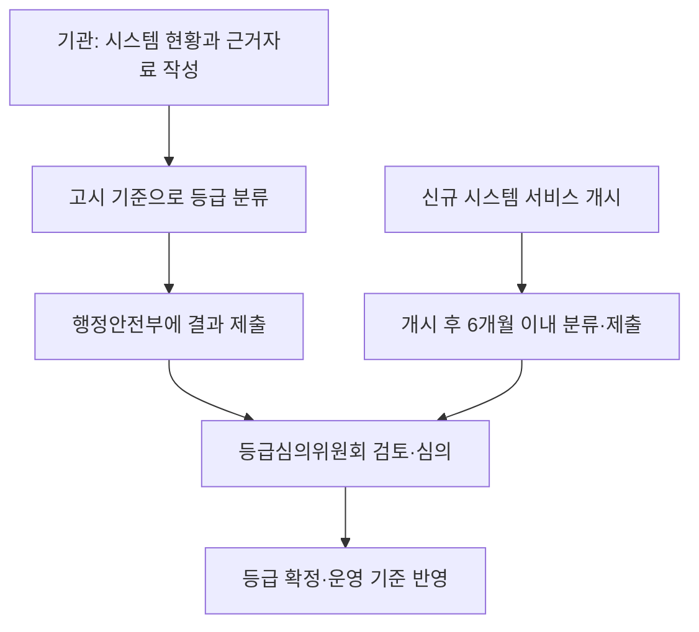

## 지식 로드맵 내 현재 위치
IT 거버넌스 → 공공 정보시스템 안정성 → 국민에게 미치는 영향에 따른 등급 분류와 운영 관리

## 30초 인출
- 본질: 정보시스템 등급제는 공공 서비스가 멈췄을 때 국민에게 미치는 영향에 따라 시스템을 A1~A4로 나누어 관리하는 제도다.
- 메커니즘: 서비스 중요도와 영향도를 살펴 등급을 정하고, 등급별 안정성 관리와 장애 대응에 반영한다.

핵심 용어

- 정보시스템 등급제: 공공 정보시스템의 중요도·영향도를 분류해 관리 수준을 정하는 제도.
- A1~A4: 국가 핵심, 대국민 필수, 행정 중요, 일반 정보시스템을 구분하는 네 등급.
- 정보시스템 등급심의위원회: 기관이 제출한 분류 결과와 근거를 검토해 등급을 심의·확정하는 위원회.
- 정보시스템 안정성 고시: 등급 분류와 안정성 점검·장애 통보 등 운영에 필요한 세부 기준을 정한 행정안전부 고시.

---

## 1교시 예상문제 (10점)
> 공공 정보시스템 등급제의 목적과 A1~A4 분류 및 운영 관리의 핵심을 설명하시오. (예상)

---

## 1교시 10점 답안
### 1. 정의·목적
- 정의: 정보시스템 등급제는 공공 정보시스템의 중요도와 장애 영향을 기준으로 A1~A4 등급을 정하는 제도다.
- 목적: 국민 생활에 미치는 영향에 맞춰 안정성 관리와 장애 대응의 우선순위를 정한다.

### 2. 분류와 운영
| 등급 | 법정 분류의 요지 |
|---|---|
| A1 | 국가 안보와 국민의 생명·안전·재산에 밀접한 국가 핵심 시스템 |
| A2 | 국민이 많이 이용하는 대국민 필수 시스템 |
| A3 | 연계가 많고 중요도·영향도가 높은 행정기관 내부 업무 시스템 |
| A4 | 국민 편의 또는 행정 업무를 보조하는 일반 시스템 |

등급은 고시의 산정 기준과 근거자료에 따라 분류하고, 심의위원회가 검토·확정한다. 중앙행정기관 등은 매년 안정성 기준에 따라 현황을 점검하고 결과를 정보자원관리시스템에 등록한다. A1~A3 시스템의 장애는 행정안전부에 즉시 통보한다.

**제언:** 등급 근거와 실제 장애·복구 기록을 함께 살펴 분류와 운영 관리가 현장 영향에 맞는지 주기적으로 점검한다.

---

## 2~4교시 예상문제 (25점)
> 「전자정부법」에 따른 공공 정보시스템 등급제의 분류 기준과 절차, 등급별 운영 관리 및 장애 대응 방안을 설명하시오. (예상)

---

## 2~4교시 25점 답안
## Ⅰ. 개요
- 정의: 정보시스템 등급제는 공공 정보시스템의 중요도와 장애 영향을 기준으로 A1~A4 등급을 정하는 제도다.
- 목적: 서비스 중단이 국민과 행정 업무에 미치는 영향에 맞춰 안정성 관리와 대응 우선순위를 정한다.

## Ⅱ. 등급과 분류 기준
| 등급 | 시스템 성격 |
|---|---|
| A1 | 국가 안보, 국민 생명·안전·재산에 밀접한 국가 핵심 |
| A2 | 국민 이용이 많고 중요도·영향도가 높은 대국민 필수 |
| A3 | 시스템 간 연계가 많고 중요도·영향도가 높은 행정 중요 |
| A4 | 국민의 일상적 편의 또는 행정 업무를 보조하는 일반 |

등급 산정은 고시 별표 1의 기준에 따른다. 법령은 서비스의 성격·중요도, 이용자 수, 연계된 다른 시스템에 미치는 영향 등을 고려하도록 하며, 2026년 전면 재분류는 이용자 수만으로 중요도를 낮게 평가하던 문제를 보완해 국민 관점의 서비스 중요도를 중심으로 삼았다.

## Ⅲ. 분류·확정 절차

기관은 등급과 산정 근거를 제출하고, 심의위원회가 결과를 검토해 변경·확정한다. 신규 시스템은 서비스 개시일부터 6개월 이내에 등급을 분류해 제출한다.

## Ⅳ. 안정성 관리와 장애 대응
| 관리 구간 | 적용 내용 |
|---|---|
| 정기 점검 | 매년 고시의 안정성 기준에 따라 현황 조사·자체 점검 후 결과 등록 |
| 등급별 관리 | 별표 2의 안정성 기준에 맞춰 운영·점검·복구 계획 관리 |
| 장애 통보 | A1·A2·A3 장애 발생 시 행정안전부 디지털안전상황실에 즉시 통보 |
| 복구·재발 방지 | 장애 원인과 조치 결과를 기록하고 후속 점검에 반영 |

등급은 관리의 우선순위를 정하는 기준이다. 등급만으로 특정 이중화 구성, RTO·RPO 수치 또는 가용률이 일률적으로 정해진다고 단정하지 말고, 해당 고시의 안정성 기준과 시스템별 계획을 확인한다.

## Ⅴ. 도입 시 유의점
| 위험 | 관리 방안 |
|---|---|
| 이용자 수만으로 서비스 중요도를 판단 | 생명·안전·일상 영향과 업무 연계를 함께 검토 |
| 기관 자체 분류 근거가 불충분 | 산정 자료를 남기고 심의 과정에서 이견 조정 |
| 등급 확정 후 서비스·연계 구조가 변함 | 정기 점검과 변경 사항을 분류 검토에 반영 |
| 등급을 곧바로 특정 기술 구성으로 해석 | 고시 기준과 시스템별 위험 분석에 따라 통제 선정 |

## Ⅵ. 기술사적 제언
| 문제 | 해결 방안 |
|---|---|
| 등급이 실제 서비스 영향이나 연계 구조의 변화와 어긋날 수 있음 | 등급 근거, 연계 시스템, 장애·복구 기록을 정기적으로 대조하고 필요 시 재검토한다. |

## 출제 이력과 검증 출처
- 기존 원문에 기재된 제139회 2교시 5번 문항의 회차·문구는 공식 기출 원문을 확인하지 못해 출제 이력으로 확정하지 않았다.
- 「전자정부법」 제56조의2부터 제56조의5, 같은 법 시행령 제70조의2부터 제70조의5.
- 「행정기관 및 공공기관 정보시스템 안정성 고시」(행정안전부고시 제2026-23호, 2026. 4. 13. 시행) 제5조·제6조·제8조·제15조 및 별표 1·2. [국가법령정보센터](https://www.law.go.kr/admRulLsInfoP.do?admRulSeq=2100000277792)
- 행정안전부, 「공공 정보시스템 1만 5천여 개 등급 전면 재조정, 국민 영향 중심으로 개편」(2026. 8. 27.). [보도자료](https://www.mois.go.kr/frt/bbs/type010/commonSelectBoardArticle.do?bbsId=BBSMSTR_000000000008&nttId=129047)

## 연결 토픽
- 공공 SLA: 등급별 서비스 품질을 측정하고 합의하는 관리 주제.
- 공공 SaaS 이용: 시스템 운영 환경과 보안 요구를 검토하는 연계 주제.
