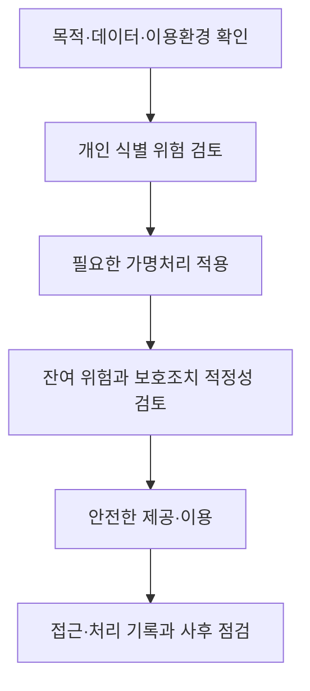

## 지식 로드맵 내 현재 위치
개인정보 보호 → 가명정보 처리 특례 → 목적·위험에 맞춘 가명처리와 안전관리

## 30초 인출
- 본질: 가명정보는 추가 정보를 쓰거나 결합하지 않으면 특정 개인을 알아볼 수 없도록 처리한 개인정보다.
- 메커니즘: 허용 목적에 맞게 위험을 검토해 가명처리하고, 추가 정보 분리·접근 통제와 재식별 금지로 관리한다.

핵심 용어

- 가명정보: 추가 정보의 사용·결합 없이는 개인을 알아볼 수 없도록 처리한 개인정보.
- 추가 정보: 가명정보를 원래 상태로 복원하는 데 필요한 정보.
- 가명정보 결합전문기관: 서로 다른 개인정보처리자의 가명정보 결합을 수행하도록 지정된 기관.
- 위험성 검토: 데이터와 처리 환경을 살펴 개인을 알아볼 위험과 필요한 보호조치를 판단하는 과정.

---

## 1교시 예상문제 (10점)
> 가명정보의 정의, 동의 없는 처리 가능 목적 및 안전조치를 설명하시오. (예상)

---

## 1교시 10점 답안
### 1. 정의·목적
- 정의: 가명정보는 추가 정보를 사용·결합하지 않으면 특정 개인을 알아볼 수 없도록 처리한 개인정보다.
- 목적: 통계작성, 과학적 연구, 공익적 기록보존에 개인정보를 안전하게 활용한다.

### 2. 처리와 보호
| 구분 | 핵심 내용 |
|---|---|
| 처리 근거 | 통계작성·과학적 연구·공익적 기록보존을 위해 동의 없이 처리 가능 |
| 결합 | 서로 다른 개인정보처리자 간 결합은 지정 전문기관이 수행 |
| 안전조치 | 복원에 필요한 추가 정보를 별도 분리·관리하고 기술적·관리적·물리적 조치 적용 |
| 금지행위 | 특정 개인을 알아보려는 처리 금지; 식별정보가 생성되면 처리 중지·회수·파기 |

**제언:** 가명처리의 적정성과 재식별 위험을 데이터와 이용 환경에 맞춰 함께 점검한다.

---

## 2~4교시 예상문제 (25점)
> 개인정보 보호법상 가명정보의 처리 특례와 결합 절차, 안전조치 및 재식별 방지 방안을 설명하시오. (예상)

---

## 2~4교시 25점 답안
## Ⅰ. 개요
- 정의: 가명정보는 추가 정보의 사용·결합 없이는 특정 개인을 알아볼 수 없도록 처리한 개인정보다.
- 목적: 적법한 연구·통계·공익 목적의 데이터 이용과 정보주체 보호를 함께 달성한다.

## Ⅱ. 처리 특례와 적용 범위
| 항목 | 법적 기준 |
|---|---|
| 동의 없는 처리 | 통계작성, 과학적 연구, 공익적 기록보존 목적에 허용 |
| 제3자 제공 | 개인을 알아보는 데 쓰일 수 있는 정보를 포함하지 않음 |
| 가명정보의 지위 | 개인정보에 해당하므로 보호법상 안전관리 필요 |

과학적 연구는 기술의 개발·실증, 기초·응용연구와 민간 투자 연구 등을 포함한다. 목적이 허용된다는 이유만으로 무제한 결합·이용이 허용되는 것은 아니며, 처리 목적과 위험에 맞는 보호조치를 마련해야 한다.

## Ⅲ. 가명처리의 판단과 수행

개인정보보호위원회의 2026년 가명정보 처리 가이드라인은 사전 준비, 위험성 검토, 가명처리, 적정성 검토, 안전한 관리의 위험도 기반 흐름을 제시한다. 특정 k값, l-다양성 또는 t-근접성을 모든 데이터에 일률적으로 적용하는 법정 기준으로 보아서는 안 된다.

## Ⅳ. 결합과 반출
| 단계 | 담당·통제 |
|---|---|
| 결합 신청 | 서로 다른 개인정보처리자가 결합 목적과 가명정보를 준비 |
| 결합 수행 | 보호위원회 또는 관계 중앙행정기관의 장이 지정한 전문기관이 수행 |
| 외부 반출 | 결합정보를 가명정보 또는 익명정보로 처리하고 전문기관의 장 승인을 받음 |
| 결합 후 이용 | 승인 범위와 목적에 맞춰 이용하고 재식별을 시도하지 않음 |

## Ⅴ. 안전조치와 금지행위
| 위험·금지 | 법에 따른 대응 |
|---|---|
| 복원용 추가 정보 노출 | 별도 분리 보관·관리 및 안전성 확보 조치 |
| 특정 개인 식별 시도 | 가명정보 처리 과정에서 금지 |
| 개인을 알아볼 정보가 생성됨 | 즉시 처리를 중지하고 지체 없이 회수·파기 |
| 결합정보 무단 반출 | 전문기관 승인과 비식별 처리 없이 외부 반출하지 않음 |

암호화·접근통제 등 구체적 통제는 자료 민감도, 결합 가능성, 처리 환경을 반영해 정한다. 가명처리만으로 재식별 위험이 사라졌다고 간주하지 않는다.

## Ⅵ. 기술사적 제언
| 문제 | 해결 방안 |
|---|---|
| 처리 목적과 데이터 환경이 바뀌면 기존 가명처리의 식별 위험 평가가 맞지 않을 수 있음 | 목적·제공 범위·결합 가능성을 변경 때마다 재검토하고, 위험이 커지면 추가 가명처리나 이용 제한을 적용한다. |

## 출제 이력과 검증 출처
- 기존 원문에 기재된 제121회 3교시 4번의 회차·문구는 공식 기출 원문을 확인하지 못해 출제 이력으로 확정하지 않았다.
- 「개인정보 보호법」 제2조제1호다목·제1호의2, 제28조의2부터 제28조의5. [국가법령정보센터](https://law.go.kr/lsLinkCommonInfo.do?chrClsCd=010202&lsJoLnkSeq=1020398653)
- 개인정보보호위원회, 「가명정보 처리 가이드라인」 전면 개정 보도자료 및 2026. 3. 가이드라인. [공식 안내](https://pipc.go.kr/np/cop/bbs/selectBoardArticle.do?bbsId=BS074&mCode=C020010000&nttId=11928)

## 연결 토픽
- 개인정보 보호법: 가명정보 처리 특례의 상위 법률.
- 데이터 3법: 개인정보·신용정보·정보통신 분야 데이터 이용 특례의 제도적 배경.
