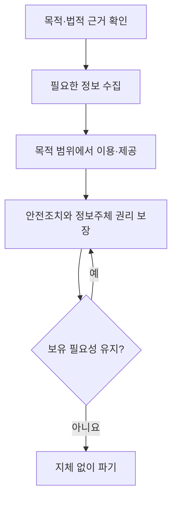
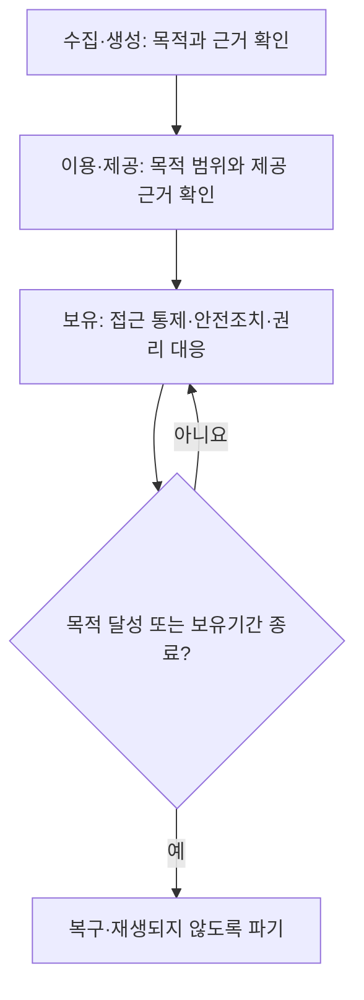

## 지식 로드맵 내 현재 위치
개인정보 보호 → 개인정보 처리 일반원칙 → 수집부터 파기까지의 적법성·권리·안전 관리

## 30초 인출
- 본질: 개인정보 보호법은 개인정보 처리자가 지켜야 할 원칙과 정보주체의 권리를 정한 일반법이다.
- 메커니즘: 처리 목적과 법적 근거를 확인하고, 필요한 범위에서 처리하며, 안전하게 관리하고 목적이 끝나면 파기한다.

핵심 용어

- 개인정보처리자: 업무 목적으로 개인정보파일을 운용하기 위해 개인정보를 처리하는 공공기관·법인·단체·개인 등.
- 정보주체: 처리되는 정보로 알아볼 수 있는 사람으로서 그 정보의 주체.
- 처리: 수집·생성·기록·저장·보유·가공·이용·제공·공개·파기 등 개인정보에 하는 행위.
- 처리 목적: 개인정보를 수집·이용하는 구체적 이유로, 처리의 적법성과 범위를 판단하는 기준.

---

## 1교시 예상문제 (10점)
> 개인정보 보호법의 목적과 개인정보 처리 생애주기별 핵심 원칙을 설명하시오. (예상)

---

## 1교시 10점 답안
### 1. 정의·목적
- 정의: 개인정보 보호법은 개인정보의 처리와 보호에 필요한 사항을 정한 일반법이다.
- 목적: 개인의 권리와 이익을 보호하고 개인정보의 적법한 활용 기반을 마련한다.

### 2. 처리 생애주기

**제언:** 처리 목적과 보유 기간을 먼저 정하고 각 단계의 책임자와 이행 증거를 관리한다.

---

## 2~4교시 예상문제 (25점)
> 개인정보 보호법의 주요 처리 원칙과 정보주체 권리, 개인정보처리자의 생애주기별 관리 방안을 설명하시오. (예상)

---

## 2~4교시 25점 답안
## Ⅰ. 개요
- 정의: 개인정보 보호법은 개인정보 처리의 원칙·의무와 정보주체 권리를 규정하는 일반법이다.
- 목적: 개인정보를 적법하고 안전하게 처리해 정보주체의 권리와 이익을 보호한다.

## Ⅱ. 기본 원칙과 적법 근거
| 원칙 | 적용 내용 |
|---|---|
| 목적 명확화 | 처리 목적을 구체적으로 정하고 목적에 필요한 범위에서 처리 |
| 최소 처리 | 목적 달성에 필요한 최소한의 개인정보를 적법하게 수집 |
| 목적 제한 | 수집 목적과 법률상 허용 범위를 벗어난 이용·제공 제한 |
| 안전성·책임성 | 위험에 맞는 안전조치를 하고 처리 과정의 책임을 관리 |

개인정보 수집·이용은 정보주체 동의 외에도 법률상 의무, 계약 이행 등 법 제15조가 정한 근거가 있을 때 가능하다. 동의만을 유일한 근거로 보지 말고 목적, 항목, 근거 조항을 함께 확인한다.

## Ⅲ. 생애주기별 처리 통제

개인정보처리자는 수집·이용부터 파기까지 각 단계에서 법적 근거와 필요성을 확인한다. 다른 법령에 따라 보존해야 하는 정보는 별도 보관 등 해당 요건을 따르며, 단순히 백업본이라는 이유로 파기 의무가 사라지지 않는다.

## Ⅳ. 정보주체 권리와 대응
| 권리 | 처리자가 준비할 대응 |
|---|---|
| 열람 | 본인 확인과 법정 제한 사유를 확인해 처리 내역 제공 |
| 정정·삭제 | 사실관계를 확인해 법정 요건에 따라 수정·삭제 |
| 처리정지 등 | 요청을 접수하고 법정 거절 사유와 후속 조치를 안내 |
| 전송 요구 | 법정 대상과 요건을 확인해 전송요구권 행사 절차 운영 |
| 자동화된 결정 대응 | 법정 적용 요건에 해당하면 거부·설명 요구 등 권리 보장 |

## Ⅴ. 안전관리와 사고 대응
| 관리 영역 | 핵심 실행 |
|---|---|
| 접근·이용 | 업무상 필요한 권한만 부여하고 처리 기록을 관리 |
| 보호조치 | 개인정보의 유형과 처리 위험에 맞는 기술적·관리적·물리적 조치 적용 |
| 보유·파기 | 보유 필요성을 점검하고 불필요해지면 법령에 맞게 파기 |
| 유출 대응 | 법정 통지·신고 요건과 기한을 확인하고 피해 확산 방지 및 후속 조치 수행 |

## Ⅵ. 기술사적 제언
| 문제 | 해결 방안 |
|---|---|
| 시스템별 처리 목적·보유 기간과 실제 운영 데이터가 다를 수 있음 | 데이터 목록과 시스템 처리 흐름을 연결하고, 목적·보유기간 변경 및 파기 결과를 정기 대조한다. |

## 출제 이력과 검증 출처
- 기존 원문에 기재된 제130회 2교시 4번 문항의 회차·문구는 공식 기출 원문을 확인하지 못해 출제 이력으로 확정하지 않았다.
- 「개인정보 보호법」 제2조부터 제4조, 제15조·제17조·제18조·제21조·제29조·제35조 및 관련 조문. [국가법령정보센터 현행법](https://www.law.go.kr/법령/개인정보보호법)
- 이 노트의 조문 기준은 개인정보 보호법(법률 제21445호, 2026. 9. 11. 시행)이다. 세부 권리·통지 요건은 사건과 처리 유형에 따라 해당 조항을 확인한다.

## 연결 토픽
- 가명정보: 일반 처리 원칙에 추가되는 가명정보 처리 특례.
- 개인정보 침해 대응: 유출 통지·신고와 피해 구제 절차.
- 개인정보 보호책임자: 조직 내 개인정보 보호 업무를 총괄하는 역할.
