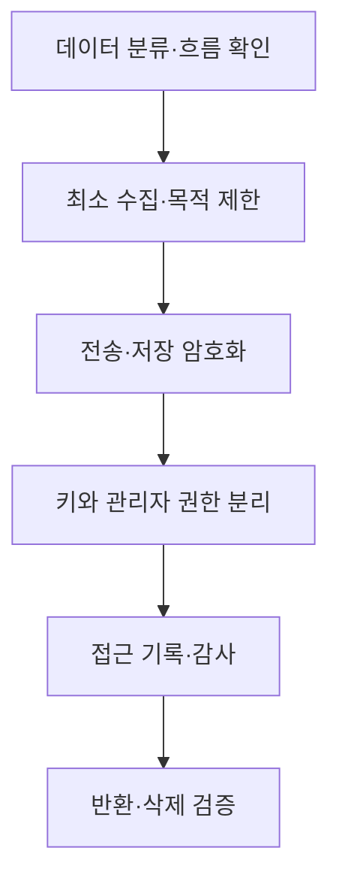

## 지식 로드맵 내 현재 위치
데이터 거버넌스 → 국경을 넘는 데이터 처리 → 관할권·이용권·보호 책임의 통제

## 30초 인출
- 본질: 데이터 주권은 데이터에 적용되는 법과 데이터의 이용·접근을 통제하는 주체를 함께 살피는 관점이다.
- 메커니즘: 데이터 위치, 처리자와 서비스 제공자의 관할권, 접근 권한, 암호키 통제를 함께 검토한다.

핵심 용어

- 데이터 주권: 데이터가 놓인 관할권과 데이터 접근·이용을 통제할 권한을 함께 다루는 개념.
- 데이터 현지화: 특정 유형의 데이터를 국내에서 저장하거나 처리하도록 요구하는 정책·규제 수단.
- 국외 이전: 개인정보를 국외로 제공·처리위탁·보관하는 행위로서 개인정보 보호법의 요건을 확인해야 하는 처리.
- HYOK(Hold Your Own Key): 고객이 암호키를 직접 관리하고 클라우드 서비스와 분리하는 키 관리 방식.

---

## 1교시 예상문제 (10점)
> 데이터 주권의 의미와 국외 클라우드 이용 시 검토할 통제 요소를 설명하시오. (예상)

---

## 1교시 10점 답안
### 1. 정의·목적
- 정의: 데이터 주권은 데이터에 적용되는 법과 데이터 접근·이용을 통제하는 주체를 함께 살피는 관점이다.
- 목적: 국경을 넘는 데이터 처리에서도 법적 의무와 정보 보호 책임을 명확히 한다.

### 2. 검토 요소
| 요소 | 확인할 내용 |
|---|---|
| 법적 관할 | 데이터 주체·처리자·서비스 제공자에 적용되는 법과 관할 |
| 데이터 위치 | 저장·처리·백업 장소와 재위탁 경로 |
| 접근 통제 | 관리자·지원 인력의 접근 범위와 감사 기록 |
| 암호키 | 키 보유자, 사용 권한, 복구·폐기 절차 |

국내 저장만으로 외국 법률의 적용 가능성이 사라지지 않으며, 암호키 분리만으로 모든 법적 접근 요구를 배제할 수도 없다. 개인정보 국외 이전은 개인정보 보호법 제28조의8의 근거와 요건에 따라 검토한다.

**제언:** 계약서와 기술 설계에서 데이터 흐름·접근 주체·키 관리 책임을 함께 확인한다.

---

## 2~4교시 예상문제 (25점)
> 해외 클라우드·SaaS를 이용하는 조직의 데이터 주권 위험을 분석하고 법적·기술적·계약적 관리 방안을 설명하시오. (예상)

---

## 2~4교시 25점 답안
## Ⅰ. 개요
- 정의: 데이터 주권은 데이터에 적용되는 법적 관할과 데이터 접근·이용에 대한 통제력을 함께 다루는 관점이다.
- 목적: 데이터의 국경 간 활용과 법적 의무·보호 책임을 조화시킨다.

## Ⅱ. 위험을 결정하는 요소
| 요소 | 주권에 미치는 영향 |
|---|---|
| 저장·처리 위치 | 현지 법과 규제, 이전 경로에 영향 |
| 서비스 제공자의 관할 | 사업자에게 적용되는 법적 의무와 정부 요청 절차에 영향 |
| 관리자 접근 | 국경 밖 인력·하위 처리자의 데이터 접근 가능성 |
| 키·복호화 권한 | 저장 데이터가 실제로 누구에게 읽힐 수 있는지 결정 |

데이터 현지화는 위치에 관한 통제 수단이지 데이터 주권 전체와 같지 않다. 예를 들어 미국 CLOUD Act는 미국 관할의 서비스 제공자가 보유·관리·통제하는 데이터에 대해 유효한 절차에 따른 제출 명령을 다루므로, 해외 서버에 저장했다는 사실만으로 검토가 끝나지 않는다.

## Ⅲ. 법적·계약적 통제
| 통제 단계 | 확인 사항 |
|---|---|
| 데이터 분류 | 개인정보·민감정보·영업비밀 등 법적 보호 대상 파악 |
| 이전 근거 | 개인정보 국외 이전에 해당하는지와 제28조의8상 근거·요건 확인 |
| 계약 | 처리 목적, 장소, 하위 처리자, 접근 통지·감사·반환·삭제 조건 명시 |
| 법적 요청 | 정부기관 요청의 통지·검토·이의제기 절차와 법률상 제한 확인 |

개인정보 국외 이전은 별도 동의만이 유일한 근거는 아니다. 이전 유형과 조건에 따라 법률이 정한 근거 및 고지 등 요건을 구체적으로 확인한다.

## Ⅳ. 기술·운영 통제

HYOK, 고객 관리 키, 기밀 컴퓨팅 등은 위험에 따라 선택할 수 있는 통제 수단이다. 키를 분리해도 서비스가 평문 데이터를 처리하거나 서비스 제공자가 복호화 경로를 보유하면 접근 위험이 남으므로, 실제 접근 경로와 복구 권한을 검증해야 한다.

## Ⅴ. 선택 기준과 한계
| 선택 | 적합한 경우 | 한계·점검점 |
|---|---|---|
| 국내 리전 | 위치·지연·계약상 국내 보관 요구 | 서비스 사업자 관할과 관리자 접근은 별도 확인 |
| 고객 관리 키 | 키 통제와 키 접근 감사가 중요 | 키 분실 복구와 서비스 운영 호환성 검토 |
| 자체·전용 인프라 | 외부 접근과 관할 위험을 더 강하게 제한해야 함 | 비용, 운영 역량, 공급망 의존성 고려 |

## Ⅵ. 기술사적 제언
| 문제 | 해결 방안 |
|---|---|
| 저장 위치만 확인하고 처리자 관할·관리자 접근·키 권한은 놓칠 수 있음 | 데이터 흐름도와 계약상 하위 처리자 목록을 맞춰 보고, 변경 때마다 관할·접근·키 통제를 재평가한다. |

## 출제 이력과 검증 출처
- 기존 원문에 기재된 제124회 2교시 1번 문항의 회차·문구는 공식 기출 원문을 확인하지 못해 출제 이력으로 확정하지 않았다.
- 「개인정보 보호법」 제28조의8(개인정보의 국외 이전). [국가법령정보센터 현행법](https://www.law.go.kr/법령/개인정보보호법)
- U.S. CLOUD Act, 18 U.S.C. § 2713. [U.S. Code](https://uscode.house.gov/view.xhtml?req=granuleid:USC-prelim-title18-section2713&num=0&edition=prelim)

## 연결 토픽
- 개인정보 보호법: 국내 개인정보 처리와 국외 이전의 법적 기준.
- 공공 SaaS 이용: 공공기관의 클라우드 보안·계약 검토.
