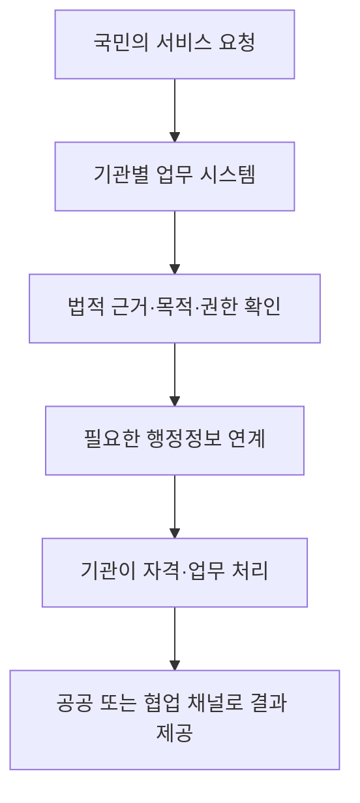

## 지식 로드맵 내 현재 위치
디지털정부 → 정부 서비스 전환 → 데이터·서비스를 연계해 국민 중심으로 제공

## 30초 인출
- 본질: 디지털 플랫폼 정부는 정부 데이터와 서비스를 연결해 국민·기업·정부가 함께 문제를 해결하도록 하는 정부 운영 방향이다.
- 메커니즘: 기관 간 데이터 연계, 편리한 서비스 접점, 민관 협업을 개인정보 보호와 보안 통제 아래 운영한다.

핵심 용어

- 디지털 플랫폼 정부(DPG): 디지털 기술과 민간의 혁신 역량을 활용해 국민 중심 서비스와 정부 업무 혁신을 추진하는 정책 방향.
- 구비서류 제로화: 다른 행정기관이 보유한 정보를 법적 근거와 절차에 따라 공동 이용해 국민의 서류 제출을 줄이는 방식.
- DPG 허브: 공공·민간 데이터와 서비스를 연계해 혁신 서비스 개발을 지원하려는 통합 플랫폼 사업.
- 행정정보 공동이용: 법령이 정한 범위와 절차에 따라 행정기관 등이 보유한 행정정보를 공동 활용하는 제도.

---

## 1교시 예상문제 (10점)
> 디지털 플랫폼 정부의 개념과 핵심 추진 방향, 구현 시 유의점을 설명하시오. (예상)

---

## 1교시 10점 답안
### 1. 정의·목적
- 정의: 디지털 플랫폼 정부는 데이터와 디지털 기술을 연결해 국민 중심의 서비스와 정부 운영을 추진하는 정책 방향이다.
- 목적: 기관별 칸막이를 줄이고 국민에게 편리하고 연결된 공공서비스를 제공한다.

### 2. 핵심 구성
| 구성 | 역할 |
|---|---|
| 행정 데이터 연계 | 자격 확인과 서비스 처리에 필요한 정보를 법적 근거에 따라 공동 활용 |
| 통합·연계 서비스 | 생애 사건과 이용 목적을 중심으로 공공서비스를 연결 |
| 민관 협업 | 민간의 서비스 역량을 활용하되 책임·보호 요건을 적용 |
| 신뢰 기반 | 개인정보 보호, 보안, 접근성, 서비스 연속성을 함께 관리 |

**제언:** 서비스 연계 때마다 이용 목적·법적 근거·정보주체 권리와 장애 대응을 함께 설계한다.

---

## 2~4교시 예상문제 (25점)
> 디지털 플랫폼 정부의 목표와 데이터·서비스 연계 구조를 설명하고, 개인정보 보호와 안정적 운영을 위한 추진 방안을 제시하시오. (예상)

---

## 2~4교시 25점 답안
## Ⅰ. 개요
- 정의: 디지털 플랫폼 정부는 데이터·서비스와 디지털 기술을 연결해 국민 중심으로 정부 업무를 혁신하려는 정책 방향이다.
- 목적: 국민의 이용 부담을 줄이고 기관 간 협업과 민관 서비스 혁신을 촉진한다.

## Ⅱ. 목표와 서비스 변화
| 기존의 불편 | 전환 방향 |
|---|---|
| 기관·사이트별로 반복 신청 | 서비스 이용 상황 중심의 연계 |
| 이미 제출한 서류를 다시 요구 | 적법한 행정정보 공동이용으로 제출 부담 완화 |
| 공공서비스가 정부 채널에만 집중 | 민간 협업 채널과 공공 책임을 함께 설계 |
| 기관별 데이터 단절 | 목적·권한·품질을 관리하며 필요한 데이터 연계 |

행정안전부의 추진 자료는 구비서류 제로화, 편리한 공공서비스, 데이터 기반 협업 등을 주요 실행 방향으로 제시한다. 모든 서비스를 하나의 포털이나 단일 데이터베이스로 통합한다는 뜻은 아니다.

## Ⅲ. 서비스 연계 구조

DPG 허브는 공공·민간 데이터를 연결해 혁신 서비스 개발을 지원하려는 플랫폼 사업으로 소개됐다. 이를 기관 데이터의 무제한 결합이나 모든 국민 데이터의 단일 저장소로 설명하지 않는다.

## Ⅳ. 구현 원칙과 통제
| 원칙 | 설계·운영 통제 |
|---|---|
| 목적에 맞는 연계 | 업무 목적과 법적 근거, 제공 항목을 먼저 확인 |
| 최소한의 데이터 이용 | 서비스 처리에 필요한 항목만 조회·전달 |
| 정보주체 보호 | 접근권한, 이용기록, 통지·권리 대응 절차 관리 |
| 민관 협업 책임 | 제공·위탁·재위탁 역할, 보안, 사고 대응을 계약에 명시 |
| 서비스 연속성 | 연계 장애 시 대체 경로와 수동 처리 절차 마련 |

## Ⅴ. 성과와 위험 관리
| 기대 효과 | 관리할 위험 |
|---|---|
| 반복 서류·신청 감소 | 부정확하거나 갱신이 늦은 원천 데이터 |
| 기관 간 업무 중복 완화 | 목적을 벗어난 정보 연계·접근 |
| 민관 서비스 개선 | 외부 채널과 위탁자에 대한 책임 불명확 |
| 처리 속도와 편의 향상 | 공통 연계 장애가 여러 서비스에 미치는 영향 |

## Ⅵ. 기술사적 제언
| 문제 | 해결 방안 |
|---|---|
| 서비스 연계가 늘수록 정보 접근과 장애 영향 범위가 커질 수 있음 | API별 목적·권한·데이터 항목을 등록하고, 최소 권한·접근 기록·장애 격리·대체 절차를 정기 점검한다. |

## 출제 이력과 검증 출처
- 기존 원문에 기재된 제129회 1교시 1번 문항의 회차·문구는 공식 기출 원문을 확인하지 못해 출제 이력으로 확정하지 않았다.
- 행정안전부, 「2024년 행정안전부 업무계획」의 디지털 플랫폼 정부 추진 방향. [공식 자료](https://www.mois.go.kr/plan2024/download/2024report.pdf)
- 디지털플랫폼정부위원회, 「DPG통합플랫폼(DPG허브) 구현으로 혁신서비스 개발 지원」(2025. 5. 30.). [공식 자료실](https://www.dpg.go.kr/user/board/DPG02020000_list_press.do)
- 정보 공동이용은 「전자정부법」 및 관계 개인정보 보호 법령의 요건을 따른다.

## 연결 토픽
- 공공 데이터 표준화: 기관 데이터의 의미·형식·품질을 일관되게 관리.
- 정보시스템 등급제: 대국민 서비스의 영향에 따라 안정성 관리를 구분.
- 개인정보 보호법: 데이터 연결과 공동 이용의 법적 한계.
