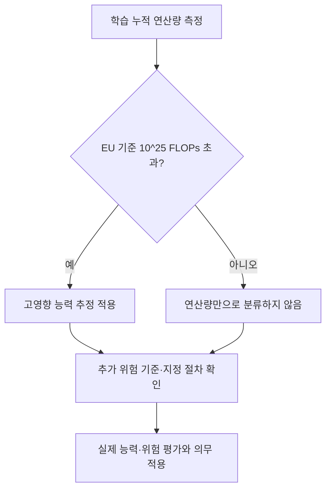
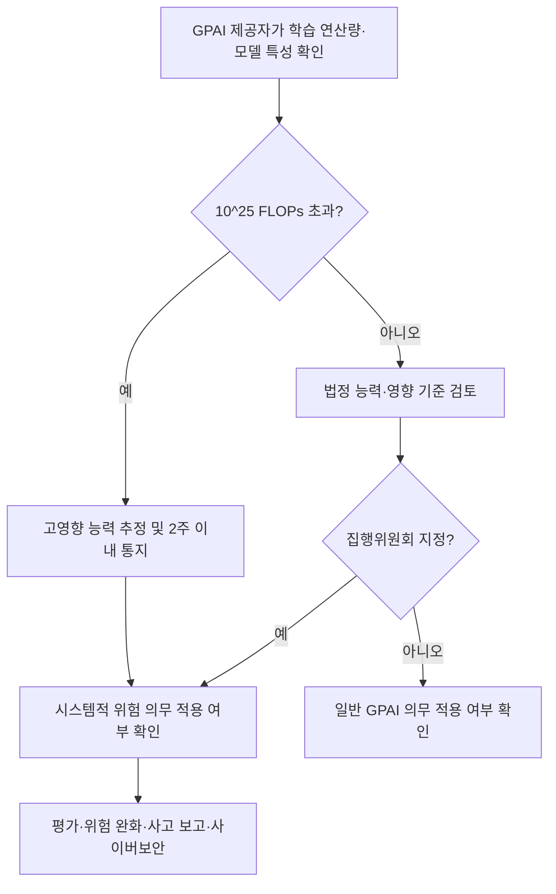

---
title: "프론티어 AI 안전 의무와 연산 임계치"
author: "GPT-6"
date: "2026-09-24T21:00:00+09:00"
tags:
  - "notes-law-policy"
extra:
  model: "GPT-6"
---

## 지식 로드맵 내 현재 위치

AI 정책·법제에서 프론티어 모델의 연산량 기준과 안전 의무를 비교한다. 연산 임계치가 법적 분류의 추정 기준인지, 정책상 평가 지표인지 구별한다.

## 30초 인출

- 본질: 연산 임계치는 대규모 AI 모델을 식별하는 정량 신호이며, 모델의 실제 능력이나 위험을 그 자체로 확정하지 않는다.
- 메커니즘: EU AI Act는 학습 누적 연산량 10^25 FLOPs 초과 시 고영향 능력을 추정하고, 미국의 2026년 행정명령은 사이버 능력 평가와 자발적 협력 체계를 추진한다.

핵심 용어

- **누적 학습 연산량**: 모델 학습에 사용한 부동소수점 연산의 총량으로, FLOPs로 나타낸다.
- **시스템적 위험 GPAI**: EU AI Act상 규모·도달 범위·영향을 고려해 추가 위험관리 의무가 적용되는 범용 AI 모델이다.
- **능력 평가**: 모델이 실제 수행할 수 있는 작업과 위험을 시험·분석하는 절차다.

---

## 1교시 예상문제 (10점)

> 프론티어 AI의 연산 임계치가 수행하는 역할과 한계를 설명하고, EU와 미국의 접근을 비교하시오. (예상)

---

## 1교시 10점 답안

### 1. 정의·목적

- 정의: 연산 임계치는 모델 학습 규모를 나타내는 정량 지표로, 규제·안전 검토 대상을 선별하는 데 쓰인다.
- 목적: 위험 검토가 필요한 모델을 조기에 식별하되, 임계치만으로 실제 능력이나 위험을 단정하지 않는다.

### 2. 관할별 기준과 작동

| 관할·제도 | 기준의 역할 |
|---|---|
| EU AI Act | 학습 누적 연산량 10^25 FLOPs 초과 시 고영향 능력을 추정하는 법정 기준 |
| 미국 연방 정책 | 2026년 행정명령이 사이버 능력 평가와 개발자 협력에 따른 자발적 체계를 추진; 10^26 FLOPs 의무 기준은 아님 |

연산량 기준은 추가 평가의 출발점이다. EU에서는 기준 미만이라도 집행위원회가 법정 절차에 따라 시스템적 위험 모델로 지정할 수 있다. 미국의 2026년 행정명령은 10^26 FLOPs를 법적 발동점으로 두지 않는다.

제언: 연산량 기록과 능력·위험 평가 결과를 함께 관리해 임계치 하나로 안전성을 판단하지 않는다.

---

## 2~4교시 예상문제 (25점)

> 프론티어 AI의 연산량 기준과 시스템적 위험 분류·안전 의무를 설명하고, EU AI Act와 미국 연방 접근의 차이를 바탕으로 기업의 대응 방안을 제시하시오. (예상)

---

## 2~4교시 25점 답안

## Ⅰ. 개요와 임계치의 의미

연산량 기준은 대규모 모델을 선별하는 신호다. FLOPs는 계산 규모를 나타낼 뿐 모델의 성능·안전성을 직접 측정하지 않으므로, 능력 평가와 법적 지정 절차를 함께 확인해야 한다.

| 판단 요소 | 의미 | 오해하면 안 되는 점 |
|---|---|---|
| 학습 누적 연산량 | 모델 학습 규모의 정량 지표 | 일정 수치가 실제 위험을 자동 입증하지 않음 |
| 능력·영향 평가 | 위험 가능성과 사회적 영향 검토 | 연산량 기준과 별개의 판단 근거 |
| 법정 분류·지정 | 추가 의무 적용 여부 결정 | 관할별 법률과 시행 시점을 확인해야 함 |

## Ⅱ. EU AI Act의 임계치와 의무

EU AI Act 제51조는 누적 학습 연산량 10^25 FLOPs 초과 모델을 고영향 능력이 있는 것으로 추정한다. 제공자는 해당 조건을 충족하거나 충족할 것으로 알려진 뒤 2주 이내에 집행위원회에 통지해야 한다. 기준 미만이어도 집행위원회가 법정 능력·영향 기준으로 지정할 수 있다.

시스템적 위험 모델 제공자는 최첨단 모델 평가와 적대적 시험, 시스템적 위험 평가·완화, 중대 사고 보고, 적절한 사이버보안 등 추가 의무를 이행한다. 세부 의무는 AI Act와 현행 지침의 적용 범위를 확인한다.

## Ⅲ. 미국 연방 접근과 비교

| 비교축 | EU AI Act | 미국 연방 정책 |
|---|---|---|
| 연산 임계치 | 10^25 FLOPs 초과를 고영향 능력의 법정 추정 기준으로 둠 | 10^26 FLOPs를 법정 의무 기준으로 두지 않음 |
| 분류 수단 | 임계치 추정 또는 집행위원회 지정 | 2026년 행정명령에 따라 사이버 능력 벤치마크를 개발하고 자발적 협력 체계를 추진 |
| 의무 성격 | 시스템적 위험 GPAI에 법정 추가 의무 적용 | 행정명령은 자발적 연방 협력 체계를 지시; 의무적 모델 허가를 만들지 않음 |
| 규제의 초점 | 안전·기본권·시장 영향에 대한 수명주기 위험관리 | 첨단 사이버 능력과 국가 중요 기반시설 보호를 위한 협력 |

미국의 과거 행정명령 14110은 2025년 1월 폐지됐다. 이를 현재 유효한 10^26 FLOPs 의무로 설명하면 안 된다. 2026년 행정명령은 능력 평가와 자발적 협력 방향을 제시하지만, EU의 법정 임계치와 같은 구조는 아니다.

## Ⅳ. 적용상 쟁점과 기업 대응

| 쟁점 | 대응 방안 |
|---|---|
| 학습 연산량만으로 실제 위험을 오판 | 연산량 산정 근거와 함께 독립 능력평가·위험분석 결과를 보존 |
| 학습 규모·모델 변경으로 의무 판단이 달라짐 | 학습 실행, 모델 버전, 배포 관할을 연결해 변경 시 법률 검토를 다시 수행 |
| 관할별 기준과 절차가 다름 | EU 통지 기한·평가 의무와 미국 자발적 협력 요건을 별도 규제 목록으로 관리 |

## Ⅴ. 기술사적 제언

| 문제 | 해결 방안 |
|---|---|
| 단일 FLOPs 수치가 모델 위험과 법적 지위를 대신하는 것으로 오해될 수 있음 | 연산량·능력평가·관할별 법적 분류를 분리 기록하고, 각 의무의 근거와 적용 시점을 모델 배포 승인에 연결한다. |

## 출제 이력과 검증 출처

- 기존 노트에서 배점이 확인되는 기출 문항은 없어 예상문제로 구성함.
- [EUR-Lex, AI Act 통합본(2026-07-27), 제51·52·55조](https://eur-lex.europa.eu/legal-content/EN/TXT/?uri=CELEX:02024R1689-20260727)
- [European Commission, GPAI 모델의 AI Act 의무](https://digital-strategy.ec.europa.eu/en/factpages/general-purpose-ai-obligations-under-ai-act)
- [The White House, Executive Order 14409 (2026-06-02)](https://www.whitehouse.gov/presidential-actions/2026/06/promoting-advanced-artificial-intelligence-innovation-and-security/)
- [The White House, Executive Order 14179 (2025-01-23)](https://www.whitehouse.gov/presidential-actions/2025/01/removing-barriers-to-american-leadership-in-artificial-intelligence/)
