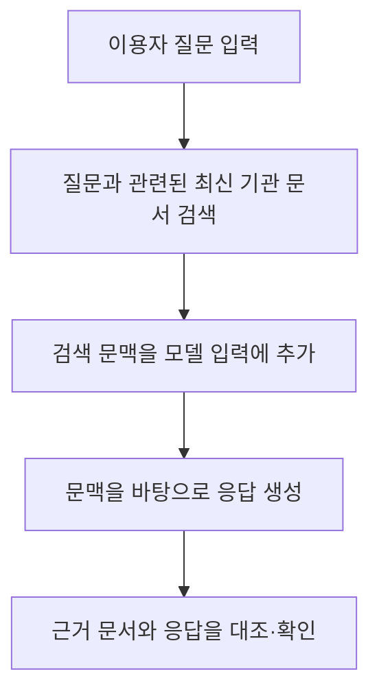
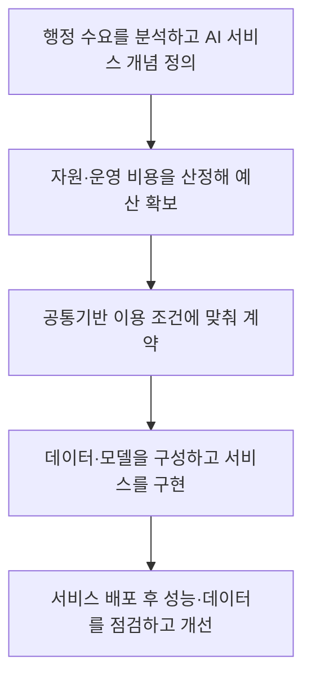
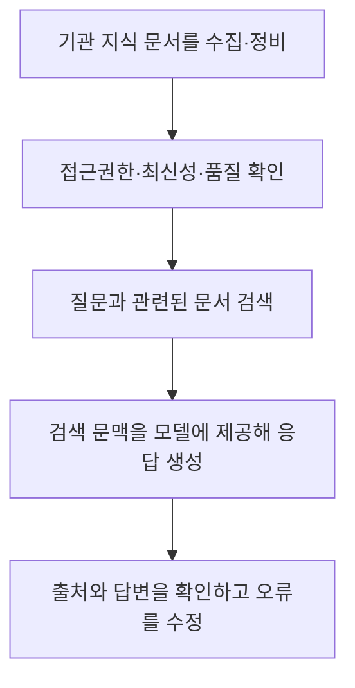

---
title: "공공부문 초거대 AI 도입·활용 가이드라인 2.0"
author: "GPT-6"
date: "2026-09-24T21:00:00+09:00"
tags:
  - "notes-law-policy"
extra:
  model: "GPT-6"
---

## 지식 로드맵 내 현재 위치

공공 AI 정책에서 2025년판 「공공부문 초거대 AI 도입·활용 가이드라인 2.0」의 역할과 2026년 현행 가이드의 변화를 살핀다.

## 30초 인출

- 본질: 가이드라인 2.0은 공공기관이 초거대 AI를 도입할 때 추진 방향, 도입 절차, 고려사항, 성과관리를 참고하도록 만든 실무 지침이다.
- 메커니즘: 현행 2026년판은 범정부 AI 공통기반을 우선 활용하도록 서비스 기획부터 운영까지 안내하고, RAG로 기관의 최신 지식 데이터에 근거한 응답을 구현하도록 지원한다.

핵심 용어

- **가이드라인 2.0**: 2025년 4월 공개된 공공부문 초거대 AI 도입·활용 안내서다.
- **범정부 AI 공통기반**: 여러 공공기관이 AI 모델·GPU 등 공통 자원을 함께 이용하도록 만든 기반 체계다.
- **RAG**: 질문과 관련된 외부 문서를 검색한 뒤 그 문맥을 바탕으로 모델이 응답하게 하는 방식이다.
- **성과관리**: 도입한 AI 서비스의 성과와 운영 상태를 계속 확인하고 개선하는 활동이다.

---

## 1교시 예상문제 (10점)

> 공공부문 초거대 AI 도입·활용 가이드라인 2.0의 목적과 주요 내용을 설명하고, 2026년 공공 AI 도입 가이드와의 관계를 서술하시오. (예상)

---

## 1교시 10점 답안

### 1. 정의·목적

- 정의: 가이드라인 2.0은 중앙부처·지자체·공공기관이 초거대 AI를 도입·활용할 때 참고하는 실무 지침이다.
- 목적: 공공서비스 혁신을 지원하면서 도입 절차, 데이터·보안 고려사항, 성과관리를 함께 살피도록 돕는다.

### 2. 지침의 범위와 현행 위치

| 자료 | 시점·역할 |
|---|---|
| 가이드라인 2.0 | 2025년 4월판; 공공 AI 추진방향, 분야별·해외 사례, 도입 절차·고려사항, 성과관리 안내 |
| 공공부문 AI 도입·활용 가이드 | 2026년 5월 기준; 범정부 AI 공통기반 우선 활용과 서비스 개발·운영 실무 안내 |

### 3. 검색증강생성의 응답 흐름

2026년 가이드는 기획·예산·계약·구축·운영 단계와 RAG 적용 방법을 안내한다. RAG는 최신 문서를 답변 근거로 활용하는 방법이며, 잘못된 검색·문서 관리가 있으면 오류를 막지 못하므로 결과 확인과 운영 점검이 필요하다.

제언: 공공 AI를 도입할 때 사업 목적·데이터 민감도·운영 책임을 먼저 정하고 최신 가이드와 법적 요구를 함께 확인한다.

---

## 2~4교시 예상문제 (25점)

> 공공부문 초거대 AI 도입·활용 가이드라인 2.0의 주요 내용을 설명하고, 2026년 공공부문 AI 도입 가이드 및 범정부 AI 공통기반을 고려한 안전한 서비스 도입 방안을 제시하시오. (예상)

---

## 2~4교시 25점 답안

## Ⅰ. 가이드라인 2.0의 개요

가이드라인 2.0은 2024년 4월 배포한 1차 안내서를 업데이트해 2025년 4월 공개했다. 공공부문 추진 방향과 활용 사례, 도입 절차·고려사항, 성과관리 방안을 묶어 실무자가 사업을 검토하도록 돕는다.

| 구분 | 주요 내용 |
|---|---|
| 정책 방향 | 공공업무·대국민 서비스에서 초거대 AI 활용 검토 |
| 도입 지원 | 도입 절차와 고려사항, 분야별·해외 활용사례 안내 |
| 운영 관점 | 도입 뒤 성과를 관리하고 서비스 개선에 반영 |

## Ⅱ. 2026년 가이드와 적용 환경

2026년 5월 기준 공공부문 AI 도입·활용 가이드는 범정부 AI 공통기반을 활용해 개별 기관의 인프라 중복 구축과 기술 파편화를 줄이는 방향을 제시한다. 행정안전부는 2026년 8월 28일 시행된 「인공지능 및 데이터 기반 행정 활성화에 관한 법률」의 공통기반 우선 이용 조항에 대응해 새 가이드를 배포했다.

| 적용 자료 | 실무에서 확인할 점 |
|---|---|
| 2025년 가이드라인 2.0 | 추진방향, 활용 사례, 기존 도입 절차·고려사항·성과관리 참고 |
| 2026년 공공 AI 도입 가이드 | 공통기반 우선 검토, 단계별 비용·계약·구축·운영 방법 확인 |
| 관련 법령·보안 기준 | 서비스의 법적 근거, 데이터 보호, 정보시스템 보안 요구 별도 확인 |

## Ⅲ. 공공 AI 서비스 도입 절차

이는 2026년 실무 가이드가 설명하는 기획·예산·계약·구축·운영 흐름이다. 각 단계의 산출물과 책임자를 정해 발주·검수·운영에 반영하되, 실제 사업은 기관별 법령과 조달·보안 절차를 함께 따른다.

## Ⅳ. RAG 기반 응답과 데이터 관리

RAG는 모델의 사전학습 지식에만 의존하지 않고 기관 문서를 응답 근거로 보태는 방식이다. 문서 최신성·접근권한·검색 품질·출처 표시를 관리해야 하며, 환각을 완전히 제거한다고 단정하지 않는다.

## Ⅴ. 주요 위험과 통제

| 위험 | 통제 방안 |
|---|---|
| 민감·비공개 정보가 외부 모델에 입력 | 데이터 등급과 이용 목적을 확인하고 승인된 서비스·전송 경로만 사용 |
| 낡거나 권한 없는 문서가 검색 결과에 포함 | 문서 소유자·갱신일·접근권한을 관리하고 검색 결과를 시험 |
| 생성 응답을 검토 없이 행정 판단에 사용 | 근거 확인과 담당자 검토를 업무 절차에 포함 |
| 개별 인프라 구축이 중복되고 운영 책임이 불명확 | 공통기반 활용 가능성과 비용을 먼저 비교하고 운영 책임·서비스 수준을 계약에 명시 |

## Ⅵ. 기술사적 제언

| 문제 | 해결 방안 |
|---|---|
| 가이드 문구만 사업계획에 인용하고 실제 데이터·운영 위험은 검토하지 않을 수 있음 | 서비스 목적·데이터 등급·공통기반 적합성·RAG 품질·사람의 검토 책임을 사업 단계별 점검항목과 검수 기준으로 연결한다. |

## 출제 이력과 검증 출처

- 기존 노트에는 제137회 2교시 4번이라고 기재돼 있으나 원문 시험자료를 확인하지 못해 이 답안의 문항은 예상으로 구성함.
- [한국지능정보사회진흥원, 공공부문 초거대 AI 도입·활용 가이드라인 2.0 (2025-04-16)](https://www.nia.or.kr/site/nia_kor/ex/bbs/View.do?bcIdx=27985&cbIdx=99953)
- [한국지능정보사회진흥원, 공공부문 AI 도입·활용 가이드 (2026-05 기준)](https://www.nia.or.kr/site/nia_kor/ex/bbs/View.do?bcIdx=29526&cbIdx=37989)
- [행정안전부, 공공부문 AI 도입·활용 가이드 배포 (2026-06-10)](https://mois.go.kr/frt/bbs/type010/commonSelectBoardArticle.do?bbsId=BBSMSTR_000000000008&nttId=126757)
- [국가법령정보센터, 인공지능 및 데이터 기반 행정 활성화에 관한 법률](https://www.law.go.kr/lsInfoP.do?lsiSeq=283735)
