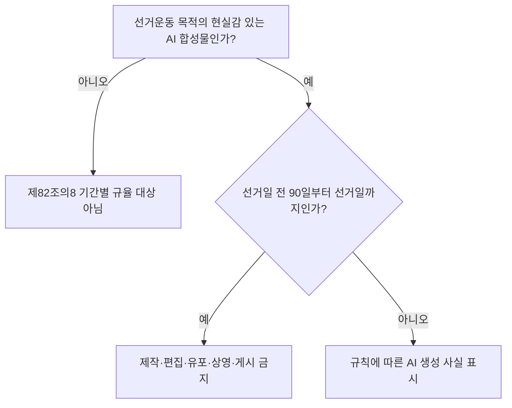
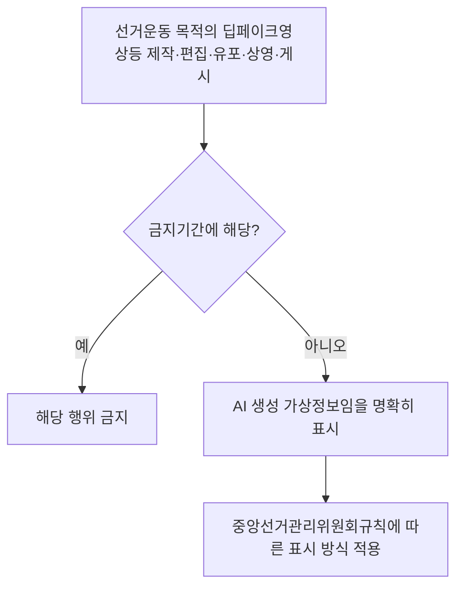

---
title: "공직선거법 딥페이크 선거운동 금지"
author: "GPT-6"
date: "2026-09-24T21:00:00+09:00"
tags:
  - "notes-law-policy"
extra:
  model: "GPT-6"
---

## 지식 로드맵 내 현재 위치

선거 정보 신뢰와 AI 합성물 표시를 다루는 공직선거법상 기간별 규제다.

## 30초 인출

- 본질: 공직선거법 제82조의8은 선거운동 목적의 현실감 있는 AI 합성 음향·이미지·영상에 대해 선거일 전 90일부터 선거일까지 제작·편집·유포·상영·게시를 금지한다.
- 메커니즘: 금지기간 밖에서 같은 목적으로 해당 합성물을 제작·편집·유포·상영·게시하려면 AI 생성물임을 규칙에 따라 명확히 표시한다.

핵심 용어

- **딥페이크영상등**: AI 기술 등으로 만든 실제와 구분하기 어려운 가상의 음향·이미지·영상 등이다.
- **금지기간**: 선거일 전 90일부터 선거일까지로, 선거운동 목적의 딥페이크영상등 이용을 금지하는 기간이다.
- **표시 의무 기간**: 금지기간이 아닌 때 선거운동 목적으로 딥페이크영상등을 이용할 때 생성 사실을 표시해야 하는 기간이다.

---

## 1교시 예상문제 (10점)

> 공직선거법 제82조의8의 딥페이크영상등 정의와 기간별 규제를 설명하시오. (예상)

---

## 1교시 10점 답안

### 1. 정의·목적

- 정의: 딥페이크영상등은 AI 기술 등으로 만든 실제와 구분하기 어려운 가상의 음향·이미지·영상 등이다.
- 목적: 선거운동에서 합성정보가 실제 발언·행동으로 오인되어 유권자 판단을 왜곡하는 일을 막는다.

### 2. 기간별 의무

| 행위 시점 | 선거운동 목적의 딥페이크영상등 |
|---|---|
| 선거일 전 90일부터 선거일까지 | 제작·편집·유포·상영·게시 금지 |
| 그 밖의 기간 | AI로 만든 가상정보임을 중앙선거관리위원회규칙에 따라 명확히 표시 |

이 조항은 모든 AI 합성물의 제작·게시를 금지하지 않는다. 선거운동 목적, 현실과 구분하기 어려운 가상정보, 행위 시점을 함께 확인한다.

제언: 선거 관련 콘텐츠의 게시 전 목적·합성 여부·선거일 기준 기간을 확인하고, 허용 기간에는 법정 표시가 유지되는지 검수한다.

---

## 2~4교시 예상문제 (25점)

> 공직선거법 제82조의8의 규제 대상, 금지기간과 표시 의무를 설명하고, 선거 관련 AI 합성 콘텐츠의 적법한 제작·게시 통제방안을 제시하시오. (예상)

---

## 2~4교시 25점 답안

## Ⅰ. 입법 목적과 규율 대상

제82조의8은 AI 기술 등으로 제작해 실제와 구분하기 어려운 가상의 음향·이미지·영상 등을 선거운동에 이용할 때 적용한다. 규율 대상은 합성물의 기술만으로 정하지 않고 선거운동 목적과 선거일 기준 시기를 함께 판단한다.

| 판단 기준 | 확인 내용 |
|---|---|
| 콘텐츠 | 실제와 구분하기 어려운 가상의 음향·이미지·영상 등인지 |
| 목적 | 해당 콘텐츠의 제작·편집·유포·상영·게시가 선거운동을 위한 것인지 |
| 행위 시점 | 선거일 전 90일부터 선거일까지인지 |

## Ⅱ. 금지기간의 행위 제한

| 기간 | 금지되는 행위 | 판단 시 유의점 |
|---|---|---|
| 선거일 전 90일부터 선거일까지 | 딥페이크영상등의 제작·편집·유포·상영·게시 | 선거운동 목적 행위인지 확인 |
| 그 밖의 기간 | 제82조의8 제1항의 기간상 금지에는 해당하지 않음 | 선거운동 목적 이용 시 제2항 표시 의무 확인 |

## Ⅲ. 금지기간 밖의 표시 의무

표시 의무는 금지기간이 아닌 시점에도 선거운동을 위해 대상 콘텐츠를 이용하는 경우에 적용된다. 세부 표시 방식은 공직선거법 조문만으로 임의 결정하지 말고 중앙선거관리위원회규칙을 확인한다.

## Ⅳ. 콘텐츠 제작·배포 통제

| 통제 단계 | 확인·조치 |
|---|---|
| 접수 | 선거운동 목적, 실존 인물·사건을 연상시키는 합성 여부 확인 |
| 기간 판정 | 해당 선거의 선거일로부터 90일 제한기간을 산정 |
| 게시 승인 | 금지기간에는 제작·편집·유포·상영·게시를 차단하고, 그 밖의 기간에는 표시 적용 여부 확인 |
| 유통 후 점검 | 표시가 삭제·가림 처리되지 않았는지 확인하고 위반 우려가 있으면 법무·선거관리 담당자에게 전달 |

## Ⅴ. 기술사적 제언

| 문제 | 해결 방안 |
|---|---|
| 여러 채널에서 재편집·재게시되어 게시 시점과 표시 상태를 놓칠 수 있음 | 콘텐츠별 선거일·금지기간·표시 적용 결과를 기록하고, 게시 게이트와 유통 점검에 연결해 담당자가 확인할 수 있도록 한다. |

## 출제 이력과 검증 출처

- 기존 노트에 적힌 기출 회차·문항 원문을 검증하지 못해 예상문제로 구성함.
- [국가법령정보센터, 공직선거법 제82조의8 (2026-07-01 시행)](https://www.law.go.kr/LSW/lsSideInfoP.do?docCls=jo&joBrNo=08&joNo=0082&lsiSeq=285629&urlMode=lsScJoRltInfoR)
