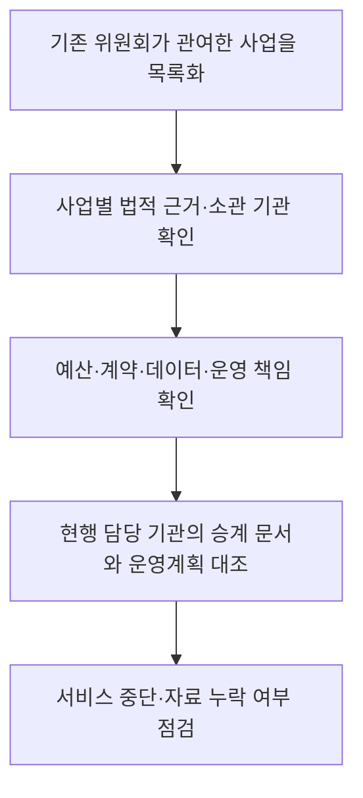

---
title: "디지털플랫폼정부위원회 폐지"
author: "GPT-6"
date: "2026-09-24T21:00:00+09:00"
tags:
  - "notes-law-policy"
extra:
  model: "GPT-6"
---

## 지식 로드맵 내 현재 위치

디지털정부 정책 거버넌스의 조직 변화와 정책·서비스 연속성 관리를 다룬다.

## 30초 인출

- 본질: 디지털플랫폼정부위원회는 대통령 소속으로 디지털플랫폼정부 정책을 심의·조정하도록 설치된 위원회였고, 설치·운영 대통령령은 2025년 11월 4일 폐지됐다.
- 메커니즘: 위원회 폐지는 그 설치 근거를 없앤 조치이며, 개별 사업·시스템의 소관이 자동으로 다른 위원회나 부처로 이전됐다는 뜻은 아니다.

핵심 용어

- **디지털플랫폼정부위원회**: 디지털플랫폼정부 구현 관련 주요 정책을 심의·조정하도록 대통령 소속으로 설치됐던 위원회다.
- **폐지령**: 2025년 11월 4일 시행된 대통령령 제35840호로, 위원회 설치·운영 규정을 폐지했다.
- **정책 연속성**: 조직 변화 뒤에도 개별 사업의 법적 소관·예산·운영 책임을 확인해 서비스가 이어지도록 관리하는 일이다.

---

## 1교시 예상문제 (10점)

> 디지털플랫폼정부위원회의 설치 근거와 폐지 시점을 설명하고, 폐지 이후 사업 연속성 검토 시 유의점을 서술하시오. (예상)

---

## 1교시 10점 답안

### 1. 정의·목적

- 정의: 디지털플랫폼정부위원회는 디지털플랫폼정부 실현 관련 주요 정책을 심의·조정하도록 대통령 소속으로 설치된 위원회였다.
- 목적: 데이터 연계와 디지털 서비스를 활용해 국민·기업·정부가 사회문제를 해결하고 가치를 창출하는 정부를 구현하려 했다.

### 2. 조직 변화와 의미

| 항목 | 내용 |
|---|---|
| 설치 근거 | 「디지털플랫폼정부위원회의 설치 및 운영에 관한 규정」 |
| 폐지 | 대통령령 제35840호, 2025년 11월 4일 시행 |
| 공식 사유 | 행정 여건 변화로 위원회 기능을 유지할 필요성이 낮아짐 |
| 해석상 유의점 | 위원회 폐지 사실만으로 개별 사업·시스템의 소관 이전을 단정할 수 없음 |

### 3. 연속성 확인 순서

이 순서는 사업 인수인계 때 수행할 관리 절차다. 법령이 일괄 승계를 정했다고 뜻하지 않으며, 각 사업의 근거와 인수인계 자료를 따로 확인해야 한다.

제언: 위원회 폐지 뒤 개별 사업의 법적 소관과 운영 책임을 문서로 확인해 공공서비스 공백을 예방한다.

---

## 2~4교시 예상문제 (25점)

> 디지털플랫폼정부위원회 폐지의 법적·행정적 의미를 설명하고, 위원회가 관여한 사업의 정책 연속성과 책임성을 확보하기 위한 관리 방안을 제시하시오. (예상)

---

## 2~4교시 25점 답안

## Ⅰ. 설치 목적과 기능

위원회 설치 규정은 데이터 통합·연계·분석을 바탕으로 디지털플랫폼정부를 구현하고 관련 주요 정책을 효율적으로 심의·조정하는 것을 목적으로 했다.

| 기능 관점 | 설치 규정의 내용 |
|---|---|
| 정책 목적 | 국민·기업·정부가 사회문제를 해결하고 새로운 가치를 창출하는 정부 구현 |
| 위원회 역할 | 디지털플랫폼정부 실현 관련 주요 정책 심의·조정 |
| 법적 형식 | 대통령령에 근거해 설치·운영 |

## Ⅱ. 폐지 내용과 공식 사유

| 구분 | 확인된 사실 |
|---|---|
| 폐지 법령 | 「디지털플랫폼정부위원회의 설치 및 운영에 관한 규정 폐지령」 |
| 공포번호·시행일 | 대통령령 제35840호, 2025년 11월 4일 |
| 공식 개정 이유 | 행정 여건 변화로 기능을 유지할 필요성이 낮아졌다고 판단 |
| 법적 직접 효과 | 설치·운영 규정과 위원회 설치 근거 폐지 |

## Ⅲ. 기능 승계 판단 원칙

위원회 폐지 자체와 정책·사업의 소관 변경은 구분해야 한다. 개별 정책은 관련 법령, 직제, 예산 편성, 위·수탁·계약 문서에서 담당 기관과 책임을 확인한다.

| 대상 | 확인 자료 | 결정할 사항 |
|---|---|---|
| 법정 업무 | 개별 법률·대통령령·행정규칙 | 현행 소관 기관과 권한 |
| 사업·예산 | 예산서·사업계획·조달계약 | 발주·검수·지출·성과 책임 |
| 운영 중인 시스템 | 운영 협약·자산대장·서비스 수준 | 장애 대응·보안·유지보수 주체 |

## Ⅳ. 인수인계와 서비스 연속성 관리

| 관리 단계 | 확인·조치 |
|---|---|
| 현황 파악 | 위원회가 관여한 정책·사업·데이터·시스템을 목록화 |
| 책임 확인 | 각 항목의 법적 소관·예산·계약·운영 책임을 지정 |
| 이관 검증 | 문서·계정·자산·데이터 접근권한과 미결 업무를 대조 |
| 운영 점검 | 서비스 중단, 보안 공백, 이용자 안내 누락을 확인하고 시정 |

## Ⅴ. 위험과 대응

| 위험 | 대응 |
|---|---|
| 폐지 발표를 사업 자동 이관으로 오해 | 각 사업의 이관 근거와 담당 기관을 공식 문서로 확인 |
| 조직 변경 중 계약·예산·자료 책임 공백 | 인수인계 책임자와 승인 일정을 지정하고 기록을 공동 점검 |
| 정책 명칭 변화로 성과와 운영자료가 단절 | 기존 사업명·성과지표·데이터 자산을 현행 업무 체계와 연결해 보존 |

## Ⅵ. 기술사적 제언

| 문제 | 해결 방안 |
|---|---|
| 위원회 해산 과정에서 디지털 사업의 법적 근거와 운영 책임을 혼동할 수 있음 | 사업별 법령·예산·계약·데이터·시스템 책임을 인수인계 대장에 연결하고, 현행 소관 기관의 승인과 서비스 연속성 점검을 완료한 뒤 종결한다. |

## 출제 이력과 검증 출처

- 기존 노트에 확인된 기출 문항은 없어 예상문제로 구성함.
- [국가법령정보센터, 디지털플랫폼정부위원회의 설치 및 운영에 관한 규정 폐지 연혁](https://www.law.go.kr/lsInfoP.do?lsiSeq=279325)
- [국가법령정보센터, 폐지령 제정·개정 이유](https://www.law.go.kr/LSW/lsRvsRsnListP.do?chrClsCd=010202&lsId=014304&lsRvsGubun=all)
