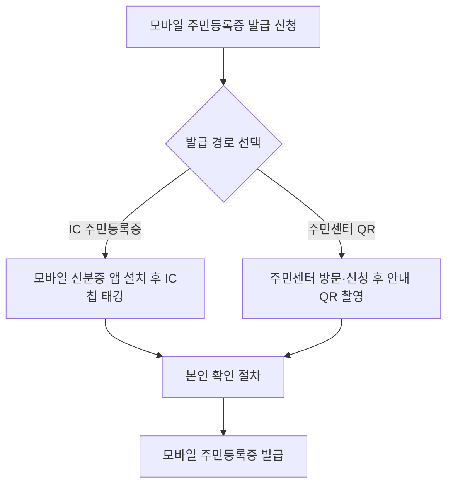
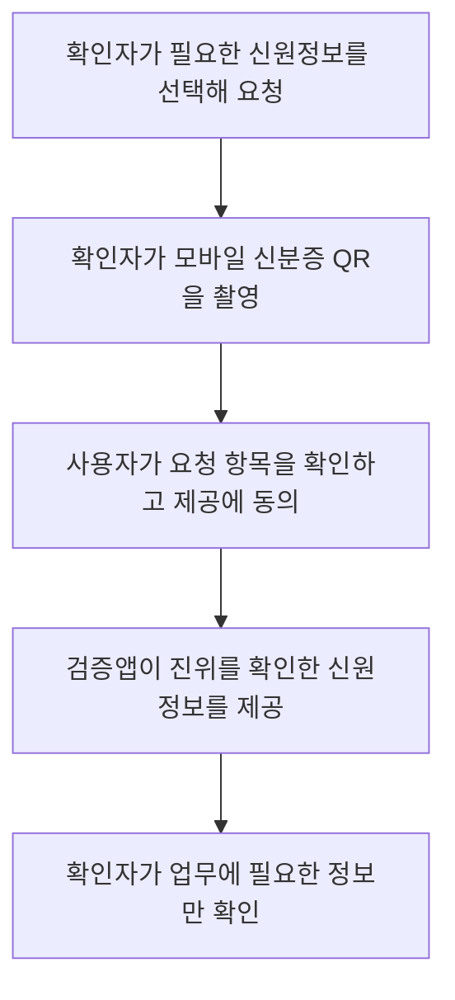

---
title: "모바일 주민등록증"
author: "GPT-6"
date: "2026-09-24T21:00:00+09:00"
tags:
  - "notes-law-policy"
extra:
  model: "GPT-6"
---

## 지식 로드맵 내 현재 위치

전자정부 신원증명에서 주민등록증의 암호화된 모바일 발급, 제시, 진위 확인을 다룬다.

## 30초 인출

- 본질: 모바일 주민등록증은 주민등록법에 따라 휴대전화에 암호화된 형태로 설치되며, 실물 주민등록증과 같은 효력을 갖는 디지털 주민등록증이다.
- 메커니즘: IC칩 주민등록증 태깅 또는 읍·면·동 주민센터 QR 발급으로 신청하고, 신원 확인자는 검증앱으로 정보를 요청하며 사용자가 동의한 정보만 확인한다.

핵심 용어

- **모바일 주민등록증**: 주민등록증과 효력이 같고 이동통신단말장치에 암호화된 형태로 설치되는 주민등록증이다.
- **IC 주민등록증**: 모바일 주민등록증 발급에 필요한 보안사항을 전자적으로 저장한 IC칩 내장 주민등록증이다.
- **신원 확인자**: 검증앱이나 연계 시스템으로 모바일 신분증의 진위와 필요한 신원정보를 확인하는 기관·사업자다.
- **선택 정보 제공**: 신원 확인자가 요청한 정보를 사용자가 확인하고 동의한 뒤 제공하는 방식이다.

---

## 1교시 예상문제 (10점)

> 모바일 주민등록증의 법적 지위, 발급 방법과 정보 제공상의 특징을 설명하시오. (예상)

---

## 1교시 10점 답안

### 1. 정의·목적

- 정의: 모바일 주민등록증은 암호화된 형태로 이동통신단말장치에 설치되며 실물 주민등록증과 효력이 동일한 신분증이다.
- 목적: 스마트폰으로 신원을 확인하게 하고, 신원 확인에 필요한 정보만 요청·제공해 불필요한 정보 노출을 줄인다.

### 2. 법적 지위와 발급 조건

| 항목 | 내용 |
|---|---|
| 법적 근거 | 주민등록법 제24조의2 |
| 법적 효력 | 주민등록증과 동일한 효력 |
| 발급 방법 | IC칩 주민등록증 태깅 또는 주민센터 방문 QR 방식 |
| 사용 제한 | 한 사람이 사용하는 이동통신단말장치 1대에만 발급 |

### 3. 발급 경로

모바일 주민등록증의 기재·표시 사항은 법령에 따른다. 휴대전화 분실·훼손 등으로 사용이 불가능하면 재발급 신청 대상이며, 시행령은 모바일 신분증용 전자정보의 유효기간을 3년으로 정한다.

제언: 발급 편의와 함께 단말기 분실 신고, 재발급, 개인정보 선택 제공 방법을 이용자에게 안내한다.

---

## 2~4교시 예상문제 (25점)

> 모바일 주민등록증의 법적 기반과 발급·검증 구조를 설명하고, 개인정보 보호와 분실·교체 대응을 포함한 안전한 운영 방안을 제시하시오. (예상)

---

## 2~4교시 25점 답안

## Ⅰ. 법적 기반과 기능

주민등록법 제24조의2는 암호화된 형태로 휴대전화에 설치되는 모바일 주민등록증의 발급 근거를 두고, 실물 주민등록증과 동일한 효력을 인정한다. 모바일 주민등록증은 실물증의 단순 사진이 아니라 법정 신분증으로 발급·검증 절차를 거친다.

| 구분 | 주요 내용 |
|---|---|
| 발급권자 | 시장·군수·구청장 |
| 신청 자격 | 주민등록증을 발급받은 사람 |
| 설치 방식 | 이동통신단말장치에 암호화된 형태로 설치 |
| 효력 | 실물 주민등록증과 동일 |

## Ⅱ. 발급 방식과 재발급

| 경로 | 주요 절차 | 특징 |
|---|---|---|
| IC칩 방식 | IC 주민등록증 신청·수령 → 앱에서 태깅·본인 확인 → 발급 | IC 주민등록증 소지자는 단말기에서 발급·재발급 신청 가능 |
| QR 방식 | 주민센터 방문 → 실물 주민등록증 제시·신청 → 안내 QR 촬영·본인 확인 | IC칩 주민등록증을 별도로 만들지 않고 신청 가능 |
| 단말기 교체 | IC칩 태깅 또는 주민센터 QR 절차로 재발급 | 기존 신분증 종류에 따라 절차가 다를 수 있음 |

## Ⅲ. 신원정보 확인 흐름

정보 제공은 사용자의 확인·동의를 거친다. 확인자는 목적에 필요한 항목만 요청하고, 신분증 전체 내용을 수집·저장하지 않도록 업무 절차를 설계한다.

## Ⅳ. 보안·유효기간·분실 관리

| 통제 항목 | 법령·공식 절차 | 운영상 유의점 |
|---|---|---|
| 저장·발급 | 휴대전화에 암호화된 형태로 설치 | 화면 캡처·비인가 앱 수집 등 노출 경로를 관리 |
| 단말 수 | 본인이 사용하는 단말기 1대에 발급 | 신규 단말기 등록 전 분실·교체 절차 확인 |
| 전자정보 유효기간 | 3년 | 만료 전 재발급 절차를 안내 |
| 분실·훼손 | 모바일 신분증 홈페이지 또는 주민센터에서 분실 신고; 사용 불능 시 재발급 신청 | 분실 즉시 신고하고 새 단말기 발급 여부를 확인 |

## Ⅴ. 적용상 위험과 대응

| 위험 | 대응 |
|---|---|
| 확인자가 필요 이상의 개인정보를 요구·저장 | 확인 목적과 요청 항목을 연동하고 최소 항목만 조회·저장 |
| QR 화면을 캡처·복제해 오용 | 공식 검증앱으로 진위를 확인하고 화면 이미지나 캡처본을 실물 신분증처럼 취급하지 않음 |
| 기기 분실 뒤 모바일 신분증이 남아 있음 | 공식 분실 신고 경로를 쉽게 안내하고 재발급·사용 정지 상태를 확인 |
| 단말 교체·3년 유효기간 만료로 본인확인이 중단 | 교체 전 발급 경로와 만료일을 확인하고 대체 신분확인 수단을 마련 |

## Ⅵ. 기술사적 제언

| 문제 | 해결 방안 |
|---|---|
| 신원확인 편의가 정보 과수집이나 단말 분실 위험으로 이어질 수 있음 | 요청 정보 최소화·사용자 동의·진위 검증을 기본 운영 기준으로 두고, 분실 신고와 재발급 절차를 민원·보안 대응 체계에 함께 반영한다. |

## 출제 이력과 검증 출처

- 기존 노트에서 확인되는 기출 문항은 없어 예상문제로 구성함.
- [국가법령정보센터, 주민등록법 제24조의2](https://www.law.go.kr/LSW/lsLinkCommonInfo.do?chrClsCd=010202&lsJoLnkSeq=1026227431)
- [국가법령정보센터, 주민등록법 시행령 제38조 (2026-04-28 시행)](https://www.law.go.kr/LSW/lsLinkCommonInfo.do?lspttninfSeq=191521)
- [모바일 신분증, 모바일 주민등록증 발급 방법](https://www.mobileid.go.kr/mip/hps/issuReqstGuidance/issuReqstGuidanceMrc.do)
- [모바일 신분증, 신원 확인자 이용 안내](https://www.mobileid.go.kr/mip/hps/svcIntrcn/svcIntrcnIdnty.do)
- [행정안전부, 주민등록증 분실 신고 안내](https://mois.go.kr/frt/sub/a06/b06/IDCard_6/screen.do)
