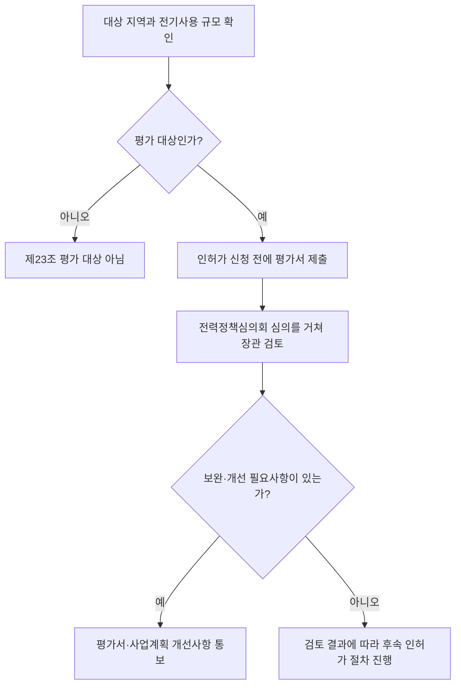
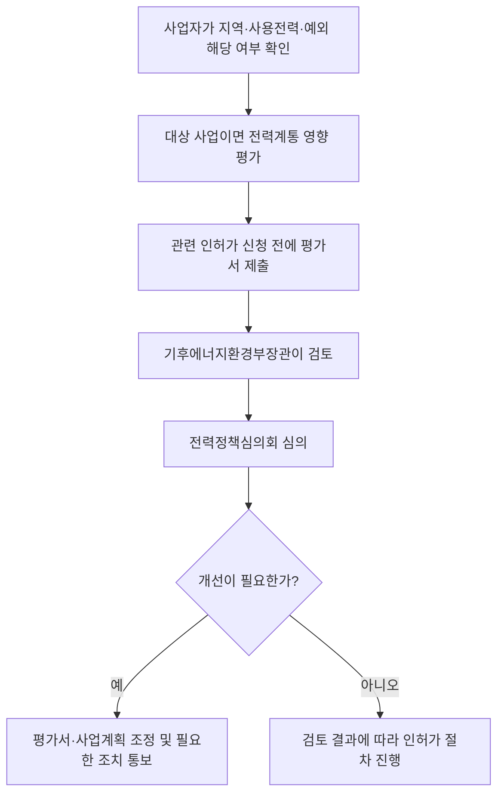

---
title: "분산에너지 활성화 특별법 / 전력계통영향평가"
author: "GPT-6"
date: "2026-09-24T21:00:00+09:00"
tags:
  - "notes-law-policy"
extra:
  model: "GPT-6"
---

## 지식 로드맵 내 현재 위치

전력·디지털 인프라 정책에서 분산에너지의 활성화와 대규모 전력사용 사업의 계통영향 검토를 다룬다.

## 30초 인출

- 본질: 분산에너지법의 전력계통영향평가는 지정된 대상 지역에서 10MW 이상 전기를 사용하려는 사업자가 전력공급 안정성에 미치는 영향을 미리 분석하게 하는 제도다.
- 메커니즘: 사업자는 인허가 등을 신청하기 전에 평가서를 기후에너지환경부장관에게 제출하고, 장관은 전력정책심의회 심의를 거쳐 검토한 뒤 필요하면 보완·개선사항을 통보한다.

핵심 용어

- **분산에너지**: 수요지 인근에서 생산·저장·공급되는 에너지로, 중앙집중형 전력 공급을 보완한다.
- **전력계통영향평가**: 대규모 전기사용 시설 등이 전력계통에 미치는 영향을 조사·예측·평가해 전력공급 안정성을 위한 대책을 마련하는 제도다.
- **계통영향사업자**: 법령상 대상 지역에서 기준 규모 이상 전기를 사용하려는 사업자다.
- **개선필요사항**: 평가서 검토 결과 계통영향을 줄이기 위해 평가서·사업계획의 개선이나 필요한 조치가 요구되는 사항이다.

---

## 1교시 예상문제 (10점)

> 분산에너지 활성화 특별법상 전력계통영향평가의 대상과 절차를 설명하시오. (예상)

---

## 1교시 10점 답안

### 1. 정의·목적

- 정의: 전력계통영향평가는 대규모 전기사용 사업이 전력계통에 미치는 영향을 사전에 평가하는 제도다.
- 목적: 전력 흐름·품질·안정적 공급에 미치는 위험을 미리 확인하고 필요한 보완 조치를 검토한다.

### 2. 대상 기준

| 판단 요소 | 기준 |
|---|---|
| 지역 | 기후에너지환경부장관이 지정·고시한 전력계통영향평가 대상 지역 |
| 전기사용 규모 | 전기판매사업자와 계약해 10MW 이상을 사용하려는 경우; 사용량을 늘려 기준에 도달하는 경우 포함 |
| 예외 | 재난 긴급조치, 군사상 기밀·긴급작전, 국가안보, 법령이 정한 첨단산업 유치 사업 등은 평가하지 않을 수 있음 |

### 3. 검토 절차

평가 대상은 전국의 모든 10MW 이상 사업이 아니라 지정된 대상 지역의 사업이다. 계통영향평가 자체가 전기공급 거부나 인허가 불허를 자동으로 뜻하지는 않는다.

제언: 데이터센터 등 대규모 전력사용 시설을 기획할 때 부지 선정 전에 대상 지역 지정과 계통 여유를 확인한다.

---

## 2~4교시 예상문제 (25점)

> 분산에너지 활성화 특별법상 전력계통영향평가의 도입 취지, 대상·절차와 평가 내용을 설명하고, 대규모 데이터센터 사업의 계통 안정성 확보 방안을 제시하시오. (예상)

---

## 2~4교시 25점 답안

## Ⅰ. 제도 개요와 분산에너지 정책

분산에너지법은 지역 단위의 분산에너지 생산·저장·소비를 활성화하는 한편, 대규모 신규 전력 수요가 기존 전력계통에 미치는 영향을 사전에 살피도록 한다. 전력계통영향평가는 사업 입지를 일률적으로 금지하는 장치가 아니라 전력공급 안정성에 미치는 영향을 확인하고 필요한 개선을 요청하는 절차다.

| 제도 요소 | 역할 |
|---|---|
| 분산에너지 활성화 | 수요지 인근 생산·저장·공급 기반을 넓혀 지역 에너지 활용을 지원 |
| 계통영향평가 | 대규모 수요가 전력 흐름·품질·안정적 공급에 미치는 영향 평가 |
| 개선 통보 | 계통영향을 줄이는 데 필요한 평가서·사업계획 보완을 사업자에게 안내 |

## Ⅱ. 실시 대상과 예외

| 기준 | 적용 내용 |
|---|---|
| 지역 요건 | 기후에너지환경부장관이 지정·고시한 평가 대상 지역 |
| 규모 요건 | 전기판매사업자와 계약을 체결하려는 10MW 이상 전기사용 사업자; 기존 사용량을 늘려 기준에 도달하는 경우 포함 |
| 추가 사용 | 기존 평가 뒤 10MW 이상을 추가 사용하려는 사업자도 대상 |
| 평가 제외 가능 | 재난 긴급조치, 국방·국가안보상 필요한 사업, 대통령령으로 정한 첨단산업 유치 사업 등 법정 예외 확인 |

## Ⅲ. 평가서 제출·검토 절차

법은 평가서 제출 시점을 인허가 신청 전으로 정하고, 장관은 전력정책심의회의 심의를 거쳐 검토한다. 평가서가 세부기준에 맞지 않으면 보완을 요구할 수 있고, 개선이 필요하면 사업계획 조정·보완이나 계통영향 최소화 조치를 통보한다. 통보는 평가서 접수일부터 3개월 이내에 한다.

## Ⅳ. 평가 내용과 사업 설계

| 평가축 | 검토 내용 | 사업 설계에 반영할 사항 |
|---|---|---|
| 전력 흐름 | 신규 부하가 계통에 미치는 영향 | 수전 위치·용량·단계별 부하계획 검토 |
| 전력 품질 | 전압·전력 품질 관련 영향 | 설비 구성과 전력품질 대책 확인 |
| 안정적 공급·사용 | 공급 신뢰도와 운영 안정성에 미치는 영향 | 공급 가능 일정과 비상 운영계획 검토 |
| 개선 조치 | 평가에서 확인된 사업계획 조정·보완 사항 | 책임자·일정·검증 자료를 정해 계획에 반영 |

## Ⅴ. 대규모 데이터센터의 위험과 대응

| 사업 위험 | 대응 방안 |
|---|---|
| 대상 지역·기준 규모를 늦게 확인해 부지·인허가 계획이 지연 | 후보지 검토 단계에서 대상 지역 고시와 계약전력 기준을 먼저 확인 |
| 단계별 증설이 누적되어 평가 대상이 될 수 있음 | 단계별 수전 용량과 누적 증설 계획을 추적하고 변경 시 평가 필요성을 재검토 |
| 평가 개선사항이 설계·운영과 분리 | 사업자·전기사용계약 담당·설계자 간 개선항목과 책임을 공동 관리 |
| 수도권 전력집중 문제를 단일 평가만으로 해결한다고 오해 | 지역별 전력계획·분산전원·저장장치·수요관리와 함께 입지를 검토 |

## Ⅵ. 기술사적 제언

| 문제 | 해결 방안 |
|---|---|
| 데이터센터 부지를 정한 뒤 계통 여유 부족과 평가 보완을 확인하면 사업 일정·비용이 커짐 | 입지 사전검토에 대상 지역 지정, 단계별 최대수요, 공급 가능 시점, 계통보완 조치를 포함하고 결과를 설계·투자 결정에 반영한다. |

## 출제 이력과 검증 출처

- 기존 노트에서 확인되는 기출 문항은 없어 예상문제로 구성함.
- [국가법령정보센터, 분산에너지 활성화 특별법 제23조 (2026-09-18 시행)](https://www.law.go.kr/LSW/lsLinkCommonInfo.do?chrClsCd=010202&lsJoLnkSeq=1029990039)
- [국가법령정보센터, 분산에너지 활성화 특별법 제24조](https://law.go.kr/lsLinkCommonInfo.do?lsJoLnkSeq=1023871633)
- [국가법령정보센터, 분산에너지 활성화 특별법 시행령 제25조 (2026-09-18 시행)](https://www.law.go.kr/lsLinkCommonInfo.do?chrClsCd=&lspttninfSeq=187755)
