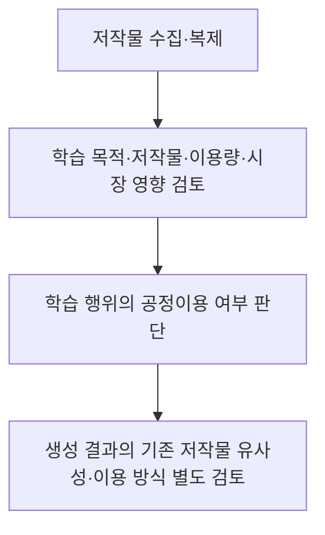
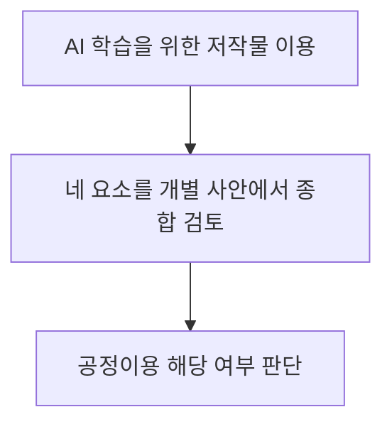
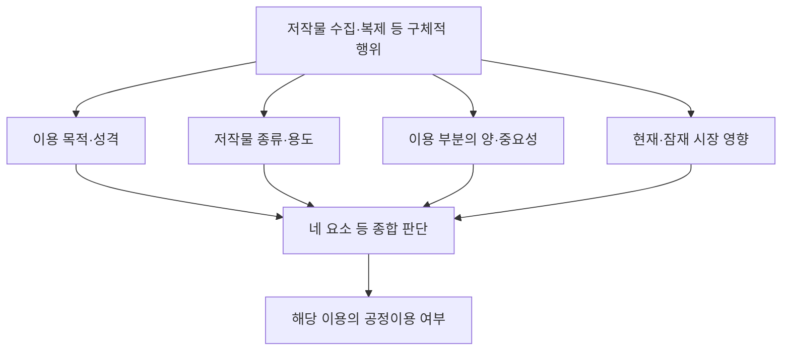
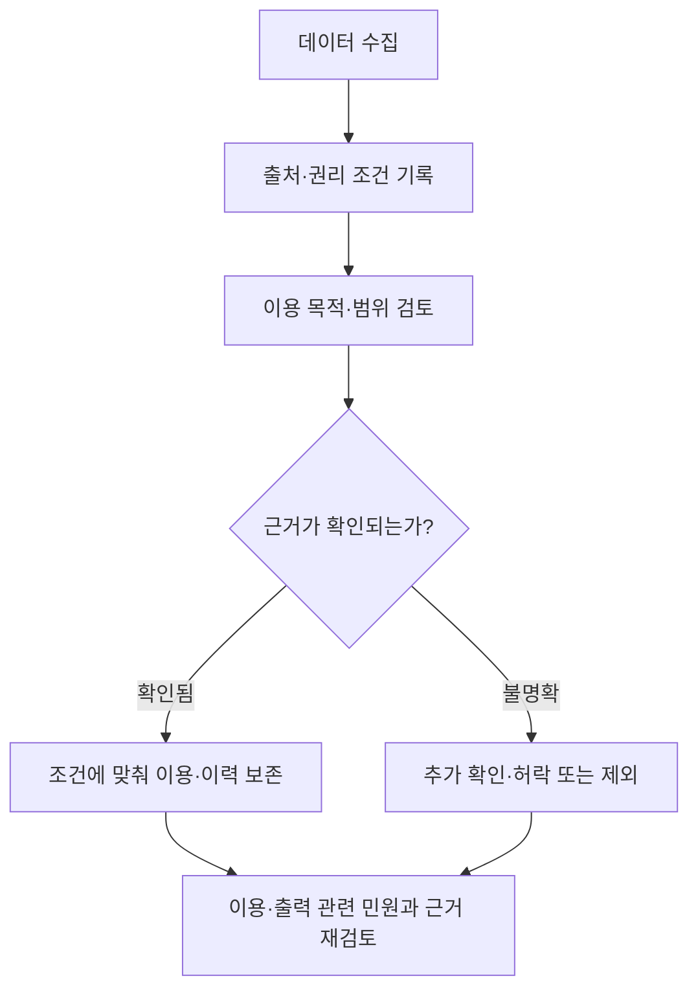

## 30초 인출
- **본질:** 생성형 AI 학습의 공정이용은 저작물을 학습에 쓴 사실만으로 자동 인정되거나 부정되지 않으며, 이용 목적·저작물 성격·이용량과 중요성·시장 영향을 종합해 판단한다.
- **메커니즘:** 저작물의 복제·전송 등 학습 단계와 생성 결과의 이용 단계는 별도로 살핀다. 학습에 공정이용이 성립해도 출력물의 저작권 침해 여부까지 자동 결정되지는 않는다.

핵심 용어

- **공정이용:** 저작권법상 일반 이용 방법과 충돌하지 않고 저작자의 정당한 이익을 부당하게 해치지 않는 저작물 이용이다.
- **텍스트·데이터 마이닝(TDM):** 텍스트·데이터를 전산 처리해 정보나 패턴을 분석하는 기법이며, 그 명칭만으로 저작권법상 면책을 뜻하지 않는다.
- **옵트아웃:** 권리자가 특정 데이터의 수집·이용을 거부하겠다는 의사를 표시하는 방식이다. 기술적 표준이나 계약과 법적 효과는 별도로 확인해야 한다.

## 핵심 도해

---

## 1교시 예상문제 (10점)
> 생성형 AI의 저작물 학습과 관련하여 저작권법상 공정이용의 의미와 판단 요소를 설명하시오. (예상)

---

## 1교시 10점 답안
### 1. 정의·목적
- **정의:** 공정이용은 저작물의 일반적인 이용 방법과 충돌하지 않고 저작자의 정당한 이익을 부당하게 해치지 않는 이용을 허용하는 저작권법상 기준이다.
- **목적:** 개별 이용의 맥락을 고려해 저작자 보호와 저작물 이용의 균형을 판단한다.

### 2. 판단 요소
저작권법 제35조의5 제2항은 다음 네 요소 등을 고려하도록 정한다.

| 요소 | 검토 내용 |
|---|---|
| 목적·성격 | 이용 목적과 상업성, 이용 방식 |
| 저작물의 종류·용도 | 사실 전달 중심인지 창작성이 강한지 등 |
| 이용 부분의 비중·중요성 | 전체에서 차지하는 양과 핵심성 |
| 시장·가치 영향 | 현재 또는 잠재적 시장과 저작물 가치에 미치는 영향 |

### 3. 적용

생성형 AI 학습이라는 이유만으로 공정이용이 자동 인정되거나 배제되는 것은 아니다. 한국저작권위원회의 2026년 안내서는 현행 조항의 해석과 고려사항을 설명하는 자료이며, 법률을 대체하거나 모든 사례의 결과를 확정하지 않는다.

**제언:** 학습 데이터의 출처와 이용 근거를 기록하고, 불명확한 데이터는 권리 확인 또는 이용 허락을 거친다.

---

## 2~4교시 예상문제 (25점)
> 생성형 AI 학습과 저작권의 관계를 설명하고, 저작권법상 공정이용 판단 기준 및 사업자의 대응 방안을 논하시오. (예상)

---

## 2~4교시 25점 답안
## Ⅰ. 개요
**생성형 AI 학습의 저작권 쟁점은 학습 과정에서의 저작물 이용과 생성 결과의 이용을 나누어 검토하는 문제다.** 저작권법 제35조의5는 일반적인 공정이용 기준을 두며, AI 학습에 대한 별도의 자동 면책을 규정하지 않는다.

| 검토 단계 | 핵심 질문 |
|---|---|
| 학습 | 수집·복제·저장 등 구체적 이용이 공정이용에 해당하는가? |
| 생성 결과 | 결과물의 복제·배포 등 이용이 기존 저작물의 권리를 침해하는가? |

## Ⅱ. 학습 단계와 공정이용
학습 데이터에 저작물이 포함되었다는 사실만으로 침해 여부가 정해지지 않는다. 학습에 수반된 구체적 이용 행위를 확인한 뒤 법정 요소를 종합한다.

저작권법 제35조의5 제1항은 일반 이용 방법과의 충돌 및 저작자의 정당한 이익에 대한 부당한 침해를 기준으로 제시한다. 제2항의 네 요소는 판단 때 고려할 항목이며, 어느 하나만으로 결론을 내리는 점수표가 아니다.

## Ⅲ. 생성 결과의 권리 검토
학습 과정의 판단과 생성 결과의 판단은 별개다. 결과가 특정 저작물의 표현을 포함하는지, 이용자가 이를 복제·배포·공중송신하는지 등 실제 행위와 사실관계를 살핀다.

| 검토 항목 | 확인 내용 |
|---|---|
| 대상 저작물 | 보호되는 표현이 특정되는가? |
| 결과와 저작물 | 표현상 실질적 유사성이 있는가? |
| 이용 행위 | 복제·배포 등 권리 행위가 있었는가? |
| 사안 맥락 | 이용 경위와 구체적 증거는 무엇인가? |

실질적 유사성만으로 모든 사안의 침해 여부가 확정되는 것은 아니다. 개별 권리와 이용 행위에 따라 판단하며, 학습 단계의 공정이용 여부가 출력 단계의 결론을 대신하지 않는다.

## Ⅳ. TDM·옵트아웃과 법적 지위
TDM은 데이터 분석 기법의 명칭이고 공정이용은 법적 판단 기준이다. 따라서 TDM이라고 해서 저작권 이용이 당연히 면책되는 것은 아니다. `robots.txt`나 유사한 표시도 기술적 수집 규칙 또는 권리자 의사 표시로 활용될 수 있으나, 그 자체가 저작권법 제35조의5의 판단을 대체하는 보편적 법정 면책·거부 절차라고 단정할 수 없다.

| 구분 | 의미 | 주의점 |
|---|---|---|
| TDM | 텍스트·데이터 분석 기법 | 기법 명칭만으로 적법성이 정해지지 않음 |
| 공정이용 | 구체적 이용을 판단하는 법 기준 | 제35조의5 요소 등을 사안별 검토 |
| 옵트아웃 표시 | 수집·이용 거부 의사나 기술적 신호 | 법적 효과와 적용 범위를 별도로 확인 |

한국저작권위원회는 2026년 2월 「생성형 인공지능의 저작물 학습에 대한 저작권법상 공정이용 안내서」를 발간했다. 이는 현행 공정이용 조항의 적용을 설명하는 안내 자료로, 법률 개정이나 확정 판례와 같은 효력을 갖는 것은 아니다.

## Ⅴ. 사업자 데이터 관리
사업자는 학습 데이터의 권리와 출처를 추적하고, 이용 근거가 불명확한 데이터의 위험을 줄이는 관리 체계를 마련할 수 있다.

권리 확인과 출처 기록은 위험관리 권고이며, 특정 데이터셋만을 사용해야 한다는 법적 의무라고 표현해서는 안 된다. 권리자의 표시, 계약 조건, 접근 통제, 공개 라이선스의 조건은 각각의 적용 범위를 확인한다.

## Ⅵ. 기술·운영 통제
기술적 통제는 법률 판단을 대신하지 않지만, 무단 수집·권리 침해 가능성을 줄이고 사고 대응 근거를 남기는 데 활용할 수 있다.

| 통제 영역 | 조치 예시 |
|---|---|
| 수집 전 | 출처·라이선스·계약 범위 확인, 수집 정책 기록 |
| 학습 데이터 | 데이터셋 버전과 출처 이력 관리, 제거 요청 처리 절차 마련 |
| 서비스 출력 | 신고·검토 경로 마련, 문제가 확인된 출력에 조치 |
| 사후 대응 | 권리자 문의·분쟁 대응 기록과 데이터 추적성 유지 |

유사도 검사나 유명 작가명 필터만으로 침해를 완전히 막을 수 있다고 보장할 수 없다. 모델 구성, 입력, 출력, 서비스 이용 맥락을 함께 점검한다.

## Ⅶ. 기술적 제언

| 문제 | 해결 방안 |
|---|---|
| 데이터 권리와 출처를 추적하기 어려움 | 수집 시 출처·이용 근거·조건을 기록하고 변경 이력을 관리한다. |
| 권리 표시와 계약 조건이 수집 과정에서 누락될 수 있음 | 수집 정책에 표시·접근 조건 확인을 반영하고 예외 사례는 검토 대상으로 보낸다. |
| 학습과 출력의 책임 검토가 뒤섞임 | 학습 데이터 처리와 결과물 신고·대응을 별도 절차로 관리한다. |

## 출제 이력 및 검증 출처
- 기출 확인: 미출제. 본 문항은 현행 주제에 맞춘 예상문제다.
- [저작권법 제35조의5, 국가법령정보센터](https://law.go.kr/lsLinkCommonInfo.do?lsJoLnkSeq=1020155981)
- [생성형 인공지능의 저작물 학습에 대한 저작권법상 공정이용 안내서, 한국저작권위원회](https://www.copyright.or.kr/information-materials/publication/research-report/view.do?brdclasscode=&brdctsno=55211&brdctsstatecode=&list.do?pageIndex=1&nationcode=&searchTarget=SUBJECT&searchText=%EC%A0%80%EC%9E%91%EA%B6%8C&servicecode=06)
