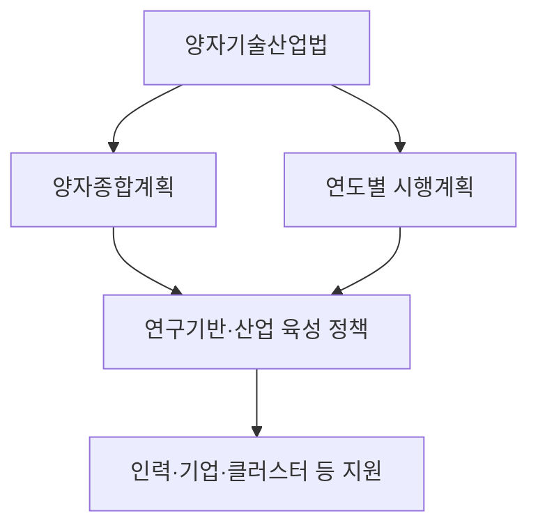
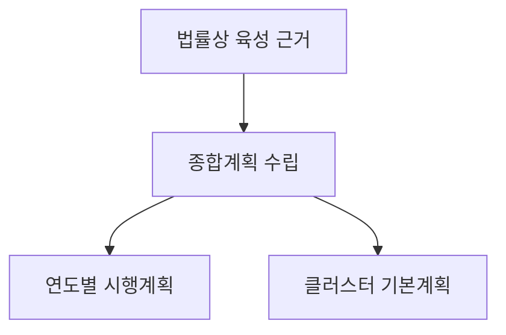
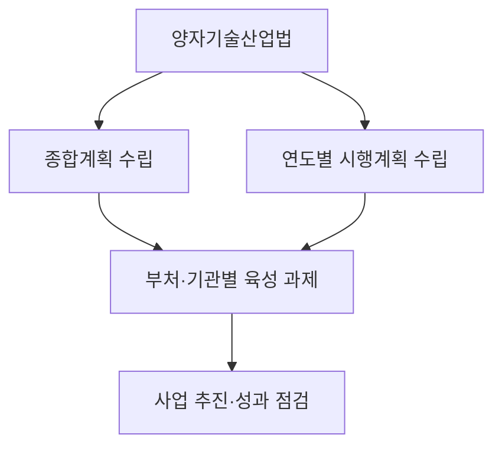
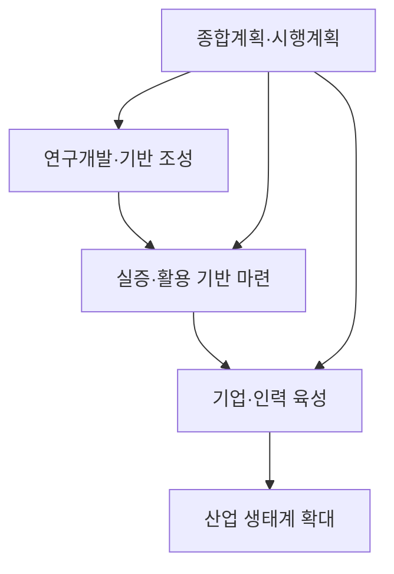

## 30초 인출
- **본질:** 양자기술산업법은 양자과학기술 연구기반을 조성하고 관련 산업을 체계적으로 육성하는 법이다.
- **메커니즘:** 법률에 따라 종합계획과 연도별 시행계획을 수립하고, 연구개발·인력·기업·양자클러스터 등 지원 정책을 추진한다.

핵심 용어

- **양자과학기술:** 양자역학적 특성으로 정보를 생성·제어·계측·전송·저장·처리하는 과학기술이다.
- **양자산업:** 양자과학기술 또는 양자지원기술 관련 제품을 생산하거나 서비스를 제공하는 산업이다.
- **양자클러스터:** 기업·대학·연구소 등을 연계해 양자과학기술과 산업을 육성하도록 지정하는 지역이다.
- **양자종합계획:** 양자과학기술과 산업 육성의 중장기 정책 방향을 정하는 법정 계획이다.

## 핵심 도해

---

## 1교시 예상문제 (10점)
> 양자기술산업법의 목적과 양자종합계획의 역할을 설명하시오. (예상)

---

## 1교시 10점 답안
### 1. 정의·목적
- **정의:** 「양자과학기술 및 양자산업 육성에 관한 법률」은 양자과학기술의 연구기반을 만들고 양자산업을 체계적으로 육성하기 위한 법이다.
- **목적:** 과학기술 혁신과 국가안보, 국민경제 발전에 이바지한다.

### 2. 계획 체계
| 수단 | 역할 |
|---|---|
| 양자종합계획 | 중장기 정책 방향과 육성 과제를 정한다. |
| 연도별 시행계획 | 종합계획을 해당 연도의 추진 과제로 구체화한다. |
| 양자클러스터 기본계획 | 클러스터 지정·육성의 기본 방향을 정한다. |

**제언:** 계획의 목표·예산·성과지표를 연계해 추진 상황을 주기적으로 점검한다.

---

## 2~4교시 예상문제 (25점)
> 양자기술산업법의 목적과 제1차 양자종합계획의 역할을 설명하고, 양자기술·산업 육성 과제를 논하시오. (예상)

---

## 2~4교시 25점 답안
## Ⅰ. 개요
**양자기술산업법과 종합계획은 양자 연구기반을 산업 육성과 연결하기 위한 법률·정책 체계다.** 해당 법은 연구기반 조성과 산업 육성을 통해 과학기술 혁신, 국가안보, 국민경제 발전에 이바지하는 것을 목적으로 한다.

| 구분 | 기능 |
|---|---|
| 법률 | 정책 수립과 지원의 근거 마련 |
| 종합계획 | 중장기 목표·방향·과제 제시 |
| 시행계획 | 연도별 과제 추진 |

## Ⅱ. 법·계획 체계

법률 제5조는 양자종합계획, 제6조는 시행계획 수립 근거를 둔다. 구체적인 계획 기간과 목표는 해당 차수의 확정 계획을 기준으로 하며, 과거 계획안의 수치나 공청회 자료를 확정 내용처럼 인용하지 않는다.

## Ⅲ. 육성 범위
양자과학기술은 양자컴퓨터에 한정되지 않는다. 현행법은 양자암호·통신·센서·소자·컴퓨터·시뮬레이터 등을 정의에 포함하고, 구현에 필요한 소재·부품·장비·시스템·소프트웨어를 양자지원기술로 규정한다.

| 범위 | 예시 |
|---|---|
| 양자과학기술 | 양자통신, 양자센서, 양자소자, 양자컴퓨터 등 |
| 양자지원기술 | 관련 소재·부품·장비·시스템·소프트웨어 |
| 산업 육성 | 제품·서비스, 연구 기반, 인력, 기업 및 클러스터 |

## Ⅳ. 추진 수단

법률은 연구기반과 산업을 지원하기 위한 여러 수단을 두며, 실제 사업의 내용·목표·예산은 확정 계획과 개별 사업 공고에서 확인한다. 양자클러스터와 양자팹 등은 법과 시행령에서 정한 지정·지원 절차에 따라 추진한다.

## Ⅴ. 암호 전환과 보안
양자컴퓨터의 발전은 일부 기존 공개키 암호에 장기 위험이 될 수 있어 암호 전환을 준비할 필요가 있다. 다만 양자기술산업법 자체를 공공망의 특정 암호 알고리즘 교체를 의무화한 규정으로 설명하지 않는다. 암호 전환 대상·일정·표준은 관계 기관의 별도 정책과 기술 기준을 확인해야 한다.

| 쟁점 | 설명 |
|---|---|
| 장기 보안 위험 | 저장된 암호문을 미래에 해독하려는 위협 고려 |
| 전환 준비 | 암호 자산·의존 시스템·교체 가능성 파악 |
| 적용 기준 | 국가 표준과 기관별 정책에 따라 알고리즘·일정을 결정 |

## Ⅵ. 성과 관리
종합계획의 실행력을 높이려면 연구성과와 산업성과를 구분해 살피고, 각 과제의 목표·담당 기관·예산·일정을 함께 관리한다. 양자클러스터는 법령상 지정 요건과 운영·성과 점검 절차에 따라 평가한다.

| 관리 항목 | 점검 예시 |
|---|---|
| 연구 기반 | 연구시설·실증 환경의 구축 및 활용 |
| 인력·기업 | 인력 양성 과정과 기업 지원 성과 |
| 클러스터 | 운영 현황, 지역 연계와 성과 |
| 정책 이행 | 연도별 과제·예산·성과지표의 진행 |

## Ⅶ. 기술적 제언

| 문제 | 해결 방안 |
|---|---|
| 계획 목표와 연도별 사업의 연결이 약함 | 중장기 목표마다 연도별 과제·책임 기관·성과지표를 대응시킨다. |
| 양자 분야별 기반과 인력 수요가 다름 | 컴퓨팅·통신·센서·지원기술별 수요를 확인해 연구·인력 정책을 조정한다. |
| 암호 전환을 단일 장비 교체로 오해할 수 있음 | 자산 조사와 상호운용성 검토를 거쳐 관계 기관 기준에 따라 단계적으로 준비한다. |

## 출제 이력 및 검증 출처
- 기출 여부·회차는 공식 원문을 확인하지 못해 단정하지 않았다. 위 문항은 예상문제다.
- [양자과학기술 및 양자산업 육성에 관한 법률, 국가법령정보센터](https://www.law.go.kr/LSW/lsInfoP.do?lsId=014525)
- [양자기술산업법 시행령, 국가법령정보센터](https://www.law.go.kr/LSW/lsInfoP.do?ancYnChk=0&chrClsCd=010202&efYd=20260102&lsiSeq=280941&urlMode=lsInfoP)
- [제1차 양자 종합계획(안) 공청회, 과학기술정보통신부](https://msit.go.kr/bbs/view.do?bbsSeqNo=94&mId=307&mPid=208&nttSeqNo=3186531&sCode=user)
- [제1차 양자 종합계획 발표, 대한민국 정책브리핑](https://www.korea.kr/news/policyNewsView.do?newsId=148958779)
