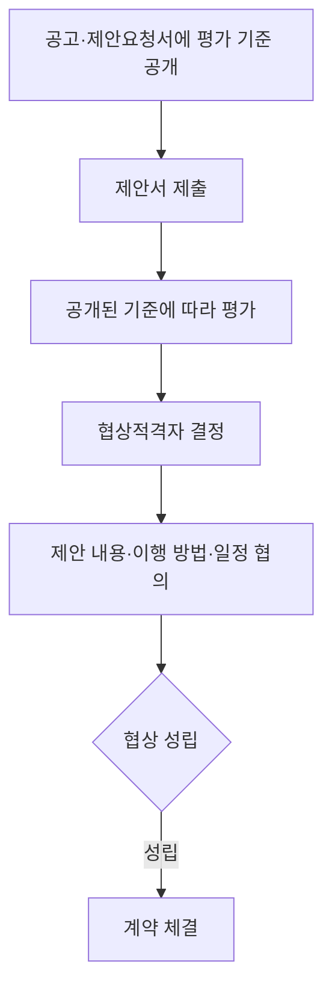
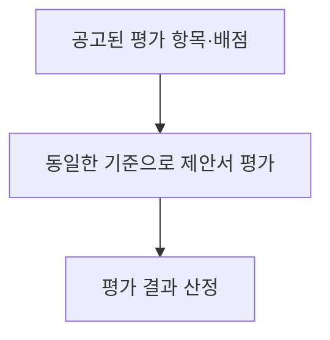
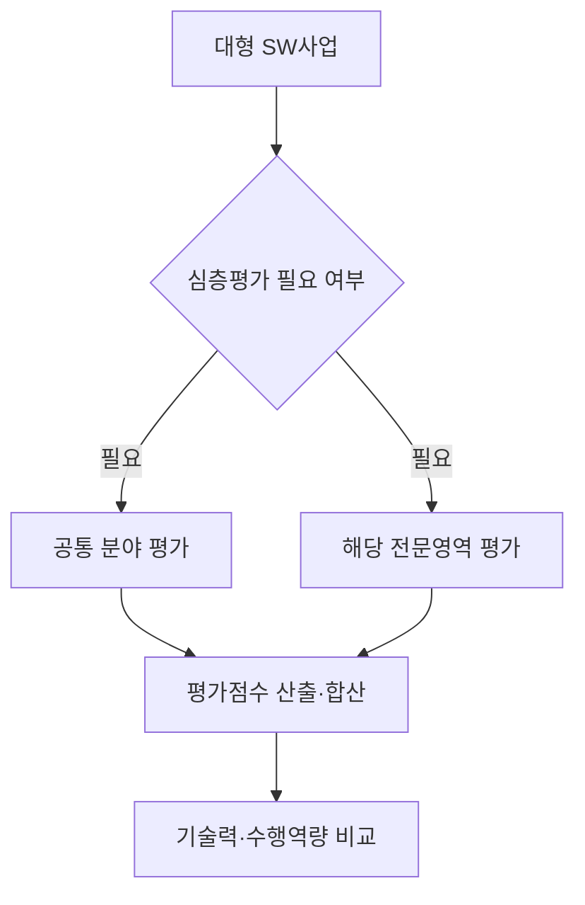
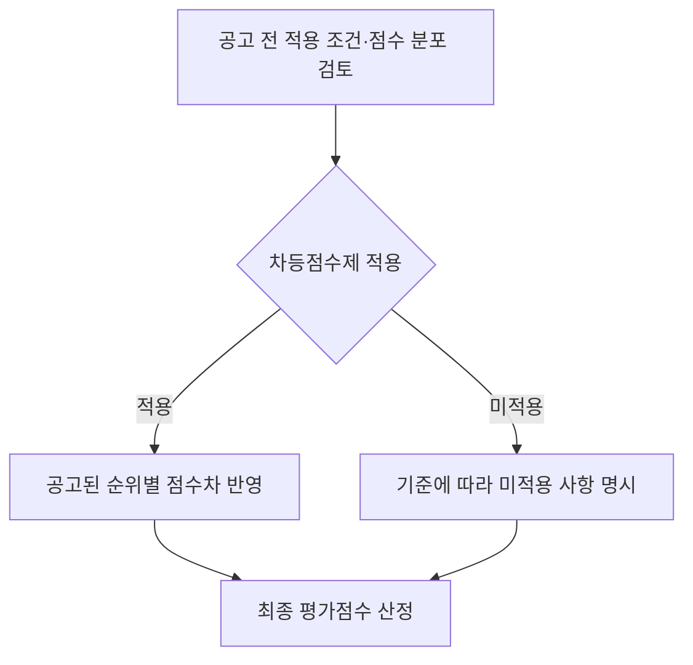
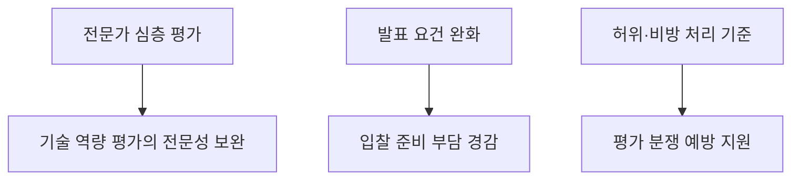

## 30초 인출
- **본질:** 조달청 제안서평가 세부기준은 조달청이 집행하는 협상계약에서 제안서 평가에 필요한 세부 사항을 정한 행정규칙이다.
- **메커니즘:** 공고된 기준으로 제안서를 평가하고, 협상적격자를 선정해 허용 범위에서 제안 내용과 이행 조건을 협의한다.

핵심 용어

- **협상계약:** 제안서를 평가한 뒤 협상 절차를 거쳐 계약상대자를 정하는 계약 방식이다.
- **전문평가:** 특정 전문영역의 심층 평가를 위해 해당 분야 전문가가 참여하는 평가 방식이다.
- **차등점수제:** 기준이 정한 경우 기술평가 순위 사이에 차등 점수를 적용하는 제도다.

## 핵심 도해

---

## 1교시 예상문제 (10점)
> 조달청 협상계약 제안서평가 세부기준의 목적과 평가 원칙을 설명하시오. (예상)

---

## 1교시 10점 답안
### 1. 정의·목적
- **정의:** 조달청 협상계약 제안서평가 세부기준은 관련 계약예규에 따라 조달청장이 제안서 평가를 집행할 때 필요한 세부사항을 정한 행정규칙이다.
- **목적:** 공개된 기준으로 제안서를 평가해 계약 목적에 맞는 제안과 이행 능력을 비교한다.

### 2. 평가 원칙

| 원칙 | 적용 내용 |
|---|---|
| 사전 공개 | 공고·제안요청서에 평가항목, 배점, 절차를 제시 |
| 기준 준수 | 제출 제안서를 공개된 기준에 따라 평가 |
| 공정한 경쟁 | 허위 내용·타사 비방 등은 해당 기준에 따라 처리 |
| 적용 범위 | 조달청 집행 기준과 해당 입찰공고를 확인 |

**제언:** 사업 요구와 평가항목·배점의 대응 관계를 입찰 전에 검토한다.

---

## 2~4교시 예상문제 (25점)
> 제136회 4교시 3번: 「조달청 협상에 의한 계약 제안서평가 세부기준」의 2024년 9월 개정과 관련하여 주요 개정 내용, 차등점수제의 도입 배경 및 적용 방안, 기대효과를 설명하시오.

---

## 2~4교시 25점 답안
## Ⅰ. 개요
**조달청 제안서평가 세부기준은 조달청이 집행하는 협상계약의 제안서 평가 절차와 방법을 정한다.** 2024년 9월 개정은 대형 SW사업 평가 전문성, 중소기업의 발표 부담, 평가 공정성을 개선하는 내용을 포함했다.

| 구분 | 설명 |
|---|---|
| 대상 | 조달청장이 제안서 평가를 집행하는 협상계약 |
| 기준 | 관련 계약예규와 조달청 행정규칙·입찰공고 |
| 결과 | 평가를 거쳐 협상 대상자를 정하고 협상 진행 |

## Ⅱ. 2024년 9월 개정 사항
조달청은 2024년 9월 13일부터 개정 기준을 시행했다. 주요 발표 내용은 대형 SW 전문평가, 수의계약 적합성 평가 대행, 허위 제안·타사 비방 대응, 제안 발표 부담 완화, 기술용역 협상계약 기준 마련이다.

| 개정 내용 | 핵심 사항 |
|---|---|
| 대형 SW 전문평가 | 정보기술개발·정보보호·데이터구축·디지털기술의 심층 평가 도입; 당시 안내 기준은 공통 60%, 전문 40% 합산 |
| 수의계약 평가 대행 | 요청이 있는 경우 조달청이 제안서 적합성 정성평가를 대행할 수 있도록 근거 마련 |
| 허위·비방 대응 | 허위 내용 판단 절차를 명확히 하고 타사 비방에 감점 가능하도록 개선 |
| 발표 부담 완화 | 온라인 평가의 발표 기준금액을 고시금액에서 5억 원 이상으로 조정하고 발표 없는 대상 확대 |
| 기술용역 | 엔지니어링·건설엔지니어링 분야의 협상계약 평가 기준 마련 |

## Ⅲ. 전문평가
전문평가는 대형 SW사업 중 심층평가가 필요한 경우 특정 전문영역의 전문가가 전담 평가에 참여하도록 한 제도다.

2024년 당시 조달청 발표는 사업금액 40억 원 이상 SW사업(유지관리 사업은 100억 원 이상)을 적용 대상으로 제시했다. 기준은 후속 개정될 수 있으므로 실제 입찰에서는 현행 세부기준과 공고를 확인한다.

## Ⅳ. 차등점수제
차등점수제는 기술평가 점수만으로 제안 순위의 변별력이 충분하지 않을 때 순위 간 정해진 점수 차를 두는 평가 방식이다. 점수차와 적용 조건은 조달청 세부기준 및 입찰공고를 따라야 한다.

| 검토 항목 | 적용 원칙 |
|---|---|
| 도입 배경 | 기술점수의 근소한 차이로 우수 제안의 순위 변별이 어려운 상황 보완 |
| 사전 명시 | 적용 여부와 방식을 조달요청·공고 과정에서 확인 가능하게 제시 |
| 적용·미적용 | 기준이 정한 조건과 사업의 점수 분포 등을 고려해 결정 |

조달청의 2024년 9월 보도자료는 개정 주요 사항을 열거하면서 차등점수제를 핵심 개정 항목으로 제시하지 않았다. 따라서 해당 문항이 차등점수제를 같은 개정의 일부로 묻는다면, 개정 보도자료와 현행 세부기준을 대조해 제도 도입 시점·근거를 구분할 필요가 있다.

## Ⅴ. 공정성 보완
허위 내용의 판단 절차를 명확히 하고 타사 비방에 불이익을 둘 수 있게 해 제안서 평가에서 발생할 수 있는 분쟁을 줄이도록 했다.

| 위험 | 기준상 대응 |
|---|---|
| 허위 제안 | 내부 심의를 통해 허위 여부와 입찰 결과 영향 판단 |
| 타사 비방 | 평가 기준에 따라 기술능력평가 감점 가능 |
| 수요기관의 평가 전문성 부족 | 요청이 있으면 조달청이 수의계약 제안서 적합성 평가를 대행 가능 |

## Ⅵ. 기대효과
전문성 강화와 발표 비용 경감, 분쟁 예방은 개정의 정책 목표다. 조달청은 개정 발표 당시 연간 약 4천여 기업이 약 195억 원의 입찰 비용을 절감할 것으로 예상했으며, 이는 당시 추정치다.

## Ⅶ. 기술적 제언

| 문제 | 해결 방안 |
|---|---|
| 복합 SW사업의 전문성을 일반 평가만으로 판단하기 어려움 | 전문평가 적용 요건과 공통·전문 평가 기준을 사전 공개한다. |
| 차등점수제 적용 시 예측 가능성이 낮을 수 있음 | 적용 여부·순위 간 점수차·산정 방식을 입찰공고에 명확히 제시한다. |
| 개정 내용과 현행 세부기준이 혼동될 수 있음 | 제도 연혁과 최신 조달청 세부기준을 분리해 대조한다. |

## 출제 이력 및 검증 출처
- 출제 이력: 원문 파일에 제136회 4교시 3번으로 기록되어 있으나 시험 원문은 별도 대조하지 못했다.
- [조달청 협상에 의한 계약 제안서평가 세부기준, 국가법령정보센터](https://www.law.go.kr/LSW/admRulLsInfoP.do?admRulSeq=2100000273638)
- [2024년 9월 개정 주요 내용, 조달청 보도자료](https://www.pps.go.kr/kor/bbs/view.do?bbsSn=2409110017&key=00634)
- [2025년 7월 개정 안내, 조달청](https://www.pps.go.kr/kor/bbs/view.do?bbsSn=2506260009&key=00318)
