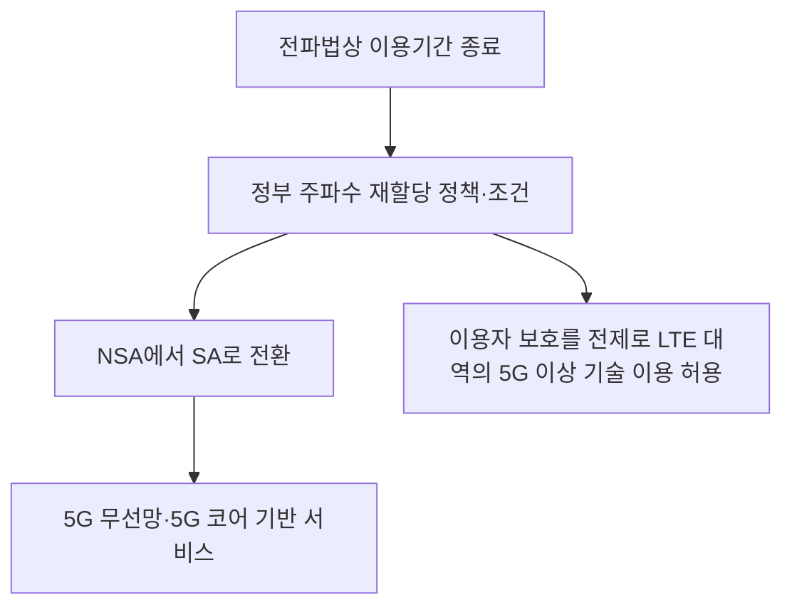
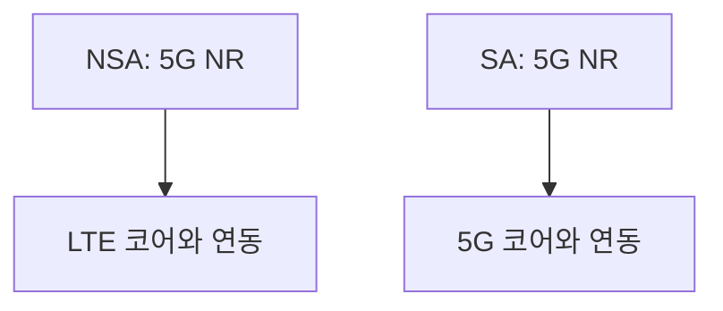
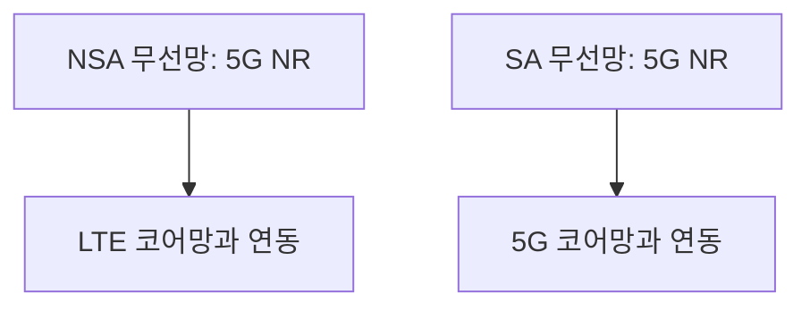
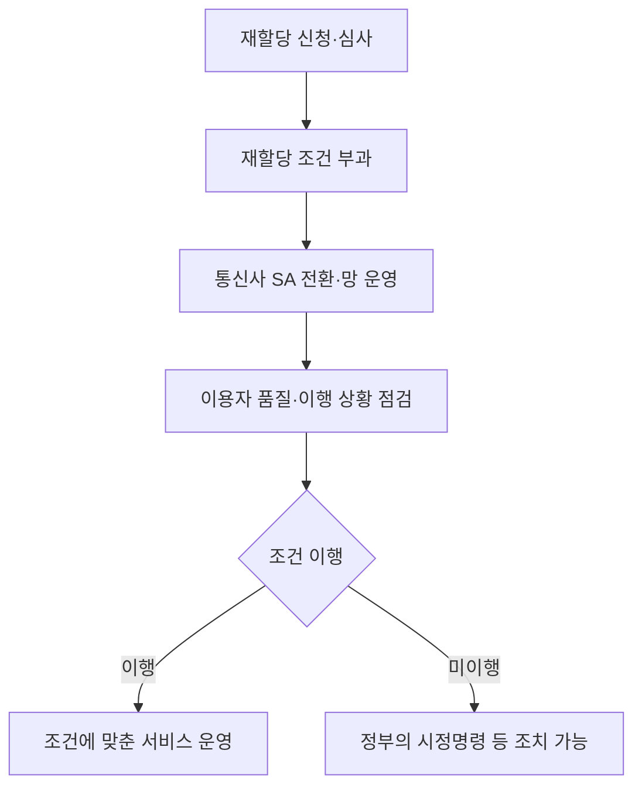
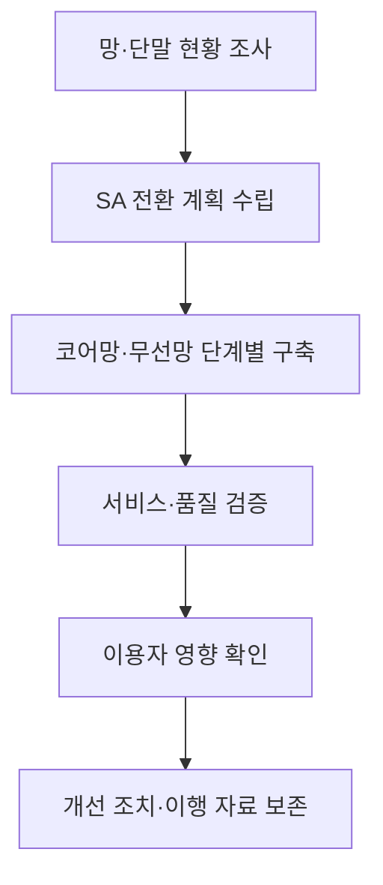

## 30초 인출
- **본질:** 5G SA는 LTE 코어에 의존하지 않고 5G 무선망과 5G 코어망으로 서비스를 제공하는 방식이다.
- **메커니즘:** 정부의 2025년 이동통신 주파수 재할당 정책은 재할당 조건으로 NSA에서 SA로 전환하도록 정하고, 3G·LTE 대역의 5G 이상 기술 이용을 허용하는 방향을 함께 제시했다.

핵심 용어

- **주파수 재할당:** 이용기간이 끝난 주파수를 기존 이용자에게 다시 할당하는 절차다.
- **5G 비단독모드(NSA):** 5G 무선망을 LTE 코어와 함께 쓰는 방식이다.
- **5G 단독모드(SA):** 5G 무선망을 5G 코어와 연결해 LTE 코어에 의존하지 않는 방식이다.
- **5G 코어(5GC):** 가입자 인증, 세션 관리, 데이터 전달 등 이동통신망의 핵심 기능을 제공하는 코어망이다.

## 핵심 도해

---

## 1교시 예상문제 (10점)
> 5G NSA와 5G SA의 구조 차이 및 주파수 재할당 정책과의 관계를 설명하시오. (예상)

---

## 1교시 10점 답안
### 1. 정의·목적
- **정의:** NSA는 5G 무선망을 LTE 코어와 연동하고, SA는 5G 무선망을 5G 코어와 연결해 독립적으로 운용하는 구조다.
- **목적:** 5G SA 전환은 무선망과 코어망을 함께 5G로 구성해 5G 기능을 활용할 기반을 마련한다.

### 2. 구조 비교
| 구분 | NSA | SA |
|---|---|---|
| 무선 접속 | 5G NR 사용 | 5G NR 사용 |
| 코어망 | LTE 코어와 연동 | 5G 코어 사용 |
| 구조상 구별 | LTE 코어에 의존 | 5G 코어 기반 단독 운용 |

2025년 정부 재할당 정책은 재할당 조건으로 NSA에서 SA로 전환하도록 정했다. 주파수 할당 조건과 기술 구조의 차이는 구분해 설명한다.

**제언:** 사업자는 코어망 전환과 실내·외 품질을 함께 점검해 이용자 불편을 줄인다.

---

## 2~4교시 예상문제 (25점)
> 이동통신 주파수 재할당 정책에서 5G SA 전환 의무화의 배경과 주요 내용을 설명하고, 기술적 영향 및 이행 관리 방안을 논하시오. (예상)

---

## 2~4교시 25점 답안
## Ⅰ. 개요
**주파수 재할당은 이용기간이 끝난 주파수를 기존 이용자에게 다시 할당할 수 있는 절차이며, 정책 당국은 재할당 과정에서 조건을 정할 수 있다.** 2025년 12월 과기정통부의 세부 정책은 3G·LTE 이용 주파수 370MHz 재할당과 이동통신망의 SA 전환을 함께 다뤘다.

| 정책 목표 | 고려 사항 |
|---|---|
| 이용자 보호 | 기존 서비스의 연속성과 품질 관리 |
| 주파수 효율 | 향후 대역 정비와 세대 진화 가능성 |
| 망 고도화 | NSA 중심 운용에서 SA로 전환 |

## Ⅱ. NSA와 SA 구조

SA는 LTE 코어망에 의존하지 않는다는 구조상의 차이가 핵심이다. SA 전환만으로 초저지연·배터리 절감·특정 서비스 품질이 자동 보장된다고 단정할 수 없다. 실제 품질은 주파수 대역폭, 무선국 구축, 단말 지원, 코어·서비스 구성에 영향을 받는다.

## Ⅲ. 재할당 정책의 주요 내용
과기정통부는 2025년 12월 정책 설명에서 재할당 조건으로 NSA에서 SA로 전환하도록 의무화한다고 밝혔다. 또한 이용자 보호에 문제가 없다는 전제 아래 재할당 주파수를 5G 이상 기술 방식으로 사용할 수 있도록 기술기준을 정비하는 계획을 제시했다.

| 정책 내용 | 설명 |
|---|---|
| SA 전환 | 재할당 조건에 따라 NSA에서 SA로 전환 |
| 기술 이용 범위 | 이용자 보호를 전제로 재할당 대역에서 5G 이상 방식 허용 추진 |
| 품질·대가 | 실내 무선국 구축 등 품질 개선과 할당대가 조정 방안 연계 |
| 이행 관리 | 정부는 불이행 시 시정명령 등 행정조치가 가능하다고 설명 |

## Ⅳ. 조건 이행 과정

주파수 재할당은 「전파법」 제16조에 근거한 행정 절차다. 정책 발표의 조건·일정과 법 조문은 구별하고, 사업자별 실제 할당 통지서와 최신 기술기준을 함께 확인한다.

## Ⅴ. 기술·운영 영향
SA 전환은 LTE 코어 의존 구조를 바꾸므로 코어망 연동, 단말 호환성, 커버리지 및 실내 품질 점검이 필요하다. 정부 브리핑도 SA 전환 때 속도가 저하될 수 있음을 언급하며 사업자의 셀 계획 조정과 무선국 구축, LTE 대역의 5G 이용 가능성을 함께 설명했다.

| 영향 영역 | 점검 사항 |
|---|---|
| 코어망 | 5G 코어 용량·연동·운영 준비 |
| 단말 | SA 지원 여부와 LTE·5G 전환 동작 |
| 품질 | 실내외 커버리지와 혼잡·속도 변화 |
| 서비스 연속성 | 음성·데이터 서비스의 이동성 및 장애 대응 |

## Ⅵ. 이행 관리

이행 계획은 단순히 SA 코어를 설치하는 데 그치지 않고, 단말 지원과 이용자 체감 품질, 행정상 재할당 조건을 함께 점검해야 한다.

## Ⅶ. 기술적 제언

| 문제 | 해결 방안 |
|---|---|
| NSA에서 SA로 전환하며 품질 변동이 발생할 수 있음 | 지역·시간대별 품질을 측정하고 셀 설계와 무선국 투자를 조정한다. |
| 단말 호환성과 코어 준비 상태가 사업자별로 다름 | 단말·코어·서비스별 전환 계획과 검증 기준을 마련한다. |
| 정책 발표와 개별 재할당 조건을 혼동할 수 있음 | 최신 재할당 통지서·기술기준·정책자료를 대조해 이행 의무를 관리한다. |

## 출제 이력 및 검증 출처
- 기출 여부·회차는 공식 시험 원문을 확인하지 못해 단정하지 않았다. 위 문항은 예상문제다.
- [전파법 제16조, 국가법령정보센터](https://www.law.go.kr/lsLinkCommonInfo.do?chrClsCd=010202&lsJoLnkSeq=1029301901)
- [이동통신 주파수 재할당 세부 정책방안, 과학기술정보통신부 정책브리핑](https://www.korea.kr/news/policyNewsView.do?newsId=156734418)
- [전기통신사업용 무선설비의 기술기준, 국가법령정보센터](https://www.law.go.kr/admRulInfoP.do?admRulSeq=2100000282848&chrClsCd=010202&urlMode=admRulRvsInfoR)
