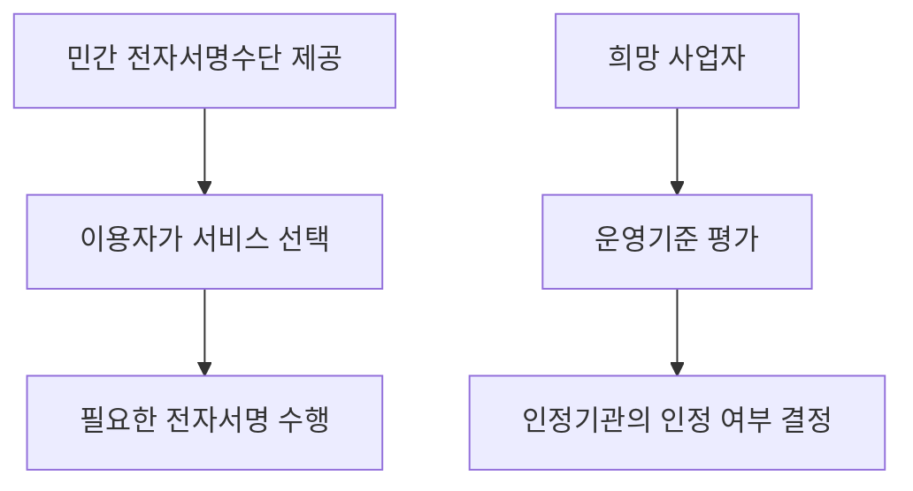
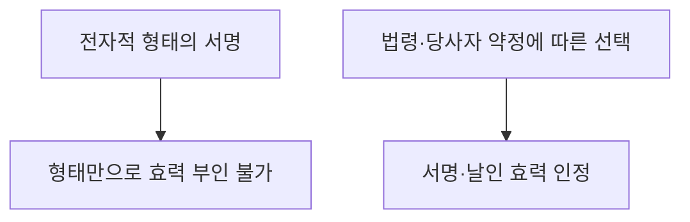
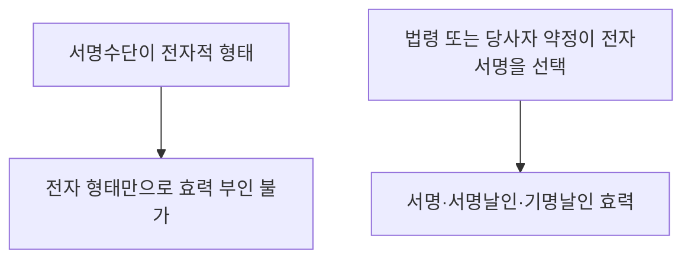
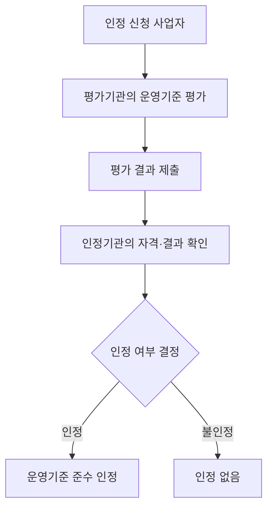
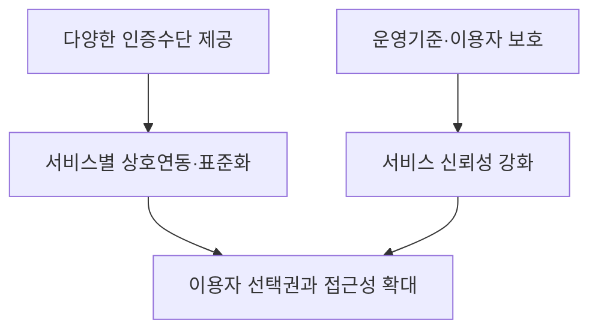

## 30초 인출
- **본질:** 전자서명법은 전자적 형태라는 이유만으로 서명 효력을 부인하지 않고, 전자서명수단의 다양성과 이용자 보호를 지원하는 법이다.
- **메커니즘:** 전자서명인증사업자는 인증 서비스를 제공할 수 있으며, 운영기준 준수 인정은 평가를 거쳐 선택적으로 받을 수 있다.

핵심 용어

- **전자서명:** 서명자를 확인하고 전자문서에 서명했음을 나타내기 위해 전자문서에 첨부·결합되는 전자적 정보다.
- **전자서명인증사업자:** 전자서명인증업무를 수행하는 사업자다.
- **운영기준 준수사실 인정:** 인증사업자가 법정 운영기준을 준수했는지 평가·인정받는 선택적 제도다.
- **공인인증서 제도 폐지:** 전자서명수단에 부여하던 종전의 공인·비공인 구분과 공인 전자서명의 특별 지위를 없앤 것이다.

## 핵심 도해

---

## 1교시 예상문제 (10점)
> 전자서명법의 개정 취지와 전자서명의 효력을 설명하시오. (예상)

---

## 1교시 10점 답안
### 1. 정의·목적
- **정의:** 전자서명법은 전자서명의 기본 사항을 정해 전자서명 이용을 촉진하고 가입자와 이용자의 권익을 보호하는 법이다.
- **목적:** 특정 전자서명수단에 의존하지 않고 다양한 인증수단을 이용할 수 있도록 제도적 기반을 마련한다.

### 2. 주요 내용
| 내용 | 설명 |
|---|---|
| 효력 | 전자적 형태라는 이유만으로 서명·날인 효력을 부인하지 않는다. 법령이나 당사자 약정에 따라 전자서명을 선택한 경우 해당 효력을 인정한다. |
| 수단 다양성 | 법령상 특정 수단을 정한 경우 등을 제외하고 특정 전자서명수단만 사용하도록 제한하지 않는다. |
| 운영기준 인정 | 인증사업자가 신청해 평가와 인정을 받을 수 있으며 모든 사업자에게 강제되는 것은 아니다. |

**제언:** 서비스는 서명수단의 종류와 무관하게 이용자가 효력·절차를 이해할 수 있도록 안내한다.

---

## 2~4교시 예상문제 (25점)
> 제122회 4교시 3번: 2020년 5월에 공인인증서와 사설인증서의 구별을 없애는 전자서명법이 개정되었다. 이에 따라 국내에 대중화되어 있는 사설인증서의 종류 및 전자서명 시장의 발전방향을 설명하시오.

---

## 2~4교시 25점 답안
## Ⅰ. 개요
**전자서명법 전부개정은 종전 공인전자서명 중심의 차등 제도를 없애고 전자서명수단의 다양성을 넓힌 개정이다.** 법률은 2020년 6월 9일 공포되어 2020년 12월 10일 시행되었다. 이 개정은 공인인증서 파일이나 공개키 암호 기술 자체를 폐지한 것이 아니다.

| 구분 | 종전 체계 | 개정 이후 |
|---|---|---|
| 제도 | 공인전자서명에 법정 추정 효력 부여 | 공인·비공인 구별에 따른 특별 지위 폐지 |
| 효력 | 공인전자서명에 별도 추정 효력 | 전자적 형태라는 이유로 효력 부인 불가; 당사자나 법령이 선택한 경우 효력 인정 |
| 정책 방향 | 지정된 공인 체계 중심 | 다양한 전자서명수단과 상호연동 촉진 |

## Ⅱ. 개정 배경과 법적 효력
개정 전에는 공인인증서에 기반한 전자서명에 특별한 추정 효력이 있었고, 이용자는 법률상 별도 지위가 없는 전자서명수단과 구별했다. 개정법은 이 차등을 없애고 전자서명수단의 다양성, 이용 활성화, 상호연동을 정책 방향에 포함했다.

전자서명이 인정된다고 해서 서명자 신원이나 문서 무결성이 모든 경우에 자동 추정되는 것은 아니다. 분쟁에서는 서명 과정, 인증 자료, 계약·법령의 요건 등 구체적 사정을 살핀다.

## Ⅲ. 전자서명인증업무 평가·인정
운영기준 준수 인정은 민간 인증사업자가 희망해 받을 수 있는 제도다. 먼저 평가기관의 평가를 받고, 인정기관이 평가 결과와 법정 자격을 확인해 인정 여부를 결정한다.

이 제도는 전자서명 서비스를 제공하기 위한 일률적 허가나 모든 사업자에 대한 의무 인증이 아니다. 운영기준은 전자서명·전자문서 위변조 방지, 가입자 확인, 시설·자료 보호, 이용자 권익 보호 등을 다룬다.

## Ⅳ. 국내 전자서명수단
시장에는 금융기관 인증서, 통신사·플랫폼 기반 간편인증, 공동인증서 등 여러 수단이 제공된다. 서비스별 명칭·사업자·기술 구현은 변할 수 있으므로 특정 회사 목록을 고정된 법정 분류로 제시하지 않는다.

| 수단 예시 | 주요 특징 |
|---|---|
| 공동인증서 | 종전 공인인증서에서 이어진 인증서 기반 방식 |
| 금융·통신·플랫폼 인증 | 사업자 앱 또는 계정을 활용한 간편 인증 |
| 생체인증 연계 | 단말기 생체 확인을 인증 절차에 활용할 수 있음 |

생체정보가 전자서명에 직접 저장된다거나 특정 인증이 항상 FIDO·PKI를 쓴다고 일반화하지 않는다. 생체정보와 개인키의 처리 방식은 서비스별 공식 설명과 기술문서를 확인한다.

## Ⅴ. 시장 발전 방향

전자서명 시장은 사업자 간 경쟁뿐 아니라 상호연동, 접근성, 개인정보·인증정보 보호, 사고 대응 능력을 함께 높여야 한다. 단일 API 중계나 공공서비스 연계는 서비스·기관에 따라 선택되는 구현 방식이며, 법이 모든 기관에 의무화한 사항은 아니다.

## Ⅵ. 기술·운영 과제

| 과제 | 관리 방향 |
|---|---|
| 인증수단별 연계 차이 | 상호연동 규격과 오류 처리 절차를 정비 |
| 계정·인증정보 탈취 | 다중요소 확인, 키 보호, 이상행위 대응을 서비스 위험에 맞게 적용 |
| 접근성 격차 | 장애인·고령자 등을 포함해 다양한 이용자가 사용할 수 있도록 설계 |
| 시장 변화 | 법적 제도와 사업자별 기술 제공 현황을 구분해 갱신 |

## Ⅶ. 기술적 제언

| 문제 | 해결 방안 |
|---|---|
| 인증사업자별 연동 방식이 달라 개발·운영 부담이 생김 | 표준 연계 방식과 공통 오류·복구 절차를 적용한다. |
| 이용자가 인정 여부와 법적 효력을 혼동할 수 있음 | 서비스별 인정 상태와 서명 절차, 효력 범위를 분명히 고지한다. |
| 인증수단 확대와 함께 계정·키 관리 위험이 커질 수 있음 | 위협모델에 맞춰 키 보호, 침해 대응, 복구 절차를 점검한다. |

## 출제 이력 및 검증 출처
- 출제 이력: 원문 파일에 제122회 4교시 3번으로 기록되어 있다. 시험 원문은 별도 대조하지 못했다.
- [전자서명법, 국가법령정보센터](https://www.law.go.kr/LSW/lsInfoP.do?lsiSeq=236201)
- [전자서명법 제8조·제9조, 국가법령정보센터](https://law.go.kr/lsLinkCommonInfo.do?lsJoLnkSeq=1015335305)
- [전자서명인증업무 운영기준, 국가법령정보센터](https://www.law.go.kr/LSW/admRulInfoP.do?admRulSeq=2100000208984&chrClsCd=010201)
