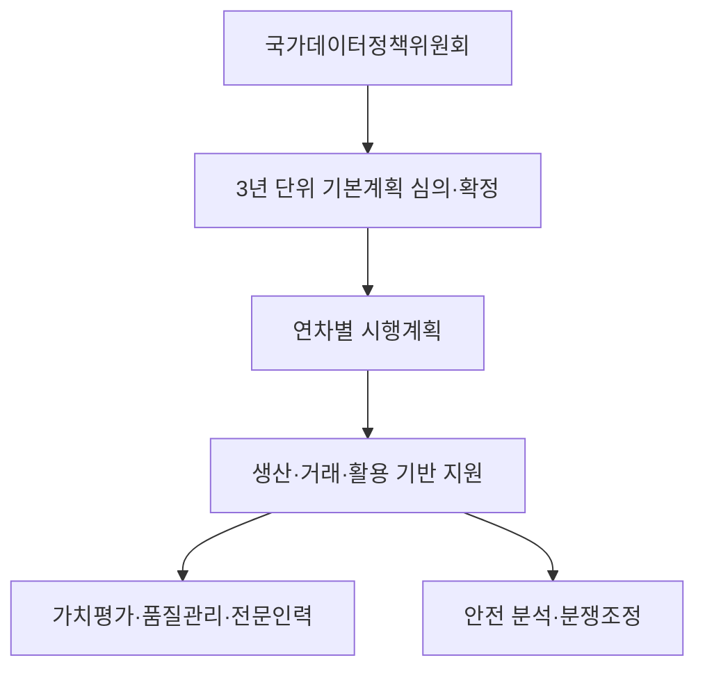
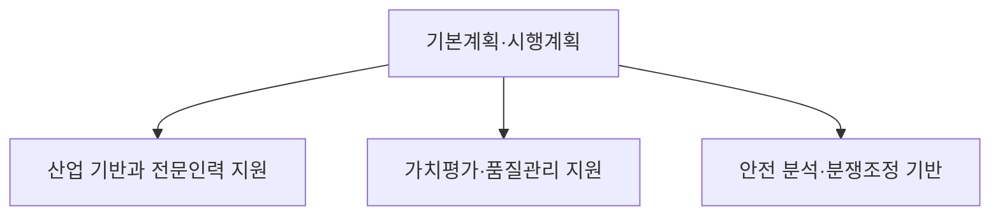
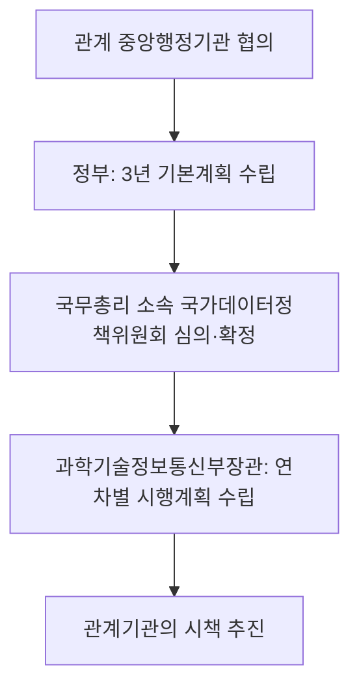
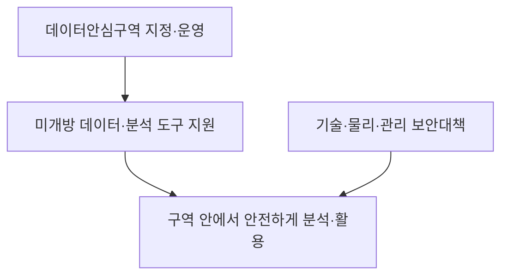

## 30초 인출
- **본질:** 데이터산업법은 데이터의 생산·거래·활용과 산업 기반을 지원하는 기본법이다.
- **메커니즘:** 3년 단위 기본계획과 국가데이터정책위원회를 중심으로 가치평가·품질관리·데이터거래사·안심구역·분쟁조정 제도를 운영한다. 데이터자산 보호는 상당한 투자·노력으로 생성된 데이터와 부정사용 방지에 한정된다.

핵심 용어

- **데이터자산:** 데이터생산자가 상당한 인적·물적 투자와 노력으로 만든 경제적 가치가 있는 데이터다.
- **데이터 가치평가기관:** 과학기술정보통신부장관이 데이터 가치평가를 전문적으로 수행하도록 지정할 수 있는 기관이다.
- **데이터거래사:** 법정 자격·교육 요건을 갖추어 장관에게 등록하고 데이터 거래 상담·자문·중개 등을 지원하는 사람이다.
- **데이터안심구역:** 데이터를 안전하게 분석·활용할 수 있도록 지정·운영하는 구역이다.

## 핵심 도해

---

## 1교시 예상문제 (10점)
> 데이터산업법의 목적과 주요 제도를 설명하시오. (예상)

---

## 1교시 10점 답안
### 1. 목적
**데이터산업법은 데이터에서 경제적 가치를 만들고 데이터산업 기반을 조성하기 위한 기본법이다.** 데이터의 생산·거래·활용과 전문인력·기업 육성을 지원하며, 개인정보·지식재산 등 기존 권리와 보호 법률을 대체하지 않는다.

### 2. 주요 제도
| 제도 | 기능 |
|---|---|
| 국가데이터정책위원회·기본계획 | 범정부 정책을 조정하고 3년 단위 기본계획을 심의 |
| 데이터자산 보호 | 상당한 투자·노력으로 생성된 데이터의 부정사용을 억제 |
| 가치평가·품질관리 | 데이터 거래와 활용에 필요한 평가·품질 기반을 지원 |
| 데이터거래사·안심구역 | 거래 전문인력과 안전 분석환경을 지원 |
| 분쟁조정 | 데이터 생산·거래·활용 관련 분쟁의 조정 절차 제공 |

**제언:** 데이터를 거래·활용할 때 개인정보·저작권·계약상 권리를 함께 확인한다.

---

## 2~4교시 예상문제 (25점)
> 제127회 4교시 4번: 최근 데이터 산업 발전을 위하여 「데이터 산업진흥 및 이용촉진에 관한 기본법」(약칭: 데이터산업법)을 제정하였다. 이 법의 목적 및 주요 내용과 기대 효과를 설명하시오.

---

## 2~4교시 25점 답안
## Ⅰ. 제정 목적과 적용 관점
**데이터산업법은 데이터의 생산·거래·활용을 촉진하고 데이터산업 기반을 조성하는 기본법이다.** 민간 데이터의 경제적·사회적 활용을 지원하되 개인정보 보호, 저작권 등 다른 법률에 따른 권리를 무효화하거나 포괄적인 데이터 소유권을 창설하지 않는다. 2021년 제정되어 2022년 4월 20일 시행되었다.

| 정책 목적 | 법의 지원 방향 |
|---|---|
| 데이터 생산·활용 | 데이터 생산과 정보분석 지원 |
| 거래 기반 | 데이터 유통·거래 기반과 전문인력 조성 |
| 산업 기반 | 데이터사업자·전문기업과 인력 육성 |
| 권리·신뢰 | 데이터자산 보호, 품질관리, 안전 분석 및 분쟁조정 |

## Ⅱ. 거버넌스와 계획
정부는 3년마다 데이터산업 진흥 기본계획을 수립하고 국가데이터정책위원회의 심의를 거쳐 확정한다. 과학기술정보통신부장관은 기본계획에 따른 연차별 시행계획을 수립하며, 위원회는 데이터 정책·계획과 집행실적 등을 심의한다.

위원회는 국무총리가 위원장이며 관계 중앙행정기관의 장과 민간 전문가 등으로 구성된다.

## Ⅲ. 데이터자산 보호와 권리 경계
데이터자산 보호 조항은 데이터생산자가 상당한 인적·물적 투자와 노력으로 생성한 경제적 가치가 있는 데이터를 보호 대상으로 삼는다. 타인의 데이터자산을 공정한 상거래 관행이나 경쟁질서에 반해 무단 취득·사용·공개하는 등 부정사용은 금지되며, 관련 사항은 부정경쟁방지법에 따른다.

| 보호되는 이익 | 법적 한계 |
|---|---|
| 상당한 투자·노력으로 생성된 경제적 가치 데이터의 부정사용 방지 | 데이터 일반에 배타적 소유권을 부여하는 규정은 아님 |
| 기술적 보호조치를 정당한 권한 없이 회피·제거·변경하는 행위 제한 | 개인정보·저작권·영업비밀 등은 각 해당 법률을 별도로 적용 |
| 데이터 생산자의 경제적 이익 보호 | 권리 귀속·이용 범위는 계약과 개별 법률을 함께 검토 |

## Ⅳ. 유통·거래와 지원 제도
법은 데이터 거래 기반 조성, 공공데이터를 제외한 데이터의 객관적 가치평가 기법·체계 수립·공표 지원, 가치평가기관 지정, 데이터 품질관리와 데이터거래사 등록 제도를 둔다. 가치평가는 거래·금융 등에서 활용하도록 지원하는 제도이지, 평가만으로 회계상 무형자산 인식이나 담보대출이 보장되는 것은 아니다.

| 제도 | 법에 따른 핵심 역할 |
|---|---|
| 가치평가 | 데이터 가치 평가기법·체계 마련과 거래·금융 활용 지원 |
| 가치평가기관 | 전문적인 평가를 위해 과학기술정보통신부장관이 지정 가능 |
| 품질인증 | 지정 인증기관이 데이터 품질인증을 실시할 수 있음 |
| 데이터거래사 | 요건·교육을 갖춰 등록하고 상담·자문·중개·알선 등 지원 |
| 유통시스템 | 거래 관련 정보와 평가·품질 정보를 관리·제공하는 기반 |

## Ⅴ. 안전한 분석 환경과 이용 지원
데이터안심구역은 누구든지 데이터를 안전하게 분석·활용할 수 있도록 과학기술정보통신부장관과 관계 중앙행정기관의 장이 지정·운영할 수 있다. 미개방 데이터와 분석 시스템·도구를 지원할 수 있으며, 데이터 유출 방지 등 보안대책을 마련해야 한다.

이 제도는 안전한 분석환경을 제공하는 근거다. 데이터가 어떤 상황에서도 외부 반출되지 않는다고 단정하지 말고, 구역별 운영·반출 기준과 데이터 제공자의 권한을 확인한다.

## Ⅵ. 분쟁조정과 다른 법률의 적용
데이터분쟁조정위원회는 데이터 생산·거래·활용 관련 분쟁의 조정을 담당한다. 다만 공공데이터 제공 거부·중단, 개인정보, 저작권 관련 분쟁은 각 해당 법률에 따른 절차를 적용한다.

| 분쟁 유형 | 우선 확인할 제도 |
|---|---|
| 민간 데이터 생산·거래·활용 | 데이터분쟁조정위원회 조정 대상 여부 |
| 공공데이터 제공 거부·중단 | 공공데이터 관련 법률상 절차 |
| 개인정보 처리·권리 | 개인정보 보호법상 구제·분쟁 절차 |
| 저작물 이용·권리 | 저작권법상 권리·분쟁 절차 |

## Ⅶ. 기대 효과와 한계
가치평가·품질관리·전문인력·안전 분석 기반은 데이터 거래의 신뢰와 활용을 높이는 데 기여할 수 있다. 그러나 제도 도입만으로 데이터 가격이 객관적으로 결정되거나 시장 거래·투자·금융이 자동 성립하지 않는다. 데이터 권리, 품질 목적적합성, 개인정보·저작권 및 계약 조건은 거래별로 확인해야 한다.

| 기대 효과 | 실현 조건 |
|---|---|
| 거래 상대 간 정보 비대칭 완화 | 평가기준·데이터 범위·전제와 한계를 함께 공개 |
| 데이터 품질 신뢰 지원 | 사용 목적에 맞는 품질 항목과 검증 자료 확인 |
| 분석·융합 활용 확대 | 적법한 이용권한, 개인정보·저작권 준수, 접근 통제 확보 |
| 데이터 전문인력 기반 조성 | 실제 거래 전문성과 등록 요건·교육 관리 |

## Ⅷ. 기술적 제언
| 문제 | 해결 방안 |
|---|---|
| 거래 데이터의 권리·출처가 불명확 | 출처·권한·이용조건을 메타데이터와 계약에 기록하고 거래 전 검증한다. |
| 평가액을 회계·금융 가치로 오해 | 평가 목적·가정·유효 범위를 명시하고 회계·금융 기준을 별도로 적용한다. |
| 품질인증을 모든 활용 목적에 대한 적합성 보증으로 오해 | 실제 분석 목적에 맞는 정확성·완전성·최신성 검증을 별도로 수행한다. |
| 안전 분석구역의 통제 범위를 과장 | 구역별 접근·분석·반출 절차와 개인정보·저작권상 이용 권한을 확인한다. |

## 출제 이력 및 검증 출처
- 출제 이력: 원문 노트에 제127회 4교시 4번으로 기록되어 있다. 시험 원문은 별도 대조하지 못했다.
- [데이터 산업진흥 및 이용촉진에 관한 기본법, 국가법령정보센터](https://law.go.kr/LSW/lsInfoP.do?lsiSeq=277325)
- [데이터산업법 제11조 데이터안심구역 지정, 국가법령정보센터](https://law.go.kr/lsLinkCommonInfo.do?chrClsCd=010202&lsJoLnkSeq=1025556481)
- [데이터산업법 제23조 데이터거래사 양성 지원, 국가법령정보센터](https://law.go.kr/lsLinkCommonInfo.do?lsJoLnkSeq=1017658309)
- [데이터산업법 제14조 가치평가기관 및 시행령, 국가법령정보센터](https://law.go.kr/LSW/lsLinkCommonInfo.do?chrClsCd=010202&lspttninfSeq=175047)
- [데이터산업법 제20조 데이터 품질인증, 국가법령정보센터 시행령](https://www.law.go.kr/LSW/lsInfoP.do?ancYnChk=0&chrClsCd=010202&efYd=20251223&lsiSeq=280559&urlMode=lsInfoP)
