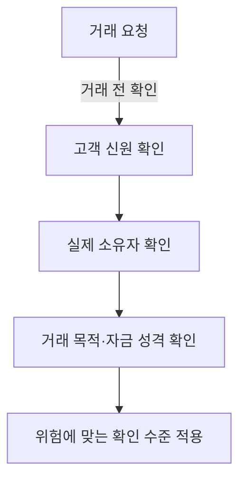
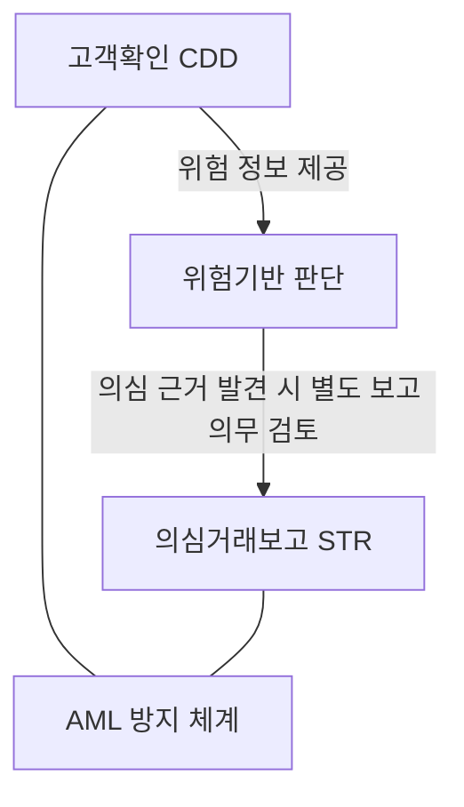
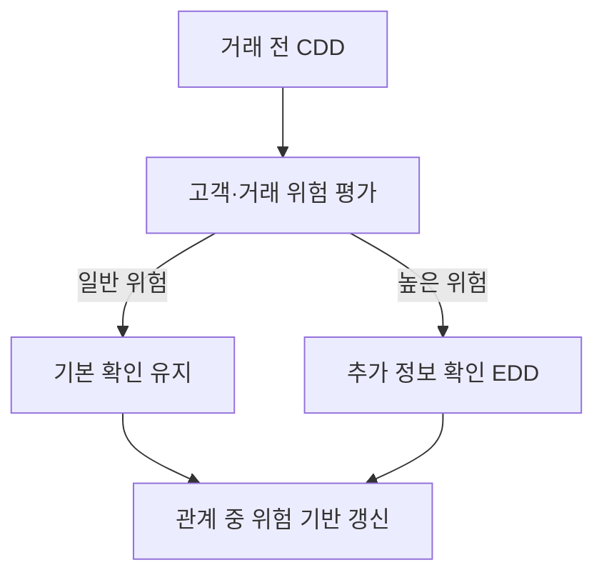
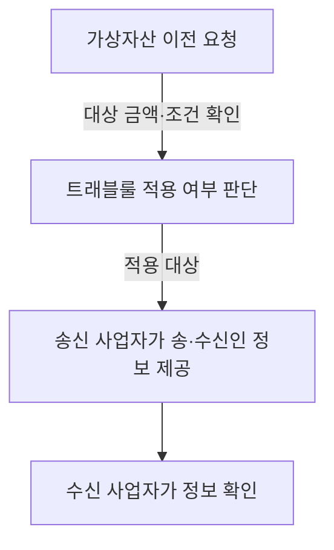

## 30초 인출

- **본질:** 고객확인(CDD)은 금융회사 등이 거래 상대방과 실제 소유자를 확인해 자금세탁·테러자금조달 위험을 관리하는 의무다.
- **메커니즘:** 거래 전 신원·실제 소유자·거래 목적 등을 확인하고, 위험에 따라 추가 확인과 지속 점검을 한다.
- **구분:** KYC/CDD는 고객과 거래의 위험을 파악하는 통제이고, AML은 CDD·의심거래보고(STR) 등을 포괄하는 방지 체계다.

핵심 용어

| 용어 | 뜻 |
|---|---|
| 고객확인(CDD) | 고객의 신원, 실제 소유자, 거래 목적 등을 확인하는 절차다. |
| 강화된 고객확인(EDD) | 위험이 높은 고객·거래에 추가 확인을 적용하는 절차다. |
| 위험기반접근(RBA) | 위험 수준에 따라 확인의 범위와 강도를 정하는 방식이다. |
| 전자 고객확인(eKYC) | 전자적 수단으로 고객확인을 수행하는 방식이다. OCR, 계좌 확인, 생체인증 등은 구현 수단의 예다. |
| 트래블룰 | 일정 가상자산 이전에서 가상자산사업자가 송·수신인 정보를 상대 사업자에게 제공하는 의무다. |

## 1교시 예상문제 (10점)

---

고객확인 절차(KYC: Know Your Customer)의 목적과 기본 확인 항목을 설명하시오. *(예상문제; 기출 개념을 바탕으로 재구성)*

---

## 1교시 10점 답안

### Ⅰ. 개념과 목적

고객확인(CDD)은 금융회사 등이 고객의 신원과 거래 관련 정보를 확인해 자금세탁 및 테러자금조달 위험을 낮추는 법정 의무다. 고객확인은 단순한 신분증 대조를 넘어 고객과 거래의 위험을 파악하는 출발점이다.

### Ⅱ. 확인 항목과 위험별 조치

고객의 실지명의, 실제 소유자, 거래 목적 등을 확인한다. 고위험으로 판단되면 위험에 맞춰 자금 출처 등 추가 정보를 확인하고, 거래 관계가 유지되는 동안에도 정해진 위험 기반 주기에 따라 정보를 갱신한다.

| 구분 | 확인의 초점 |
|---|---|
| 기본 고객확인(CDD) | 고객 신원, 실제 소유자, 거래 목적 등 |
| 강화 고객확인(EDD) | 고위험 고객·거래에 필요한 추가 정보와 근거 |

**제언:** 확인 항목과 주기를 위험 수준에 맞추고, 수집한 정보는 목적에 필요한 범위로 관리한다.

## 2~4교시 예상문제 (25점)

---

고객확인제도(KYC/CDD)의 목적과 확인 절차를 설명하고, 위험기반 강화확인 및 비대면 eKYC 운영 시 유의사항을 기술하시오. *(예상문제)*

---

## 2~4교시 25점 답안

### Ⅰ. 개념과 제도 목적

고객확인(CDD)은 금융회사 등이 고객 신원과 거래 정보를 확인해 금융거래의 자금세탁·테러자금조달 위험을 관리하는 의무다. 특정금융정보법은 고객확인과 의심거래보고 등 AML 의무의 근거를 둔다. CDD는 AML 체계 안에서 고객·거래 위험을 식별하는 통제다.

### Ⅱ. 확인 절차와 위험기반 강화

금융회사 등은 원칙적으로 거래 전에 고객확인을 수행한다. 고객과 거래의 위험을 평가하고, 위험이 높은 경우에는 추가 확인을 적용한다. 거래 관계가 계속되면 위험 수준에 따라 주기를 정해 확인 정보를 갱신하며, 정보의 진위나 타당성이 의심되면 다시 확인한다.

### Ⅲ. 비대면 eKYC와 준수 사항

eKYC는 전자적 수단을 활용한 고객확인 방식이며 특정 기술 조합을 일률적으로 뜻하지 않는다. 신분증 진위 확인, 계좌 확인, 영상·생체 확인 등은 업무 특성과 적용 규정에 따라 선택할 수 있는 수단이다. OCR만으로 고객의 실재성이나 실제 소유자를 확인했다고 단정할 수 없으므로, 확인 결과의 신뢰성과 위험을 함께 평가해야 한다.

| 운영 쟁점 | 적용 원칙 |
|---|---|
| 수단 선택 | 업무·고객 위험과 적용 규정에 맞는 확인 수단을 설계한다. |
| 정보 정확성 | 확인자료의 진위가 의심되면 신뢰 가능한 자료로 재확인한다. |
| 정보 관리 | 목적에 필요한 정보를 수집하고 접근·보존·폐기를 관리한다. |

### Ⅳ. AML 보고와 가상자산 이전

CDD는 STR과 같은 보고 행위와 구분한다. 의심거래보고는 거래가 자금세탁 등과 관련 있다고 의심할 합리적 근거가 있을 때 금융정보분석원에 보고하는 별도 의무다. 가상자산 트래블룰도 모든 KYC 정보를 거래소끼리 공유하는 제도가 아니라, 법령상 대상 이전에서 송·수신인 정보를 사업자 간 제공하는 의무다. 국내 사업자 간 100만 원 이상 이전에 관한 기준은 금융정보분석원 안내를 따른다.

**제언:** eKYC 수단의 편의성보다 확인자료의 신뢰도와 위험 기반 재확인 절차를 우선 설계한다.

## 출제 근거

- 제122회 1교시 10번: `고객확인 절차(KYC : Know Your Customer)`

## 찾아볼 것

- [특정 금융거래정보의 보고 및 이용 등에 관한 법률](https://www.law.go.kr/LSW/lsInfoP.do?lsiSeq=283365)
- [특정 금융거래정보의 보고 및 이용 등에 관한 법률 시행령](https://www.law.go.kr/LSW/lsInfoP.do?lsiSeq=288765)
- [금융정보분석원: 고객확인제도](https://www.kofiu.go.kr/kor/policy/amls05.do)
- [금융정보분석원: 가상자산 트래블룰 안내](https://www.kofiu.go.kr/kor/notification/report_view.do?ntcnYardOrdrNo=391&seCd=0001)
