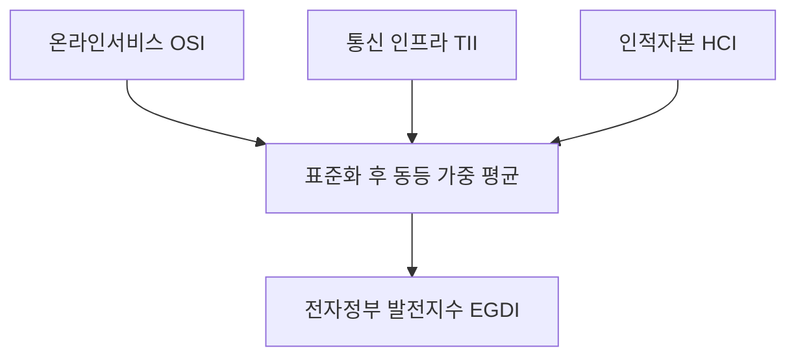
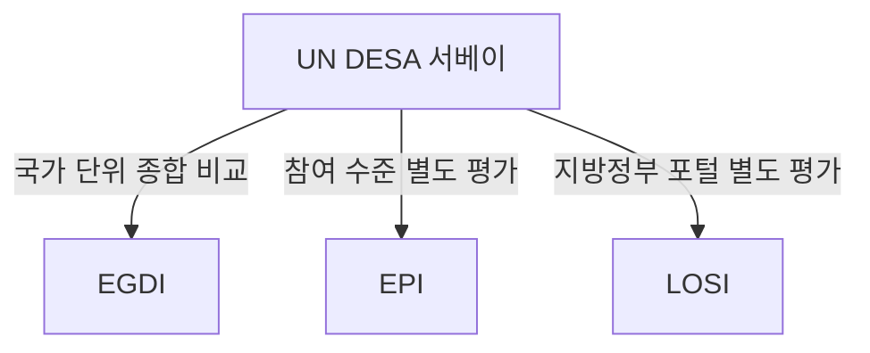
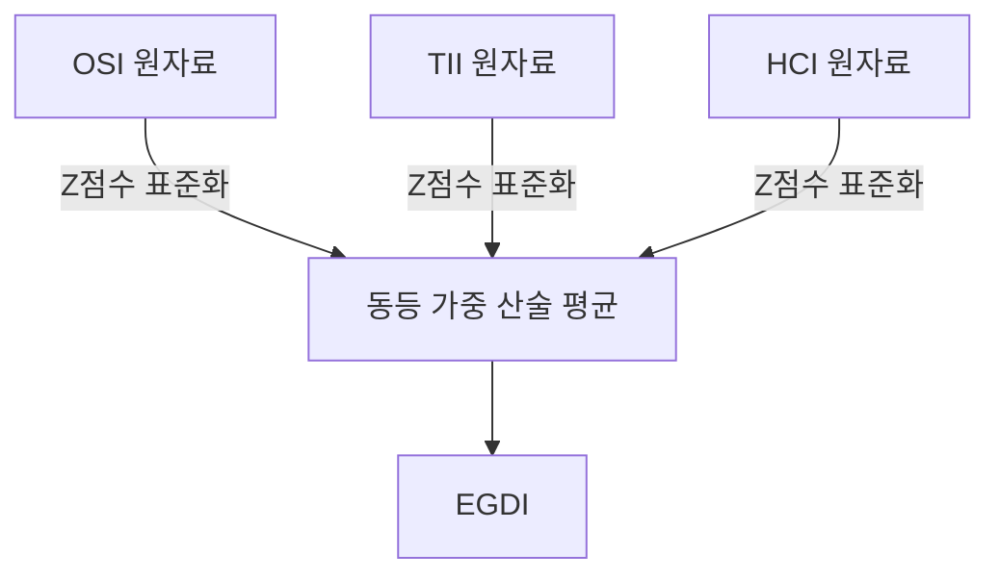
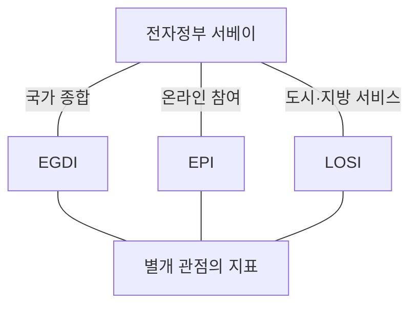

## 30초 인출

- **본질:** UN 전자정부 서베이는 193개 회원국의 디지털 정부 발전 수준을 비교하고 격차와 정책 과제를 살피는 격년 평가다.
- **산정:** EGDI는 표준화한 온라인서비스(OSI), 통신 인프라(TII), 인적자본(HCI) 지수의 동등 가중 평균이다.
- **구분:** 온라인 참여지수(EPI)와 도시 포털을 평가하는 지역 온라인서비스지수(LOSI)는 EGDI와 구별되는 평가다.
- **현행판:** 현재 공개된 최신판은 2024년판이다. 2026년판 평가 준비가 진행 중이라는 UN 자료가 있으나, 공개 결과로 혼동하지 않는다.

핵심 용어

| 용어 | 뜻 |
|---|---|
| EGDI | OSI·TII·HCI를 표준화해 동등 가중으로 합산한 국가 단위 종합지수다. |
| OSI | 국가 온라인 공공서비스의 범위와 품질을 평가하는 지수다. |
| TII | 통신 인프라의 발전 수준을 나타내는 지수다. |
| HCI | 전자정부 이용·발전을 뒷받침하는 인적자본 수준을 나타내는 지수다. |
| EPI | 정부의 온라인 정보 제공, 협의, 의사결정 참여 수준을 별도로 평가한다. |
| LOSI | 지방정부의 온라인 서비스와 도시 포털을 평가하는 지수다. |

## 1교시 예상문제 (10점)

---

UN 전자정부 서베이의 목적과 전자정부 발전지수(EGDI)의 구성요소를 설명하시오. *(예상문제)*

---

## 1교시 10점 답안

### Ⅰ. 목적

UN 전자정부 서베이는 UN 경제사회국(UN DESA)이 193개 회원국의 디지털 정부 발전 수준을 격년으로 평가하는 조사다. 각국의 상대적 위치를 비교하고 디지털 정부의 발전 과제와 격차를 파악하는 데 활용한다.

### Ⅱ. EGDI 구성 및 산정

EGDI는 세 구성 지수를 표준화한 뒤 같은 비중으로 평균한 종합지수다. 따라서 온라인 서비스만으로 국가의 전자정부 수준을 설명하지 않으며, 통신 기반과 이를 이용할 인적 역량도 함께 본다.

| 지수 | 평가 대상 |
|---|---|
| OSI | 온라인 공공서비스의 범위와 품질 |
| TII | 통신 인프라 |
| HCI | 인적자본 |

**제언:** 순위보다 세 구성 지수의 강·약점을 진단해 서비스, 기반, 역량을 함께 개선한다.

## 2~4교시 예상문제 (25점)

---

국제연합(UN)은 매 2년마다 전체 회원국을 대상으로 전자정부 평가를 실시한다. 전자정부 평가의 산정 방식과 구성요소를 설명하고 한국의 발전방향을 기술하시오. *(제127회 2교시 1번 기출)*

---

## 2~4교시 25점 답안

### Ⅰ. 평가 개요

UN DESA의 전자정부 서베이는 193개 회원국의 국가 디지털 정부를 격년으로 비교한다. 국가 단위 EGDI를 중심으로 온라인 참여(EPI)와 지방정부 온라인 서비스(LOSI)도 별도로 다뤄, 서비스 제공과 디지털 포용의 수준을 살핀다. 공개된 최신판은 2024년판이다.

### Ⅱ. EGDI 산정 방식

EGDI는 OSI, TII, HCI의 표준화 값을 같은 비중으로 산술 평균한다. 각 구성 지수는 따로 분석할 수 있어 종합 순위와 함께 어느 영역이 발전을 견인하거나 제약하는지 진단할 수 있다.

| 구성요소 | 핵심 관점 |
|---|---|
| OSI | 온라인 서비스의 범위와 품질 |
| TII | 통신 연결 기반 |
| HCI | 디지털 정부를 활용할 인적 역량 |

### Ⅲ. 관련 지표와 해석

EPI는 전자정보 제공, 온라인 협의, 의사결정 참여 등 정부의 전자적 참여 기회를 평가한다. LOSI는 지방정부·도시 포털을 대상으로 지역 단위 온라인 서비스 수준을 본다. 둘 다 전자정부 서베이에 포함되지만 EGDI의 세 구성 지수에 더해지는 항목은 아니다.

### Ⅳ. 한국의 발전방향

한국은 지수 순위 관리에 그치지 않고 실제 이용자의 접근성과 서비스 결과를 개선해야 한다. 특히 고령자·장애인·이주민 등 다양한 이용자의 접근성, 지역 간 서비스 격차, 연결 기반과 디지털 활용 역량을 함께 점검한다. AI 등 신기술을 적용할 때도 서비스의 공정성, 설명 가능성, 개인정보 보호를 갖춰야 한다.

| 과제 | 발전방향 |
|---|---|
| 순위 중심 운영 | 이용자 경험과 서비스 효과를 함께 측정한다. |
| 디지털 접근 격차 | 접근성 표준과 보조 수단을 제공하고 취약 이용자 관점에서 점검한다. |
| 중앙·지역 역량 편차 | 지방정부의 서비스 개선과 기반·인력 역량 강화를 지원한다. |

**제언:** 한국은 순위보다 포용성·이용 성과·지역 역량을 함께 높이는 디지털 정부 정책을 추진한다.

## 출제 근거

- 제127회 2교시 1번: 국제연합 전자정부 평가의 산정 방식, 구성요소, 한국의 발전방향

## 찾아볼 것

- [UN DESA, UN E-Government Survey 2024](https://desapublications.un.org/publications/un-e-government-survey-2024)
- [UN E-Government Survey 2024 Technical Appendix](https://desapublications.un.org/sites/default/files/publications/2024-09/Technical%20Appendix%20%28Web%20version%29%201292024.pdf)
