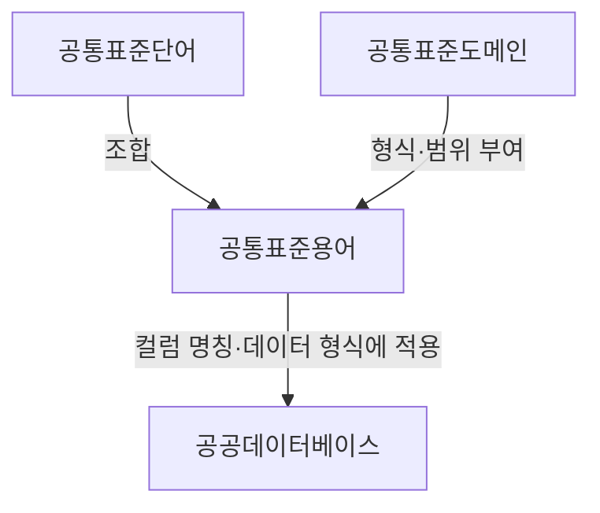
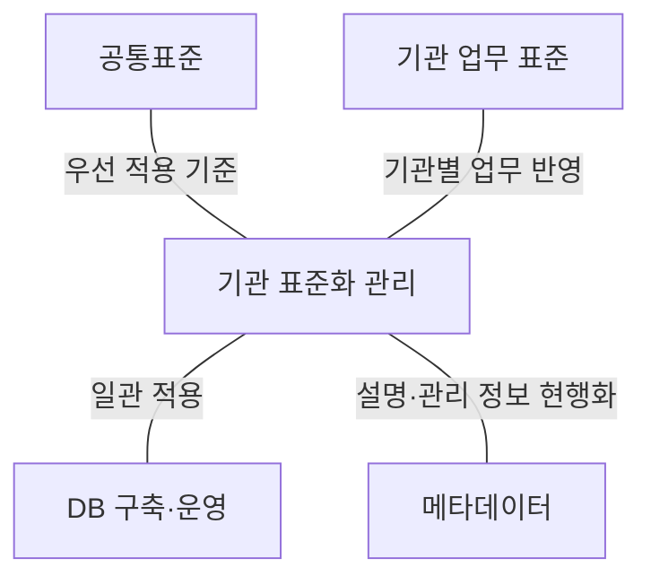
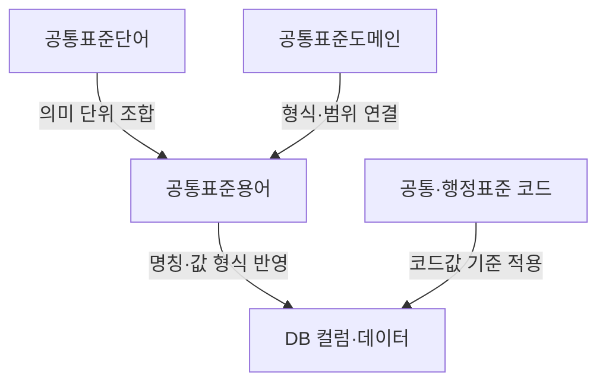
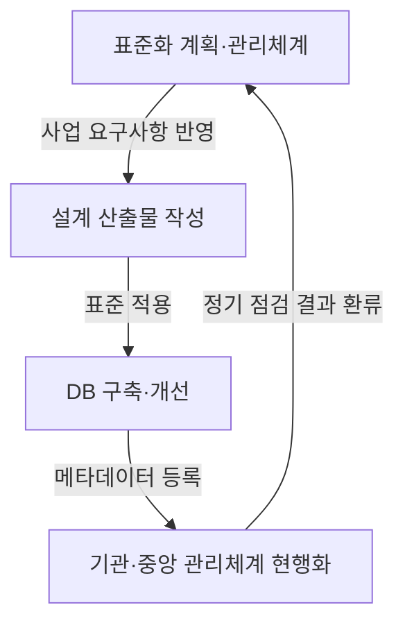

## 30초 인출

- **본질:** 공공데이터베이스 표준화는 공통·기관 표준을 데이터베이스에 일관되게 적용해 데이터의 이해와 연계를 돕는 관리 활동이다.
- **핵심:** 표준용어·단어·도메인·코드와 메타데이터·데이터셋을 관리한다. 공통표준용어는 공통표준단어와 공통표준도메인의 조합이다.
- **절차:** 표준을 정하고 설계 산출물과 DB에 적용한 뒤, 메타데이터를 등록·현행화하고 정기 점검한다.
- **현행:** 2023년 출제 당시 매뉴얼은 2026년 4월 개정본으로 갱신되었다. 적용 시 현행 지침과 매뉴얼을 확인한다.

핵심 용어

| 용어 | 뜻 |
|---|---|
| 공공데이터 표준화 | 코드·용어·도메인·메타데이터·데이터셋 표준을 공공데이터베이스에 일관되게 적용하는 활동이다. |
| 공통표준용어 | 공통표준단어와 공통표준도메인을 조합해 컬럼 명칭, 형식, 범위를 정하는 기준이다. |
| 기관표준 | 공공기관이 소관 업무에 맞춰 정하고 내부 DB에 일관되게 적용하는 표준이다. |
| 메타데이터 | 데이터의 의미·구조·관리 정보를 설명해 검색과 연계를 돕는 정보다. |

## 1교시 예상문제 (10점)

---

공공데이터베이스 표준화 관리 매뉴얼의 목적과 주요 표준 요소를 설명하시오. *(예상문제; 제132회 기출 주제를 바탕으로 재구성)*

---

## 1교시 10점 답안

### Ⅰ. 목적

공공데이터베이스 표준화는 공공기관이 관리하는 데이터의 명칭과 형식 등을 일관되게 적용해 기관 간 이해·검색·연계를 돕는 활동이다. 관리 매뉴얼은 공통표준과 기관표준을 업무와 DB에 적용하는 기준·절차를 안내한다.

### Ⅱ. 표준 요소

공통표준용어는 표준단어와 표준도메인을 조합한다. 공공기관의 데이터베이스 표준화는 용어 외에도 코드, 메타데이터, 데이터셋 등을 포함한다.

| 요소 | 역할 |
|---|---|
| 용어·단어 | 데이터 의미와 컬럼 명칭을 일관되게 표현 |
| 도메인 | 데이터 형식과 허용 범위를 정함 |
| 코드 | 공통으로 쓰는 코드값과 의미를 맞춤 |
| 메타데이터·데이터셋 | 데이터의 설명·관리와 연계를 지원 |

**제언:** 신규 DB 설계부터 공통표준을 반영하고, 운영 중인 DB도 정기적으로 적용 현황을 점검한다.

## 2~4교시 예상문제 (25점)

---

‘공공데이터 베이스표준화 관리매뉴얼(2023.04.)’을 마련하여 예방적 품질관리 기준을 제시하고 있다. 이와 관련하여 매뉴얼의 목적, 표준화 요소 및 이행 절차를 설명하시오. *(제132회 4교시 2번 기출; 질문 표현은 원문을 기준으로 띄어쓰기만 정리)*

---

## 2~4교시 25점 답안

### Ⅰ. 목적과 적용 관점

공공데이터베이스 표준화는 코드·용어·도메인·메타데이터·데이터셋의 표준을 수립해 DB에 일관되게 적용하는 활동이다. 표준화 관리 매뉴얼은 기관이 데이터베이스를 구축·운영하고 메타데이터를 등록·관리할 때 따를 기준과 절차를 안내한다. 출제 당시의 2023년 4월판 이후 2026년 4월 개정본이 공개되었으므로 실무에는 현행본을 적용한다.

### Ⅱ. 주요 표준화 요소

공공기관은 공통표준을 우선 적용하고 업무 특성에 필요한 기관표준을 함께 관리한다. 공통표준용어는 공통표준단어와 공통표준도메인의 조합으로 구성되며, DB 컬럼 명칭과 데이터 형식·범위를 정하는 데 활용된다.

| 관리 요소 | 관리 내용 |
|---|---|
| 표준용어·단어 | 명칭, 의미, 영문 약어 등 |
| 표준도메인 | 데이터 형식과 허용 범위 |
| 표준코드 | 코드명, 코드값, 적용 범위 |
| 메타데이터·데이터셋 | 구조·설명·관리 정보의 등록과 현행화 |

### Ⅲ. 표준화 이행과 점검

기관은 표준화 관리체계와 연간 계획을 마련하고, 시스템 구축·고도화 과정에서 공통·기관 표준을 산출물과 DB에 반영한다. 메타데이터를 기관·중앙 관리체계에 등록하고 최신 상태로 관리하며, 표준 적용 수준을 정기적으로 점검해 개선한다. 기존 DB를 즉시 재구축하기 어려운 경우에는 표준 데이터와 연결할 수 있도록 비표준 매핑 정보를 관리하고, 개선·재구축 때 표준을 적용한다.

### Ⅳ. 기대효과와 유의점

표준은 데이터 의미와 형식의 차이를 줄여 검색·결합·공동활용을 돕는다. 표준을 사후에 맞추면 매핑과 변경 비용이 커질 수 있으므로, 업무 담당자와 데이터 담당자가 설계 단계부터 용어·도메인·코드의 의미를 함께 검토해야 한다. 기관 고유 업무를 이유로 공통표준과 다른 항목이 필요하면 근거와 매핑을 관리하고, 표준 변경 영향도 확인한다.

| 개선 과제 | 적용 방향 |
|---|---|
| 신규·고도화 사업의 표준 누락 | 발주·설계 단계에서 요구사항과 산출물을 확인 |
| 기존 데이터 불일치 | 매핑 정보를 관리하고 개선 시 표준 적용 |
| 표준의 최신성 저하 | 변경 이력과 메타데이터를 함께 현행화 |

**제언:** 사업 기획·설계 단계의 표준 검토와 운영 단계의 메타데이터 점검을 연계해 데이터 품질을 관리한다.

## 출제 근거

- 제132회 4교시 2번: 공공데이터베이스 표준화 관리 매뉴얼의 예방적 품질관리 기준

## 찾아볼 것

- [공공데이터베이스 표준화 관리 매뉴얼 개정본(2026년 4월), 한국지능정보사회진흥원](https://www.nia.or.kr/site/nia_kor/ex/bbs/View.do?bcIdx=29316&cbIdx=27974)
- [공공기관의 데이터베이스 표준화 지침(행정안전부고시 제2025-19호)](https://www.law.go.kr/admRulInfoP.do?admRulSeq=2100000255382&chrClsCd=010201)
