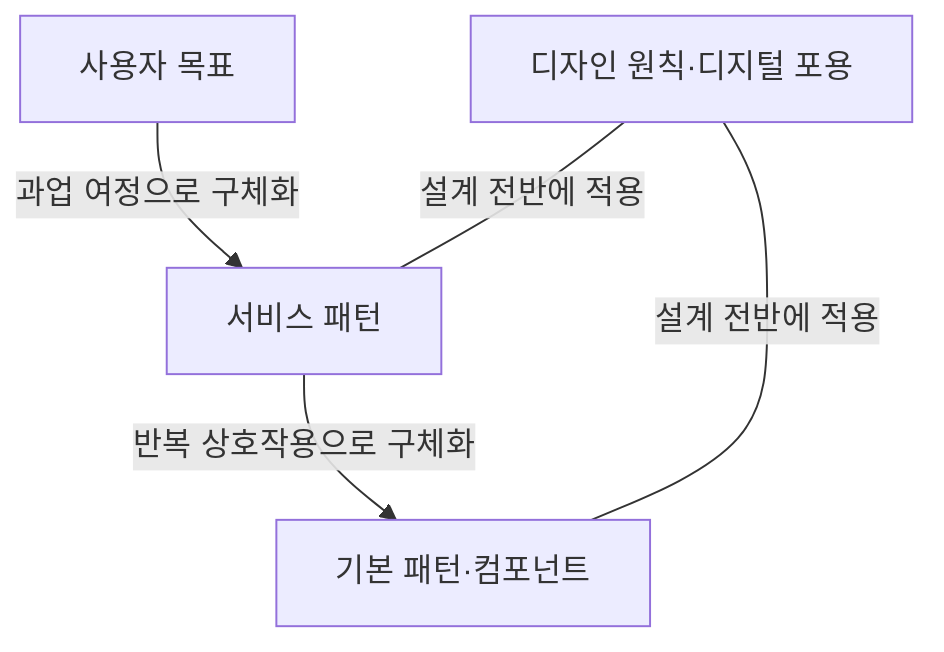
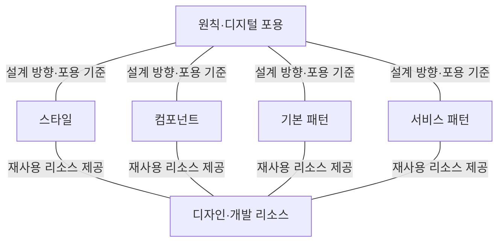
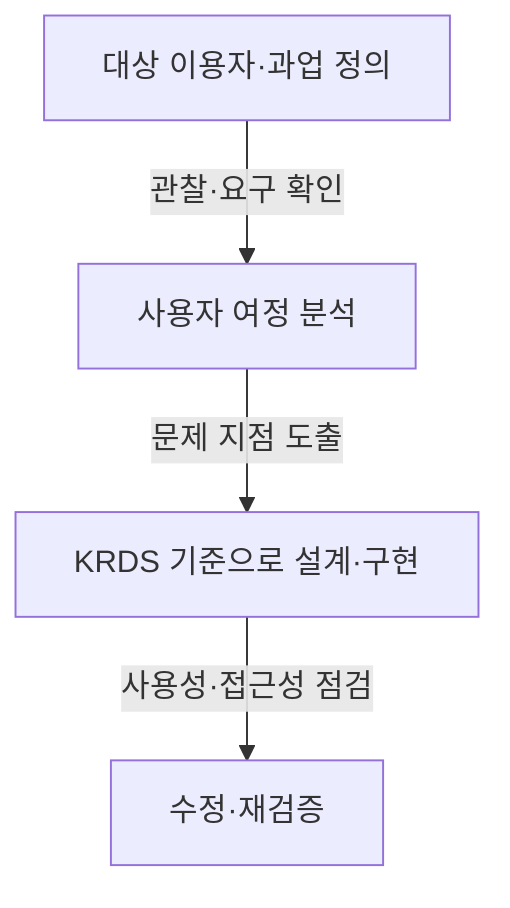

## 30초 인출

- **본질:** 디지털 정부서비스 UI/UX 가이드라인은 국민이 웹·앱에서 목적을 쉽게 달성하도록 공통 원칙과 설계 기준을 제공한다.
- **메커니즘:** 사용자를 이해하고, 여정의 문제를 찾아, 원칙·스타일·컴포넌트·패턴에 따라 설계한 뒤 실제 이용으로 검증한다.
- **현행판:** 행정안전부는 2025년 8월 수정본을 배포했다. 범정부 디자인 시스템 KRDS에서 지침과 디자인·개발 리소스를 제공한다.

핵심 용어

| 용어 | 뜻 |
|---|---|
| 사용자 경험(UX) | 서비스를 이용하며 목적을 찾고 수행하는 전 과정의 경험이다. |
| 사용자 인터페이스(UI) | 사용자가 서비스와 상호작용하는 화면과 조작 요소다. |
| KRDS | 공공 웹·앱의 일관된 설계와 구현을 돕는 범정부 디자인 시스템이다. |
| 서비스 패턴 | 핵심 과업의 사용자 여정과 화면 흐름을 설계하는 재사용 가능한 기준이다. |

## 1교시 예상문제 (10점)

---

디지털 정부서비스 UI/UX 가이드라인의 목적과 주요 구성요소를 설명하시오. *(예상문제; 제133회 기출 주제를 바탕으로 재구성)*

---

## 1교시 10점 답안

### Ⅰ. 목적

디지털 정부서비스 UI/UX 가이드라인은 국민이 공공 웹·앱에서 필요한 정보를 이해하고 과업을 마치도록 공통 원칙과 설계 기준을 제시한다. 기관별로 달랐던 사용 경험을 개선하면서 서비스별 목적과 이용자 차이도 반영한다.

### Ⅱ. 구성요소

KRDS는 상위 설계 원칙과 이를 구현하는 스타일, 컴포넌트, 기본 패턴, 서비스 패턴을 제공한다. 접근성·사용성 점검 기준과 예시 리소스도 함께 활용한다.

| 구성요소 | 역할 |
|---|---|
| 스타일 | 색상·서체·형태 등 시각 표현 기준 |
| 컴포넌트 | 반복 사용하는 UI 요소 기준 |
| 기본 패턴 | 입력·동의·오류 등 반복 과업 기준 |
| 서비스 패턴 | 방문·검색·신청 등 핵심 서비스 흐름 기준 |

**제언:** 새로 만들거나 개선하는 공공 웹·앱은 현행 KRDS 리소스를 검토하고 실제 이용자 관점에서 확인한다.

## 2~4교시 예상문제 (25점)

---

‘디지털정부서비스UI/UX가이드라인’(2024.2, 행정안전부)은 디지털서비스를 구성하는 사용자 인터페이스(User Interface; UI)와 사용자 경험(User Experience; UX) 품질에 큰 영향을 주는 요소에 대하여 행정기관 및 공공기관이 준수해야 할 세부사항을 제시한다. 이와 관련하여 다음을 설명하시오. *(제133회 2교시 2번 기출)*

---

## 2~4교시 25점 답안

### Ⅰ. 목적과 기본 원칙

디지털 정부서비스 UI/UX 가이드라인은 사용자 경험과 만족도를 높이고 공공서비스의 설계·개발 기준을 제공한다. 현행 공개본은 행정안전부가 배포한 2025년 8월 수정본이며, 공공 웹사이트와 모바일 앱의 UI/UX 구현에 활용한다.

핵심 원칙은 사용자 중심, 포용성, 공통된 경험과 서비스별 특성의 조화, 간결한 이용, 이해하기 쉬운 상호작용, 다양한 이용 상황의 고려, 신뢰성이다.

| 원칙 | 설계 초점 |
|---|---|
| 사용자 중심·포용 | 다양한 이용자의 목표와 접근 필요를 반영 |
| 일관성과 개별성 | 공통된 경험을 주면서 서비스 맥락을 살림 |
| 간결·이해 용이 | 불필요한 행동을 줄이고 오류를 쉽게 바로잡도록 함 |
| 상황·신뢰 고려 | 이용 환경을 반영하고 공식성·정보 최신성을 유지 |

### Ⅱ. 가이드라인 구성

가이드라인은 원칙에서 구체적 UI 요소와 업무 흐름까지 단계별 기준을 제공한다. 일관된 기준은 반복 사용 요소를 재사용하게 돕지만, 서비스의 이용자·목표에 맞게 적용해야 한다.

### Ⅲ. 적용과 검증

기관은 서비스 이용자와 과업을 파악해 여정에서 막히는 지점을 찾는다. KRDS의 디자인 라이브러리, 디자인 토큰, HTML 컴포넌트 리소스를 활용해 화면과 상호작용을 설계하고, 사용성·접근성 기준에 따라 구현과 이용자 경험을 검증한다. 웹 접근성은 UI/UX 설계와 함께 별도의 웹사이트 품질 기준으로 확인하며, 가이드라인 적용만으로 접근성 인증이나 품질 확보가 자동 보장되는 것은 아니다.

### Ⅳ. 적용 시 유의점

공통 기준을 적용하되 모든 서비스를 같은 화면으로 만들지는 않는다. 기관의 역할, 과업, 이용 환경을 반영하고 장애인·고령자·어린이·외국인 등 다양한 이용자가 목적을 달성할 수 있는 대안을 제공한다. 시행 후에는 실제 오류와 이용자 피드백을 바탕으로 지속 개선한다.

| 개선 과제 | 적용 방향 |
|---|---|
| 기관별 경험의 차이 | 공통 컴포넌트·패턴으로 일관성을 높이되 서비스별 맥락 반영 |
| 특정 이용자 배제 | 초기 설계부터 다양한 이용 환경을 시험하고 대안 제공 |
| 화면의 형식적 준수 | 과업 성공 여부와 이용자 피드백으로 효과 확인 |

**제언:** KRDS를 재사용 가능한 출발점으로 삼고, 서비스별 사용자 여정과 접근성 검증 결과에 따라 개선한다.

## 출제 근거

- 제133회 2교시 2번: 디지털 정부서비스 UI/UX 가이드라인의 주요 품질 요소

## 찾아볼 것

- [행정안전부, 디지털 정부서비스 UI/UX 가이드라인 수정본(2025년 8월)](https://www.mois.go.kr/frt/bbs/type001/commonSelectBoardArticle.do?bbsId=BBSMSTR_000000000045&nttId=120220)
- [KRDS 디자인 원칙](https://www.krds.go.kr/html/site/utility/utility_02.html)
- [KRDS 시작하기 및 구성](https://www.krds.go.kr/html/site/outline/outline_01.html)
- [행정안전부, 전자정부 웹사이트 품질관리 지침 개정 안내](https://mois.go.kr/frt/bbs/type001/commonSelectBoardArticle.do?bbsId=BBSMSTR_000000000016&nttId=118636)
