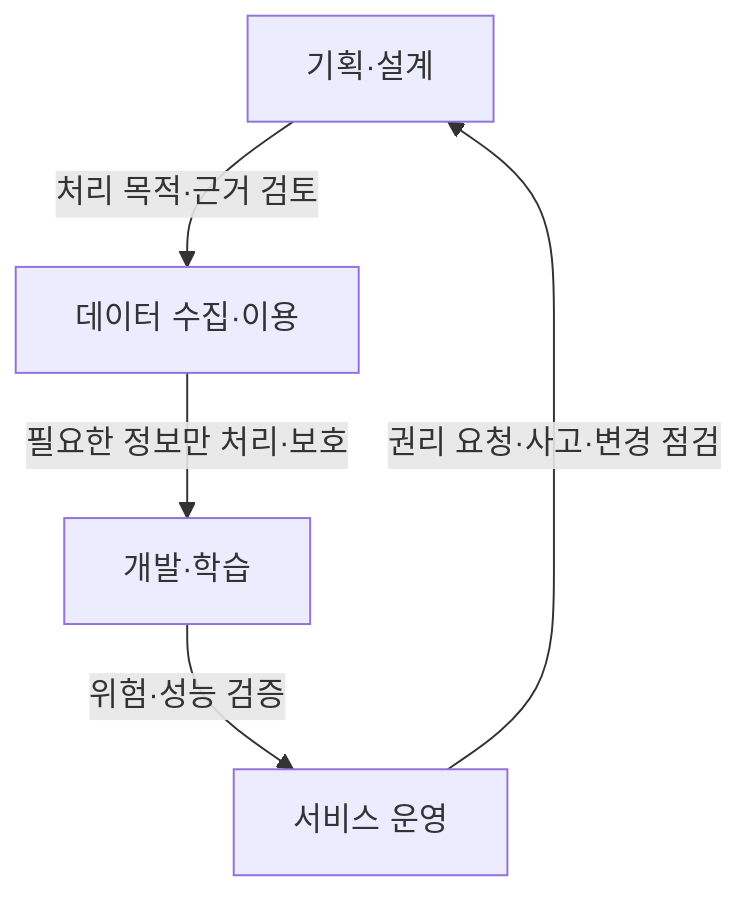
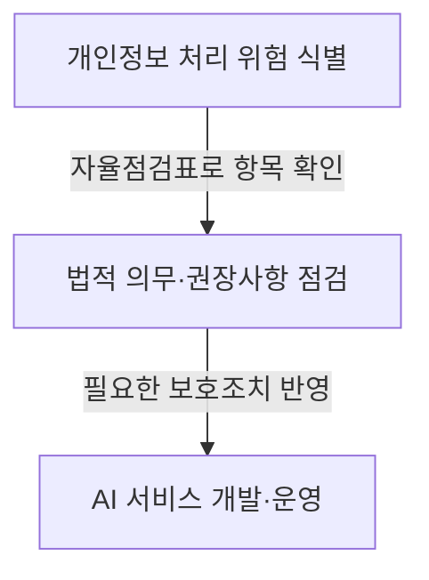
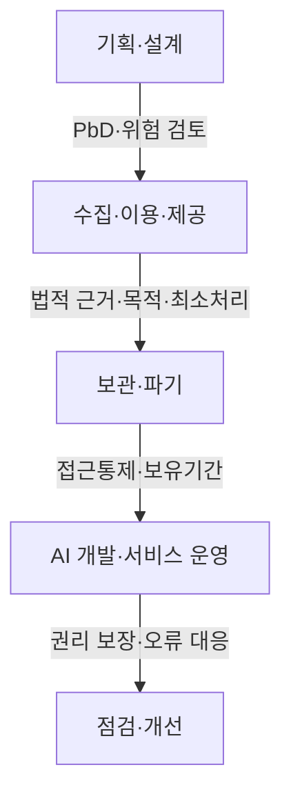

## 30초 인출

- **본질:** AI 개인정보보호 자율점검표는 개발자·운영자가 AI 업무 전 과정의 개인정보 처리 위험과 준수사항을 스스로 확인하는 안내서다.
- **구성:** 개인정보보호위원회가 2021년 공개한 자료는 6대 원칙, 16개 점검항목, 54개 확인사항으로 구성된다.
- **메커니즘:** 기획·설계부터 수집·이용·학습·서비스 운영까지 적법한 처리, 안전조치, 정보주체 권리를 확인하고 위험을 줄인다.
- **현행 적용:** 자율점검표는 법령 자체가 아니므로 현재 개인정보 보호법과 2024~2025년 AI 안내서·위험관리 자료를 함께 확인한다.

핵심 용어

| 용어 | 뜻 |
|---|---|
| AI 개인정보보호 자율점검표 | AI 업무에서 개인정보 보호 의무·권장사항을 단계별로 자율 확인하는 안내서다. |
| 프라이버시 중심 설계(PbD) | 기획·설계 단계부터 개인정보 보호를 시스템과 업무에 반영하는 접근이다. |
| 개인정보 영향평가(PIA) | 법에서 정한 공공기관의 대상 개인정보파일에 대해 침해 위험을 평가하는 제도다. |
| 자동화된 결정 | 완전히 자동화된 시스템으로 개인정보를 처리해 내리는 결정이다. 행정청의 자동적 처분은 제외되며, 거부권 등은 권리·의무에 중대한 영향을 주는 경우 등 법 요건에 따른다. |

## 1교시 예상문제 (10점)

---

인공지능(AI) 개인정보보호 자율점검표의 목적과 주요 원칙을 설명하시오. *(예상문제; 제125회 기출 주제를 바탕으로 재구성)*

---

## 1교시 10점 답안

### Ⅰ. 목적과 성격

AI 개인정보보호 자율점검표는 개발자·운영자가 개인정보 침해 위험과 관련 법상 주요 의무를 업무 단계별로 확인하도록 개인정보보호위원회가 공개한 안내서다. 2021년 공개본은 자율점검 수단이며, 법령을 대신하거나 그 자체로 모든 서비스의 준수를 보장하지 않는다.

### Ⅱ. 원칙과 적용

2021년 점검표는 적법성, 안전성, 투명성, 참여성, 책임성, 공정성의 6대 원칙과 이를 점검하는 항목·확인사항을 제시한다. 조직은 이를 기준으로 처리 근거, 최소 수집, 안전조치, 이용자 권리와 편향 위험을 살핀다.

**제언:** 2021년 체크리스트를 현재 법령과 최신 생성형 AI 안내서에 맞춰 보완해 사용한다.

## 2~4교시 예상문제 (25점)

---

인공지능(AI) 기술이 확산됨에 따라 개인정보 침해 등 다양한 사회적 문제 발생 우려가 높아졌다. 이를 대응하기 위하여 개인정보보호위원회에서 인공지능(AI) 개인정보보호 자율점검표를 확정하였다. 인공지능(AI) 개인정보보호 자율점검표의 원칙과 생애주기별 주요 점검사항을 설명하시오. *(제125회 3교시 4번 기출)*

---

## 2~4교시 25점 답안

### Ⅰ. 제도의 목적과 성격

AI 개인정보보호 자율점검표는 AI 설계·개발·운영에서 개인정보를 안전하게 처리하도록 개인정보보호법상 주요 의무와 권장사항을 단계별로 확인하는 안내서다. 개인정보보호위원회는 2021년 개발자·운영자용 자료를 공개했으며, 이 자료는 6개 원칙, 16개 점검항목, 54개 확인사항으로 구성된다. 자율점검은 법적 의무를 대신하지 않는다.

### Ⅱ. 6대 원칙

점검표의 원칙은 AI 생애주기 전반에서 개인정보 처리의 적법성·안전성과 이용자 보호를 확인하기 위한 기준이다.

| 원칙 | 핵심 확인 관점 |
|---|---|
| 적법성 | 처리 목적과 법적 근거를 확인 |
| 안전성 | 유출·노출·해킹 방지 및 안전한 파기 |
| 투명성 | 처리 사실과 관련 정보를 알기 쉽게 공개 |
| 참여성 | 열람·정정·삭제·처리정지 등 권리행사 보장 |
| 책임성 | 처리 주체와 위탁·관리 책임을 명확히 함 |
| 공정성 | 차별·편향으로 인한 부당한 결과를 점검 |

### Ⅲ. 생애주기별 점검사항

기획·설계에서부터 처리 근거와 위험을 살피고, 개인정보를 수집·이용할 때 목적과 범위를 확인한다. 보관·파기와 접근통제를 정하며, AI 개발·운영 단계에서는 개인정보가 과도하게 노출되지 않는지, 이용자 권리와 이의제기 절차가 마련됐는지 점검한다.

| 단계 | 점검 핵심 |
|---|---|
| 기획·설계 | 처리 목적·근거, 최소처리, 위험 검토, PbD |
| 수집·이용·제공 | 동의 또는 다른 적법 근거, 목적 내 처리, 공개정보 수집의 적법성 |
| 보관·파기 | 보유기간, 접근권한, 안전조치, 파기 절차 |
| 개발·서비스 운영 | 데이터 노출·편향 위험, 처리방침, 권리행사·침해 대응 |

### Ⅳ. 현행 법·지침과 함께 적용

자율점검표는 2021년 자료이므로 이후의 법령과 기술 변화에 맞춰 함께 확인할 자료가 있다. 개인정보보호위원회는 2024년 공개 데이터 처리 안내서와 AI 프라이버시 리스크 관리 모델, 2025년 생성형 AI 개인정보 처리 안내서를 공개했다.

자동화된 결정에 대한 거부·설명 권리는 모든 AI 사용에 일괄 적용되는 것이 아니다. 개인정보 보호법 제37조의2는 완전히 자동화된 시스템에 의한 결정이 정보주체의 권리 또는 의무에 중대한 영향을 미치는 경우 등을 규정하며, 법정 예외와 후속 조치 요건을 함께 확인해야 한다. 개인정보 영향평가도 모든 공공 AI 사업의 일반 의무라고 단정할 수 없으며, 법령상 대상과 조건에 해당하는지 판단한다.

| 적용 자료 | 점검 목적 |
|---|---|
| 2021년 자율점검표 | 기본 원칙과 생애주기별 확인항목 참고 |
| 현행 개인정보 보호법 | 법적 근거·안전조치·정보주체 권리 판단 |
| 최신 AI 처리 안내서·리스크 모델 | 공개데이터·생성형 AI 등 구체적 위험과 처리 기준 확인 |

**제언:** 조직별 점검표를 최신 법령·AI 안내서와 연계하고, 고위험 처리에는 책임자 검토와 기록을 남긴다.

## 출제 근거

- 제125회 3교시 4번: AI 개인정보보호 자율점검표의 원칙과 생애주기별 주요 점검사항

## 찾아볼 것

- [개인정보보호위원회, AI 개인정보보호 자율점검표(2021년 5월)](https://pipc.go.kr/np/cop/bbs/selectBoardArticle.do?bbsId=BS074&mCode=C020000000&nttId=7348)
- [개인정보보호위원회, 생성형 AI 개발·활용 개인정보 처리 안내서(2025년 8월)](https://pipc.go.kr/np/cop/bbs/selectBoardArticle.do?bbsId=BS074&mCode=C020010000&nttId=11410)
- [개인정보보호위원회, AI 프라이버시 리스크 관리 모델(2024년 12월 자료실)](https://pipc.go.kr/np/cop/bbs/selectBoardList.do?bbsId=BS289&mCode=D040070000)
- [개인정보 보호법 제37조의2: 자동화된 결정에 대한 정보주체의 권리](https://www.law.go.kr/LSW/lsLinkCommonInfo.do?chrClsCd=010202&lsJoLnkSeq=1029334889)
- [개인정보보호위원회, 생성형 AI 개인정보 영향평가 기준 안내](https://pipc.go.kr/np/cop/bbs/selectBoardArticle.do?bbsId=BS074&mCode=&nttId=11475)
