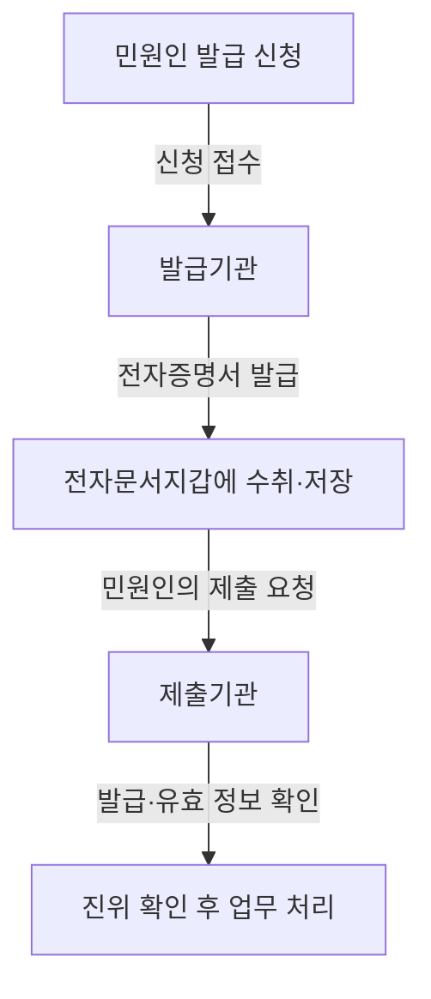
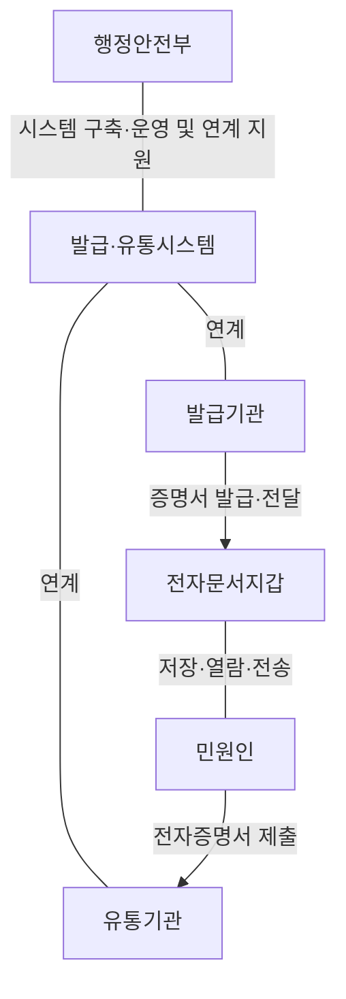
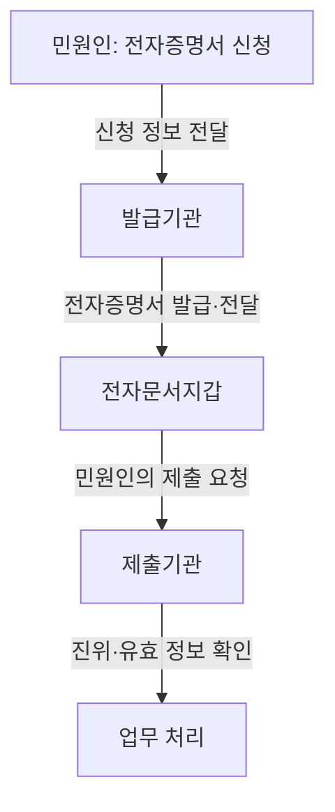
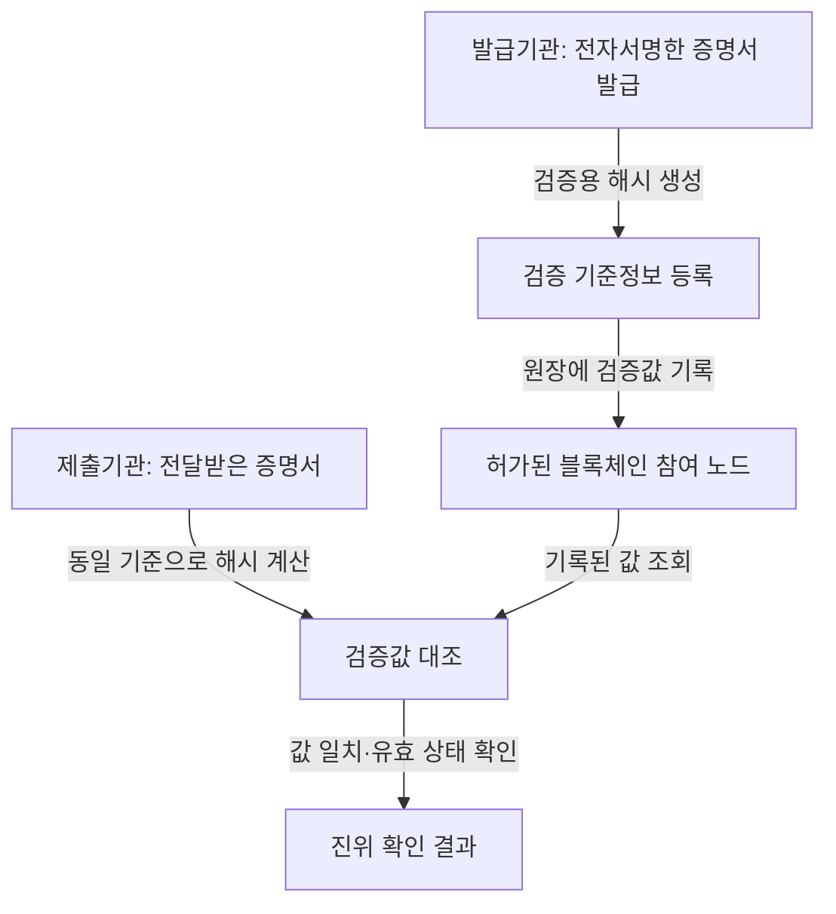

## 지식 로드맵 내 현재 위치

IT 거버넌스·정책 → 전자정부 서비스 → 전자증명서 발급·유통

## 30초 인출

- **본질:** 전자증명서는 행정기관이 특정 사실이나 관계를 증명하려고 전자 형태로 발급하는 민원문서다.
- **메커니즘:** 발급기관이 신청에 따라 발급하고, 전자문서지갑 등 발급·유통 연계수단으로 보관·전달하며, 제출기관은 진위와 유효성을 확인한다.
- **블록체인 연계:** 블록체인은 문서 원문을 공개 저장하는 곳이 아니라 위변조 확인을 돕는 검증 기반으로 설계한다.

핵심 용어

| 용어 | 뜻 |
|---|---|
| 전자증명서 | 행정기관이 특정 사실이나 관계를 증명하려고 전자문서 또는 전자화문서로 발급하는 민원문서다. |
| 전자문서지갑 | 전자증명서를 받아 저장·열람·전송하는 전자적 공간이다. |
| 발급·유통시스템 | 행정안전부가 전자증명서 발급과 유통을 지원하려고 구축·운영하는 정보시스템이다. |
| 해시(Hash) | 문서 데이터에서 계산하는 고정 길이 값으로, 대조를 통해 데이터 변경 여부를 확인하는 데 쓴다. |
| 행정정보 공동이용 | 기관이 보유한 행정정보를 민원 처리에 공동으로 활용하는 절차로, 민원인이 증명서를 발급받아 제출하는 방식과 구별된다. |

---

## 1교시 예상문제 (10점)

---

전자증명서의 개념과 발급·제출 흐름, 진위 확인의 핵심을 설명하시오. *(예상)*

---

## 1교시 10점 답안

### 1. 정의·목적

**정의:** 전자증명서는 행정기관이 특정 사실이나 관계를 증명하려고 전자 형태로 발급하는 민원문서다.

**목적:** 종이 발급·전달 절차를 줄이고 증명서를 전자적으로 제출·확인하게 한다.

전자증명서 발급의 법적 근거는 「민원 처리에 관한 법률」 제28조의2다. 전자증명서의 종류는 행정안전부장관이 관계 기관과 협의해 정하고 고시한다.

### 2. 발급·제출과 확인

민원인은 발급받은 전자증명서를 제출기관에 전송한다. 제출기관은 전달받은 증명서가 발급된 문서인지와 유효한지를 확인하며, 구체적인 제출·확인 방식은 연계 서비스에 따른다.

**제언:** 발급기관과 제출기관은 연계 규격과 진위 확인 절차를 함께 점검한다.

---

## 2~4교시 예상문제 (25점)

---

최근 행정안전부에서 전자증명서 사업을 추진하고 있다. 전자증명서의 개념, 발급 및 유통 절차, 블록체인 연계 방안을 설명하시오. *(제121회 4교시 2번 기출)*

---

## 2~4교시 25점 답안

### Ⅰ. 개요

**정의:** 전자증명서는 행정기관이 특정 사실이나 관계를 증명하기 위해 전자문서 또는 전자화문서로 발급하는 민원문서다.

**목적:** 종이 증명서의 발급·전달 부담을 줄이고, 민원인이 필요한 증명서를 전자적으로 제출할 수 있게 한다.

「민원 처리에 관한 법률」 제28조의2는 행정기관이 전자민원창구나 통합전자민원창구를 통해 전자증명서를 발급할 수 있도록 한다. 행정안전부의 발급업무 처리지침은 발급기관, 유통기관, 전자문서지갑, 발급·유통시스템의 역할을 정한다.

| 방식 | 처리 주체와 대상 | 전자증명서와의 차이 |
|---|---|---|
| 전자증명서 발급·제출 | 발급기관이 증명서를 발급하고 민원인이 제출기관에 전달 | 민원문서 자체를 전자 형태로 받아 제출한다. |
| 행정정보 공동이용 | 민원 처리기관이 보유기관의 행정정보를 공동으로 이용 | 민원인이 이미 발급된 증명서를 제출하는 방식과 다르다. |
| 전자문서 유통 | 전자문서를 송신·수신·중계 | 증명문서 외 일반 전자문서의 유통까지 포함한다. |

### Ⅱ. 발급·유통 주체

행정안전부는 발급·유통서비스 정책과 시스템, 연계 표준을 지원한다. 발급기관은 시스템을 연계하고 민원인의 요청에 따라 증명서를 발급한다. 유통기관은 전자증명서의 신청·수취·저장·열람·전송에 참여한다. 전자문서지갑은 증명서를 보관하고 민원인이 제출할 수 있게 하는 전자적 공간이다.

### Ⅲ. 발급과 제출 절차

민원인은 전자민원창구 등을 통해 증명서를 신청하고 수령 방식을 지정한다. 발급기관은 발급·유통시스템과 연계해 증명서를 지갑에 전달한다. 민원인은 제출기관을 지정해 전송하고, 제출기관은 연계된 확인 절차를 거쳐 업무에 사용한다. 지갑 주소·정보무늬(QR) 등 제출 방식은 서비스가 제공하는 수단에 맞춘다.

### Ⅳ. 블록체인 연계 방안

블록체인은 전자증명서의 진위 확인에 활용할 수 있지만, 원문이나 개인정보를 그대로 분산원장에 올리는 방식은 피해야 한다. 행정안전부는 전자증명서 발급·유통 사업에 블록체인 기반 기술을 적용해 왔으나, 공개된 자료만으로 현행 시스템의 구체적인 해시 알고리즘·온체인 항목·합의 방식을 단정할 수는 없다. 다음은 시스템 연계 설계 시 지킬 원칙이다.

| 설계 원칙 | 확인 내용 |
|---|---|
| 원문 보호 | 증명서 원문과 개인정보는 블록체인에 직접 기록하지 않고 접근통제된 발급·유통 경로에서 처리한다. |
| 변경 확인 | 제출 문서와 발급 시 검증값을 같은 방식으로 계산해 대조한다. |
| 발급기관 확인 | 전자서명 등으로 발급 주체와 발급 사실을 확인할 수 있게 한다. |
| 폐기·정정 반영 | 취소·재발급 등 상태 변화가 확인 절차에 반영되도록 유효성 정보를 관리한다. |
| 운영 통제 | 참여기관 권한, 키 관리, 로그, 장애·복구 절차를 정하고 연계기관 간 검증을 수행한다. |

해시 대조는 문서 데이터의 변경 여부를 확인하는 수단이며, 발급 권한·서명·현재 유효 상태를 단독으로 증명하지 않는다. 따라서 전자서명과 발급기관 정보, 폐기·정정 상태 확인을 함께 설계해야 한다.

### Ⅴ. 기술사적 제언

| 문제 | 해결 방안 |
|---|---|
| 기관별 연계 방식 차이로 제출·검증이 끊김 | 공통 연계 규격과 상호운용 시험을 마련하고 발급기관·유통기관·제출기관이 함께 검증한다. |
| 검증값만으로는 발급 주체와 최신 유효 상태를 충분히 확인하기 어려움 | 발급기관 서명과 취소·재발급 상태 조회를 연계해 문서 변경 여부와 현재 유효성을 함께 확인한다. |
| 분산원장에 개인정보가 남을 위험 | 원문·개인정보의 온체인 기록을 금지하고 검증에 필요한 최소 정보와 접근기록만 관리한다. |

## 출제 이력과 검증 출처

- 제121회 4교시 2번: 전자증명서의 개념, 발급 및 유통 절차, 블록체인 연계 방안
- [민원 처리에 관한 법률 제28조의2, 전자증명서의 발급](https://law.go.kr/LSW/lsInfoP.do?lsId=001359&efYd=20220712)
- [행정안전부고시 제2022-54호, 전자증명서 발급업무 처리지침](https://www.law.go.kr/LSW/admRulLsInfoP.do?admRulSeq=2100000213310)
- [행정안전부, 정보무늬(QR)로 전자증명서 편리하게 발급하고 제출하세요(2022.08.29.)](https://www.mois.go.kr/frt/bbs/type010/commonSelectBoardArticle.do?bbsId=BBSMSTR_000000000008&nttId=94425)
- [행정안전부, 블록체인 기반 전자증명서 발급·유통 플랫폼 구축 계획(2018.05.15.)](https://www.mois.go.kr/frt/bbs/type010/commonSelectBoardArticle.do?bbsId=BBSMSTR_000000000008&nttId=63533)
- [정부24 모바일앱·서비스 안내](https://www.gov.kr/portal/orgSite/mobile)

## 연결 토픽

- 행정정보 공동이용
- 공공 마이데이터
- 전자문서 및 전자거래 기본법
