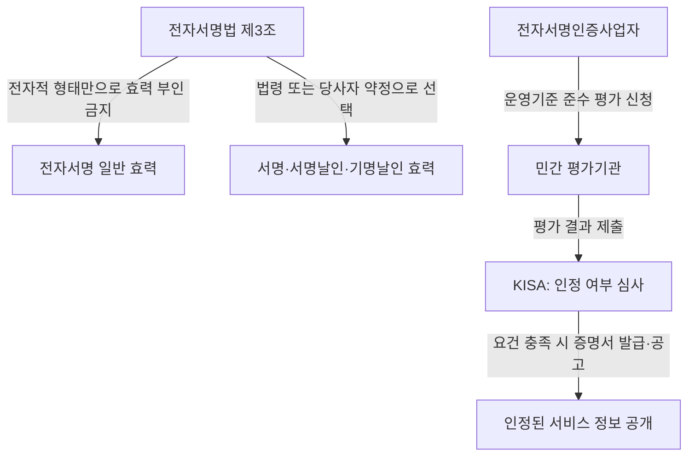

## 지식 로드맵 내 현재 위치

IT 거버넌스·정책 → 전자서명·인증 제도 → 전자서명법과 인증 서비스

## 30초 인출

- **본질:** 개정 전자서명법은 특정 공인인증 수단에 부여된 독점적 지위를 없애고 다양한 전자서명 서비스가 경쟁하도록 바꿨다.
- **법적 효력:** 전자서명은 전자적 형태라는 이유만으로 효력이 부인되지 않으며, 법령이나 당사자 약정으로 전자서명을 선택한 경우 서명 효력을 가진다.
- **신뢰 확인:** 민간 평가기관이 운영기준 준수 여부를 평가하고 한국인터넷진흥원(KISA)이 결과를 검토해 인정 여부를 결정한다.

핵심 용어

| 용어 | 뜻 |
|---|---|
| 전자서명 | 전자문서에 첨부되거나 논리적으로 결합된 전자정보로, 서명자의 신원과 서명 사실을 나타내는 데 이용된다. |
| 전자서명인증사업자 | 전자서명인증과 관련 기록 관리 등 전자서명인증업무를 하는 사업자다. |
| 운영기준 준수사실 인정 | 전자서명인증사업자가 법정 운영기준을 지키는지 평가받고 그 사실을 인정받는 제도다. |
| 공동인증서 | 종전 공인인증서가 제도 개편 뒤 사용되는 인증서 서비스 명칭이다. 현행 법의 독점적 공인 지위를 뜻하지 않는다. |
| 사설인증서 | 민간 인증 서비스를 통칭하는 일상적 표현이며, 전자서명법상의 별도 인증서 종류를 뜻하지 않는다. |

---

## 1교시 예상문제 (10점)

---

전자서명법 전부개정의 취지와 전자서명의 효력, 운영기준 준수사실 인정제도를 설명하시오. *(예상)*

---

## 1교시 10점 답안

### 1. 정의·목적

**정의:** 전자서명은 전자문서에 결합된 전자정보로 서명자의 신원과 해당 문서에 서명한 사실을 나타낸다.

**목적:** 특정 전자서명 수단의 제도상 독점 지위를 없애고 안전하고 편리한 전자서명 이용을 촉진한다.

개정법은 2020년 6월 9일 공포되어 같은 해 12월 10일 시행됐다. 공인인증기관·공인인증서 제도를 없애고, 전자서명 서비스의 신뢰성을 확인하는 운영기준 준수사실 인정제도를 두었다.

### 2. 법적 효력과 신뢰 확인

| 구분 | 법의 취지 |
|---|---|
| 전자서명의 효력 | 전자적 형태라는 이유만으로 효력을 부인하지 않는다. 법령이나 당사자 약정으로 서명 방식을 선택한 경우 서명·서명날인·기명날인의 효력을 가진다. |
| 운영기준 준수 인정 | 민간 평가기관이 평가하고 KISA가 평가 결과를 검토해 인정 여부를 결정한다. 인정 사실은 서비스의 신뢰성을 판단하는 정보다. |

**제언:** 이용자는 인증 방식의 편의뿐 아니라 인정 범위와 본인확인 절차를 함께 확인한다.

---

## 2~4교시 예상문제 (25점)

---

2020년 5월에 공인인증서와 사설인증서의 구별을 없애는 전자서명법이 개정되었다. 이에 따라 국내에 대중화 되어 있는 사설인증서의 종류 및 전자서명 시장의 발전방향을 설명하시오. *(제122회 4교시 3번 기출; 원문 표현 유지)*

---

## 2~4교시 25점 답안

### Ⅰ. 개요

**정의:** 전자서명법은 전자문서에 결합된 전자서명의 기본 효력과 인증업무의 신뢰 기반을 정하는 법률이다.

**목적:** 공인인증서의 우월적 지위를 없애고 기술·서비스를 바탕으로 다양한 전자서명 수단이 경쟁할 수 있게 한다.

개정법은 2020년 6월 9일 공포되고 2020년 12월 10일 시행됐다. 제도 개편은 전자서명의 효력 원칙과 인증사업자 운영기준 평가·인정 제도를 분리해, 특정 인증서를 보편적 우월 수단으로 지정하지 않는 데 핵심이 있다.

| 구분 | 개정 전 제도 | 개정 후 제도 |
|---|---|---|
| 인증 주체 | 지정 공인인증기관 중심 | 다양한 전자서명인증사업자 |
| 인증 수단 | 공인인증서가 우월한 법적·제도적 지위 보유 | 특정 인증수단에 독점 지위를 부여하지 않음 |
| 신뢰 확인 | 공인 체계 중심 | 운영기준 준수 여부를 평가·인정해 이용자 판단을 지원 |

### Ⅱ. 전자서명의 법적 효력과 신뢰 제도

전자서명은 전자적 형태라는 이유만으로 법적 효력이 부인되지 않는다. 법령 또는 당사자 사이의 약정으로 서명 방식에 전자서명을 선택하면 서명으로서의 효력이 있다. 이 원칙이 모든 인증수단에 동일한 신원 확인 수준이나 증거력을 자동 부여한다는 뜻은 아니다.

운영기준 준수사실 인정은 전자서명인증사업자의 안정성·신뢰성과 이용자 보호를 확인하는 절차다. 민간 평가기관이 운영기준을 평가하고, KISA는 평가 결과의 적정성을 심사해 인정 여부를 결정한다. 과학기술정보통신부는 인정기관을 지정하고 평가기관을 선정한다.

### Ⅲ. 국내 전자서명 서비스 유형

‘사설인증서’는 민간 서비스를 가리키는 통칭이지 법률상 인증서 유형은 아니다. 아래 유형은 법정 분류가 아니라 저장·이용 방식에 따른 서비스 모델이다.

| 서비스 모델 | 제공·이용 방식 | 이용 시 살필 점 |
|---|---|---|
| 공동인증 서비스 | 종전 공인인증서에서 이어진 인증서 방식으로 전자서명 서비스를 제공한다. 저장매체·연계 방식은 사업자와 서비스에 따라 다르다. | 인증서 보관, 비밀번호·키 관리, 이용기관의 지원 범위를 확인한다. |
| 금융인증 서비스 | 금융결제원이 제공하는 클라우드 기반 인증 서비스다. | 계정 복구, 접속 인증, 지원 기관과 이용 범위를 살핀다. |
| 플랫폼·통신사 간편인증 | PASS·카카오·네이버·토스 등 플랫폼·통신사가 앱이나 웹으로 가입자 확인 및 전자서명 서비스를 제공한다. | 단말 변경, 사업자 간 연계, 본인확인 방법과 개인정보 처리를 확인한다. |

서비스 명칭과 기술 구성은 변할 수 있으므로 제품별 저장 방식이나 생체인증 적용 여부를 유형의 고정 속성으로 단정하지 않는다. 인정받은 서비스와 인정 범위는 KISA 전자서명 통합지원포털에서 확인한다.

### Ⅳ. 전자서명 시장의 발전 방향

| 발전 방향 | 핵심 과제 |
|---|---|
| 이용자 선택권 | 상황에 맞는 인증수단을 고를 수 있도록 지원하고 인증수단별 요구사항을 알기 쉽게 안내한다. |
| 상호운용성 | 표준 연계와 공통 검증 절차로 이용기관의 중복 연계 부담을 줄인다. |
| 신뢰·보안 | 키 보호, 가입자 확인, 침해 대응과 서비스 연속성을 점검하고 평가·인정 정보를 투명하게 공개한다. |
| 포용성 | 장애·고령·기기 제약이 있는 이용자를 위해 대체 인증수단과 접근 가능한 절차를 마련한다. |

전자서명 사업자는 서비스 특성에 맞는 보안과 편의를 제공하고, 이용기관은 여러 수단을 공정하게 연계해야 한다. 인정 여부는 신뢰 판단 자료 중 하나로 활용하되, 업무 위험과 법령이 요구하는 본인확인 수준도 함께 고려한다.

### Ⅴ. 기술사적 제언

| 문제 | 해결 방안 |
|---|---|
| 이용자가 인증서 명칭만으로 보안 수준·인정 범위를 오해할 수 있음 | 서비스 화면에 사업자·인정 범위·확인된 신원 수준과 처리 목적을 표준 형식으로 표시하고 공식 인정 목록으로 연결한다. |
| 기관별 연계가 중복되면 이용자 선택권이 줄고 운영 부담이 커짐 | 공통 API와 상호운용 시험을 마련하되 인증사업자 선택·연계가 특정 사업자에 종속되지 않도록 한다. |

## 출제 이력과 검증 출처

- 제122회 4교시 3번: 사설인증서 유형과 전자서명 시장의 발전 방향
- [전자서명법 제3조·제8조~제10조, 국가법령정보센터](https://www.law.go.kr/LSW/lsInfoP.do?lsiSeq=236201)
- [한국인터넷진흥원, 전자서명인증 제도 및 인정·평가 체계](https://www.kisa.or.kr/1060203)
- [한국인터넷진흥원 전자서명 통합지원포털, 인정사업자 목록](https://rootca.kisa.or.kr/accreditation/accredited-providers)
- [국가법령정보센터, 전자서명법 전부개정 이유](https://www.law.go.kr/LSW/lsRvsRsnListP.do?chrClsCd=010202&lsId=011173&lsRvsGubun=all)

## 연결 토픽

- 전자증명서
- 본인확인기관
- 모바일 신분증
