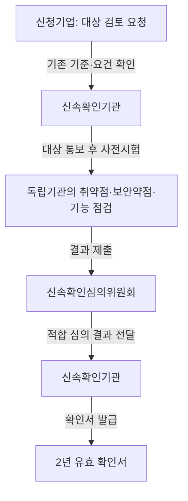
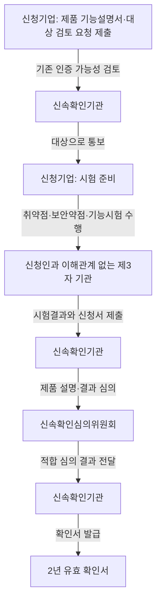

## 지식 로드맵 내 현재 위치

IT 거버넌스·정책 → 정보보안 인증·검증 → 정보보호제품 신속확인

## 30초 인출

- **본질:** 정보보호제품 신속확인은 기존 인증 기준이 없는 신기술·융복합 보안제품을 평가해 공공부문에 적용할 길을 여는 제도다.
- **메커니즘:** 기존 인증·국가용 보안요구사항 적용 가능성을 먼저 검토하고, 취약점·소프트웨어 보안약점·기능시험을 확인한 뒤 심의위원회가 적합 여부를 심의한다.
- **적용 범위:** 확인서는 2년 유효하다. 공공기관 ‘나·다’ 그룹은 별도 보안적합성 검증 없이 도입할 수 있고, ‘가’ 그룹은 국가사이버안보센터 검증이 필요하다.

핵심 용어

| 용어 | 뜻 |
|---|---|
| 정보보호제품 신속확인 | 기존 평가기준이 없는 신기술·융복합 보안제품을 평가하고 임시 공공 적용을 지원하는 제도다. |
| 공통평가기준(CC, Common Criteria) | 정보보호제품의 보안성을 평가하기 위한 기준으로, 제품군별 보호프로파일이나 국가용 보안요구사항이 적용될 수 있다. |
| 보호프로파일(PP, Protection Profile) | 제품군이 충족해야 할 보안 요구사항을 정리한 평가 기준이다. |
| 소프트웨어 보안약점 진단 | 소프트웨어 코드의 보안 취약 요소를 확인하는 활동이다. |
| 보안적합성 검증 | 공공기관의 도입 제품이 국가·공공 정보통신망의 보안요건에 맞는지 확인하는 별도 절차다. |

---

## 1교시 예상문제 (10점)

---

정보보호 제품 신속 확인 제도. *(제129회 1교시 11번 기출 문항 표현)*

---

## 1교시 10점 답안

### 1. 정의·목적

**정의:** 정보보호제품 신속확인은 기존 인증기준이 없는 신기술·융복합 보안제품을 보안성 평가와 심의로 확인하는 제도다.

**목적:** 새 제품의 보안성을 확인하고 기존 평가기준이 마련될 때까지 공공부문에서 활용할 수 있도록 한다.

### 2. 대상·확인 절차

대상 검토에서는 기존 인증제도에서 평가할 수 있는지와 국가용 보안요구사항·보호프로파일 적용 여부를 확인한다. 확인서를 받은 제품도 모든 공공기관에 같은 조건으로 도입되는 것은 아니다.

| 공공기관 구분 | 도입 조건 |
|---|---|
| 나·다 그룹 | 신속확인 제품을 별도 보안적합성 검증 없이 도입 가능 |
| 가 그룹 | 국가사이버안보센터의 보안적합성 검증 후 도입 가능 |

**제언:** 조달 검토 시 신속확인서의 유효기간과 기관별 보안적합성 요건을 함께 확인한다.

---

## 2~4교시 예상문제 (25점)

---

정보보호제품 신속확인 제도의 도입 목적과 대상, 보안성 확인 절차, 공공기관 도입 범위 및 사후관리를 설명하시오. *(예상; 제129회 1교시 문항 확장)*

---

## 2~4교시 25점 답안

### Ⅰ. 개요와 도입 목적

**정의:** 정보보호제품 신속확인은 기존 인증제도에서 평가기준이 마련되지 않은 신기술·융복합 보안제품을 최소 절차로 평가하고 확인서를 발급하는 제도다.

**목적:** 기준 부재로 공공 도입이 지연되는 제품의 보안성을 확인해 공공부문 적용 기회를 제공한다.

| 기존 평가기준 상태 | 적용 방식 |
|---|---|
| 국가용 보안요구사항·보호프로파일 등 기존 제도로 평가 가능 | 해당 기존 인증·평가제도를 활용한다. |
| 기존 제도로 평가할 수 있는 기준이 없음 | 신속확인 대상으로 검토해 별도 점검·심의를 진행한다. |

신속확인은 CC인증이나 일반 성능평가를 대체하는 보편 인증이 아니다. 기존 평가기준이 적용되지 않는 제품을 위한 제한된 경로다.

### Ⅱ. 대상 확인과 심의 절차

먼저 기존 인증·평가 기준을 적용할 수 있는지 검토한다. 대상 통보를 받은 신청기업은 취약점 분석·평가, 소프트웨어 보안약점 진단, 기능시험 결과를 준비한다. 보안점검과 기능시험은 신청인과 이해관계가 없는 제3자 기관이 수행한다. 심의위원회는 제출자료와 제품 설명을 검토해 적합 여부를 의결한다.

### Ⅲ. 확인 항목과 사후관리

| 확인 항목 | 확인하는 내용 |
|---|---|
| 취약점 분석·평가 | 제품에서 알려진 취약점이나 공격 가능성을 점검한다. |
| 소프트웨어 보안약점 진단 | 제품 소프트웨어의 보안약점 점검 결과를 확인한다. |
| 기능시험 | 제품 기능설명에 제시된 주요 기능의 시험 결과를 확인한다. 소프트웨어 품질인증서가 기능시험 확인서를 대신할 수 있다. |
| 제품 변경 | 제품 변경 시 취약점 점검과 소프트웨어 보안약점 진단 결과를 확인하고 변경 승인을 받는다. |
| 유효기간 연장 | 기존 인증제도 가능성을 검토하고 취약점을 점검한 뒤 연장 여부를 심의한다. |

확인서 유효기간은 2년이다. 기존 제도에서 적용할 평가기준이 마련되면 신속확인 유효기간을 연장하지 않고, 현재 확인서가 만료되면 제도 이용을 종료한다.

### Ⅳ. 공공기관 도입 범위와 제도 구분

| 구분 | 신속확인 | CC인증·기존 평가기준 |
|---|---|---|
| 대상 | 기존 평가기준이 없는 신기술·융복합 제품 | 적용 가능한 기준과 평가체계가 마련된 제품 |
| 평가 근거 | 취약점·보안약점·기능시험 결과와 심의 | 해당 인증·평가제도의 기준과 절차 |
| 유효·사후관리 | 확인서 2년, 변경 승인과 제한적 연장 절차 | 제도별 인증서 유효기간·사후관리 적용 |
| 공공기관 도입 | 나·다 그룹은 별도 보안적합성 검증 없이 도입 가능; 가 그룹은 국가사이버안보센터 검증 필요 | 해당 제도 및 기관별 보안요건에 따름 |

확인서 발급이 조달 계약이나 모든 공공기관의 구매를 자동 보장하지 않는다. 구매·계약 요건은 조달 절차와 해당 기관의 적용 요건을 별도로 확인한다.

### Ⅴ. 기술사적 제언

| 문제 | 해결 방안 |
|---|---|
| 제안: 여러 기관이 도입한 뒤 제품 버전별 취약점 공지·조치 현황이 흩어질 수 있음 | 제안: 제품 버전, 취약점 공지, 조치 상태를 참여 기관에 정기 공유하는 운영 체계를 둔다. |

## 출제 이력과 검증 출처

- 제129회 1교시 11번: 정보보호 제품 신속 확인 제도
- [KISA, 정보보호제품 신속확인 제도 절차·도입요건·사후관리](https://www.kisa.or.kr/1041502)
- [정보보호산업진흥포털, 신속확인 제도 소개](https://www.ksecurity.or.kr/kisis/subIndex/552.do)
- [정보보호산업진흥포털, 신속확인 체계](https://www.ksecurity.or.kr/kisis/subIndex/553.do)
- [KISA, 2026년 신속확인 유효기간 연장 지원 안내](https://www.kisa.or.kr/401/form?postSeq=3660)

## 연결 토픽

- CC인증
- 정보보호제품 성능평가
- 보안적합성 검증
