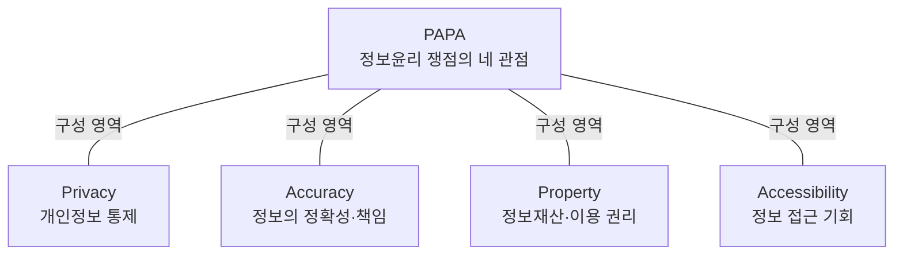
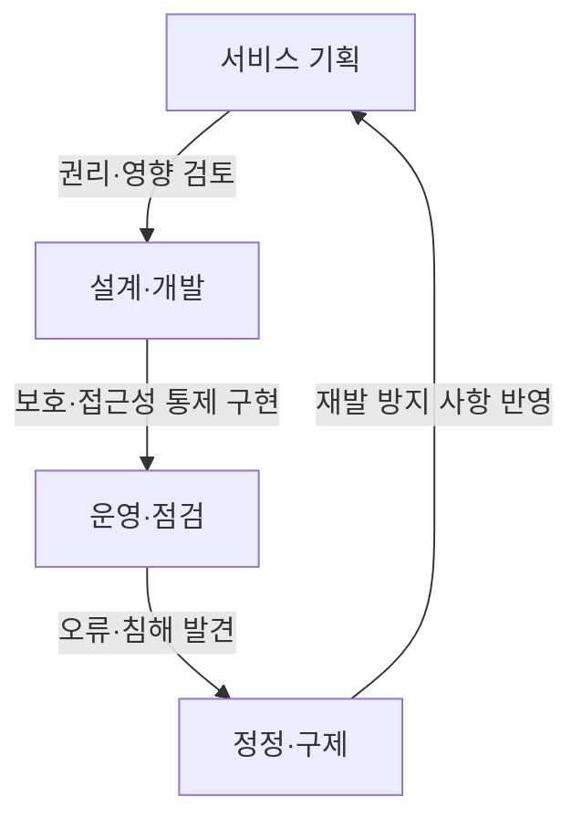

## 지식 로드맵 내 현재 위치

IT 거버넌스·정책 → 정보사회 윤리 → 정보윤리와 PAPA

## 30초 인출

- **본질:** 정보윤리는 정보기술을 만들고 사용하는 과정에서 사람의 권리와 사회적 책임을 지키는 행동 기준이다.
- **메커니즘:** 메이슨의 PAPA는 개인정보(Privacy), 정보의 정확성(Accuracy), 정보재산(Property), 정보 접근성(Accessibility) 문제를 점검하는 네 관점이다.
- **적용:** 기술 설계·운영에서 네 관점의 위험을 확인하고 예방·구제 방안을 마련한다.

핵심 용어

| 용어 | 뜻 |
|---|---|
| 정보윤리 | 정보의 생성·처리·이용 과정에서 권리와 책임을 판단하는 규범이다. |
| PAPA | 정보윤리 쟁점을 개인정보·정확성·재산권·접근성 네 관점으로 나누는 틀이다. |
| 알고리즘 편향 | 학습자료나 설계의 편향이 자동화된 결과에 반영되어 집단별 불이익을 만드는 현상이다. |
| 윤리적 설계(Ethics by Design) | 시스템 설계 단계부터 권리·공정성·안전 영향을 고려하는 접근이다. |

---

## 1교시 예상문제 (10점)

---

정보윤리의 개념과 메이슨의 PAPA 4대 영역을 설명하시오. *(예상)*

---

## 1교시 10점 답안

### 1. 정의·목적

**정의:** 정보윤리는 정보기술의 개발·이용에서 사람의 권리와 사회적 책임을 지키기 위한 행동 기준이다.

**목적:** 기술의 이익을 누리면서 개인정보 침해, 허위정보, 지식재산 침해, 정보격차로 인한 피해를 줄인다.

### 2. PAPA 4대 영역

| 영역 | 점검 질문 |
|---|---|
| Privacy | 개인 정보가 적법하고 필요한 범위에서 수집·이용되는가? |
| Accuracy | 정보가 정확하며 오류를 바로잡을 책임이 분명한가? |
| Property | 정보와 창작물의 권리가 존중되고 이용 허락이 확인되는가? |
| Accessibility | 필요한 사람이 정보와 정보기술을 이용할 수 있는가? |

**제언:** 기획·개발 검토표에 PAPA 네 항목을 두고 출시 전에 권리 침해와 접근성 위험을 점검한다.

---

## 2~4교시 예상문제 (25점)

---

정보윤리와 관련하여 다음을 설명하시오. 가. 정보윤리의 개념 및 중요성 나. 메이슨의 4대 영역(PAPA) 다. 정보화 사회의 주요 역기능 및 대응 방안 *(제123회 4교시 3번 기출)*

---

## 2~4교시 25점 답안

### Ⅰ. 개요와 중요성

**정의:** 정보윤리는 정보기술을 개발·운영·이용할 때 개인의 권리와 사회적 책임을 지키도록 하는 규범이다.

**목적:** 기술 활용으로 발생하는 권리 침해와 사회적 피해를 예방하고, 문제가 생기면 책임 있게 바로잡는다.

| 구분 | 정보윤리 | 정보보안 |
|---|---|---|
| 중심 질문 | 어떤 정보 이용이 정당하고 책임 있는가 | 정보자산을 어떻게 보호할 것인가 |
| 접근 | 가치·권리·책임 판단 | 기술·관리·물리적 통제 |
| 관계 | 바람직한 이용 기준을 제시 | 윤리적 기준을 구현하는 통제를 제공 |

정보윤리는 법적 의무를 대신하지 않는다. 법과 기술적 통제가 다루지 못하는 상황에서도 이해관계와 피해를 고려해 책임 있는 선택을 돕는다.

### Ⅱ. PAPA 4대 영역

| 영역 | 핵심 쟁점 | 점검 예 |
|---|---|---|
| Privacy | 개인정보의 수집·이용·공개 통제 | 목적에 필요한 정보만 수집하고 접근 권한을 제한한다. |
| Accuracy | 정보의 품질과 오류 책임 | 출처와 갱신 시점을 확인하고 오류 정정 절차를 둔다. |
| Property | 정보·창작물의 권리와 이용 조건 | 저작권·라이선스를 확인하고 이용 허락 범위를 지킨다. |
| Accessibility | 정보 이용의 기회와 접근 장벽 | 장애·연령·기기 환경에 따른 이용 장벽을 점검한다. |

### Ⅲ. 정보화 사회의 역기능과 대응

| PAPA 관점 | 대표 역기능 | 대응 방향 |
|---|---|---|
| Privacy | 과도한 수집·감시·무단 공개 | 최소 수집, 명확한 이용 고지, 접근 통제와 침해 구제 |
| Accuracy | 허위정보·딥페이크·오류 데이터에 따른 피해 | 출처 확인, 정정 경로, 생성물 표시와 피해 대응 절차 |
| Property | 저작물 무단 복제·학습·재배포 | 권리·라이선스 확인, 적법한 이용 허락과 보상 협의 |
| Accessibility | 디지털 격차와 장애인·고령층 배제 | 접근성 기준 적용, 대체 이용 경로와 디지털 역량 지원 |

대응 수단은 법률·기술·교육·운영 절차를 함께 사용한다. AI가 개입하는 서비스는 정확성·공정성·설명 가능성을 추가로 살피되, 특정 기술이나 표시 의무가 모든 서비스에 동일하게 적용된다고 단정하지 않는다.

### Ⅳ. 실천 체계

| 단계 | 실천 내용 |
|---|---|
| 기획·설계 | PAPA 쟁점과 영향받는 이용자, 법적 의무를 확인한다. |
| 개발·운영 | 접근 통제, 데이터 품질 점검, 이용 허락 및 접근성 요건을 반영한다. |
| 문제 발생 후 | 신고·정정·삭제·피해 구제 절차를 운영하고 재발 원인을 개선한다. |

### Ⅴ. 기술사적 제언

| 문제 | 해결 방안 |
|---|---|
| 윤리 검토가 선언에 그쳐 설계 변경으로 이어지지 않을 수 있음 | 제안: 기획·설계 검토표에 PAPA별 영향받는 사람, 위험, 책임자, 검증 근거를 기록하고 출시 승인 때 미해결 항목을 검토한다. |
| 자동화된 결과의 오류나 편향을 이용자가 알아채기 어려울 수 있음 | 제안: 중요 서비스는 결과 설명·이의제기 경로와 정기적인 집단별 오류 점검을 마련한다. |

## 출제 이력과 검증 출처

- 제123회 4교시 3번: 정보윤리의 개념·중요성, 메이슨의 PAPA, 정보화 사회 역기능·대응
- [ACM Code of Ethics and Professional Conduct](https://www.acm.org/code-of-ethics)
- [ACM Computing Curricula 자료의 PAPA 언급](https://www.acm.org/binaries/content/assets/education/curricula-recommendations/msis-2006.pdf)
- [과학기술정보통신부, 인공지능 윤리기준 관련 자료](https://www.msit.go.kr/)

## 연결 토픽

- 개인정보 보호
- 인공지능 윤리
- 디지털 접근성
