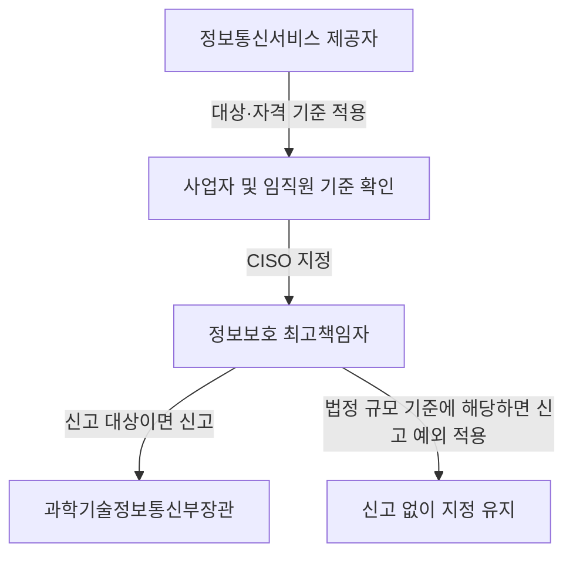

## 지식 로드맵 내 현재 위치

IT 거버넌스·정책 → 정보통신망법상 보안책임 → CISO 지정·신고 및 개인정보 보호조치의 현행 체계

## 30초 인출

- **본질:** 정보통신망법은 정보통신서비스의 보안 책임을 정하고, 개인정보 안전조치는 개인정보 보호법 체계에서 규율한다.
- **메커니즘:** 정보통신서비스 제공자는 법령상 기준에 따라 정보보호 최고책임자(CISO)를 지정·신고하고, 개인정보처리자는 개인정보 보호법에 따른 안전성 확보조치를 이행한다.
- **현행 기준:** 2026년 9월 11일 시행 법률에서 CISO 업무·겸직 가능 업무가 개정되었으므로 과거의 CISO 겸직 금지 설명을 그대로 적용하지 않는다.

핵심 용어

| 용어 | 뜻 |
|---|---|
| 정보보호 최고책임자(CISO, Chief Information Security Officer) | 정보통신시스템과 정보의 안전한 관리를 총괄하도록 법에 따라 지정하는 책임자다. |
| 개인정보 안전성 확보조치 | 개인정보처리자가 개인정보의 분실·도난·유출·위조·변조·훼손을 막기 위해 갖추는 법정 보호조치다. |
| 겸직 제한 | 법과 시행령이 정한 사업자의 신고된 CISO에게 정보보호 업무 외 다른 업무를 제한하는 규정이다. 법정 겸임 업무는 별도로 허용된다. |

---

## 1교시 예상문제 (10점)

---

정보통신망법상 CISO 제도와 개인정보 보호조치의 현행 법적 근거를 설명하시오. *(예상)*

---

## 1교시 10점 답안

### 1. 정의·목적

**정의:** CISO 제도는 정보통신서비스 제공자의 정보보호 계획과 위험관리를 책임지는 임원을 법에 따라 지정하는 제도다.

**목적:** 정보통신시스템의 보안과 정보의 안전한 관리를 경영 책임과 연결한다.

### 2. 현행 법체계

| 규율 대상 | 현행 근거 | 핵심 내용 |
|---|---|---|
| CISO 지정·신고·업무 | 정보통신망법 제45조의3 및 시행령 | 지정 기준, 신고, 겸직 제한과 업무를 규정한다. |
| 개인정보 안전조치 | 개인정보 보호법 제29조, 시행령 제30조 및 안전성 확보조치 기준 | 개인정보처리자의 관리적·기술적·물리적 보호조치를 규정한다. |
| 과거 망법 개인정보 보호조치 | 구 정보통신망법 제28조 | 2020년 개정으로 개인정보 보호법 체계에 이관되어 현재의 직접 근거가 아니다. |

2026년 9월 11일 시행 법률은 CISO의 총괄 업무와 겸할 수 있는 법정 업무를 명시했다. 따라서 과거의 일률적인 CISO·CPO 겸직 금지 설명은 현행 조문과 대조해야 한다.

**제언:** 내부 규정과 직무기술서를 현행 법률·시행령의 CISO 지정 및 겸직 기준에 맞춰 정기 점검한다.

---

## 2~4교시 예상문제 (25점)

---

CISO의 지정 의무 대상, 겸직 제한 및 개정 배경을 설명하시오. *(제121회 2교시 6번 기출; 당시 문제의 2020년 적용 시점을 현재 법령에 그대로 적용하지 말 것)*

---

## 2~4교시 25점 답안

### Ⅰ. 제도 개요와 법체계 구분

**정의:** 정보보호 최고책임자(CISO)는 정보통신서비스 제공자의 보안 계획과 위험관리를 총괄하는 법정 책임자다.

**목적:** 정보보호를 경영 의사결정과 연결해 침해사고를 예방하고 대응 역량을 높인다.

| 구분 | CISO 제도 | 개인정보 안전조치 |
|---|---|---|
| 직접 법적 근거 | 정보통신망법 제45조의3 | 개인정보 보호법 제29조 및 하위 규정 |
| 책임 주체 | 정보통신서비스 제공자 | 개인정보처리자 |
| 핵심 의무 | CISO 지정·신고, 정보보호 업무 총괄 | 개인정보의 안전한 처리를 위한 관리적·기술적·물리적 조치 |

구 정보통신망법 제28조의 개인정보 보호조치 규정은 현재의 개인정보 보호법 체계로 이관되었다. 망법에 남은 CISO 제도와 개인정보 보호법의 안전조치 의무를 같은 규정으로 혼동하지 않는다.

### Ⅱ. 지정·신고와 자격 기준

정보통신망법 제45조의3은 정보통신서비스 제공자가 대통령령상 기준에 맞는 임직원을 CISO로 지정하고 신고하도록 한다. 자산총액·매출액 등 대통령령이 정한 기준에 해당하는 경우 신고 예외가 적용될 수 있다. 지정 자격과 신고 기한·방법은 시행령에 따르므로 사업자 유형과 최신 조문을 확인한다.

### Ⅲ. 업무와 겸직 제한

| 법적 구분 | 정보보호 최고책임자의 업무 |
|---|---|
| 총괄 업무 | 정보보호 계획 수립·시행·개선, 정기 감사와 개선, 위험 식별·평가 및 대책 마련, 교육·모의훈련 계획 수립·시행 |
| 법정 겸임 가능 업무 | 정보보호 공시, 주요정보통신기반시설 보호책임자 업무, 전자금융거래법상 CISO 업무, 개인정보 보호책임자 업무, 관계 법령상 필요한 정보보호 조치 |
| 제한 적용 | 겸직 제한 대상 사업자의 신고된 CISO는 법정 업무 외 다른 업무를 겸할 수 없으며, 시행령상 사업자 기준을 확인한다. |

2026년 9월 11일 시행 조문은 CISO의 총괄 업무를 보강하고, 개인정보 보호책임자(CPO) 업무를 포함한 법정 겸임 가능 업무를 열거한다. 따라서 대규모 사업자의 CISO와 CPO 겸직을 무조건 금지한다고 답하지 말고, 현행 법 제45조의3 제3항·제4항과 시행령의 대상 기준을 함께 적용한다.

### Ⅳ. 개인정보 안전조치의 현행 근거

| 시기·규정 | 내용 | 현재 답안에서의 위치 |
|---|---|---|
| 구 정보통신망법 제28조 | 정보통신서비스 제공자의 개인정보 보호조치 근거 | 과거 제도 설명에 한정 |
| 개인정보 보호법 제29조 | 개인정보처리자의 안전성 확보조치 의무 | 현행 상위 법률 근거 |
| 시행령 제30조·개인정보의 안전성 확보조치 기준 | 내부관리계획, 접근권한 관리 등 세부 조치 구체화 | 현행 이행 기준 |

2020년 법 개정 과정에서 정보통신망법의 개인정보 규율을 개인정보 보호법 체계로 이관했다. 따라서 과거의 망법 보호조치 고시를 현행 CISO 제도나 개인정보 안전조치의 직접 근거로 제시하지 않는다.

### Ⅴ. 기술사적 제언

| 문제 | 해결 방안 |
|---|---|
| 과거 시험·내부 규정의 CISO 겸직 금지 설명이 개정 법률과 어긋날 수 있음 | 제안: CISO 지정·신고 대상, 겸직 제한 대상, 법정 겸임 업무를 조문·시행령 시행일과 함께 관리하는 컴플라이언스 표를 운영한다. |
| 정보보안 책임과 개인정보 안전조치의 담당 조직이 서로 다른 법적 근거를 혼용할 수 있음 | 제안: CISO 업무와 개인정보 보호책임자 업무를 역할표에 구분하고, 법정 겸임 가능 여부와 실제 승인 책임을 함께 검토한다. |

## 출제 이력과 검증 출처

- 제121회 2교시 6번: CISO 자격요건·겸직 여부·개정 배경 질문. 당시의 2020년 적용 시점과 현행법을 구분해 답한다.
- [정보통신망법 제45조의3, 2026년 9월 11일 시행](https://www.law.go.kr/LSW/lsLinkCommonInfo.do?chrClsCd=010202&lsJoLnkSeq=1032646007)
- [정보통신망법 시행령 제36조의7·제36조의8](https://law.go.kr/lsLinkCommonInfo.do?lsJoLnkSeq=1030435563)
- [개인정보 보호법 시행령 제30조, 2026년 9월 11일 시행](https://law.go.kr/LSW/lsLawLinkInfo.do?chrClsCd=010202&lsJoLnkSeq=900079401)
- [개인정보의 안전성 확보조치 기준](https://www.law.go.kr/LSW/admRulInfoP.do?admRulSeq=2100000281400&chrClsCd=010201)

## 연결 토픽

- 개인정보의 안전성 확보조치
- 정보보호 최고책임자(CISO)
- 개인정보 보호책임자(CPO)
