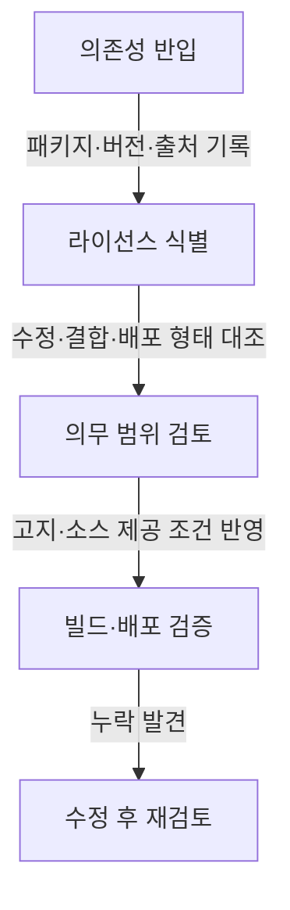

## 지식 로드맵 내 현재 위치

IT 거버넌스·정책 → 소프트웨어 라이선스 → 카피레프트와 상호주의 범위

## 30초 인출

- **본질:** 카피레프트 라이선스는 저작물을 수정·배포할 때 정해진 조건을 지키고, 적용 범위에 있는 수정물에도 같은 자유를 이어가도록 하는 저작권 라이선스다.
- **메커니즘:** 의무는 라이선스별 정의와 행위에 따라 달라지며, 외부 배포·네트워크 제공·결합 방식이 적용 조건을 가른다.
- **판단:** GPL·LGPL·AGPL·MPL의 의무 범위를 라이선스 원문과 제품의 실제 배포 형태로 확인한다.

핵심 용어

| 용어 | 뜻 |
|---|---|
| 카피레프트 | 저작권을 바탕으로 재배포와 수정의 자유를 보장하고, 정해진 범위의 수정물에도 라이선스 조건을 이어가는 방식이다. |
| GPL | 배포하는 프로그램의 복제·수정·배포 조건과 소스 제공 의무를 정한 GNU 자유 소프트웨어 라이선스다. |
| AGPL | 수정된 프로그램과 원격으로 상호작용하는 이용자에게 소스 제공 기회를 두는 GNU 라이선스다. |
| LGPL | 라이브러리 이용 프로그램과 라이브러리 자체의 조건을 구분해 연결·배포 조건을 정한 GNU 라이선스다. |
| MPL | 수정된 MPL 파일의 공개를 요구하면서 다른 파일은 별도 조건으로 결합할 수 있는 파일 단위 카피레프트 라이선스다. |

---

## 1교시 예상문제 (10점)

---

카피레프트 라이선스의 개념과 대표 라이선스별 의무 범위를 설명하시오. *(예상)*

---

## 1교시 10점 답안

### 1. 정의·목적

**정의:** 카피레프트 라이선스는 수정·배포된 저작물에도 정해진 자유와 조건을 이어가게 하는 저작권 이용허락이다.

**목적:** 저작물의 이용·수정 자유가 재배포 과정에서 사라지지 않도록 한다.

### 2. 라이선스별 적용 범위

| 라이선스 | 중심 의무·특성 |
|---|---|
| GPL | 배포하는 적용 대상 프로그램에 라이선스와 소스 제공 조건을 적용한다. |
| LGPL | 라이브러리 자체의 수정·배포와 이를 이용하는 프로그램의 연결 조건을 나누어 규정한다. |
| AGPL | 수정된 프로그램과 네트워크로 상호작용하는 이용자에게 소스를 제공할 의무를 추가한다. |
| MPL | 수정된 MPL 파일을 공개하되, 별도 파일의 조건은 구분할 수 있다. |

**제언:** 제품별 의존성 목록에서 라이선스 버전과 수정·배포 형태를 함께 기록해 공개 의무를 확인한다.

---

## 2~4교시 예상문제 (25점)

---

허용적 라이선스와 카피레프트 라이선스의 차이를 설명하고, 카피레프트 라이선스의 종류와 소프트웨어 개발·배포 시 유의사항을 서술하시오. *(제122회 1교시 4번 기출 문항을 확장한 예상문제)*

---

## 2~4교시 25점 답안

### Ⅰ. 개요와 라이선스의 목적

**정의:** 카피레프트 라이선스는 저작권자가 복제·수정·재배포를 허락하되, 적용 대상 저작물의 이용 자유가 후속 배포에서도 유지되도록 조건을 둔 라이선스다.

**목적:** 후속 이용자가 소스에 접근하고 수정물을 재배포할 수 있도록 이용 조건을 이어간다.

| 비교 기준 | 카피레프트 | 허용적 라이선스 |
|---|---|---|
| 재배포 조건 | 적용 대상 수정물에 같은 라이선스 계열 조건을 요구할 수 있다. | 저작권·면책 고지 등 조건을 지키면 다른 라이선스로 배포할 수 있다. |
| 소스 제공 | 해당 라이선스가 정한 행위·범위에서 소스 제공 조건이 생긴다. | 일반적으로 소스 공개 조건을 두지 않는다. |
| 판단 주의 | 수정·결합·배포 방식과 라이선스 버전을 확인한다. | 각 라이선스의 고지·특허 조건을 확인한다. |

### Ⅱ. 주요 유형과 적용 범위

| 라이선스 | 조건이 집중되는 범위 | 확인할 점 |
|---|---|---|
| GPL | GPL 적용 저작물의 수정·배포와 결합물 | 단순 이용과 배포를 구분하고, 소스 제공 의무의 적용 여부를 라이선스별로 확인한다. |
| LGPL | 라이브러리 자체와 라이브러리를 연결한 프로그램 | 연결·수정 방식에 따른 조건 및 사용자가 라이브러리를 교체·수정할 수 있는 요건을 살핀다. |
| AGPL | 수정된 프로그램을 네트워크로 이용자와 상호작용시키는 경우 | 단순 API 호출이 자동으로 전체 서비스 코드를 공개시킨다고 단정하지 말고, 라이선스의 적용 대상 프로그램인지 검토한다. |
| MPL | MPL 적용 파일과 그 파일의 수정 내용 | 같은 제품의 별도 파일은 라이선스 적용 범위가 다를 수 있다. |

GNU FAQ는 GPL 코드의 정적·동적 연결을 일반적으로 같은 결합물 관점에서 설명하지만, 적용 여부는 코드 관계와 라이선스 원문을 함께 따져야 한다. SaaS라는 운영 형태만으로 의무를 단정하지 않는다.

### Ⅲ. 배포 형태에 따른 의무 확인

| 행위 | 확인할 의무 |
|---|---|
| 내부에서만 사용 | 외부 배포에 따른 소스 제공 조항이 발동하는지 라이선스별로 확인한다. |
| 실행 파일·제품을 외부에 전달 | 라이선스 고지, 라이선스 사본, 적용 대상 소스 제공 또는 소스 접근 방법을 확인한다. |
| 수정 프로그램을 네트워크 서비스로 제공 | AGPL 적용 대상 수정 프로그램과 원격 이용자 상호작용 요건이 충족되는지 검토한다. |
| MPL 코드와 다른 파일 결합 | MPL 파일의 수정 여부와 별도 파일의 라이선스 조건을 구분한다. |

의무 범위는 “오픈소스 코드를 조금이라도 사용했는가”만으로 정해지지 않는다. 저작물의 수정·결합 관계, 외부에 전달하는 방식, 라이선스의 버전과 예외 조항을 기록한다.

### Ⅳ. 소프트웨어 공급망 관리

| 관리 시점 | 확인 자료 |
|---|---|
| 개발 전 | 패키지명·버전·라이선스 식별자·저작권자 고지 |
| 변경 시 | 코드 수정 내역·결합 구조·고지 파일 변경 |
| 배포 전 | 포함된 바이너리·소스 제공 경로·고지 및 라이선스 사본 |

라이선스 자동 식별 도구는 검토 대상을 찾는 수단이다. 불명확한 결합 관계나 의무 해석은 원문과 법률 검토로 확인한다.

### Ⅴ. 기술사적 제언

| 문제 | 해결 방안 |
|---|---|
| 제품 코드에는 수정된 카피레프트 구성요소가 있으나 배포 산출물과 의무 자료가 연결되지 않을 수 있음 | 제안: 릴리스별 구성요소·라이선스·수정 여부·소스 제공 위치를 산출물 목록과 함께 검토하고 승인 기록을 남긴다. |
| 원격 서비스가 AGPL 의무를 자동 회피하거나 자동 발생시킨다고 오판할 수 있음 | 제안: 적용 대상 프로그램, 수정 여부, 원격 이용자 상호작용을 라이선스 원문 기준으로 법무·개발 담당자가 공동 판정한다. |

## 출제 이력과 검증 출처

- 제122회 1교시 4번: 허용적 라이선스(Permissive License)와 카피레프트 라이선스(Copyleft License)
- [GNU GPL FAQ](https://www.gnu.org/licenses/gpl-faq.en.html)
- [GNU GPLv3](https://www.gnu.org/licenses/gpl-3.0.html)
- [Mozilla MPL 2.0 FAQ](https://www.mozilla.org/en-US/MPL/2.0/FAQ/)

## 연결 토픽

- 허용적 라이선스
- 오픈소스 컴플라이언스
- 소프트웨어 구성요소 명세서(SBOM)
