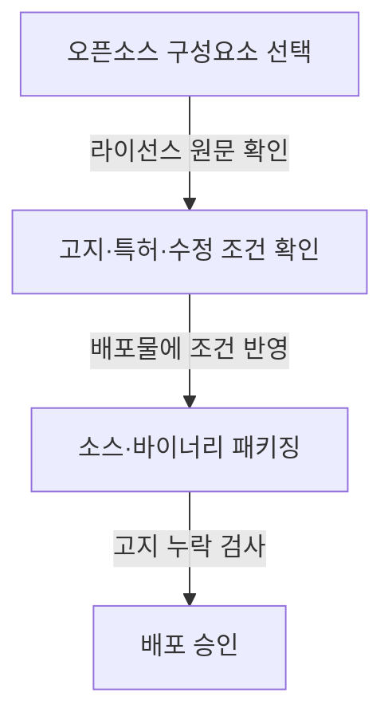
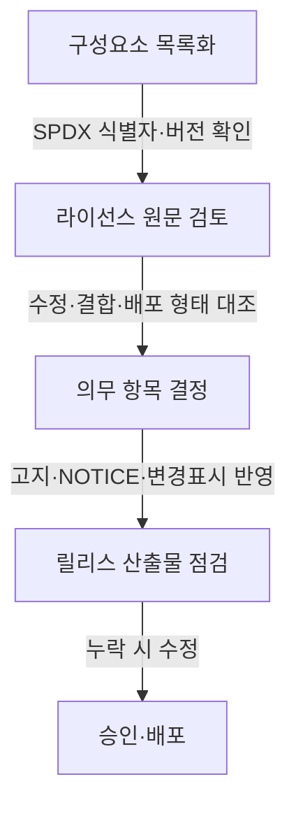

## 지식 로드맵 내 현재 위치

IT 거버넌스·정책 → 소프트웨어 라이선스 → 허용적 라이선스의 고지·특허 조건

## 30초 인출

- **본질:** 허용적 라이선스는 저작권 고지와 면책 조건 등을 지키면 코드를 수정·배포하고 다른 라이선스의 제품에 포함할 수 있도록 허용하는 오픈소스 라이선스다.
- **메커니즘:** MIT·BSD·Apache-2.0은 고지·재배포 조건과 특허 관련 조항이 다르므로 선택한 라이선스 원문을 확인한다.
- **판단:** 소스·바이너리에 포함할 고지, 수정 표시, 특허 허락과 종료 조건을 각각 검토한다.

핵심 용어

| 용어 | 뜻 |
|---|---|
| 허용적 라이선스 | 일정한 저작권·면책 고지 조건을 지키면서 수정·재배포를 폭넓게 허용하는 라이선스다. |
| MIT License | 저작권·허락 고지를 소프트웨어의 모든 사본 또는 주요 부분에 포함하도록 정한 간결한 라이선스다. |
| BSD-3-Clause | 고지·면책 조건에 더해 저작권자·기여자 이름을 홍보에 무단 사용하지 못하게 하는 라이선스다. |
| Apache License 2.0 | 저작권·특허 이용허락과 고지·수정 표시 조건을 명시한 라이선스다. |
| NOTICE 파일 | Apache-2.0 배포물에 포함된 NOTICE가 있을 때 그 고지 내용을 배포물의 일부로 전달하는 자료다. |

---

## 1교시 예상문제 (10점)

---

허용적 라이선스의 개념과 MIT·BSD·Apache-2.0 라이선스의 주요 조건을 비교하시오. *(예상)*

---

## 1교시 10점 답안

### 1. 정의·목적

**정의:** 허용적 라이선스는 정해진 고지 조건을 지키면 소스 공개 의무를 일반적으로 두지 않고 수정·재배포를 넓게 허용하는 오픈소스 라이선스다.

**목적:** 코드의 재사용과 다른 제품·서비스와의 결합을 쉽게 한다.

### 2. 대표 라이선스 비교

| 라이선스 | 주요 배포 조건 | 구별점 |
|---|---|---|
| MIT | 저작권·허락 고지를 사본 또는 주요 부분에 포함 | 별도 특허 이용허락 조항을 두지 않는다. |
| BSD-3-Clause | 소스·바이너리에 저작권·조건·면책 고지를 유지 | 저작권자·기여자 이름으로 제품을 홍보하지 못하게 한다. |
| Apache-2.0 | 라이선스 사본·저작권 고지·수정 표시 등을 조건에 따라 유지 | 명시적 특허 이용허락 및 특허소송 시 종료 조항을 둔다. |

### 3. 적용 절차

**제언:** 구성요소별 라이선스와 배포 고지 파일을 릴리스 검토 목록에 포함한다.

---

## 2~4교시 예상문제 (25점)

---

허용적 라이선스와 카피레프트 라이선스의 차이를 설명하고, MIT·BSD·Apache-2.0 라이선스를 비교하여 상용 소프트웨어에 적용할 때의 유의사항을 서술하시오. *(제122회 1교시 4번 기출 문항을 확장한 예상문제)*

---

## 2~4교시 25점 답안

### Ⅰ. 개요와 카피레프트와의 차이

**정의:** 허용적 라이선스는 정해진 조건을 지키는 한 수정·재배포를 폭넓게 허용하고, 통상 파생 제품의 소스 공개를 요구하지 않는 라이선스다.

**목적:** 재사용 장벽을 낮추고 오픈소스 코드를 다양한 제품과 서비스에 결합할 수 있도록 한다.

| 비교 기준 | 허용적 라이선스 | 카피레프트 라이선스 |
|---|---|---|
| 제품 결합 | 자체 라이선스의 제품에 결합할 수 있다. | 적용 대상 수정·결합물에 해당 라이선스의 조건이 이어질 수 있다. |
| 소스 제공 | 일반적으로 소스 공개를 요구하지 않는다. | 라이선스가 정한 배포·네트워크 제공 조건에서 소스 제공 의무가 생길 수 있다. |
| 공통 의무 | 각 라이선스가 요구하는 고지·면책 조건을 지킨다. | 소스 제공 외에도 저작권·라이선스 고지 등 의무를 지킨다. |

### Ⅱ. MIT·BSD·Apache-2.0 비교

| 라이선스 | 저작권·면책 고지 | 추가 조건 | 특허 조항 |
|---|---|---|---|
| MIT | 사본 또는 주요 부분에 저작권·허락 고지를 포함한다. | 별도 수정 표시나 NOTICE 파일 의무는 두지 않는다. | 명시적 특허 이용허락 조항은 없다. |
| BSD-3-Clause | 소스·바이너리 배포물에 고지·조건·면책을 유지한다. | 저작권자·기여자 이름을 승인 없이 홍보에 사용할 수 없다. | 별도 명시적 특허 이용허락 조항은 없다. |
| Apache-2.0 | 라이선스 사본·저작권 고지 등을 유지하고 수정 파일에 변경 사실을 표시한다. | 배포물에 적용 가능한 NOTICE가 있으면 그 고지를 포함한다. | 기여자의 특허 이용허락과 특정 특허소송에 따른 종료 조항을 둔다. |

Apache-2.0의 특허 이용허락은 라이선스가 정한 범위의 기여자 특허에 관한 것이다. Apache-2.0을 썼다는 이유만으로 제3자 특허까지 모두 허락된다고 보지 않는다.

### Ⅲ. 배포 형태별 의무

| 배포 형태 | 확인할 사항 |
|---|---|
| 소스 코드 재배포 | 적용 라이선스의 저작권·허락 고지 및 조건을 소스에 유지한다. |
| 바이너리 재배포 | 문서나 동봉 자료 등 라이선스가 지정한 매체에 필요한 고지를 전달한다. |
| Apache-2.0 코드 수정 | 수정 파일에 변경 사실을 표시하고, 원래 고지와 적용 가능한 NOTICE를 확인한다. |
| 다른 라이선스와 결합 | 각 구성요소의 조건과 제품 전체에 적용할 라이선스가 충돌하지 않는지 검토한다. |

고지 의무는 라이선스별로 표현이 다르다. Apache-2.0의 NOTICE 파일은 프로젝트에 해당 파일이 존재하고 라이선스 조건이 적용되는 경우 전달하며, 모든 MIT·BSD 코드에 NOTICE 파일을 만들 의무가 있는 것은 아니다.

### Ⅳ. 도입·배포 검토 흐름

| 검토 주체 | 확인 책임 |
|---|---|
| 개발 | 구성요소 버전·수정 내역·배포 형식 기록 |
| 오픈소스 관리 | 라이선스 식별·고지 자료와 SBOM 대조 |
| 법무·보안 | 결합 조건·특허 쟁점·고위험 예외 검토 |

자동화 도구는 누락 후보를 찾는 수단이다. 식별 오류나 복합 라이선스는 원문과 법률 검토를 거친다.

### Ⅴ. 기술사적 제언

| 문제 | 해결 방안 |
|---|---|
| 라이선스 이름의 친숙함만 보고 선택하면 제품에 필요한 특허 이용허락을 놓칠 수 있음 | 제안: 구성요소 선정 초기에 특허 조항이 필요한지 먼저 판정하고, 명시적 기여자 특허 허락이 요구되면 Apache-2.0을 우선 검토하며, 고지 중심의 단순 조건이면 MIT·BSD를 비교한다. |

## 출제 이력과 검증 출처

- 제122회 1교시 4번: 허용적 라이선스(Permissive License)와 카피레프트 라이선스(Copyleft License)
- [Open Source Initiative, MIT License](https://opensource.org/license/mit)
- [Open Source Initiative, BSD 3-Clause License](https://opensource.org/license/BSD-3-Clause)
- [Open Source Initiative, Apache License 2.0](https://opensource.org/license/Apache-2.0)
- [Apache License 2.0 원문](https://www.apache.org/licenses/LICENSE-2.0)

## 연결 토픽

- 카피레프트 라이선스
- 오픈소스 컴플라이언스
- 소프트웨어 구성요소 명세서(SBOM)
