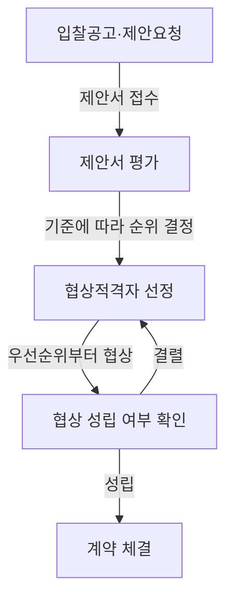
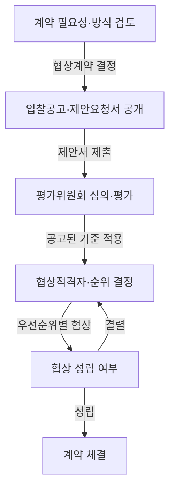

## 지식 로드맵 내 현재 위치

IT 거버넌스·정책 → 공공 정보화사업 조달 → 제안서 평가와 협상 계약

## 30초 인출

- **본질:** 협상에 의한 계약은 전문성·기술성 등이 필요한 물품·용역에서 제안서를 평가하고 협상을 거쳐 가장 유리한 상대자와 계약하는 방식이다.
- **메커니즘:** 공고와 제안요청 → 제안서 평가·협상적격자 선정 → 순위별 협상 → 성립하면 계약한다.
- **판단:** 평가비율·적격 기준·협상 세부 절차는 계약 유형과 적용 예규·입찰공고에서 확인한다.

핵심 용어

| 용어 | 뜻 |
|---|---|
| 협상에 의한 계약 | 제안서를 평가해 협상적격자를 선정하고, 협상으로 계약 상대자를 정하는 물품·용역 계약 방식이다. |
| 협상적격자 | 입찰공고와 적용 기준이 정한 기술능력 등 요건을 충족해 협상 대상이 된 입찰자다. |
| 제안서평가위원회 | 제안서를 공고된 기준에 따라 심의·평가하는 위원회다. |
| 우선협상대상자 | 종합평가 순위에 따라 가장 먼저 협상하는 협상적격자다. |

---

## 1교시 예상문제 (10점)

---

협상에 의한 계약의 개념과 기본 추진 절차를 설명하시오. *(예상)*

---

## 1교시 10점 답안

### 1. 정의·목적

**정의:** 협상에 의한 계약은 전문성·기술성·긴급성 등이 필요한 물품·용역에서 제안서를 평가하고 협상으로 계약상대자를 정하는 방식이다.

**목적:** 가격만으로 평가하기 어려운 사업에서 이행실적·기술능력·수행계획·가격을 종합해 공공기관에 유리한 계약을 체결한다.

### 2. 추진 절차

| 계약방식 | 선정 판단 |
|---|---|
| 협상에 의한 계약 | 공고된 평가기준과 협상 절차로 가장 유리한 상대자를 선정한다. |
| 최저가 중심 경쟁 | 입찰가격을 중심으로 낙찰자를 결정하는 적용 기준을 따른다. |

**제언:** 입찰공고에 평가항목·배점·협상절차를 명확히 공개하고 변경 이력을 관리한다.

---

## 2~4교시 예상문제 (25점)

---

공공 기관의 정보시스템 구축업체 선정 및 계약 체결에 있어 협상에 의한 계약 방식의 개념, 추진 절차, 제안서 평가 기준 및 기술성 중심 낙찰 방안을 설명하시오. *(제122회 4교시 2번 기출)*

---

## 2~4교시 25점 답안

### Ⅰ. 개요와 적용 목적

**정의:** 협상에 의한 계약은 물품·용역의 전문성·기술성·긴급성 등으로 필요성이 인정될 때 복수 제안서를 평가하고 협상 절차로 계약 상대자를 정하는 방식이다.

**목적:** 사업 수행계획과 기술능력, 가격 등을 함께 고려해 계약 목적에 적합한 제안을 선택한다.

| 비교 기준 | 협상에 의한 계약 | 가격 중심 낙찰 방식 |
|---|---|---|
| 평가 대상 | 이행실적·기술능력·사업수행계획·가격 등 | 입찰가격 중심으로 해당 제도 기준 적용 |
| 계약 결정 | 협상적격자 선정 후 우선순위별 협상 | 적용 낙찰기준에 따라 결정 |
| 적합한 상황 | 제안의 전문성·기술성 등 비교가 중요한 물품·용역 | 규격·이행조건이 명확하고 가격 경쟁이 중심인 경우 |

### Ⅱ. 추진 절차

국가계약법 시행령 제43조에 따라 계약 담당자는 계약 목적에 맞는 제안서 평가·협상 세부기준을 정해 열람할 수 있게 한다. 평가에는 원칙적으로 제안서평가위원회 심의가 필요하며, 구체적 절차는 적용 기관·계약예규에 따라 확인한다.

### Ⅲ. 제안서 평가 기준

| 평가 영역 | 확인 예 | 설계 원칙 |
|---|---|---|
| 기술능력·수행계획 | 요구사항 적합성, 아키텍처, 방법론, 보안, 일정·품질관리 | 과업 성과와 직접 연결되는 평가항목을 둔다. |
| 이행실적·수행역량 | 유사 실적, 핵심 인력, 투입·협업 계획 | 객관적 증빙과 평가 방식을 공고에 명시한다. |
| 입찰가격 | 총비용과 가격평가 산식 | 산식과 적용 한도를 입찰공고·관련 기준에 밝힌다. |
| 평가 배점 | 기술·가격 배점과 세부 항목 | 모든 계약에 90:10을 일률 적용하지 말고, 해당 사업 기준을 따른다. |

기술능력과 가격의 세부 배점 및 협상적격자 기준은 계약 종류와 적용 기준에 따라 달라질 수 있다. 소프트웨어 사업에 적용되는 별도 법령·지침이 있는지 확인하되, 오래된 관행상의 비율이나 하한율을 모든 입찰에 일반화하지 않는다.

### Ⅳ. 협상·낙찰 판단

| 단계 | 판단 | 결과 |
|---|---|---|
| 적격 판정 | 입찰공고의 기술능력 기준 등 협상적격 요건 충족 여부 | 협상 대상자 확정 |
| 순위 산정 | 공고된 기술·가격 종합평가 결과 | 우선협상대상자 지정 |
| 협상 | 제안요청서·제안서 범위 안에서 이행 내용과 조건 조정 | 협상 성립 또는 결렬 |
| 계약 | 협상 결과와 계약 조건 확정 | 성립 시 계약, 결렬 시 다음 순위와 협상 |

평가기준에 정하지 않은 요소를 사후에 임의로 반영하지 않는다. 협상은 제안서와 공고된 조건을 바탕으로 수행하며, 과업 내용의 변경은 계약·사업관리 절차와 관련 규정에 따라 처리한다.

### Ⅴ. 기술성 중심 낙찰을 위한 제언

| 문제 | 해결 방안 |
|---|---|
| 평가 배점만 기술 중심으로 높이고 사업의 핵심 위험을 구분하지 않으면 가격·기술 점수가 실제 성공조건과 어긋날 수 있음 | 제안: 입찰 전 필수 보안·연계 요구를 통과조건으로 두고, 나머지 기술 항목은 사업 위험과 성과에 따라 우선순위를 정한 뒤 가격 배점을 설계한다. |

## 출제 이력과 검증 출처

- 제122회 4교시 2번: 공공 정보시스템 구축 계약의 개념·절차·평가기준·기술성 중심 낙찰
- 제84회 기출: 협상에 의한 계약 관련 문제로 출제 노트에 기록됨
- [국가계약법 시행령 제43조, 2026년 6월 3일 시행](https://www.law.go.kr/LSW/lsLinkCommonInfo.do?chrClsCd=010202&lsJoLnkSeq=1026177749)
- [(계약예규) 협상에 의한 계약체결기준, 2026년 1월 2일 시행](https://www.law.go.kr/admRulInfoP.do?admRulSeq=2100000272436)
- [기획재정부 협상에 의한 계약 제안서 평가 업무처리 규정](https://www.law.go.kr/admRulInfoP.do?admRulSeq=2100000254684)

## 연결 토픽

- 소프트웨어 분리발주
- 소프트웨어 단계별 발주
- 예비타당성조사
