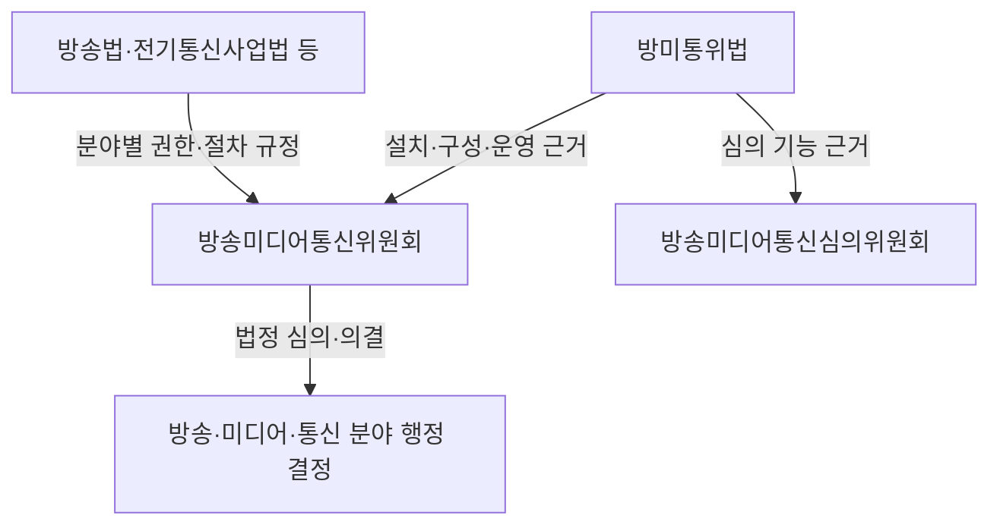
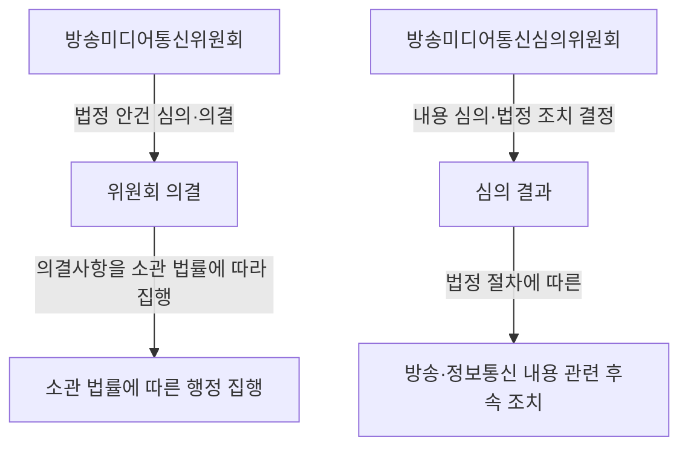

## 지식 로드맵 내 현재 위치

IT 거버넌스·정책 → 방송·미디어·통신 정책 → 방송미디어통신위원회의 법정 역할과 조직

## 30초 인출

- **본질:** 방송미디어통신위원회는 방송·미디어·통신 분야의 법정 사무를 심의·의결하는 합의제 중앙행정기관이다.
- **메커니즘:** 설치법이 위원회와 심의위원회의 조직·권한을 정하고, 분야별 법률이 구체적인 규제·진흥 업무를 정한다.
- **주의:** 위원회 출범만으로 OTT에 방송사업자와 같은 의무가 자동 적용되지는 않는다.

핵심 용어

| 용어 | 뜻 |
|---|---|
| **방송미디어통신위원회** | 방송·미디어·통신 관련 법정 사무를 독립적으로 심의·의결하는 합의제 행정기관이다. |
| **방미통위법** | 위원회의 설치·구성·운영과 심의위원회 등의 법적 근거를 정한 법률이다. |
| **합의제 행정기관** | 여러 위원의 심의·의결로 주요 행정 결정을 하는 기관이다. |

---

## 1교시 예상문제 (10점)

---

방송미디어통신위원회의 설립 목적과 법적 기능을 설명하시오. *(예상)*

---

## 1교시 10점 답안

### Ⅰ. 정의·목적

| 구분 | 핵심 |
|---|---|
| 정의 | **방송미디어통신위원회**는 방송·미디어·통신 정책과 이용자 보호 관련 법정 사무를 심의·의결하는 합의제 행정기관이다. |
| 목적 | 미디어 융합 환경에서 표현의 자유와 방송의 공공성을 보호하고 이용자 권익, 산업의 균형 발전을 함께 다룬다. |

### Ⅱ. 법적 작동 구조

| 구분 | 법률상 핵심 |
|---|---|
| 위원회 | 방송·통신 분야의 법정 사무를 심의·의결한다. |
| 심의위원회 | 방송·정보통신 내용의 심의와 법률에 따른 제재·시정요구를 담당한다. |
| 개별 법률 | 방송사업, 통신사업, 이용자 보호 등 분야별 권한과 요건을 정한다. |

**제언:** 신규 미디어 정책은 소관 법률과 의결 주체를 먼저 확인해 권한 공백이나 중복 심의를 줄인다.

---

## 2~4교시 예상문제 (25점)

---

방송미디어통신위원회의 설립 배경과 법적 지위, 주요 기능을 설명하고 미디어 융합 환경에서의 정책 과제를 제시하시오. *(예상)*

---

## 2~4교시 25점 답안

### Ⅰ. 설립 목적과 법적 지위

| 구분 | 핵심 |
|---|---|
| 정의 | **방송미디어통신위원회**는 방송·미디어·통신 정책과 이용자 보호 관련 법정 사무를 심의·의결하는 합의제 행정기관이다. |
| 목적 | 미디어 융합 환경에서 표현의 자유와 방송의 공공성을 보호하고 이용자 권익, 산업의 균형 발전을 함께 다룬다. |

| 근거 | 내용 |
|---|---|
| 방미통위법 | 위원회의 설치·구성·운영 및 심의위원회 근거를 둔다. |
| 정부조직법 | 중앙행정기관의 설치와 소관 사무를 정한다. |
| 개별 분야 법률 | 구체적인 인허가·규제·이용자 보호의 권한과 절차를 정한다. |

### Ⅱ. 조직과 의사결정

위원회와 심의위원회는 별도 법정 기능을 수행한다. 조직 통합을 이유로 모든 콘텐츠·통신 관련 사무가 하나의 의결 절차에 들어간다고 보아서는 안 된다.

### Ⅲ. 주요 소관 기능

| 기능 영역 | 설명 |
|---|---|
| 방송 정책 | 방송사업·편성·광고 등 방송 관련 법률에 따른 사무를 수행한다. |
| 미디어 정책 | 법률과 정부조직상 배정된 미디어 관련 정책을 다룬다. |
| 통신 규제·이용자 보호 | 전기통신사업 및 이용자 보호 관련 법정 권한을 수행한다. |
| 내용 심의 | 심의위원회가 방송·정보통신 내용과 법률상 조치를 심의한다. |

방미통위법의 소관 열거와 정부조직법·분야별 법률을 함께 확인해야 한다. OTT나 온라인 플랫폼에 새로운 의무를 부과하려면 해당 서비스가 법률상 규율 대상인지 별도로 판단해야 한다.

### Ⅳ. 미디어 융합 쟁점

| 쟁점 | 점검 기준 |
|---|---|
| 전통 방송과 온라인 서비스의 규율 차이 | 서비스 정의·사업자 지위·적용 조문을 비교한다. |
| 공공성 보호와 표현의 자유 | 제한 근거, 절차적 보장, 구제 수단을 확인한다. |
| 정책 기능의 조정 | 위원회 설치법·정부조직법·개별법상 소관을 기준으로 협의 주체를 정한다. |
| 글로벌 사업자 대응 | 국내 관할·집행 근거와 국제 협력 수단을 구분한다. |

정책적 논의인 ‘동일서비스 동일규제’나 시청각미디어서비스법 제정은 현행법상 이미 확정된 의무와 구별해 제안으로 다뤄야 한다.

### Ⅴ. 기술사적 제언

| 문제 | 해결 방안 |
|---|---|
| 융합 서비스는 여러 법률의 정의와 소관이 달라 사업자 의무를 예측하기 어려울 수 있음 | 제안: 서비스 유형별 적용 법률·담당 기관·심의 절차를 공개하는 소관 매핑표를 마련하고, 법 개정 때 중복·누락을 함께 점검한다. |

## 출제 이력과 검증 출처

- 확인한 제132~140회 공식 문제지에서는 직접 문항 미확인. 예상문제는 설치 목적·법적 지위·기능과 융합 정책 과제를 다루도록 구성.
- [방송미디어통신위원회의 설치 및 운영에 관한 법률](https://www.law.go.kr/LSW/lsInfoP.do?lsiSeq=283379)
- [정부조직법](https://www.law.go.kr/법령/정부조직법)

## 연결 토픽

- 망 중립성
- 개인정보 보호법
- 디지털 플랫폼 정부
