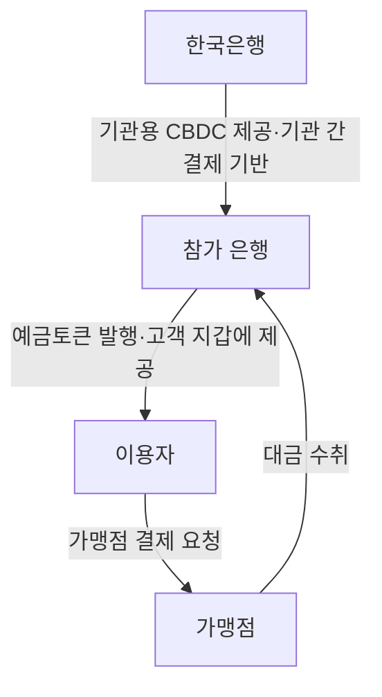
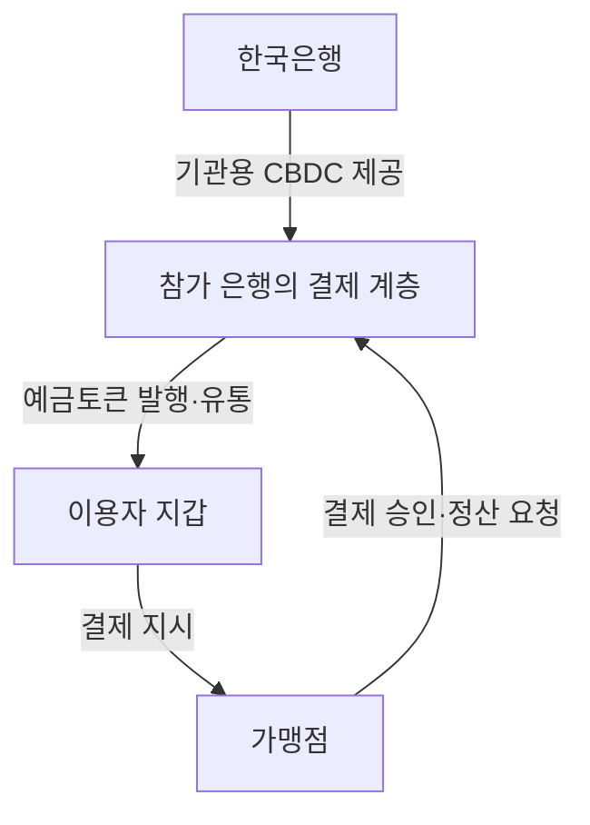

## 지식 로드맵 내 현재 위치

디지털 금융 → 중앙은행 디지털화폐 실증 → 기관용 CBDC와 예금토큰 기반 지급

## 30초 인출

- **본질:** 프로젝트 한강은 기관용 CBDC와 예금토큰을 활용해 지급·결제 모델을 시험하는 한국은행의 디지털화폐 실증 사업이다.
- **메커니즘:** 한국은행은 금융기관 간 결제용 CBDC를 제공하고, 참가 은행은 예금토큰을 발행해 이용자 결제에 활용한다.
- **현황:** 1차 일반 이용자 실거래는 2025년에 끝났고, 한국은행은 2026년 2차 실거래 추진 계획을 밝혔다.

핵심 용어

| 용어 | 뜻 |
|---|---|
| **기관용 CBDC** | 중앙은행이 금융기관 간 결제에 사용하도록 제공하는 디지털 중앙은행 화폐다. |
| **예금토큰** | 은행 예금을 토큰 형태로 표시해 결제·정산에 활용하는 은행 발행 수단이다. |
| **프로그래머블 지급** | 지급 조건을 전산 규칙으로 적용해 지정된 조건에서만 지급되도록 하는 방식이다. |

---

## 1교시 예상문제 (10점)

---

프로젝트 한강의 목적과 기관용 CBDC·예금토큰의 역할을 설명하시오. *(예상)*

---

## 1교시 10점 답안

### Ⅰ. 정의·목적

| 구분 | 핵심 |
|---|---|
| 정의 | **프로젝트 한강**은 기관용 CBDC와 예금토큰을 결합해 디지털 지급·결제의 활용 가능성을 시험하는 실증 사업이다. |
| 목적 | 토큰화된 지급 수단의 결제 구조와 프로그래머블 지급 활용성을 실제 환경에서 검토한다. |

### Ⅱ. 2계층 역할

| 수단 | 발행·제공 주체 | 사용 목적 |
|---|---|---|
| 기관용 CBDC | 한국은행 | 참가 금융기관 간 결제 기반 |
| 예금토큰 | 참가 은행 | 이용자·가맹점 간 디지털 결제 |

**제언:** 실증 결과를 확대 적용하기 전 결제 실패·환불·분쟁 절차를 이용자 관점에서 검증한다.

---

## 2~4교시 예상문제 (25점)

---

프로젝트 한강의 추진 목적과 2계층 구조, 예금토큰 결제 및 프로그래머블 지급 방식, 기대 효과와 검증 과제를 설명하시오. *(예상)*

---

## 2~4교시 25점 답안

### Ⅰ. 추진 목적과 실증 현황

| 구분 | 핵심 |
|---|---|
| 정의 | **프로젝트 한강**은 기관용 CBDC와 예금토큰을 결합해 디지털 지급·결제의 활용 가능성을 시험하는 실증 사업이다. |
| 목적 | 토큰화된 지급 수단의 결제 구조와 프로그래머블 지급 활용성을 실제 환경에서 검토한다. |

1차 일반 이용자 실거래는 2025년에 진행됐으며, 한국은행은 2026년 2차 실거래 계획을 밝혔다.

| 구분 | 내용 |
|---|---|
| 검증 대상 | 디지털 지급수단의 이용자 결제와 거래 처리 |
| 추진 방식 | 한국은행·참가 금융기관 협력 실증 |
| 적용 상태 | 실증 단계이며, 전면 상용화로 단정하지 않는다. |

### Ⅱ. 2계층 구조

중앙은행이 일반 이용자 계좌를 직접 운영하는 구조가 아니라, 참가 은행을 통해 이용자 결제가 이뤄지는 역할 분담을 시험한다. 구체적인 담보·정산 방식은 실증 설계에 따라 확인한다.

### Ⅲ. 예금토큰 결제 과정

| 단계 | 처리 |
|---|---|
| 1 | 참가 은행이 이용자에게 예금토큰을 제공한다. |
| 2 | 이용자가 가맹점에서 지갑으로 결제를 요청한다. |
| 3 | 시스템이 잔액·결제 조건을 확인한다. |
| 4 | 조건을 충족하면 토큰 이전과 정산을 처리하고 결과를 기록한다. |

실증 목적에 따라 바우처 등 조건부 지급을 적용할 수 있지만, 부정 사용을 100% 차단하거나 수수료가 0원이 된다고 보장하지 않는다.

### Ⅳ. 기대 효과와 검증 과제

| 관점 | 기대 가능성 | 검증 과제 |
|---|---|---|
| 지급 효율 | 결제·정산 절차 단축 가능성 | 장애·취소·환불 처리 |
| 지급 조건 | 허용된 목적·기간을 전산으로 확인 가능 | 잘못된 분류와 예외 지급의 구제 |
| 상호운용성 | 디지털 지급 수단 연계 가능성 | 참여 기관 간 규격·보안 호환 |
| 이용자 보호 | 거래 이력의 확인 가능성 | 개인정보 최소 수집과 접근통제 |

### Ⅴ. 기술사적 제언

| 문제 | 해결 방안 |
|---|---|
| 실증 거래에서 오류·분쟁이 발생하면 이용자가 책임 주체와 구제 절차를 알기 어려울 수 있음 | 제안: 확대 전 은행·운영기관별 장애 통지, 거래취소, 이의신청 책임을 정하고 모의 사고훈련으로 복구시간과 이용자 안내를 검증한다. |

## 출제 이력과 검증 출처

- 미출제. 예상문제는 실증 목적·구조·결제 흐름과 검증 과제를 묻도록 구성함.
- [한국은행, 프로젝트 한강 1차 실거래 파일럿 결과보고서](https://www.bok.or.kr/portal/bbs/B0000232/view.do?menuNo=200725&nttId=10094317)
- [한국은행, 2026년 신년사](https://www.bok.or.kr/portal/bbs/P0002575/view.do?menuNo=200041&nttId=10095505)

## 연결 토픽

- 디지털자산 기본법안
- 금융보안
- 개인정보 보호법
