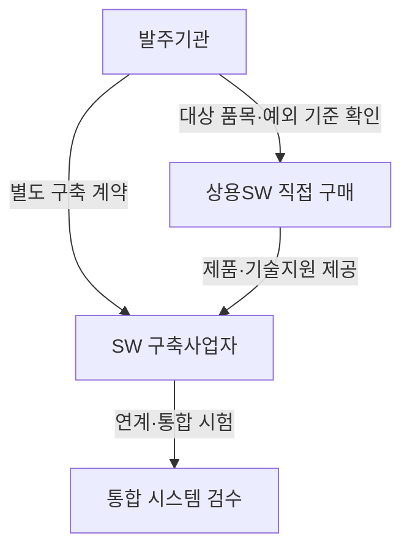
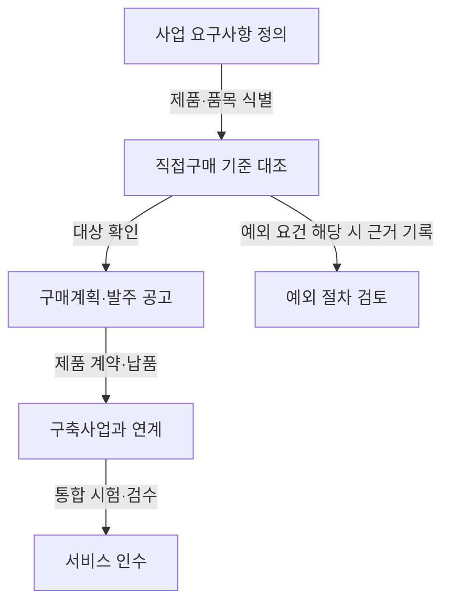

## 지식 로드맵 내 현재 위치

공공 SW 조달 → 상용소프트웨어 구매 → 직접구매·분리발주와 통합 책임 관리

## 30초 인출

- **본질:** SW 분리발주는 공공 SW 사업에서 대상 상용SW를 사업 전체 구축 계약과 별도로 직접 구매하는 조달 방식이다.
- **메커니즘:** 발주기관이 적용 기준을 확인해 품목을 분리 구매하고, 구축사업자는 시스템 연계·통합을 수행한다.
- **핵심:** 직접구매 대상과 예외는 법률·고시 기준으로 판정하며, 품목만 나누고 연계·검수 책임을 정하지 않으면 통합 위험이 남는다.

핵심 용어

| 용어 | 뜻 |
|---|---|
| **상용소프트웨어 직접구매** | 국가기관 등이 고시 기준에 따라 상용SW를 구축사업과 별도로 구매하는 제도다. |
| **분리발주** | 사업에 쓰이는 대상 SW 품목을 시스템 구축 계약과 구분해 발주하는 방식이다. |
| **통합 책임** | 분리 구매한 제품과 구축 시스템 사이의 연계·시험·장애 조정 책임이다. |

---

## 1교시 예상문제 (10점)

---

소프트웨어 분리발주의 목적과 발주·통합 구조를 설명하시오. *(예상)*

---

## 1교시 10점 답안

### Ⅰ. 정의·목적

| 구분 | 핵심 |
|---|---|
| 정의 | **SW 분리발주**는 공공기관이 기준에 해당하는 상용소프트웨어를 구축사업과 분리해 직접 구매하는 방식이다. |
| 목적 | 상용SW 구매와 시스템 구축을 구분해 구매 조건을 명확히 하고, 제품 선택·계약·품질 책임을 관리한다. |

### Ⅱ. 조달 구조

| 주체 | 책임 |
|---|---|
| 발주기관 | 직접구매 적용 여부와 예외를 검토하고 구매·사업 범위를 정한다. |
| SW 공급자 | 제품 공급과 계약 범위의 기술지원을 제공한다. |
| 구축사업자 | 시스템 연계·통합과 계약된 구축 산출물을 수행한다. |

**제언:** 발주서에서 제품 공급자와 구축사업자의 연계·장애 조정 책임을 항목별로 정한다.

---

## 2~4교시 예상문제 (25점)

---

소프트웨어 분리발주의 목적과 적용 판단, 발주 절차, 기대 효과 및 통합 과정의 관리 방안을 설명하시오. *(예상)*

---

## 2~4교시 25점 답안

### Ⅰ. 개념과 법적 근거

| 구분 | 핵심 |
|---|---|
| 정의 | **SW 분리발주**는 공공기관이 기준에 해당하는 상용소프트웨어를 구축사업과 분리해 직접 구매하는 방식이다. |
| 목적 | 상용SW 구매와 시스템 구축을 구분해 구매 조건을 명확히 하고, 제품 선택·계약·품질 책임을 관리한다. |

소프트웨어진흥법 제54조는 정품 상용SW 구매 예산 확보와 고시 기준에 따른 직접구매를 정한다. 법령이 정한 적용대상·예외를 사업별로 확인해야 하며, 특정 금액 기준을 모든 사업에 일률 적용해서는 안 된다.

| 점검 항목 | 판단 자료 |
|---|---|
| 사업 적용 | SW진흥법 및 하위 고시의 사업 요건 |
| 제품 대상 | 제품 유형·구매금액·인증 등 고시 기준 |
| 제외 판단 | 고시가 정한 사유와 절차, 승인 자료 |

### Ⅱ. 발주 절차

발주기관은 품목별 구매계획과 연계 범위를 사업 문서에 반영한다. 대상이 아닌 품목을 임의로 분리하거나 예외 사유를 근거 없이 적용하지 않는다.

### Ⅲ. 기대 효과와 유의점

| 기대 효과 | 운영상 유의점 |
|---|---|
| 제품 계약·가격 조건의 명확화 | 제품 계약과 구축 계약 간 일정·검수 연계 |
| 공급자의 직접 참여와 기술지원 조건 명시 | 기술지원 범위·기간·요청 경로 정의 |
| 특정 제품·기술 선택의 추적성 | 요구사항과 제품 기능의 적합성 확인 |
| 재사용 가능한 제품의 활용 | 버전·라이선스·보안 패치 관리 |

### Ⅳ. 통합·품질 관리

| 단계 | 확인 사항 |
|---|---|
| 요구사항 | 기능·성능·보안·연계 조건을 제품과 구축 범위로 나눈다. |
| 계약 | 납품, 기술지원, 인터페이스, 검수 기준과 책임자를 명시한다. |
| 통합 시험 | 버전 호환, 장애 복구, 부하·보안 요구를 함께 검증한다. |
| 인수·운영 | 결함 접수와 원인 분석, 패치·업그레이드 책임을 연결한다. |

### Ⅴ. 기술사적 제언

| 문제 | 해결 방안 |
|---|---|
| 제품 계약과 구축 계약이 각자 검수돼도 실제 통합 서비스에서는 오류가 남을 수 있음 | 제안: 최종 인수는 업무 시나리오 기반 공동 통합시험을 통과한 뒤 결정하고, 실패 항목은 공동 이슈기록으로 재시험까지 추적한다. |

## 출제 이력과 검증 출처

- 이전 기출로 기록된 제84회·제86회 문항은 원문 대조가 완료되지 않아 기출 표현을 단정하지 않고 주제만 보존함.
- [소프트웨어진흥법 제54조](https://www.law.go.kr/LSW/lsSideInfoP.do?docCls=jo&joBrNo=00&joNo=0054&lsiSeq=265845)
- [소프트웨어사업 계약 및 관리감독에 관한 지침](https://www.law.go.kr/LSW/admRulInfoP.do?admRulSeq=2100000195988)

## 연결 토픽

- 협상에 의한 계약
- 공공 SW 사업관리
- 상용소프트웨어 품질성능 평가시험
