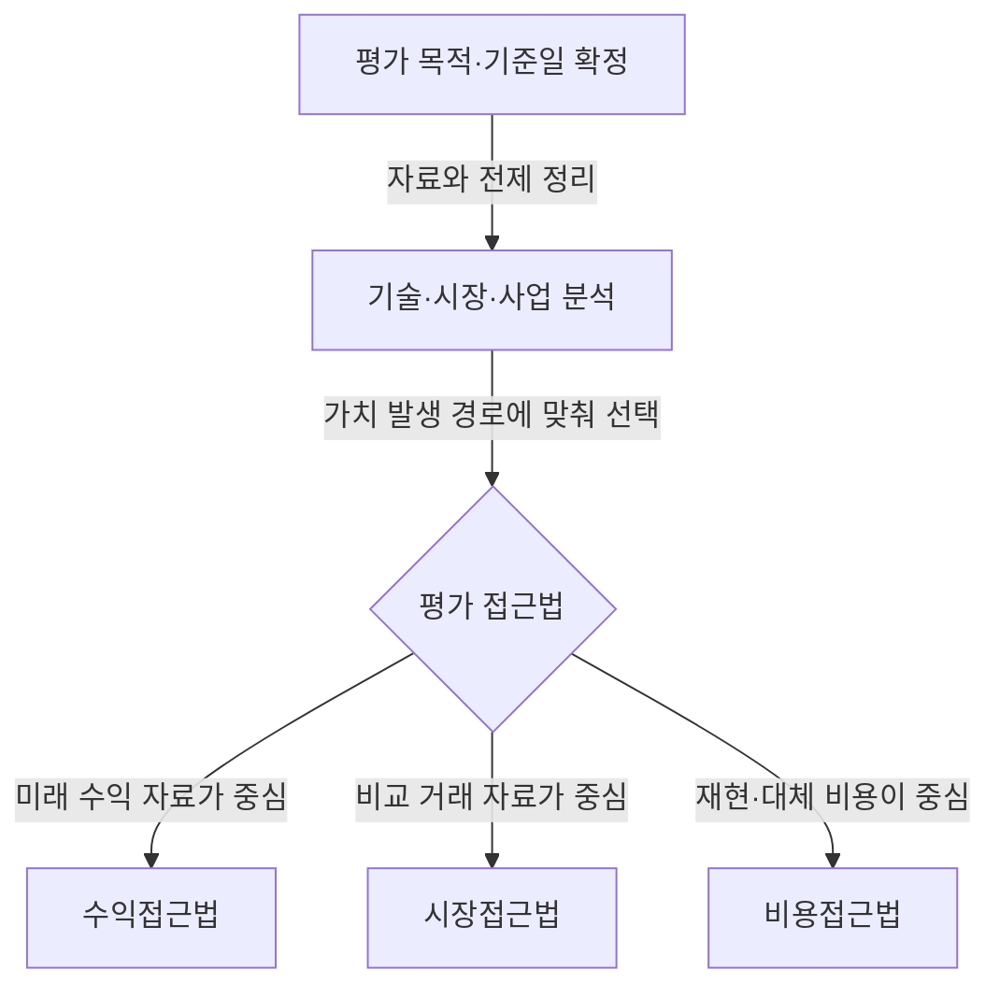
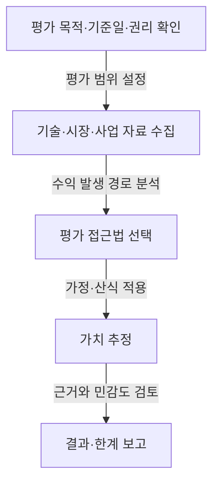
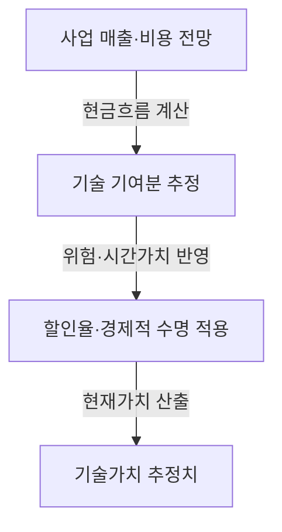

## 지식 로드맵 내 현재 위치

기술사업화·금융 → 무형자산 평가 → 기술가치 산정 접근법과 가정 검증

## 30초 인출

- **본질:** 기술가치평가는 사업화 과정에서 기술이 창출할 경제적 가치를 금액·등급·점수로 표현하는 평가다.
- **메커니즘:** 평가 목적과 권리를 확인한 뒤 기술·시장·사업 자료를 분석하고, 적합한 접근법과 가정을 적용한다.
- **핵심:** 평가는 기술 자체의 절대가격이 아니라 평가 기준일·목적·가정에 따른 추정치다.

핵심 용어

| 용어 | 뜻 |
|---|---|
| **기술평가** | 사업화로 발생할 수 있는 기술의 경제적 가치를 가액·등급·점수로 표현하는 평가다. |
| **수익접근법** | 기술이 기여할 것으로 보는 미래 경제적 수익을 현재 가치로 환산하는 방법이다. |
| **시장접근법** | 비교 가능한 기술 거래나 시장 자료를 바탕으로 가치를 추정하는 방법이다. |
| **비용접근법** | 기술을 재현·대체하는 데 필요한 비용을 바탕으로 가치를 추정하는 방법이다. |

---

## 1교시 예상문제 (10점)

---

기술가치평가의 개념과 주요 평가 접근법을 설명하시오. *(예상)*

---

## 1교시 10점 답안

### Ⅰ. 정의·목적

| 구분 | 핵심 |
|---|---|
| 정의 | **기술가치평가**는 사업화로 생길 수 있는 기술의 경제적 가치를 가액·등급·점수로 나타내는 평가다. |
| 목적 | 기술이전, 사업화, 투자·담보 판단에 필요한 근거를 제공한다. |

### Ⅱ. 평가 접근법

| 접근법 | 핵심 자료 |
|---|---|
| 수익 | 미래 수익·비용, 기술 기여, 할인율 |
| 시장 | 비교 가능한 거래·시장 자료 |
| 비용 | 개발·대체에 필요한 비용 |

**제언:** 평가 결과와 함께 기준일, 핵심 가정, 민감한 입력값을 요약해 제시한다.

---

## 2~4교시 예상문제 (25점)

---

기술가치평가의 목적과 절차, 수익·시장·비용 접근법의 특징을 설명하고 평가 신뢰성 확보 방안을 제시하시오. *(예상)*

---

## 2~4교시 25점 답안

### Ⅰ. 개념과 평가 목적

| 구분 | 핵심 |
|---|---|
| 정의 | **기술가치평가**는 사업화로 생길 수 있는 기술의 경제적 가치를 가액·등급·점수로 나타내는 평가다. |
| 목적 | 기술이전, 사업화, 투자·담보 판단에 필요한 근거를 제공한다. |

| 목적 | 활용 예 |
|---|---|
| 기술이전 | 실시권·양도 조건 검토 |
| 사업화 | 투자·사업계획 의사결정 |
| 금융·회계 | 담보·출자 등 목적별 판단 자료 |

평가값은 목적, 권리 범위, 기준일과 가정에 따라 달라지므로 서로 다른 조건의 평가액을 절대값처럼 비교하지 않는다.

### Ⅱ. 평가 절차

평가 대상 기술의 권리성과 사업화 가능성을 확인한 뒤 자료의 품질과 목적에 맞는 방법을 정한다.

### Ⅲ. 3대 접근법 비교

| 방법 | 산정 관점 | 유의점 |
|---|---|---|
| 수익접근법 | 기술 관련 미래 수익을 추정해 현재 가치로 환산 | 수익 예측·기술 기여도·할인율 가정에 민감 |
| 시장접근법 | 유사 기술의 거래·시장 비교자료 활용 | 비교사례의 권리·시장·거래 조건 차이 확인 |
| 비용접근법 | 개발 또는 대체에 필요한 비용 분석 | 투입비용이 미래 수익이나 시장성을 직접 나타내지는 않음 |

### Ⅳ. 수익접근법과 주요 가정

수익접근법은 예측기간, 경제적 수명, 기술기여도와 할인율이 바뀌면 결과도 변한다. 하나의 숫자만 제시하기보다 핵심 가정을 함께 공개한다.

### Ⅴ. 기술사적 제언

| 문제 | 해결 방안 |
|---|---|
| 단일 추정액이 거래가격이나 회수 가능한 금액으로 오해될 수 있음 | 제안: 투자·양도 의사결정 문서에는 평가 목적·기준일·가치 범위와 주요 불확실성을 함께 싣고, 최종 거래 조건은 별도 협상·실사로 결정한다. |

## 출제 이력과 검증 출처

- 이전 기출로 기록된 제110회·제118회 문구는 원문 대조가 완료되지 않아 문항을 재인용하지 않고 주제만 보존함.
- [기술의 이전 및 사업화 촉진에 관한 법률](https://www.law.go.kr/LSW/lsInfoP.do?lsiSeq=258487)

## 연결 토픽

- 협상에 의한 계약
- 지식재산권 관리
- 기술금융
