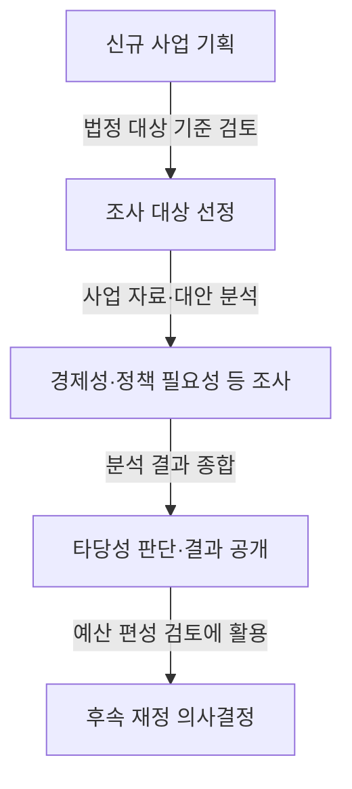
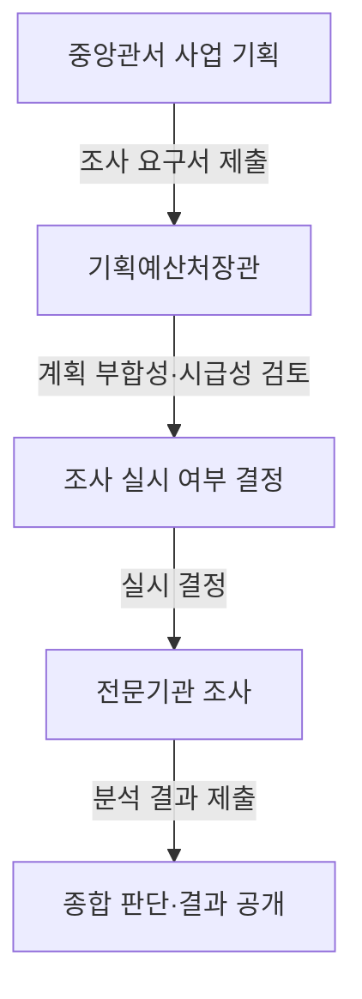

## 지식 로드맵 내 현재 위치

국가재정 관리 → 대규모 신규사업 사전 검토 → 예비타당성조사와 종합 판단

## 30초 인출

- **본질:** 예비타당성조사는 대규모 신규 재정사업 예산을 편성하기 전에 사업 타당성을 검토하는 제도다.
- **메커니즘:** 국가재정법상 대상 기준을 확인하고, 경제성·정책적 필요성 등 분석 결과를 종합해 타당성을 판단한다.
- **핵심:** 대상 기준은 총사업비 500억원 이상이면서 국가 재정지원 300억원 이상인 신규 사업 등 법률 요건으로 확인한다.

핵심 용어

| 용어 | 뜻 |
|---|---|
| **예비타당성조사** | 대규모 신규 재정사업의 예산 편성 전에 타당성을 검토하는 제도다. |
| **B/C** | 편익과 비용을 비교하는 경제성 분석 지표다. |
| **AHP** | 여러 평가 기준을 종합해 사업 타당성을 판단하는 분석 방법이다. |

---

## 1교시 예상문제 (10점)

---

예비타당성조사의 목적과 대상 기준, 종합 판단 방식을 설명하시오. *(예상)*

---

## 1교시 10점 답안

### Ⅰ. 정의·목적

| 구분 | 핵심 |
|---|---|
| 정의 | **예비타당성조사**는 국가재정법에 따라 대규모 신규 재정사업의 예산 편성 전에 타당성을 검토하는 제도다. |
| 목적 | 사업 필요성과 재정 투입의 타당성을 사전에 검토해 예산 편성 판단에 활용한다. |

### Ⅱ. 검토 구조

| 항목 | 기준 |
|---|---|
| 일반 대상 기준 | 총사업비 500억원 이상, 국가 재정지원 300억원 이상인 신규 사업 등 법정 요건 |
| 분석 내용 | 경제성, 정책적 필요성 등 법령·지침상 분석 |
| 판단 방식 | 분석 결과를 종합하며, 사업 유형별 지침을 확인 |

**제언:** 정보화 사업은 편익 산정의 출처와 중복 계상 여부를 사업 기획 단계에서 기록한다.

---

## 2~4교시 예상문제 (25점)

---

예비타당성조사의 목적과 법정 대상 기준, 조사 절차 및 주요 분석 내용을 설명하고 정보화 사업의 검토 시 유의점을 제시하시오. *(예상)*

---

## 2~4교시 25점 답안

### Ⅰ. 제도 목적과 대상

| 구분 | 핵심 |
|---|---|
| 정의 | **예비타당성조사**는 국가재정법에 따라 대규모 신규 재정사업의 예산 편성 전에 타당성을 검토하는 제도다. |
| 목적 | 사업 필요성과 재정 투입의 타당성을 사전에 검토해 예산 편성 판단에 활용한다. |

국가재정법 제38조에 근거해 일반 대상은 총사업비 500억원 이상이며 국가 재정지원 규모가 300억원 이상인 신규 사업 등으로, 법정 예외와 사업 종류별 조항을 함께 확인한다.

| 판정 단계 | 점검 내용 |
|---|---|
| 신규 사업 여부 | 기존 사업 변경·계속사업 여부 확인 |
| 규모 기준 | 총사업비와 국가 재정지원 규모 확인 |
| 법정 예외 | 국가재정법 제38조의 제외·면제 규정 확인 |

### Ⅱ. 신청·선정·조사 흐름

조사 신청은 대상사업의 명칭·개요·필요성 등을 포함해 제출하며, 실시 여부와 조사 방법은 현행 법령·운용지침을 따른다. 조사 기간이나 통과 점수를 모든 사업에 고정값으로 단정하지 않는다.

### Ⅲ. 주요 분석 관점

| 관점 | 확인 내용 |
|---|---|
| 경제성 | 비용과 편익, 대안 간 효율성 |
| 정책적 필요성 | 정책 목표·상위 계획과의 부합, 추진 여건 |
| 기타 사업별 관점 | 지역·기술 등 지침이 정한 분야별 요소 |

분석 항목과 가중치는 사업 유형 및 최신 수행 지침에 따라 달라질 수 있다. 모든 사업을 고정된 ‘3대 분석’이나 동일 AHP 기준으로 설명하지 않는다.

### Ⅳ. 정보화 사업 검토

| 위험 | 검토 방법 |
|---|---|
| 공공서비스 편익의 계량화 | 처리시간·오류·서비스 품질 지표와 산정 근거를 제시 |
| 기존 시스템과 중복 | 현행 시스템·데이터·연계 계획을 조사 |
| 기술·운영비 누락 | 구축비뿐 아니라 운영·보안·전환 비용을 포함 |
| 기술 변화 | 단계별 추진 대안과 변경 시 비용·효과를 비교 |

특정 B/C 값을 달성하면 통과한다거나 정보화 사업은 경제성 가중치를 반드시 낮춘다는 식으로 단정하지 않는다.

### Ⅴ. 기술사적 제언

| 문제 | 해결 방안 |
|---|---|
| 급변하는 정보화 사업은 전면 구축안 하나만 평가하면 기술·수요 변화에 대응하기 어려울 수 있음 | 제안: 현행 유지·단계적 구축·전면 전환 대안을 같은 성과 기준으로 비교하고, 후속 단계는 앞 단계의 성과 확인을 조건으로 검토한다. |

## 출제 이력과 검증 출처

- 이전 기출로 기록된 제102회·제116회 문구는 원문 대조가 완료되지 않아 기출 문항을 재인용하지 않고 주제만 보존함.
- [국가재정법 제38조](https://law.go.kr/lsLinkCommonInfo.do?lsJoLnkSeq=1018845245)
- [예비타당성조사 수행 총괄지침](https://www.law.go.kr/admRulLsInfoP.do?admRulSeq=2100000280172)

## 연결 토픽

- 정보전략계획(ISP)
- 협상에 의한 계약
- 국가재정 관리
