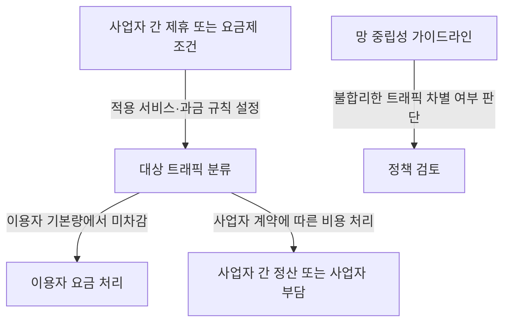
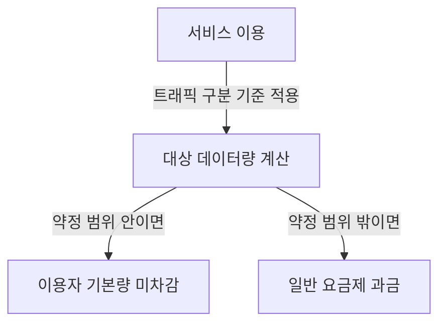
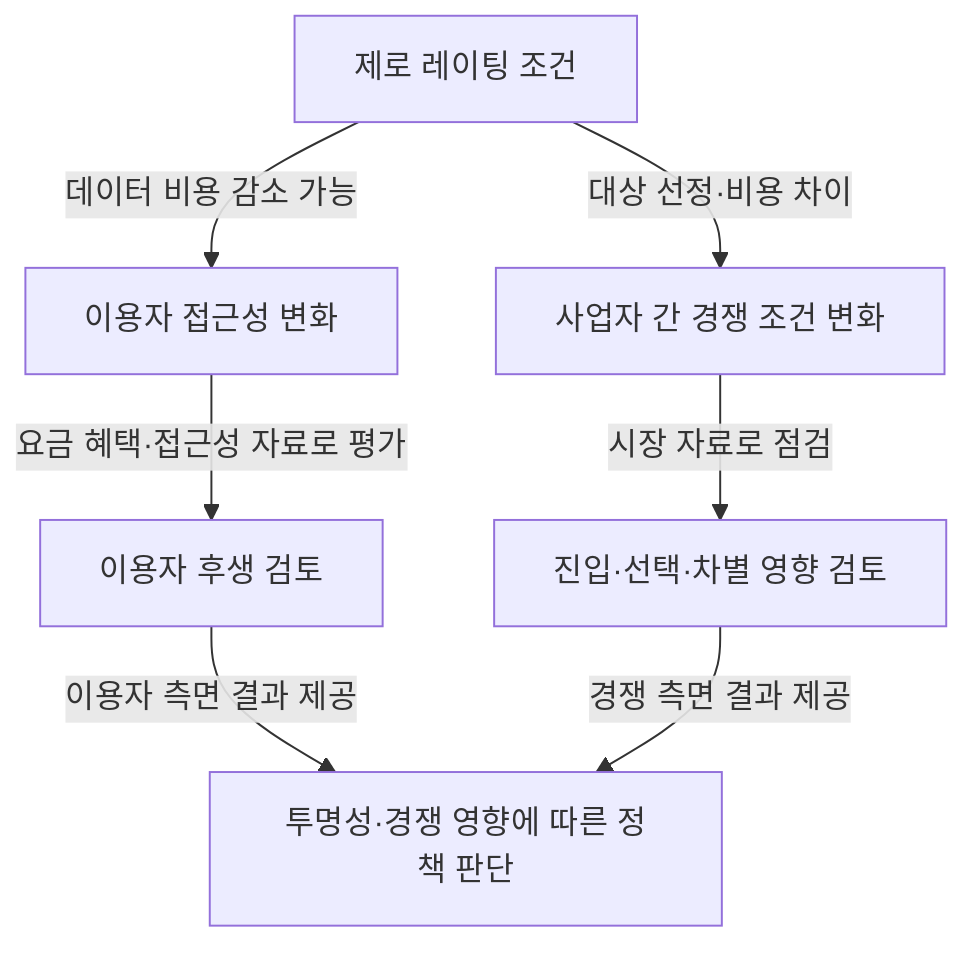

## 지식 로드맵 내 현재 위치

통신 정책 → 인터넷 트래픽 관리 → 특정 서비스 데이터 과금과 망 중립성

## 30초 인출

- **본질:** 제로 레이팅은 이용자가 특정 서비스의 데이터를 사용해도 본인 기본 데이터 사용량에서 차감하지 않는 요금 방식이다.
- **메커니즘:** 요금제·제휴 조건에 따라 대상 트래픽의 과금 방식을 달리하며, 비용은 사업자 간 계약 또는 사업자 부담으로 처리될 수 있다.
- **핵심:** 적용 여부만으로 위법을 단정하지 않고 투명성·차별성·경쟁 영향 등 구체적 조건을 살핀다.

핵심 용어

| 용어 | 뜻 |
|---|---|
| **제로 레이팅** | 특정 서비스 이용 데이터량을 이용자 기본 제공량에서 차감하지 않는 요금 방식이다. |
| **망 중립성** | 합법적 트래픽을 불합리하게 차단하거나 차별하지 않도록 하는 인터넷 개방 원칙이다. |
| **트래픽 관리 투명성** | 사업자가 트래픽 관리의 목적·범위·조건·절차·방법을 공개하고 필요한 이용자 안내를 하는 원칙이다. |

---

## 1교시 예상문제 (10점)

---

제로 레이팅의 개념과 망 중립성 관련 검토 쟁점을 설명하시오. *(예상)*

---

## 1교시 10점 답안

### Ⅰ. 정의·목적

| 구분 | 핵심 |
|---|---|
| 정의 | **제로 레이팅**은 지정된 서비스의 데이터 이용량을 가입자 기본 데이터에서 차감하지 않는 요금 방식이다. |
| 목적 | 데이터 요금 부담을 낮추거나 특정 서비스의 접근성을 높일 수 있으나, 적용 조건에 따라 경쟁에 영향을 줄 수 있다. |

### Ⅱ. 요금·정책 관계

| 검토 쟁점 | 질문 |
|---|---|
| 투명성 | 적용 서비스·조건·기간을 이용자가 알 수 있는가? |
| 차별성 | 경쟁 서비스에 불리한 조건을 부당하게 적용하는가? |
| 경쟁 영향 | 이용자 선택·시장 진입에 미치는 효과는 무엇인가? |

**제언:** 제휴 조건과 적용 대상을 이용자가 비교할 수 있도록 요금 안내에 명확히 표시한다.

---

## 2~4교시 예상문제 (25점)

---

제로 레이팅의 개념과 유형, 망 중립성 원칙과의 관계, 이용자·시장에 미치는 영향 및 정책 검토 방안을 설명하시오. *(예상)*

---

## 2~4교시 25점 답안

### Ⅰ. 개념과 과금 구조

| 구분 | 핵심 |
|---|---|
| 정의 | **제로 레이팅**은 지정된 서비스의 데이터 이용량을 가입자 기본 데이터에서 차감하지 않는 요금 방식이다. |
| 목적 | 데이터 요금 부담을 낮추거나 특정 서비스의 접근성을 높일 수 있으나, 적용 조건에 따라 경쟁에 영향을 줄 수 있다. |

비용 부담은 사업자 계약과 요금 설계에 따라 다르므로 모든 사례가 ‘콘텐츠 사업자의 대납’이라고 볼 수 없다.

### Ⅱ. 유형과 이해관계자

| 유형 예시 | 특징 | 검토점 |
|---|---|---|
| 사업자 자체 서비스 적용 | 통신사업자 계열·자체 서비스가 대상일 수 있음 | 경쟁 서비스의 동등 조건 여부 |
| 사업자 간 제휴 | 특정 콘텐츠 사업자와 요금 혜택 계약 | 공개 조건·계약 기준·이용자 선택 |
| 공익 서비스 지원 | 교육·공공 서비스 접근을 지원할 수 있음 | 대상 선정·지속 가능 재원 |

이는 사례를 분류하기 위한 유형이며, 현행 법령이 이 세 유형에 각각 일률적인 허용·금지를 정한 것은 아니다.

### Ⅲ. 망 중립성 원칙

| 원칙 | 관련 기준 |
|---|---|
| 이용자 권리 | 합법적 콘텐츠·서비스를 자유롭게 이용할 권리 |
| 트래픽 투명성 | 관리 방침의 목적·범위·조건·절차·방법 공개 및 이용자 고지 |
| 차단 금지 | 합법적 트래픽 차단 금지 원칙과 합리적 관리 예외 |
| 불합리한 차별 금지 | 서비스 유형·제공자에 따른 불합리한 트래픽 차별 금지 |

망 중립성 가이드라인은 트래픽 처리 원칙을 정한다. 요금상 제로 레이팅이 있다는 사실만으로 트래픽을 차단·차별했다고 단정하지 말고, 계약·기술 처리와 시장 영향을 구분해 판단한다.

### Ⅳ. 영향과 정책 검토

정책 검토에서는 서비스 품질·요금 혜택과 함께 대체 서비스의 접근성, 조건 공개, 사업자 지배력, 소비자 선택 제한 여부를 살핀다. 공공 목적 사례도 자동으로 허용된다고 단정하지 않는다.

### Ⅴ. 기술사적 제언

| 문제 | 해결 방안 |
|---|---|
| 상업 제휴의 경쟁 효과는 서비스 출시 후 이용자 선택과 시장 상황에 따라 달라질 수 있음 | 제안: 영향이 큰 제휴는 기간을 정한 뒤 운영 자료로 경쟁·이용자 영향을 재평가하고, 불리한 효과가 확인되면 조건을 수정하거나 종료한다. |

## 출제 이력과 검증 출처

- 이전 기출로 기록된 제116회·제119회 문항은 원문 대조가 완료되지 않아 기출 표현은 재인용하지 않고 주제만 보존함.
- [망 중립성 및 인터넷 트래픽 관리에 관한 가이드라인](https://www.law.go.kr/LSW/admRulInfoP.do?admRulSeq=2100000197003)
- [전기통신사업법 시행령 별표 4](https://www.law.go.kr/flDownload.do?flSeq=125839375&gubun=)

## 연결 토픽

- 망 중립성
- 통신시장 경쟁 정책
- 통신요금 투명성
